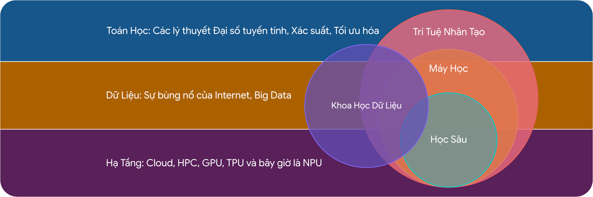

# AI Là Gì?

## AI Là Gì?

AI (Artificial Intelligence) là một lĩnh vực không mới, đã được manh nha từ đầu thế kỷ 20, nhưng mãi tới đầu thế kỷ 21, hay ngày nay, mới thực sự trỗi dậy và đi vào đời sống của xã hội.

Vậy, AI là gì? AI hay Trí Tuệ Nhân Tạo, là một lĩnh vực của Khoa Học Máy Tính tập trung nghiên cứu xây dựng một mô hình trí tuệ cho các hệ thống máy tính, nhằm mô phỏng trí tuệ của con người. Mục đích giúp máy móc thực hiện các nhiệm vụ liên quan đến trí thông minh của con người, như học tập, suy luận, giải quyết vấn đề, nhận thức và đưa ra quyết định, thậm chí có cả cảm xúc tương tự như con Người thật.

## Tại Sao Lại Là Lúc Này?

Ý tưởng về “trí thông minh giống con Người” đã xuất hiện từ hàng ngàn năm, và bắt đầu được gọi rõ tên là AI (Trí Thông Minh Nhân Tạo) và nghiên cứu sâu vào giữa thế kỷ 20 nhưng chưa thể thành hiện thực. Cho tới gần đây, vào đầu thế kỷ 21, đặc biệt từ những năm 2010, với sự bùng nổ và lớn mạnh của Internet cho phép thế giới có lượng dữ liệu khổng lồ (Big Data), cũng như hạ tầng phần cứng phát triển (GPU/TPU/NPU), và các Trung Tâm Dữ Liệu (Data Center) xuất hiện với số lượng lớn, AI đã dần xuất hiện rõ ràng hơn và dần đi vào đời sống xã hội chúng ta.

Hình 1: Trí Tuệ Nhân Tạo (AI) và các nền tảng.

* Toán Học: Các lý thuyết Đại số tuyến tính, Xác Suất, Tối ưu hóa.
* Dữ liệu: Sự bùng nổ của Internet, Big Data.
* Hạ Tầng: Cloud, Data Center, HPC, GPU, TPU, NPU.

AI bây giờ, đã không còn là một lĩnh vực hay khái niệm xa lạ, nó đã và đang dần xuất hiện khắp nơi trong đời sống hiện đại, từ công việc đến giải trí, từ học tập đến nghiên cứu, và hơn thế nữa, AI đã dần trở thành công cụ đắc lực tới người cộng sự hiệu quả và thậm chí là người đồng hành tất yếu.

Trong báo cáo hôm nay, chúng ta sẽ cùng điểm qua một số lĩnh vực đời sống mà AI đang xuất hiện mà thậm chí chúng ta không nhận ra, để cùng đánh giá giá trị, ý nghĩa cũng như những lo lắng đối với AI nói riêng và sự phụ thuộc hoặc tận dụng công nghệ nói chung trong xã hội hiện đại.

# AI Trong Đời Sống (AI in Daily Life): Từ Tiện Ích Đến Thấu Hiểu

Ứng dụng của AI trong đời sống hàng ngày đang chuyển dịch từ mô hình "điều khiển mệnh lệnh" sang mô hình "trí tuệ môi trường" (Ambient Intelligence), nơi công nghệ trở nên vô hình và phục vụ con người một cách chủ động dựa trên ngữ cảnh.

## Nhà thông minh (Smart Home) và Sự tiến hóa của Không gian Sống

Khái niệm nhà thông minh năm 2025 đã vượt xa các kịch bản tự động hóa đơn giản (như bật đèn khi mở cửa). Trong nhà thông minh, AI giúp các thiết bị có khả năng nhận biết ngữ cảnh, học từ thói quen sinh hoạt và tự điều chỉnh hoạt động sao cho phù hợp với nhu cầu của người sử dụng, mà không cần can thiệp trực tiếp.

### AI giúp tự động hóa và tối ưu hóa không gian sống (Smart Home)

**Tự động hóa** là một trong những lợi ích rõ rệt nhất của AI trong nhà thông minh. Các thiết bị trong gia đình như đèn chiếu sáng, điều hòa, quạt, máy nước nóng hay rèm cửa có thể được kết nối và điều khiển thông qua hệ thống AI trung tâm. Thay vì phải thao tác thủ công, người dùng chỉ cần cài đặt sẵn hoặc ra lệnh bằng giọng nói.

AI có khả năng **học hỏi thói quen sinh hoạt** của người dùng để đưa ra các điều chỉnh phù hợp. Ví dụ, hệ thống có thể tự động bật đèn khi trời tối, điều chỉnh nhiệt độ phòng vào ban đêm để tạo cảm giác thoải mái khi ngủ, hoặc tắt các thiết bị điện khi không có người trong nhà nhằm tiết kiệm điện năng.

Ngoài ra, các thiết bị thông minh còn giúp **tối ưu hóa việc sử dụng năng lượng**. AI phân tích dữ liệu tiêu thụ điện hằng ngày để đề xuất giải pháp tiết kiệm, góp phần giảm chi phí sinh hoạt và bảo vệ môi trường.

Có thể nói, AI đã biến không gian sống từ bị động thành **một môi trường thông minh, biết thích nghi với con người**.

### AI nâng cao chất lượng sống và an toàn cho con người (Ambient Intelligence)

Bên cạnh sự tiện ích, AI còn đóng vai trò quan trọng trong việc **nâng cao chất lượng sống và đảm bảo an toàn**. Các hệ thống camera thông minh được tích hợp trí tuệ nhân tạo có khả năng nhận diện khuôn mặt, phân biệt giữa người quen và người lạ, từ đó hạn chế nguy cơ xâm nhập trái phép.

AI còn có thể **phát hiện các hành vi bất thường** như chuyển động lạ vào ban đêm, cửa bị mở trái phép hay âm thanh bất thường trong nhà. Khi phát hiện nguy hiểm, hệ thống sẽ ngay lập tức gửi cảnh báo đến điện thoại của chủ nhà hoặc kích hoạt còi báo động, giúp người dùng kịp thời xử lý tình huống.

AI trong Smart Home còn hỗ trợ **phòng tránh các sự cố trong sinh hoạt hằng ngày**. Các cảm biến thông minh có thể phát hiện rò rỉ khí gas, khói, cháy nổ hoặc nước tràn, từ đó tự động ngắt nguồn điện và gửi thông báo khẩn cấp. Điều này góp phần giảm thiểu rủi ro, bảo vệ tài sản và tính mạng con người.

Ngoài ra, AI trong nhà thông minh còn đóng vai trò như một **trợ lý cá nhân**, hỗ trợ con người trong nhiều hoạt động sinh hoạt hằng ngày, đặc biệt là người cao tuổi, trẻ em và người khuyết tật thông qua các trợ lý ảo như Google Assistant, Alexa hay Siri, người dùng có thể điều khiển các thiết bị trong nhà bằng giọng nói, đặt lịch nhắc việc, tra cứu thông tin hoặc quản lý công việc cá nhân một cách nhanh chóng. Điều này giúp họ sống độc lập hơn nhưng vẫn đảm bảo an toàn.

Như vậy, AI không chỉ làm cho ngôi nhà thông minh hơn mà còn **tạo ra một không gian sống an toàn, nhân văn và gần gũi với con người**.

### Sự tiến hóa của không gian sống thông minh

Từ các *tiện ích đơn lẻ*, AI đang dần biến ngôi nhà thành một **không gian sống thông minh**, *có khả năng học hỏi, dự đoán và thích nghi* với nhu cầu của con người. Ngôi nhà không chỉ phản ứng theo mệnh lệnh mà còn *chủ động* đề xuất các giải pháp nhằm nâng cao chất lượng cuộc sống.

Có thể thấy rằng, ứng dụng AI trong nhà thông minh và Trí thông minh Môi trường đang làm thay đổi cách con người sống và tương tác với không gian xung quanh. Trong tương lai, Smart Home hứa hẹn sẽ tiếp tục phát triển, mang lại một môi trường sống tiện nghi, an toàn và thông minh hơn cho con người.

Tóm lại,  **AI đang từng bước thay đổi không gian sống**, từ tiện ích đơn thuần đến một môi trường thông minh biết bảo vệ và chăm sóc con người.

### Các Ví Dụ

#### Tiên Phong Tại Việt Nam: Lumi, Rạng Đông và FPT

**Lumi Việt Nam** là một ví dụ điển hình cho sự chuyển mình của công nghệ Việt. Khởi đầu từ năm 2012 với ý tưởng về các công tắc cảm ứng, Lumi đã phát triển thành một hệ sinh thái IoT toàn diện. Điểm cốt lõi trong giải pháp của Lumi không chỉ nằm ở phần cứng mà là khả năng xử lý thông minh tại biên (Edge AI) và trên đám mây.

Hệ thống AI của Lumi có khả năng học thói quen sinh hoạt của người dùng để tự động hóa các ngữ cảnh phức tạp. Ví dụ, hệ thống có thể tự động nhận biết khi trời tối để đóng rèm và bật đèn với cường độ phù hợp, hoặc điều chỉnh nhiệt độ điều hòa dựa trên thói quen giấc ngủ của từng thành viên trong gia đình, giúp tối ưu hóa năng lượng tiêu thụ.

Đặc biệt, Lumi là thương hiệu Việt Nam đầu tiên đạt chứng chỉ CE của Châu Âu và tích hợp sâu vào các hệ sinh thái toàn cầu như Apple HomeKit, Google Assistant và Amazon Alexa. Điều này cho phép người dùng Việt Nam điều khiển ngôi nhà bằng giọng nói tiếng Việt hoặc tiếng Anh thông qua các trợ lý ảo quốc tế, xóa nhòa ranh giới giữa công nghệ nội và ngoại. Chiến lược đầu tư 11-14% doanh thu hàng năm cho R&D đã giúp Lumi không chỉ giữ vững thị phần trong nước với hơn 50.000 khách hàng mà còn xuất khẩu sang các thị trường khó tính như Israel, Singapore và Thái Lan.

Song song với Lumi, **Rạng Đông** – một thương hiệu truyền thống – đã thực hiện cú nhảy vọt công nghệ với hệ sinh thái **RalliSmart**. Giải pháp của Rạng Đông tập trung vào "Chiếu sáng vì sức khỏe" (Human Centric Lighting), sử dụng AI để điều chỉnh phổ ánh sáng và cường độ theo nhịp sinh học của con người, mô phỏng ánh sáng mặt trời tự nhiên để cải thiện sức khỏe thể chất và tinh thần cho người dùng.

Trong khi đó, **FPT Smart Home** lại tận dụng thế mạnh về công nghệ phần mềm của tập đoàn mẹ để phát triển các giải pháp điều khiển bằng giọng nói tiếng Việt cực kỳ tự nhiên, cho phép người dùng ra lệnh bằng ngôn ngữ đời thường thay vì các câu lệnh cứng nhắc. FPT Play Box đóng vai trò là "trái tim" của hệ thống, kết hợp giải trí và điều khiển nhà thông minh trong một thiết bị duy nhất.

#### Đối Chiếu Quốc Tế: Hệ Sinh Thái Matter và Google/Amazon

Trên quy mô toàn cầu, cuộc đua Smart Home đã chuyển sang giai đoạn chuẩn hóa với sự ra đời của giao thức **Matter**. Các ông lớn như Google, Amazon và Apple đang sử dụng AI để tạo ra sự tương thích liền mạch giữa hàng ngàn thiết bị từ các hãng khác nhau.

- **Google Nest & Amazon Alexa:** Không chỉ dừng lại ở việc bật/tắt thiết bị, AI của các hãng này (như Alexa Hunches) có thể chủ động đề xuất hành động, ví dụ như nhắc người dùng khóa cửa nếu họ rời đi mà quên, hoặc tự động kích hoạt hệ thống an ninh dựa trên âm thanh bất thường trong nhà.
- **Tối ưu hóa năng lượng lưới điện:** Tại các quốc gia phát triển, AI trong Smart Home còn kết nối với lưới điện thông minh (Smart Grid) để tự động điều chỉnh việc sử dụng năng lượng của các thiết bị tiêu thụ điện lớn (như xe điện, máy giặt) vào các giờ thấp điểm, giúp cân bằng tải và giảm chi phí.

Bảng 1: So sánh Đặc điểm Hệ thống Nhà thông minh Việt Nam và Quốc tế

| Đặc điểm         | Giải pháp Việt Nam (Lumi, FPT, Rạng Đông)                    | Giải pháp Quốc tế (Google, Amazon, Samsung)                  |
| :--------------- | :----------------------------------------------------------- | :----------------------------------------------------------- |
| **Trọng tâm AI** | Tối ưu hóa ngữ cảnh địa phương, xử lý tiếng Việt, chiếu sáng sức khỏe. | Xử lý ngôn ngữ tự nhiên đa ngôn ngữ, dự đoán nhu cầu (Predictive), tích hợp dịch vụ thương mại. |
| **Kết nối**      | Tích hợp mạnh với Zalo, hạ tầng mạng viễn thông trong nước (Viettel, VNPT). | Hệ sinh thái khép kín hoặc chuẩn Matter toàn cầu.            |
| **Chi phí**      | Phù hợp thu nhập trung bình, tối ưu chi phí lắp đặt.         | Chi phí thiết bị cao, thường yêu cầu đăng ký dịch vụ (subscription). |
| **Bảo mật**      | Dữ liệu thường lưu trữ tại server trong nước, tuân thủ luật an ninh mạng VN. | Dữ liệu lưu trữ đám mây toàn cầu, tuân thủ GDPR/CCPA.        |

## Giải Trí Kỹ Thuật Số (Digital Entertainment): Siêu Cá Nhân Hóa

AI đã biến đổi ngành giải trí từ mô hình phát sóng đại chúng (one-to-many) sang mô hình phân phối cá nhân hóa (one-to-one), nơi mỗi người dùng có một trải nghiệm nội dung độc bản.

### Thuật toán Đề xuất và Siêu cá nhân hóa (Hyper-personalization)

Các nền tảng giải trí như Netflix, Spotify, TikTok và YouTube đã nâng tầm thuật toán đề xuất lên mức độ nghệ thuật nhờ AI. Không chỉ dựa vào lịch sử xem, AI phân tích hàng nghìn điểm dữ liệu vi mô: thời điểm trong ngày, thiết bị sử dụng, thời lượng xem, hành động tua nhanh hay tạm dừng, và thậm chí cả bối cảnh văn hóa.

* **VieON**, ứng dụng giải trí hàng đầu Việt Nam, đã xây dựng lợi thế cạnh tranh bằng cách ứng dụng AI và Big Data vào hệ thống đề xuất nội dung. Với khẩu hiệu "The more you watch, the better VieON gets" (Càng xem nhiều, VieON càng hiểu bạn), nền tảng này phân tích hành vi xem của người dùng theo thời gian thực để gợi ý các chương trình TV, phim ảnh và thể thao phù hợp nhất. Hệ thống AI của VieON không chỉ dựa vào lịch sử xem mà còn phân tích các yếu tố như thời điểm trong ngày và thiết bị sử dụng để tối ưu hóa trải nghiệm.
* **Zing MP3** sử dụng AI để phân tích đặc trưng âm thanh (audio features) của nhạc Việt – một điều mà các thuật toán quốc tế thường gặp khó khăn do sự khác biệt về ngôn ngữ và giai điệu. Các tính năng như "Daily Mix" hay gợi ý bài hát dựa trên tâm trạng (mood-based) của Zing MP3 được tinh chỉnh để phù hợp với văn hóa nghe nhạc của người Việt.
* **Spotify:** Năm 2025, Spotify không chỉ gợi ý bài hát mà còn tạo ra các danh sách phát động như "Daylist", thay đổi tiêu đề và nội dung liên tục dựa trên tâm trạng và hoạt động của người dùng trong ngày. Tính năng "AI DJ" sử dụng giọng nói nhân tạo để dẫn chuyện, tạo cảm giác như đang nghe một chương trình phát thanh được thiết kế riêng cho từng cá nhân.
* **Netflix:** AI được sử dụng để tối ưu hóa từng khung hình. Công nghệ "Dynamic Optimizer" điều chỉnh chất lượng nén video dựa trên độ phức tạp của cảnh phim và băng thông mạng, đảm bảo trải nghiệm mượt mà nhất. Một ứng dụng độc đáo khác là việc Netflix sử dụng AI để tự động tạo và chọn ảnh bìa (thumbnail) cho phim. Cùng một bộ phim, nhưng người dùng thích phim hành động sẽ thấy ảnh bìa là cảnh cháy nổ, trong khi người thích phim lãng mạn sẽ thấy cảnh diễn viên chính đang hẹn hò. Điều này giúp tối ưu hóa tỷ lệ nhấp (CTR) và tăng thời gian xem.
* **TikTok:** nền tảng này sử dụng hệ thống **phản hồi thời gian thực (Real-time Loop)** với độ nhạy cực cao. AI phân tích sâu vào nội dung video (thị giác, âm thanh) và đặc biệt ưu tiên "tỷ lệ hoàn thành" để ngay lập tức điều chỉnh dòng nội dung trên trang "Dành cho bạn". Điều này tạo ra một vòng lặp Dopamine liên tục, nơi sở thích của người dùng được cập nhật theo từng giây vuốt màn hình.
* **YouTube:** sức mạnh nằm ở **mạng thần kinh đa tầng (Neural Networks)** kết hợp với kho dữ liệu khổng lồ từ hệ sinh thái Google. Thuật toán của YouTube không chỉ dự đoán bạn muốn xem gì mà còn tối ưu hóa cho "thời gian xem chất lượng" bằng cách xếp hạng hàng tỷ video qua hai giai đoạn: lọc ứng viên phù hợp và chấm điểm xác suất tương tác. AI của YouTube thấu hiểu sự khác biệt giữa nhu cầu giải trí nhanh trên điện thoại và nhu cầu xem nội dung chuyên sâu trên Smart TV để đưa ra gợi ý chuẩn xác nhất.

Nhờ sự kết hợp giữa phân tích hành vi tức thời và dữ liệu lịch sử bền vững, các nền tảng này không chỉ đáp ứng nhu cầu mà còn có khả năng "dẫn dắt" xu hướng, khiến người dùng cảm thấy như ứng dụng đang thực sự đọc được suy nghĩ của chính mình.

## Giáo Dục 4.0 (Education 4.0): Cá Nhân Hóa Lộ Trình Học Tập

Giáo dục là lĩnh vực AI mang lại giá trị nhân văn sâu sắc, chuyển dịch vai trò của giáo viên từ người truyền đạt kiến thức sang người hướng dẫn, và học sinh từ người tiếp nhận thụ động sang người học chủ động với lộ trình riêng (Personalized Learning).

### Những Ứng Dụng Thực Tiễn

**VioEdu**, trực thuộc tập đoàn FPT, là nền tảng EdTech tiên phong tại Việt Nam sử dụng AI để mô hình hóa kiến thức. Hệ thống xây dựng một "Cây kiến thức" (Knowledge Graph) liên kết các khái niệm toán học với nhau. Khi học sinh làm bài tập, AI sẽ phân tích các lỗi sai để xác định chính xác "lỗ hổng" kiến thức nằm ở đâu trên cây đồ thị đó (ví dụ: sai ở phép nhân hay sai ở quy tắc dấu ngoặc). Từ đó, hệ thống đề xuất lộ trình học tập được cá nhân hóa, giúp học sinh tiết kiệm 30-50% thời gian học bằng cách tập trung vào những gì mình chưa biết, thay vì học dàn trải. Kết quả thực nghiệm cho thấy 73,8% học sinh tiến bộ rõ rệt sau 3-6 tháng sử dụng.

**Elsa Speak**, ứng dụng học tiếng Anh nổi tiếng toàn cầu do người Việt sáng lập (Văn Đinh Hồng Vũ), là niềm tự hào của trí tuệ Việt. Elsa sử dụng công nghệ nhận diện giọng nói độc quyền để phân tích phát âm của người dùng đến cấp độ âm tiết (syllable level). AI so sánh giọng người học với giọng bản xứ chuẩn để chỉ ra lỗi sai cụ thể (như lưỡi đặt chưa đúng, âm gió chưa đủ). Gần đây, tính năng **Elsa AI** tích hợp Generative AI cho phép người dùng thực hành hội thoại tự do (Role-play) với gia sư ảo trong các tình huống thực tế như phỏng vấn xin việc hay gọi món tại nhà hàng, giúp xóa bỏ rào cản tâm lý ngại nói của người học.

**Duolingo** sử dụng mô hình AI "Birdbrain" để cá nhân hóa độ khó của bài học cho hàng trăm triệu người dùng. Gần đây, với gói Duolingo Max tích hợp GPT-4, ứng dụng này cung cấp tính năng "Explain My Answer", cho phép AI giải thích chi tiết tại sao câu trả lời của người dùng là sai, mô phỏng vai trò của một giáo viên thực thụ.

**Photomath** lại sử dụng thị giác máy tính (Computer Vision) để đọc các đề toán viết tay và sử dụng AI để giải từng bước, giúp học sinh hiểu quy trình giải toán thay vì chỉ đưa ra đáp số.

### Kết luận: Người đồng hành, không phải người thay thế

AI trong giáo dục không ra đời để thay thế giáo viên hay làm thui chột tư duy của học sinh. Ngược lại, nó giải phóng con người khỏi những bài tập lặp đi lặp lại, cho phép chúng ta tập trung vào tư duy phản biện và sáng tạo. Như một câu nói phổ biến hiện nay: "AI sẽ không thay thế bạn, nhưng người biết sử dụng AI sẽ thay thế người không biết."

Việc tận dụng AI trong học tập cá nhân không còn là một lựa chọn, mà là một kỹ năng sinh tồn trong kỷ nguyên tri thức mới.

## Mua Sắm & Thương Mại Điện Tử: Từ Tìm Kiếm Đến Khám Phá

Sự kết hợp giữa dữ liệu lớn (Big Data) và trí tuệ nhân tạo (AI) đang chuyển dịch trọng tâm ngành bán lẻ từ "bán hàng đại trà" sang "cá nhân hóa sâu sắc" và "hỗ trợ tức thì", giúp tối ưu hóa hành trình mua sắm của người tiêu dùng.

### Cá nhân hóa Hành trình và Công cụ Gợi ý

AI đóng vai trò như một tư vấn viên chuyên nghiệp, thấu hiểu sở thích và nhu cầu của từng khách hàng trên các sàn thương mại điện tử (TMĐT) như Shopee hay Lazada.

* **Cơ chế hoạt động:** Các thuật toán Học máy (Machine Learning) phân tích lịch sử tìm kiếm, hành vi nhấp chuột và xu hướng tiêu dùng để mã hóa thành các hồ sơ sở thích riêng biệt cho từng người dùng.
* **Hiệu quả thực tiễn:** Người dùng cảm thấy hài lòng hơn khi các sản phẩm "đúng ý" tự động hiển thị, giúp giảm đáng kể thời gian tìm kiếm và tăng tỷ lệ chuyển đổi đơn hàng cho doanh nghiệp.

### Chatbot CSKH và Tương tác Tự động 24/7

Các hệ thống Chatbot AI đã trở thành cầu nối giao tiếp quan trọng, thay đổi hoàn toàn cách thức doanh nghiệp chăm sóc và hỗ trợ khách hàng.

* **Khả năng phản hồi tức thì:** Chatbot AI có khả năng lắng nghe, phân tích các thắc mắc về đơn hàng hoặc khiếu nại và đưa ra giải đáp ngay lập tức tại mọi thời điểm trong ngày.
* **Thấu hiểu ngữ cảnh:** Nhờ kỹ thuật Xử lý ngôn ngữ tự nhiên (NLP), AI không chỉ trả lời theo kịch bản cứng nhắc mà còn có thể nhận diện ý định và cảm xúc của khách hàng để đưa ra cách ứng xử phù hợp.

### Công nghệ Tìm kiếm và Thử nghiệm Trực quan

* **Tìm kiếm bằng hình ảnh:** AI phân tích các thuộc tính hình học, màu sắc và kiểu dáng từ ảnh chụp của người dùng để gợi ý các sản phẩm tương đồng hiện có trên sàn.
* **Thử đồ ảo (Virtual Try-on):** Tích hợp AI và thực tế ảo tăng cường (AR) cho phép người dùng "mặc thử" quần áo, thử màu son hoặc ướm thử nội thất vào không gian nhà mình trước khi quyết định thanh toán.
* **Dự báo xu hướng:** AI phân tích dữ liệu thị trường để đưa ra các gợi ý sản phẩm sắp trở thành "hot trend", giúp người dùng luôn dẫn đầu trong các xu hướng tiêu dùng.

## Giao Thông (Transportation): Cuộc Cách Mạng Xe Điện và Tự Lái

Giao thông là lĩnh vực chịu tác động mạnh mẽ nhất của AI, với sự hội tụ của xe điện, xe tự lái và các dịch vụ gọi xe công nghệ.

### AI trong di chuyển và giao thông

Trên khắp thế giới có hơn 90% các vụ tai nạn giao thông là do sai lầm, sự chủ quan và sơ ý của con người. Và trong kỉ nguyên mà AI đang được thịnh hành và phát triển thì việc AI xuất hiện trong Giao thông vận tải là một bước tiến lớn để giảm thiểu nguy hiểm và gia tăng tiện ích, an toàn hơn. AI đã và đang xuất hiện trong các lĩnh vực Giao thông vận tải như:

* **Bản đồ và Chỉ đường:** Các ứng Map (Google Maps, Waze, vv..) hiện nay đã tích hợp AI để dự đoán tình hình giao thông, tính toán thời gian di chuyển, tuyến đường và đưa ra các tuyến đường tối ưu hóa nhất theo thời gian thực của các loại phương tiện.
* **Các ứng dụng đặt xe:** Thịnh hành Grab hay Be đều sử dụng AI để kết nối tài xế ở vị trí gần nhất với người đặt, hỗ trợ tính toán giá tiền cũng như lộ trình đón khách một cách tối ưu hóa.
* **Xe tự lái:** Là một lĩnh vực hot nhận được rất nhiều sự quan tâm. Các dòng xe hiện đại như Tesla đã sử dụng AI để nhận diện mặt đường, chướng ngại vật, tính toán lộ trình cùng nhiều phương thức khác và đã có thể tự di chuyển ở bất cứ đâu, trong bất kỳ điều kiện thời tiết nào mà không cần con người hỗ trợ
* **VinFast**, hãng xe điện toàn cầu của Việt Nam, đã tích hợp sâu AI vào các dòng xe VF8 và VF9.
  - **Hệ thống ADAS (Hỗ trợ lái xe nâng cao):** Sử dụng mạng lưới cảm biến và camera dày đặc, AI của VinFast cung cấp các tính năng tự hành cấp độ 2+ như hỗ trợ di chuyển khi ùn tắc, hỗ trợ lái trên cao tốc, và tự động chuyển làn. Đặc biệt, tính năng Smart Summon cho phép xe tự động di chuyển đến vị trí người lái trong bãi đỗ.
  - **Trợ lý ảo ViVi:** Được phát triển bởi VinBigData, ViVi là trợ lý giọng nói tiếng Việt đa vùng miền, có khả năng hiểu các câu lệnh tự nhiên, kể chuyện cười, và điều khiển các tính năng trên xe, tạo ra trải nghiệm người dùng thân thiện và đậm chất Việt.

### Lợi ích, thách thức của AI trong di chuyển và giao thông

Việc đưa AI vào lĩnh vực giao thông vận tải đã giúp tối ưu hóa toàn bộ hệ thống để hướng tới sự bền vững, an toàn và hiệu quả cho con người. Nhiều ích lợi như:

* **Nâng cao an toàn giao thông:** Hỗ trợ con người trong việc tham gia giao thông, giảm bớt các tình trạng chủ quan từ con người khi tham gia giao thông
*  **Tối ưu hóa lưu thông và ùn tắc:** Tính toán lộ trình, tình trạng giao thông giúp giảm ùn tắc
* **Tăng hiệu quả kinh tế và vận tải:** Giảm thiểu các chi phí nhờ tính toán lộ trình và các vấn đề một cách linh hoạt, liên tục
* **Bảo vệ môi trường:** Giảm khí thải do ùn tắc giao thông

Song song với các hữu ích mà AI mang lại cho việc di chuyển và giao thông thì còn nhiều hạn chế, thách thức cần đối mặt như **An ninh mạng, sự tin tưởng của người dùng và tình trạng hạ tầng kỹ thuật cũng như công nghệ kỹ thuật…**

# AI Trong Công Việc (AI in the Workplace): Từ Công Cụ Đến Đồng Nghiệp

* Tái Định hình Năng suất và Quy trình

Môi trường công sở đang trải qua sự thay đổi căn bản khi AI chuyển từ vai trò công cụ hỗ trợ sang vai trò "đồng nghiệp ảo" (Copilot) và tác nhân tự chủ (Agent).

## Hợp tác Người - AI: Mô hình Centaur và Cobot

Mô hình làm việc hiệu quả nhất hiện nay không phải là thay thế con người, mà là sự hợp tác.

* **Mô hình Centaur (Nhân mã):** Kết hợp trí tuệ chiến lược của con người với sức mạnh xử lý của AI. Ví dụ, con người đưa ra ý tưởng và khung sườn, AI thực hiện việc viết chi tiết và kiểm tra lỗi, sau đó con người tinh chỉnh lại. *Human in the loop*, con Người là người quyết định cuối cùng dựa trên sự hỗ trợ của AI hay tác nhân AI.
* **Mô hình Cobot (Robot cộng tác):** Trong sản xuất, các robot được trang bị AI làm việc an toàn bên cạnh công nhân, hỗ trợ các việc nặng nhọc hoặc đòi hỏi độ chính xác cao, và con người chuyển thành chức năng giám sát.

## Văn Phòng Thông Minh và Sự Trỗi Dậy của "Siêu Tác Tử" (Superagency)

Sự tích hợp của Generative AI vào các bộ công cụ năng suất cốt lõi như Microsoft 365 (với Copilot) và Google Workspace (với Gemini) đã tạo ra một cuộc cách mạng về hiệu suất làm việc văn phòng. Gemini Enterprise hay Google Agentspace (A Space of agents) là những giải pháp như vậy, nơi các agent con Người chung bàn làm việc với các agent AI.

### Tự động hóa Tác vụ Tri thức

AI đóng vai trò như một trợ lý thông minh, giải phóng nhân viên khỏi các công việc hành chính lặp lại và nhàm chán (drudgery).

* **Soạn thảo và Sáng tạo:** AI hỗ trợ viết bản nháp email, báo cáo, bài phát biểu, tạo slide thuyết trình từ tài liệu văn bản chỉ trong vài giây. Thống kê cho thấy 85% người dùng Copilot đạt được bản nháp tốt nhanh hơn, và tốc độ hoàn thành các tác vụ như viết, tìm kiếm, tóm tắt tăng trung bình 29%.
* **Tổng hợp thông tin:** Khả năng tóm tắt các cuộc họp Teams/Meet kéo dài hàng giờ, trích xuất các điểm chính và danh sách công việc cần làm (action items) giúp nhân viên tiết kiệm thời gian đáng kể. Việc "bắt kịp" (catch-up) nội dung các cuộc họp bị bỏ lỡ nhanh hơn gấp 4 lần nhờ AI.
* **Phân tích dữ liệu:** Trong Excel hay Google Sheets/Looker, AI cho phép người dùng truy vấn dữ liệu bằng **ngôn ngữ tự nhiên** (ví dụ: "Hãy cho tôi biết xu hướng doanh số quý 3 so với năm ngoái và vẽ biểu đồ cột"), giúp việc phân tích dữ liệu trở nên dễ tiếp cận với cả những nhân viên không chuyên về kỹ thuật.

### Agentic AI - trợ lý AI có tri thức

Agentic AI hiện đang là 1 xu thế mới trong nội dung AI của toàn thế giới, và cũng là 1 trong những cách áp dụng AI trong công việc hiệu quả và đã được rất nhiều doanh nghiệp lớn triển khai mô hình này.

Trong tất cả các lĩnh vực mà cần tương tác với số lượng khổng lồ về kiến thức và quy trình trong một doanh nghiệp trú trọng về an ninh và bảo mật như là doanh nghiệp về mảng công nghệ, thì Agentic AI là một trợ lý ảo rất cần thiết.

**Bối cảnh 1:** Trợ lý nghiên cứu tự động (The Research Agent): Cấp trên giao 1 công việc về tìm hiểu sản phẩm có tiềm năng trên thị trường để phát triển cho doanh nghiệp., thay vì mở 1 đống tab trên trình duyệt web rồi sau đó copy paste và chắt lọc thông tin, chúng ta sẽ sử dụng AI Agent, tự động so sánh và tìm hiểu về các sản phẩm trong doanh nghiệp đang có và các sản phẩm trên thị trường và đưa ra những đánh giá, nghiên cứu, chúng ta chỉ cần chắt lọc những thông tin có ích đó và làm báo cáo.

**Bối Cảnh 2:** Trợ lý gửi mail & đặt lịch (The Booking Agent): 1 team dự án trong công ty gần 500 người đang cần phải đặt 1 phòng họp để chuẩn bị cho cuộc họp gấp liên quan tới dự án của mình, nhưng tìm mãi không thấy có phòng họp và khung giờ trống bởi vì quá nhiều \> Sử dụng AI Agent để tìm kiếm lịch và phòng họp trống để đặt trong ngày hôm nay, tự động, nhanh chóng và hiệu quả.

* **Giải đáp thắc mắc - (Research Agent):** Giải đáp các câu hỏi về toàn bộ các quy trình và các quy định về an ninh và bảo mật trong một doanh nghiệp. Từ đó có thể tránh các rủi ro về an ninh và bảo mật, đảm bảo được một quy trình vận hành không bị lỗ hổng.
* **Tự động hóa quy trình - (Automatic Workflow):** AI Agent sẽ được phân công và có tri thức để giải quyết các quy trình và hoạt động tự động hóa trong doanh nghiệp. Ví dụ như quy trình bàn giao thu hồi tài sản, gửi mail và thực hiện các quy trình như quy trình mua hàng,.... Đây là mô hình Agent-2-Agent, hoặc Agent Orchestration.

## Lập Trình & Phát Triển Phần Mềm

### Sự chuyển dịch Mô hình: Từ Microservices sang "Agentic Workflows”

Sự chuyển dịch lớn nhất trong năm 2024-2025 là từ Chatbot (hỏi-đáp) sang Agent (hỏi/yêu cầu-làm).

Nếu những phần trước chúng ta nói về việc AI hỗ trợ viết mã, thì phần này đánh dấu sự chuyển dịch sang Agentic AI (AI tác nhân). Backend không chỉ là nơi xử lý logic tĩnh mà trở thành môi trường điều phối các tác nhân AI có khả năng suy luận, lập kế hoạch và thực thi chuỗi tác vụ phức tạp.

*  **Sự trỗi dậy của Kiến trúc Tác nhân (Agentic Architecture)**: Mô hình "Prompt-Response" đơn giản đang được thay thế bằng các quy trình làm việc của tác nhân (Agentic Workflows). Thay vì chỉ gọi API đơn lẻ, backend giờ đây đóng vai trò là "Orchestrator" (Người điều phối) cho các tác nhân AI:
   * **Mẫu thiết kế Saga Orchestration:** Sử dụng các framework như LangGraph hoặc AWS Step Functions để quản lý trạng thái của các tác nhân AI khi chúng thực hiện các chuỗi tác vụ dài (ví dụ: Tác nhân A tìm dữ liệu -\> Tác nhân B phân tích -\> Tác nhân C ra quyết định). Nếu một bước thất bại, hệ thống tự động kích hoạt quy trình bù trừ (compensating transaction) thông minh hơn nhờ AI suy luận.
   * **Scatter-Gather Pattern cho LLM:** Backend chia nhỏ một yêu cầu phức tạp thành nhiều tác vụ con, gửi song song đến các mô hình chuyên biệt (Specialized Agents) để xử lý, sau đó tổng hợp kết quả. Điều này giúp giảm độ trễ và tăng độ chính xác so với việc dùng một mô hình LLM khổng lồ.

*  **Model Context Protocol (MCP) - Chuẩn giao tiếp mới**: Sự ra đời của giao thức MCP (Model Context Protocol) đang thay đổi cách backend kết nối với AI. MCP cho phép các trợ lý AI truy cập an toàn vào dữ liệu thời gian thực (logs, database) của hệ thống backend để chẩn đoán lỗi hoặc thực thi lệnh mà không cần hard-code các tích hợp. Tuy nhiên, điều này cũng mở ra rủi ro bảo mật mới nếu các máy chủ MCP không được giám sát chặt chẽ.

### DevSecOps 2.0: Generative IaC và Chaos Engineering

* **Generative Infrastructure as Code (IaC)**: Vai trò của DevOps đang thay đổi triệt để. Thay vì viết thủ công hàng nghìn dòng Terraform hay CloudFormation, các kỹ sư đang sử dụng AI để tạo ra toàn bộ kiến trúc hạ tầng từ mô tả ngôn ngữ tự nhiên hoặc sơ đồ kiến trúc.
  * **Tự động hóa Terraform/CloudFormation:** Các công cụ AI hiện nay có thể "dịch" yêu cầu như "Triển khai cụm Kubernetes với 3 node worker, mạng riêng ảo và backup hàng ngày trên AWS us-east-1" thành mã IaC tuân thủ các tiêu chuẩn bảo mật (PCI DSS, HIPAA) ngay lập tức.
  * **Phát hiện sai lệch (Drift Detection):** AI liên tục so sánh trạng thái thực tế của hạ tầng với mã nguồn IaC để phát hiện và tự động sửa chữa các thay đổi không mong muốn (configuration drift).

* **AI-Driven Chaos Engineering (Kỹ thuật hỗn loạn dẫn dắt bởi AI)**”: Chaos Engineering (một kỹ thuật trong phát triển và kiểm thử phần mềm) truyền thống thường là ngẫu nhiên. Trong năm 2025, AI biến nó thành quy trình có mục tiêu và dự báo được:
  * **Mô phỏng sự cố dựa trên dữ liệu thực:** AI phân tích lịch sử sự cố (Post-mortems) để tạo ra các kịch bản kiểm thử "Chaos" sát với thực tế nhất (ví dụ: độ trễ mạng tăng đột ngột ở một microservice cụ thể).
  * **Dự báo điểm gãy (Failure Prediction):** Thay vì chờ hệ thống sập, AI phân tích các tín hiệu yếu (weak signals) để dự báo thành phần nào có nguy cơ bị lỗi cao nhất và đề xuất phương án gia cố trước khi sự cố xảy ra.

**CodeVista**: FPT Software đã phát triển **CodeVista**, một trợ lý lập trình AI "Make in Vietnam". CodeVista được tích hợp trực tiếp vào môi trường phát triển (IDE), hỗ trợ lập trình viên giải thích các đoạn mã phức tạp, tự động tạo mã (code generation), phát hiện lỗi (bug fixing) và tối ưu hóa mã nguồn (refactoring). Được huấn luyện trên dữ liệu nội bộ và các tiêu chuẩn coding của FPT, CodeVista giúp tăng tốc độ phát triển phần mềm và đảm bảo tính nhất quán của mã nguồn trong các dự án lớn.

**GitHub Copilot:** Sử dụng mô hình OpenAI Codex, Copilot đóng vai trò như một lập trình viên đôi (pair programmer), gợi ý cả đoạn code hoàn chỉnh dựa trên ngữ cảnh và comment của người dùng.

**Amazon Q Developer:** Tập trung sâu vào hệ sinh thái AWS. Amazon Q không chỉ viết code mà còn là chuyên gia về hạ tầng đám mây, giúp tối ưu hóa cấu hình bảo mật, nâng cấp phiên bản ngôn ngữ (ví dụ: Java upgrade), và giải thích các kiến trúc hệ thống phức tạp, giúp doanh nghiệp tiết kiệm hàng ngàn giờ công lao động kỹ thuật.

**Gemini Code Assist:** Được vận hành bởi mô hình Gemini mới nhất với cửa sổ ngữ cảnh (*context window*) siêu lớn, công cụ này mang lại khả năng thấu hiểu **toàn bộ kho mã nguồn** (full codebase awareness) thay vì chỉ các tệp tin cục bộ. Tích hợp xuyên suốt từ IDE (qua Cloud Code) đến tận Google Cloud Console, Gemini hỗ trợ toàn diện vòng đời phần mềm: từ viết code, thiết kế hạ tầng, đến gỡ lỗi và vận hành trực tiếp trên cloud, tạo nên một trải nghiệm DevOps thống nhất và bảo mật cấp doanh nghiệp.

## Y Tế & Chăm Sóc Sức Khỏe (Healthcare)

Trong y tế, AI không thay thế bác sĩ mà trở thành "cánh tay phải" đắc lực.

**DrAid** của VinBrain là minh chứng cho trí tuệ Việt trên bản đồ AI y tế thế giới. Đây là nền tảng AI đầu tiên của Đông Nam Á đạt chuẩn FDA (Cục quản lý Thực phẩm và Dược phẩm Hoa Kỳ) cho chẩn đoán X-quang.

- **Cơ chế:** DrAid được huấn luyện trên bộ dữ liệu khổng lồ gồm hơn 2,3 triệu hình ảnh y tế. Hệ thống hoạt động như một "bác sĩ thứ hai", tự động sàng lọc và khoanh vùng các bất thường trên ảnh X-quang ngực thẳng (như lao, tràn khí màng phổi, ung thư) trong vòng chưa đầy 5 giây với độ chính xác trên 91%.
- **Tác động:** Giúp giảm 80-85% thời gian sàng lọc ban đầu, giảm thiểu sai sót chẩn đoán và hỗ trợ bác sĩ tại hơn 100 bệnh viện trên khắp Việt Nam.

## Marketing & Sáng Tạo Nội Dung

Marketing là lĩnh vực hưởng lợi lớn từ AI tạo sinh, cho phép các doanh nghiệp sản xuất nội dung với tốc độ và quy mô chưa từng có.

* **Sáng tạo nội dung đa phương thức:** Các công cụ như Jasper, Copy.ai (văn bản), Midjourney, Canva (hình ảnh), Synthesia (video), Predis.ai (mạng xã hội) cho phép tạo ra các chiến dịch marketing trọn gói chỉ từ một vài câu lệnh gợi ý (prompts). Tại Việt Nam, một tỉ lệ lớn người làm marketing đã sử dụng ChatGPT cho công việc.
* **Cá nhân hóa quy mô lớn (Mass Personalization):** AI cho phép doanh nghiệp tạo ra hàng triệu biến thể quảng cáo, mỗi biến thể được tối ưu hóa cho một cá nhân cụ thể dựa trên dữ liệu hành vi của họ. Điều này thay thế phương pháp tiếp cận "một nội dung cho tất cả" (one-size-fits-all) truyền thống, giúp tăng tỷ lệ chuyển đổi và doanh thu.

Các ví dụ:

- **Maika AI:** Không chỉ là phần cứng loa thông minh, Maika đã mở rộng sang hệ sinh thái phần mềm hỗ trợ công việc. **Maika AI Extension** giúp người dùng tóm tắt video YouTube, nghiên cứu từ khóa SEO, viết email và tạo nội dung marketing đa kênh một cách nhanh chóng. Các mẫu (template) nội dung được tối ưu hóa cho ngôn ngữ và văn phong tiếng Việt.
- **LovinBot:** Cung cấp nền tảng AI White-label, cho phép các doanh nghiệp tự xây dựng hệ thống AI nội bộ (In-house AI Platform) để tạo nội dung, chatbot CSKH mà không cần đội ngũ kỹ thuật chuyên sâu. LovinBot giúp doanh nghiệp Việt tiết kiệm chi phí và giữ an toàn dữ liệu.

## Sản xuất và Chuỗi Cung ứng: Vai Trò AI Cộng Tác (Collaborative AI), Tương Lai Của Lao Động

Trong lĩnh vực sản xuất, AI là trái tim của Công nghiệp 4.0.

* **Bảo trì dự đoán (Predictive Maintenance):** Phân tích dữ liệu từ cảm biến rung động, nhiệt độ, âm thanh của máy móc để dự báo hỏng hóc trước khi nó xảy ra, giúp giảm thời gian chết (downtime) ngoài kế hoạch.
* **Kiểm soát chất lượng (Quality Control):** Hệ thống thị giác máy tính (Computer Vision) có thể phát hiện các lỗi sản phẩm siêu nhỏ trên dây chuyền sản xuất với tốc độ và độ chính xác vượt xa mắt người.
* **Tối ưu hóa Logistics:** AI phân tích hàng triệu biến số (thời tiết, giao thông, giá xăng, tình trạng xe) để lập kế hoạch tuyến đường tối ưu nhất, giúp tiết kiệm nhiên liệu và thời gian giao hàng.

Ví dụ:

* **VinMotion (Việt Nam):** Công ty con của Vingroup chuyên phát triển robot hình người (Humanoid Robots) và robot công nghiệp. Các robot này được thiết kế để làm việc trong các nhà máy của VinFast, đảm nhận các công việc nặng nhọc, độc hại hoặc lặp đi lặp lại như vận chuyển linh kiện, hàn, và lắp ráp chi tiết. Mục tiêu của VinMotion không chỉ là phục vụ nội bộ mà còn hướng tới thương mại hóa robot "Make in Vietnam" ra thị trường quốc tế, cạnh tranh với các ông lớn như Tesla Optimus.
* **Amazon Robotics:** Amazon tiếp tục là người mở đường với các robot cộng tác tiên tiến:
  * **Proteus:** Robot tự hành hoàn toàn (AMR) đầu tiên có thể di chuyển an toàn giữa các nhân viên kho mà không cần lồng bảo vệ, nhờ hệ thống cảm biến và AI tiên tiến giúp nó nhận biết và tránh né con người theo thời gian thực.
  * **Sparrow:** Cánh tay robot sử dụng thị giác máy tính và giác hút chân không để nhặt và xử lý hàng triệu loại sản phẩm có hình dạng và kích thước khác nhau. Sparrow giải phóng con người khỏi các thao tác lặp lại nhàm chán, cho phép họ tập trung vào các công việc giám sát và quản lý.

## Tuyển Dụng & Nhân Sự (HR Tech)

Trong bối cảnh chuyển đổi số hiện nay, trí tuệ nhân tạo (AI) không chỉ được ứng dụng để tự động hóa các quy trình phức tạp mà còn đóng vai trò hỗ trợ con người tiếp cận công nghệ một cách dễ dàng và bình đẳng hơn. Đặc biệt, đối với lĩnh vực việc làm và tuyển dụng, nhiều nhóm người lao động vẫn gặp khó khăn trong việc tạo lập hồ sơ nghề nghiệp do hạn chế về kỹ năng công nghệ và khả năng trình bày thông tin.

Giải pháp **AI-assisted Career Profiling** được xây dựng dựa trên khái niệm **Assistive AI**, trong đó AI đóng vai trò là một trợ lý hỗ trợ người dùng, giúp chuyển đổi các dữ liệu đơn giản như hình ảnh, giọng nói và nội dung ngắn thành hồ sơ nghề nghiệp có cấu trúc, rõ ràng và phù hợp với nhu cầu tuyển dụng.

AI đang giải quyết bài toán "lệch pha" cung cầu trong thị trường lao động.

- **TopCV:** Sử dụng công nghệ **Toppy AI** để phân tích sâu hồ sơ ứng viên (CV Parsing) và hành vi tìm việc. Hệ thống tự động chấm điểm độ phù hợp của hồ sơ với bản mô tả công việc (Job Description), giúp nhà tuyển dụng lọc ra các ứng viên tiềm năng nhất trong hàng ngàn hồ sơ.
- **JobHopin:** Được biết đến với **Bunny AI**, nền tảng này phân tích dữ liệu thị trường thời gian thực để đưa ra các báo cáo về mức lương, xu hướng kỹ năng. JobHopin là startup Việt Nam đầu tiên tích hợp thành công vào hệ sinh thái SAP SuccessFactors, giúp các tập đoàn lớn quản lý nhân tài hiệu quả hơn.

**Bối cảnh 1:** Hỗ trợ tạo hồ sơ nghề nghiệp tự động hoặc cập nhật và duy trì hồ sơ nghề nghiệp và đề xuất việc làm phù hợp

Người lao động không cần kiến thức chuyên môn về công nghệ thông tin hay kỹ năng viết CV. Thay vào đó, họ chỉ cần cung cấp hình ảnh liên quan đến công việc đã thực hiện, mô tả kinh nghiệm và kỹ năng thông qua giọng nói hoặc nhập các thông tin ngắn gọn, đơn giản. Khi đó hệ thống Assistive AI sẽ thực hiện phân tích nội dung hình ảnh và giọng nói, trích xuất các thông tin quan trọng như kỹ năng, kinh nghiệm, lĩnh vực làm việc, chuẩn hóa và trình bày dữ liệu dưới dạng hồ sơ nghề nghiệp cuối cùng tạo trang hoặc cập nhật hồ sơ cá nhân dưới dạng website. Quy trình này giúp giảm đáng kể rào cản trong việc tạo CV truyền thống, đặc biệt đối với người lao động không rành công nghệ.

Ngoài ra, dựa trên hồ sơ nghề nghiệp đã được tạo lập, hệ thống AI hỗ trợ:

* Phân tích kỹ năng và kinh nghiệm của người lao động
* So khớp với các vị trí tuyển dụng trên nền tảng
* Đề xuất các công việc phù hợp theo khu vực, kỹ năng và yêu cầu
* Hỗ trợ gửi hồ sơ đến nhà tuyển dụng

Người lao động không cần chủ động tìm kiếm trên nhiều kênh khác nhau mà vẫn có thể tiếp cận các cơ hội việc làm phù hợp.

**Bối cảnh 2:** Hỗ trợ nhà tuyển dụng trong việc tìm kiếm nhân lực

Đối với nhà tuyển dụng hoặc chủ thầu, hệ thống AI hỗ trợ:

* Tìm kiếm người lao động theo tiêu chí cụ thể
* Tổng hợp và trình bày thông tin hồ sơ ngắn gọn
* Hỗ trợ đánh giá ứng viên dựa trên hình ảnh công việc và kinh nghiệm thực tế
* Rút ngắn thời gian sàng lọc hồ sơ

Cách tiếp cận này giúp nhà tuyển dụng tập trung vào năng lực thực tế thay vì chỉ dựa trên CV văn bản.

Việc ứng dụng **Assistive AI** trong giải pháp **AI-assisted Career Profiling** không chỉ mang lại giá trị về mặt công nghệ mà còn có ý nghĩa xã hội sâu sắc. Giải pháp giúp thu hẹp khoảng cách số, tạo điều kiện cho mọi người lao động – đặc biệt là những người không rành công nghệ – có thể tiếp cận cơ hội việc làm một cách công bằng và hiệu quả hơn.

Hệ thống đóng vai trò như một trợ lý hỗ trợ nghề nghiệp, giúp người lao động thể hiện năng lực của mình thông qua những hình thức đơn giản và gần gũi, từ đó tối ưu hóa quá trình kết nối giữa cung và cầu lao động.

# Vai Trò và Lợi Ích Thực Tiễn

Tổng hợp từ các phân tích trên, có thể đúc kết vai trò và lợi ích của AI qua các khía cạnh cốt lõi sau:

## Vai Trò và Ý Nghĩa

### Vai trò "Người Cộng sự" (Augmentation)

AI không thay thế con người, mà nâng cao năng lực của con người. Trong y tế, AI giúp bác sĩ chẩn đoán chính xác hơn; trong lập trình, AI giúp kỹ sư viết mã nhanh hơn; trong marketing, AI giúp người sáng tạo vượt qua rào cản kỹ thuật để hiện thực hóa ý tưởng. Mối quan hệ này chuyển từ "người ra lệnh - máy thực thi" sang "người định hướng - máy cộng tác".3

### Bản chất của sự “Nâng tầm năng lực

AI không hoạt động độc lập để loại bỏ con người mà đóng vai trò là một lớp khuếch đại năng lực (Amplifier). Sự nâng tầm này được thể hiện qua khả năng giải quyết các giới hạn về sinh học và kỹ thuật của con người:

* **Trong Y tế:** AI đóng vai trò là "mắt thần" giúp bác sĩ phân tích các hình ảnh y khoa, từ đó đưa ra các chẩn đoán có độ chính xác cao hơn so với việc chỉ dựa vào quan sát bằng mắt thường.
* **Trong Lập trình:** AI không viết thay toàn bộ giải pháp mà đóng vai trò là "động cơ tăng tốc", giúp lập trình viên viết mã nhanh hơn tới 55% bằng cách tự động hóa các đoạn mã mẫu (boilerplate) và đề xuất sửa lỗi.
* **Trong Marketing:** AI phá vỡ các rào cản về kỹ năng đồ họa hay dựng phim, giúp những người làm sáng tạo có thể hiện thực hóa những ý tưởng phức tạp chỉ thông qua các câu lệnh ngôn ngữ tự nhiên (prompts).

### Sự chuyển dịch mô hình: Từ "Ra lệnh" sang "Cộng tác"

Đây là sự thay đổi căn bản về tư duy vận hành trong kỷ nguyên 2024-2025. Thay vì máy móc chỉ chờ đợi từng lệnh đơn lẻ, AI đã chuyển mình thành **Trí tuệ Nhân tạo Tác tử (Agentic AI)** – một thực thể có khả năng chủ động:

* **Từ "Người ra lệnh - Máy thực thi":** Đây là mô hình truyền thống nơi con người phải "cầm tay chỉ việc", máy móc chỉ thực hiện các phản hồi tĩnh dựa trên các câu lệnh (prompts) rời rạc.
* **Sang "Người định hướng - Máy cộng tác":** Với sự xuất hiện của **Agentic AI**, mối quan hệ này dựa trên sự tin tưởng và phân quyền. **Agentic AI** có khả năng tự lập kế hoạch, sử dụng công cụ và thực hiện các chuỗi tác vụ phức tạp để đạt được mục tiêu cuối cùng. Con người đóng vai trò đưa ra chiến lược và thẩm định đạo đức, trong khi AI chủ động thực thi và tối ưu hóa quy trình.
* **Mô hình Centaur (Nhân mã):** Đây là ví dụ điển hình cho sự cộng tác này, nơi trí tuệ chiến lược của con người kết hợp với sức mạnh xử lý và khả năng tự chủ của Agentic AI để tạo ra những kết quả vượt bậc.

### Phân tích chiều sâu các mô hình cộng tác thực tế

| Đặc điểm | Mô hình Centaur (Tri thức) | Mô hình Cobot (Sản xuất) |
| :---- | :---- | :---- |
| **Môi trường** | Văn phòng, nghiên cứu, sáng tạo nội dung. | Nhà máy, dây chuyền lắp ráp, logistics. |
| **Sự cộng tác** | Con người đưa khung sườn, AI viết chi tiết, con người tinh chỉnh. | Robot làm việc ngay bên cạnh công nhân, hỗ trợ việc nặng nhọc/đòi hỏi chính xác cao. |
| **Giá trị cốt lõi** | Tối ưu hóa tư duy chiến lược. | Tối ưu hóa sự an toàn và hiệu suất vật lý. |

### Tác động đến tư duy quản trị và đào tạo

Sự dịch chuyển sang vai trò cộng sự đòi hỏi một sự thay đổi sâu sắc trong cấu trúc và tư duy nhân sự:

* **Dịch chuyển vai trò:** Lập trình viên không còn chỉ là "người viết mã" mà chuyển sang làm "kiến trúc sư hệ thống"; người làm nội dung chuyển từ "người soạn thảo" sang "người biên tập và thẩm định".
* **Kỹ năng mới - Quản trị ảo giác AI (AI Hallucination Management):** Đây là kỹ năng sống còn khi làm việc với AI tác tử. Vì AI có thể đưa ra các thông tin sai lệch một cách rất tự tin (ảo giác), con người cần có kỹ năng kiểm chứng dữ liệu, truy xuất nguồn gốc và nhận diện các lỗi logic tinh vi để đảm bảo tính chính xác của "người cộng sự".
* **Kỹ năng định hướng (Prompt Engineering & Orchestration):** Con người không cần học cách làm việc như máy, mà cần học cách điều phối máy thông qua tư duy phản biện và khả năng ra quyết định dựa trên các phương án mà AI đề xuất.
* **Giá trị nhân văn:** Khi máy móc đảm nhận các tác vụ lặp lại và tự chủ vận hành, con người được trả về với các giá trị cốt lõi: sự thấu cảm, đạo đức nghề nghiệp và khả năng xử lý các tình huống mang tính cá nhân hóa cao mà AI chưa thể thay thế.

**Tóm lại:**

Sức mạnh thực sự của AI không nằm ở khả năng tính toán khô khan, mà nằm ở sự kết hợp giữa **tốc độ xử lý của máy** và **tầm nhìn chiến lược của người**. Việc chấp nhận AI như một "cộng sự" chính là chìa khóa để đạt được bước nhảy vọt về năng suất mà vẫn bảo tồn được giá trị của con người.

## Lợi Ích Định Lượng (Đo Lường Được)

### Tăng năng suất

AI giúp người lao động **hoàn thành công việc nhanh hơn và hiệu quả hơn** bằng cách tự động hóa các thao tác lặp lại và hỗ trợ tư duy.

* Soạn email, văn bản
* Tóm tắt tài liệu
* Tìm kiếm thông tin
* Phân tích dữ liệu cơ bản
* Viết code/SQL mẫu, báo cáo

Theo nghiên cứu thực tế, **người lao động sử dụng AI tiết kiệm trung bình 2,2 giờ mỗi tuần.** Con số này tương đương **5,4% tổng thời gian làm việc.** Thời gian tiết kiệm được chuyển sang:

* Công việc chuyên môn sâu
* Phân tích, sáng tạo, ra quyết định
* Giảm áp lực và quá tải công việc

Tóm lại: AI không làm con người làm việc nhiều hơn, mà giúp họ làm việc hiệu quả hơn.

### Tăng trưởng kinh tế

Ở **cấp độ vĩ mô**, AI không chỉ tác động đến từng cá nhân hay doanh nghiệp riêng lẻ, mà còn **đóng góp trực tiếp vào tăng trưởng kinh tế và GDP** thông qua việc **nâng cao năng suất toàn xã hội**.

Trước hết, AI giúp **tăng năng suất lao động quốc gia**.
Khi cùng một lực lượng lao động, nhưng nhờ AI mà mỗi người xử lý được nhiều công việc hơn, nhanh hơn và chính xác hơn, thì **tổng sản lượng của nền kinh tế sẽ tăng lên**, ngay cả khi số lao động không đổi. Đây là yếu tố cốt lõi thúc đẩy tăng trưởng GDP trong dài hạn.

Bên cạnh đó, AI còn giúp **giảm chi phí sản xuất**:

* Tự động hóa các công đoạn lặp lại
* Tối ưu hóa chuỗi cung ứng, logistics, năng lượng
* Giảm sai sót và chi phí sửa lỗi

Khi chi phí giảm, doanh nghiệp có thể:

* Hạ giá thành sản phẩm
* Tăng biên lợi nhuận
* Hoặc tái đầu tư cho nghiên cứu và mở rộng sản xuất

Từ đó, **nâng cao năng lực cạnh tranh của doanh nghiệp và của cả nền kinh tế quốc gia** trên thị trường khu vực và toàn cầu.

Quan trọng hơn, AI **không chỉ tối ưu những hoạt động kinh tế hiện có**, mà còn **tạo ra giá trị kinh tế hoàn toàn mới**.

Cụ thể:

* AI tạo ra **sản phẩm mới**, như:
  * Trợ lý ảo
  * Hệ thống phân tích và dự báo thông minh
  * Công cụ sáng tạo nội dung, chẩn đoán, ra quyết định
* AI tạo ra **dịch vụ mới** mà trước đây **không thể hoặc rất tốn kém để thực hiện**, ví dụ:
  * Hỗ trợ khách hàng 24/7
  * Phân tích dữ liệu lớn theo thời gian thực
  * Cá nhân hóa dịch vụ cho từng người dùng

AI không chỉ giúp nền kinh tế làm tốt hơn những gì đang có, mà còn tạo ra những sản phẩm, dịch vụ và mô hình kinh doanh hoàn toàn mới. Chính điều này giúp AI trở thành một trong những động lực quan trọng thúc đẩy tăng trưởng kinh tế và GDP trong dài hạn

### Tiết kiệm chi phí

Thông qua:

* **Tự động hóa** quy trình lặp lại → giảm chi phí nhân sự
* **Tối ưu tài nguyên & năng lượng**
* **Giảm sai sót do con người** → giảm chi phí sửa lỗi

Ví dụ thực tế:

* VinFast — hãng xe điện lớn của Việt Nam — sử dụng **hệ thống tự động hóa và AI trong dây chuyền sản xuất** (ví dụ predictive maintenance — dự báo bảo trì, hệ thống giám sát chất lượng, và các công cụ số hoá thi công).
* Kết quả: **giảm chi phí vận hành, tăng hiệu suất và độ ổn định**

## Lợi Ích Định Tính (Vô Hình)

### Nâng cao chất lượng cuộc sống và giải phóng sức lao động sáng tạo:

* AI đóng vai trò như một trợ lý thông minh, giúp giải phóng con người khỏi các công việc hành chính, lặp đi lặp lại và nhàm chán (drudgery).
* Trong công việc văn phòng, các công cụ như Microsoft Copilot hay Google Gemini giúp người dùng đạt được bản nháp tốt nhanh hơn, tóm tắt các cuộc họp kéo dài hàng giờ chỉ trong vài giây, từ đó cho phép nhân viên tập trung vào các nhiệm vụ chiến lược và sáng tạo hơn.
* Trong đời sống, hệ thống nhà thông minh tự động hóa các nhu cầu thiết yếu và quản lý năng lượng, giúp tối ưu hóa thời gian nghỉ ngơi và sự thoải mái tối đa cho gia chủ.

### Cá nhân hóa trải nghiệm và tăng cường sự gắn kết:

* **Giải trí:** AI đóng vai trò là "người tuyển chọn" nội dung, thấu hiểu tâm trạng và bối cảnh của người dùng để đưa ra các đề xuất "may đo" riêng biệt (như tính năng AI DJ của Spotify hay thuật toán đề xuất của TikTok), tạo cảm giác ứng dụng thực sự hiểu được suy nghĩ của mình.
* **Mua sắm:** AI đóng vai trò như tư vấn viên chuyên nghiệp, hiển thị sản phẩm đúng sở thích giúp người dùng hài lòng hơn và giảm thời gian tìm kiếm.
* **Dịch vụ khách hàng:** Chatbot AI với khả năng xử lý ngôn ngữ tự nhiên giúp nhận diện ý định và cảm xúc, mang lại sự tương tác gần gũi và thấu cảm hơn so với các kịch bản cứng nhắc trước đây.

### Giải quyết các vấn đề xã hội và dân chủ hóa quyền tiếp cận:

* **Hỗ trợ sức khỏe tinh thần:** Các ứng dụng AI (như Wysa, Woebot) cung cấp sự hỗ trợ tâm lý 24/7, tạo không gian "không phán xét" để người dùng thoải mái chia sẻ các vấn đề thầm kín, đặc biệt hiệu quả trong việc giảm triệu chứng trầm cảm và lo âu.
* **Thúc đẩy bình đẳng cơ hội:** Giải pháp "Assistive AI" giúp những người lao động không rành công nghệ hoặc hạn chế về kỹ năng trình bày có thể tạo hồ sơ nghề nghiệp chuyên nghiệp thông qua giọng nói và hình ảnh, từ đó thu hẹp khoảng cách số và tạo cơ hội việc làm công bằng hơn.
* **An toàn và an ninh:** AI chuyển đổi cơ chế bảo vệ từ phản ứng sang dự báo và phòng ngừa chủ động, giúp loại bỏ các báo động giả và bảo vệ quyền riêng tư tốt hơn thông qua xử lý dữ liệu tại biên (Edge AI).

### Nâng tầm giá trị nhân văn và tư duy chiến lược:

* **Tập trung vào giá trị cốt lõi của con người:** Khi AI đảm nhận các tác vụ lặp lại, con người được trả về với những giá trị mà máy móc chưa thể thay thế như sự thấu cảm, đạo đức nghề nghiệp và khả năng xử lý các tình huống cá nhân hóa cao.
* **Chuyển đổi vai trò từ "thực thi" sang "kiến trúc":** AI giúp con người thay đổi tư duy từ người trực tiếp làm các việc chi tiết sang vai trò "kiến trúc sư hệ thống" hoặc "người định hướng chiến lược", giúp nâng tầm vị thế của người lao động trong chuỗi giá trị.
* **Mô hình cộng tác Centaur (Nhân mã):** Tạo ra một hình thái làm việc mới nơi trí tuệ chiến lược của con người kết hợp với sức mạnh xử lý của máy tính để đạt được những kết quả mà cả hai không thể làm được khi đứng riêng lẻ.

### Thúc đẩy công bằng xã hội và thu hẹp khoảng cách số

* **Hỗ trợ nhóm yếu thế:** Thông qua "Assistive AI" (AI hỗ trợ), công nghệ này giúp thu hẹp khoảng cách số, tạo điều kiện cho những người không rành công nghệ tiếp cận cơ hội việc làm một cách công bằng thông qua giọng nói hoặc hình ảnh.
* **Dân chủ hóa dịch vụ cao cấp:** AI giúp các dịch vụ như tư vấn tài chính (chấm điểm tín dụng AI cho người chưa có tài khoản ngân hàng) hay hỗ trợ y tế chuyên sâu trở nên dễ tiếp cận hơn với đại đa số người dân, không chỉ giới hạn ở nhóm có thu nhập cao.

### Củng cố niềm tin và sự an tâm trong đời sống (Peace of Mind)

* **An ninh dự báo chủ động:** Thay vì chỉ phản ứng khi có sự cố, AI tạo ra cảm giác an tâm bằng cách dự báo và phòng ngừa rủi ro ngay từ sớm, từ an ninh nhà ở đến phát hiện gian lận tài chính theo thời gian thực.
* **Bảo vệ quyền riêng tư thông qua Edge AI:** Việc xử lý dữ liệu ngay tại thiết bị (Edge AI) giúp người dùng cảm thấy an toàn hơn vì thông tin cá nhân không cần gửi lên đám mây, bảo vệ quyền riêng tư tối đa.

### Thay đổi văn hóa và mô hình vận hành tổ chức

* **Xây dựng văn hóa số:** AI thúc đẩy việc hình thành các bộ quy tắc ứng xử mới, nâng cao kỹ năng phản biện và quản trị "ảo giác AI", giúp tổ chức trở nên minh bạch và chuyên nghiệp hơn.
* **Tối ưu hóa sự gắn kết nhân viên:** Bằng cách loại bỏ sự nhàm chán (drudgery) trong công việc, AI giúp giảm áp lực và quá tải, từ đó cải thiện sức khỏe tinh thần và sự hài lòng của nhân viên đối với tổ chức.

# Những Vấn Đề Cần Lưu Ý và Định Hướng Tương Lai

Trong bối cảnh AI đã đi từ “công cụ hỗ trợ” sang “người cộng sự” trong cả đời sống và công việc, câu hỏi quan trọng không còn là “AI làm được gì?” mà là “Con người sẽ tổ chức, quản trị và đồng hành với AI như thế nào cho an toàn, hiệu quả và nhân văn?”. Phần này tổng hợp các vấn đề cần lưu ý và đề xuất một số định hướng cho giai đoạn 2025–2030, đặc biệt trong bối cảnh Việt Nam đang tăng tốc chuyển đổi số và ứng dụng AI ở quy mô quốc gia.

## Những Vấn Đề Cần Lưu Ý

### Phụ Thuộc Vào Dữ Liệu và Rủi Ro “Ảo Giác” AI

Các hệ thống AI hiện nay vẫn phụ thuộc hoàn toàn vào dữ liệu đầu vào; nếu dữ liệu sai lệch, lỗi thời hoặc mang định kiến, kết quả mô hình tạo ra cũng sẽ sai nhưng được trình bày rất tự tin và thuyết phục, đặc biệt với các mô hình sinh nội dung và Agentic AI. Trong các lĩnh vực nhạy cảm như y tế, pháp lý, tài chính hay nhân sự, nguy cơ đưa ra quyết định dựa trên kết quả “ảo giác” này có thể dẫn đến thiệt hại lớn về kinh tế, pháp lý và danh dự tổ chức

### Giới Hạn Trong Việc Hiểu Yếu Tố Con Người và Bối Cảnh Xã Hội

AI hiện chưa thể hiểu sâu sắc các yếu tố văn hoá tổ chức, động lực nội tại, cảm xúc và những sắc thái tinh tế trong mối quan hệ giữa con người với con người. Việc sử dụng AI vào đánh giá nhân sự, ra quyết định tuyển dụng, thăng tiến hay kỷ luật nếu thiếu kiểm soát có thể làm gia tăng cảm giác bất công, xói mòn niềm tin nội bộ và làm tổn hại văn hoá doanh nghiệp.

### Tác Động Đến Việc Làm và Kỹ Năng Lao Động

Nhiều công việc lặp lại đang bị tự động hoá nhanh, trong khi người lao động chưa được học kịp các kỹ năng mới phù hợp với thời đại AI, nhất là lao động phổ thông và cấp trung. Nếu doanh nghiệp và nhà nước không có kế hoạch đào tạo, nâng cấp kỹ năng rõ ràng, xã hội rất dễ rơi vào cảnh “nhiều người cần việc nhưng lại thiếu đúng kỹ năng”, khiến khoảng cách giữa người có tay nghề cao và người ít kỹ năng ngày càng lớn

### Quyền Riêng Tư, Bảo Vệ Dữ Liệu và Nâng Tín Số

Việc thu thập, lưu trữ và phân tích khối lượng lớn dữ liệu cá nhân (hành vi, giọng nói, hình ảnh, vị trí…) để huấn luyện và vận hành các hệ thống AI đặt ra thách thức lớn về quyền riêng tư và an toàn dữ liệu. Người dùng thường không rõ dữ liệu của mình được lưu ở đâu, được dùng vào mục đích gì và có thể bị khai thác, rò rỉ hoặc mua bán như thế nào, dẫn đến nguy cơ mất niềm tin số nếu không có cơ chế minh bạch và bảo vệ đủ mạnh.

### Thao Túng Thông Tin, Deepfake và Xói Mòn Nhận Thức Xã Hội

Công nghệ sinh nội dung (text, hình ảnh, video, giọng nói) làm mờ ranh giới thật – giả, tạo điều kiện cho các chiến dịch thao túng dư luận, lừa đảo, bôi nhọ danh dự cá nhân, tổ chức. Khi nội dung được “cá nhân hoá cực độ” trên mạng xã hội, người dùng càng dễ bị nhốt trong “bong bóng thông tin”, suy giảm năng lực tư duy phản biện và đối thoại, ảnh hưởng trực tiếp đến chất lượng không gian công cộng và niềm tin xã hội.

### Khoảng Cách Số và Nguy Cơ Bị Bỏ Lại Phía Sau

Ngoài ra, những tổ chức, địa phương, nhóm lao động không có điều kiện tiếp cận hạ tầng số, dữ liệu và kỹ năng sử dụng AI sẽ bị bất lợi so với nhóm tiên phong. Nếu không có chính sách “bao trùm số” làn sóng AI có thể làm gia tăng khoảng cách giữa doanh nghiệp lớn và nhỏ, giữa thành thị và nông thôn, giữa nhóm lao động tri thức và nhóm lao động phổ thông.

## Định Hướng Tương Lai Gần

Để khai thác tối đa lợi ích của AI đồng thời giảm thiểu rủi ro, cần một cách tiếp cận mang tính hệ thống, kết hợp giữa công nghệ, thể chế và phát triển con người. Một số định hướng trọng tâm:

### Xây Dựng Khung Quản Trị và Pháp Lý cho AI

* Hoàn thiện khung pháp lý về bảo vệ dữ liệu cá nhân, minh bạch thuật toán, trách nhiệm giải trình và phân định trách nhiệm pháp lý khi xảy ra sai sót liên quan đến hệ thống AI.

* Thiết lập cơ chế đánh giá tác động AI tương tự đánh giá tác động môi trường, đặc biệt với các hệ thống dùng trong y tế, giáo dục, tài chính, tuyển dụng, an ninh công cộng.

* Khuyến khích doanh nghiệp sử dụng AI theo cách an toàn và có trách nhiệm: hệ thống cần rõ ràng, không thiên vị, bảo vệ dữ liệu cá nhân, và ở các quyết định quan trọng thì con người phải là người quyết cuối cùng, không giao hoàn toàn cho AI.

### Ưu Tiên Phát Triển Năng Lực Con Người và Kỹ Năng AI

* Triển khai các chương trình đào tạo diện rộng về hiểu biết AI căn bản, tư duy dữ liệu, kỹ năng sử dụng công cụ AI cho học sinh – sinh viên, người lao động và đội ngũ lãnh đạo.

* Cần tập trung vào những kỹ năng mà máy khó làm được (như phản biện, sáng tạo, giao tiếp…) và học cách “phối hợp với AI/robot” sao cho mỗi bên làm đúng phần mạnh của mình, thay vì để AI làm thay hoặc con người làm một mình.
* Xây dựng các chương trình đào tạo lại cho những nhóm lao động dễ bị ảnh hưởng bởi tự động hoá, như nhân viên hành chính, nhân viên chăm sóc khách hàng tuyến đầu hay một số vị trí trong nhà máy. Mục tiêu là giúp họ học kỹ năng mới để chuyển sang những công việc có giá trị cao hơn, thay vì bị mất việc khi máy móc và AI làm bớt phần việc cũ của họ.

### Đầu Tư Hạ Tầng Dữ Liệu Và Hệ Sinh Thái AI “Make in Vietnam”

* Phát triển hạ tầng dữ liệu dùng chung cho các lĩnh vực ưu tiên như y tế, giáo dục, giao thông, đô thị thông minh, với các chuẩn mở và cơ chế bảo vệ quyền riêng tư rõ ràng.

* Khuyến khích xây dựng và sử dụng các mô hình AI, nền tảng AI được tối ưu cho tiếng Việt và bối cảnh Việt Nam, giảm phụ thuộc vào công nghệ và dữ liệu nước ngoài, đồng thời tạo lợi thế cạnh tranh cho doanh nghiệp nội địa.

* Tạo môi trường thử nghiệm có kiểm soát cho các ứng dụng AI mới trong tài chính, y tế, giáo dục, chính phủ số để vừa khuyến khích đổi mới, vừa kiểm soát được rủi ro.

### Thúc Đẩy AI vì Mục Tiêu Phát Triển Bền Vững và Bao Trùm

* Định hướng các chương trình AI quốc gia không chỉ tập trung vào tăng trưởng GDP, mà còn vào giải quyết các vấn đề xã hội: tiếp cận y tế, giáo dục vùng sâu vùng xa, hỗ trợ người khuyết tật, tối ưu hoá sử dụng năng lượng và bảo vệ môi trường.

* Bảo đảm mọi nhóm dân cư, đặc biệt là người lao động thu nhập thấp, doanh nghiệp nhỏ và siêu nhỏ, phụ nữ, người khuyết tật có cơ hội tiếp cận các công cụ AI trợ giúp để nâng cao năng suất và cơ hội việc làm.

### Xây Dựng Văn Hóa Số Và Đạo Đức AI

* Đưa nội dung đạo đức số, an toàn thông tin, kỹ năng phân biệt thật giả và sử dụng AI có trách nhiệm vào chương trình giáo dục và đào tạo trong nhà trường, doanh nghiệp.

* Khuyến khích các tổ chức xây dựng “bộ quy tắc ứng xử với AI” nội bộ, quy định rõ: khi nào được dùng AI, khi nào bắt buộc có con người kiểm tra, các yêu cầu về bảo mật, tránh đưa dữ liệu nhạy cảm vào mô hình công cộng.

* Tăng cường vai trò của truyền thông, các tổ chức nghề nghiệp và cộng đồng chuyên môn trong việc giám sát, phản biện và phổ biến các thực hành tốt về AI.

# Kết Luận

~~Trí tuệ nhân tạo đã thực sự bước ra khỏi phòng thí nghiệm để trở thành một phần không thể thiếu của đời sống và công việc. Vai trò của AI đã chuyển từ một công cụ thụ động sang một người cộng sự chủ động, mang lại những lợi ích to lớn về năng suất, kinh tế và chất lượng sống. Tuy nhiên, chìa khóa để khai thác thành công sức mạnh của AI không nằm ở bản thân công nghệ, mà nằm ở khả năng thích ứng, học hỏi và làm chủ công nghệ của con người. Việt Nam, với sự năng động và chiến lược đúng đắn, đang đứng trước cơ hội lịch sử để tận dụng làn sóng công nghệ này, tạo ra bước nhảy vọt về phát triển kinh tế - xã hội trong kỷ nguyên số.~~

## AI Là Hiện Hữu Thực Tiễn

* Trên cơ sở các nội dung đã phân tích đã làm rõ vai trò và tác động toàn diện của trí tuệ nhân tạo (AI) đối với đời sống cá nhân, môi trường làm việc và sự phát triển kinh tế – xã hội trong bối cảnh hiện nay. Thông qua việc tiếp cận AI từ góc độ ứng dụng thực tiễn cho thấy AI không còn là khái niệm mang tính lý thuyết hay tương lai xa, mà đã và đang hiện diện sâu sắc trong các hoạt động thường nhật của con người.

## AI Trong Đời Sống

* Trong đời sống hằng ngày, AI góp phần nâng cao chất lượng sống thông qua việc cá nhân hóa trải nghiệm, tự động hóa các nhu cầu thiết yếu và hỗ trợ con người trong học tập, giải trí, giao thông và quản lý sinh hoạt. Các hệ thống thông minh dựa trên AI giúp con người tiết kiệm thời gian, giảm áp lực trong cuộc sống và tiếp cận các dịch vụ một cách thuận tiện, hiệu quả hơn.

## AI Trong Công Việc

* Trong môi trường làm việc, AI thể hiện vai trò là công cụ hỗ trợ và khuếch đại năng lực con người, đặc biệt trong các hoạt động xử lý dữ liệu, phân tích, sáng tạo nội dung và ra quyết định. Việc ứng dụng AI không chỉ giúp nâng cao năng suất lao động mà còn thúc đẩy sự chuyển dịch vai trò của con người từ thực hiện tác vụ sang tư duy chiến lược, giám sát và sáng tạo. Điều này cho thấy AI không đơn thuần thay thế con người, mà góp phần tái cấu trúc mô hình lao động theo hướng hiệu quả và bền vững hơn.

## Đánh Giá Chung

* Ở góc độ kinh tế – xã hội, AI mang lại những giá trị rõ rệt trong việc tối ưu hóa chi phí, nâng cao hiệu quả sản xuất – kinh doanh và thúc đẩy tăng trưởng kinh tế. Thực tiễn tại Việt Nam cho thấy AI đang từng bước được ứng dụng vào nhiều lĩnh vực như sản xuất, tài chính, dịch vụ và quản lý, qua đó khẳng định tiềm năng lớn của AI trong quá trình chuyển đổi số quốc gia.

## Lời Kết

* Từ những phân tích trên, có thể kết luận rằng AI là một công cụ mang tính chiến lược, có khả năng tạo ra giá trị lớn nếu được ứng dụng đúng cách. Trong giai đoạn tới, việc kết hợp hài hòa giữa phát triển công nghệ AI, nâng cao năng lực con người và hoàn thiện thể chế quản lý sẽ là yếu tố then chốt nhằm đảm bảo AI đóng góp tích cực cho sự phát triển bền vững của xã hội.

