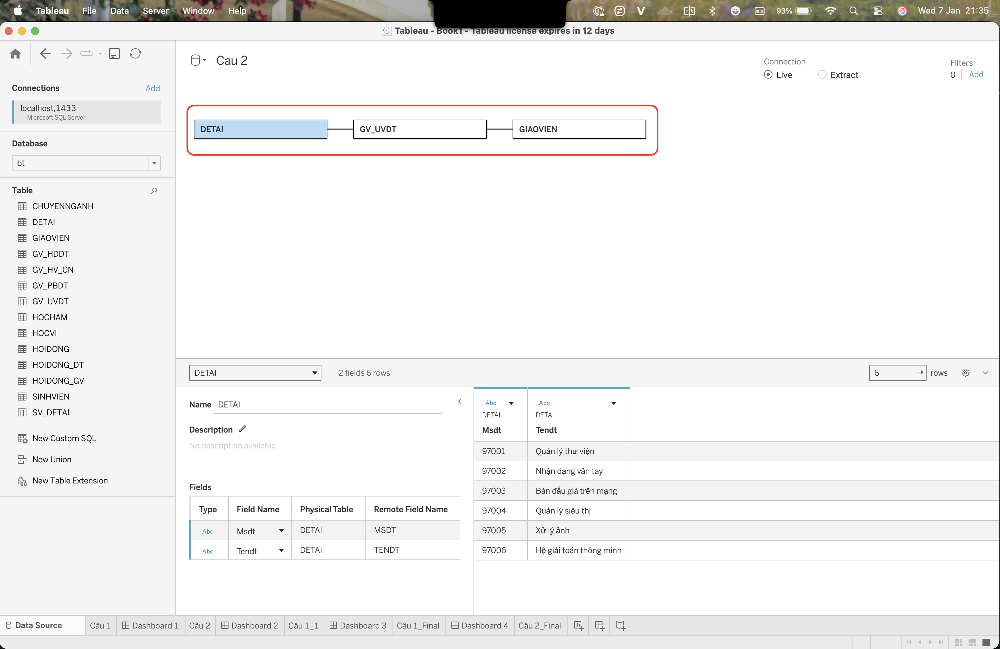
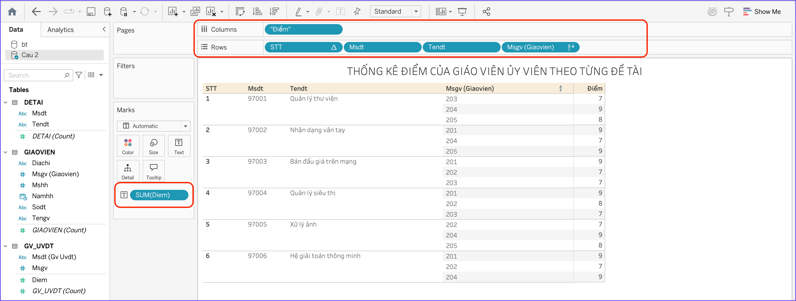
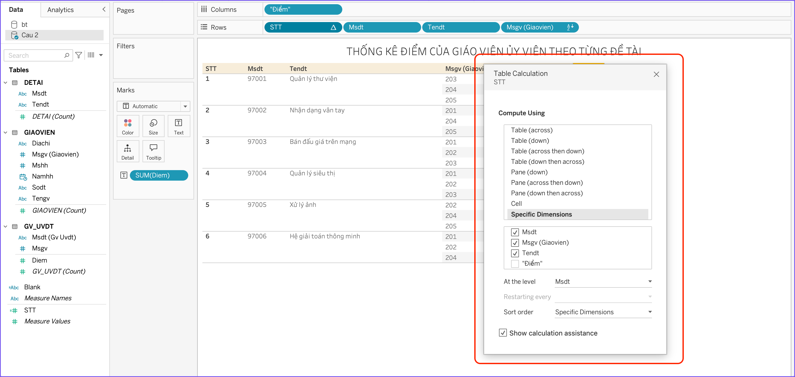
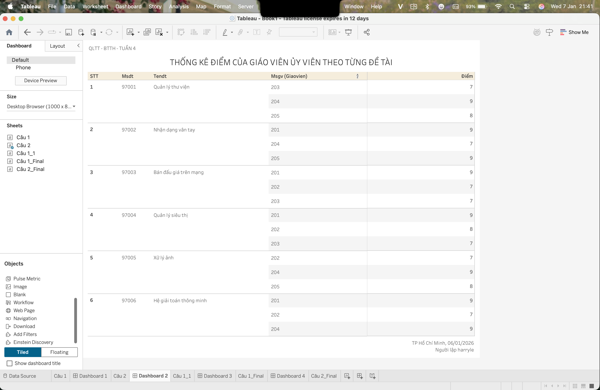

# Các Bước Thực Hiện Chi Tiết

## 1.B

### Kết nối database

### Kết nối các fields và data liên quan vào columns và rows panels

### Config STT field để group theo từng đề tài

### Thiết kế Dashboard

## 1.C

## 1.D
