## B. AN TOÀN DỮ LIỆU

### 7. Backup (Sao Lưu) và Restore (Khôi Phục)

Hãy backup CSDL `AAA` thành 1 file `AAA.BAK`, sau đó xóa CSDL `AAA` và hãy khôi phục `AAA` nhờ vào `AAA.BAK`. 
Thực hiện bằng 2 cách: 

- Cách 1: Dùng giao diện.
  - Yêu cầu: Chụp màn hình các bước thực hiện (Chụp đúng phần cần thiết và rõ nét, có thể dùng công cụ Snipping Tool). 
- Cách 2: Dùng câu lệnh.
  - Yêu cầu: Dùng các lệnh SQL để thực hiện.

#### Cách 1: Giao Diện (SSMS)

##### Backup (Sao Lưu)

- Click chuột phải vào CSDL AAA > **Tasks** > **Back Up...**

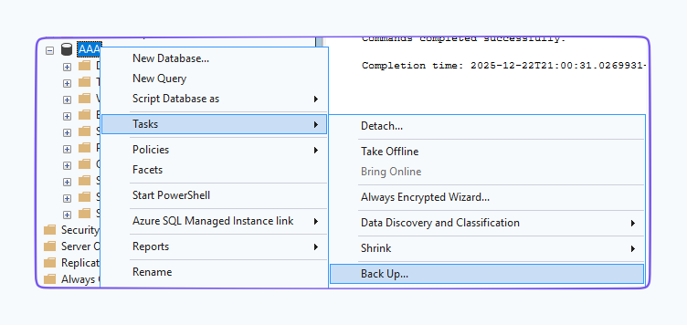

- Mục **Destination**: Chọn **Disk**, chọn đường dẫn lưu file `AAA.BAK`.

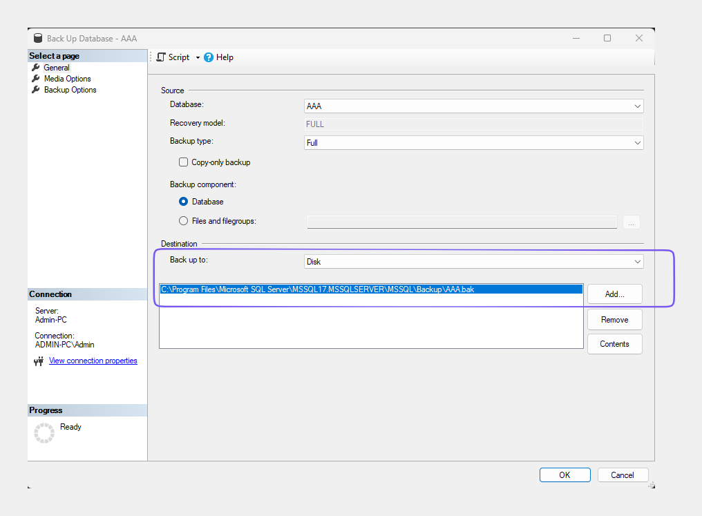

- Nhấn **OK**.
  - Màn hình thông báo "The backup of database 'AAA' completed successfully").

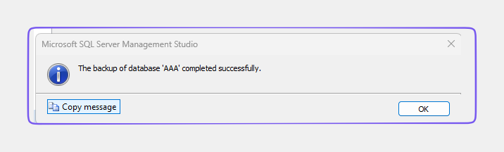

##### Xóa DB

- Click chuột phải vào CSDL AAA -> **Delete**.
- Check vào ô **Close existing connections** (để ngắt các kết nối đang chạy).

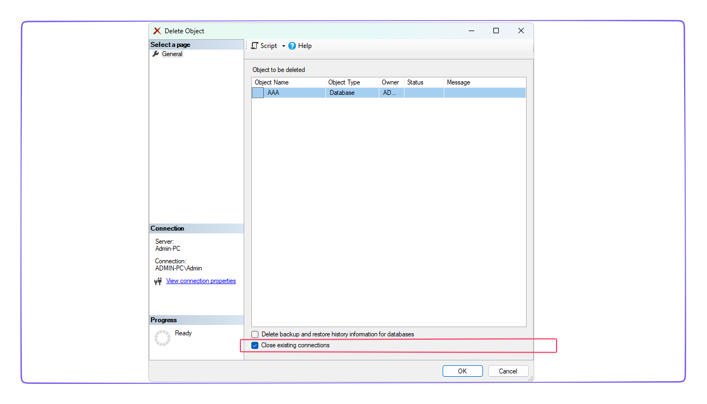

- Nhấn **OK**.

##### Restore (Khôi Phục)

- Click chuột phải vào thư mục **Databases** -> **Restore Database...**
- Chọn **Database** -> Nhấn nút **...** để duyệt file -> Chọn file `AAA.BAK` vừa tạo.

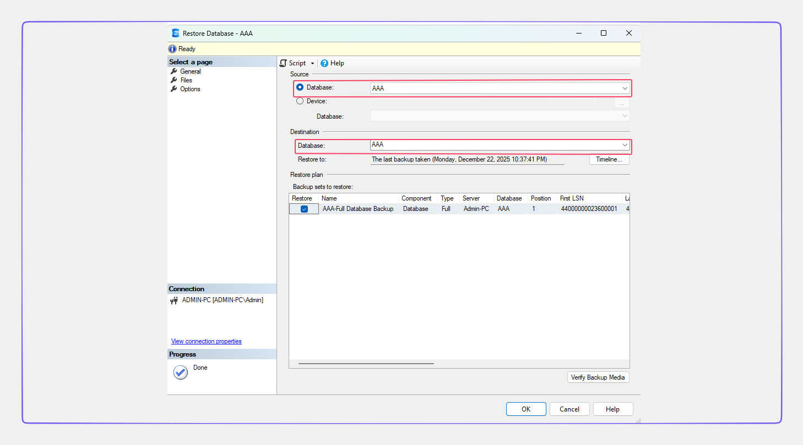

- Nhấn **OK**.

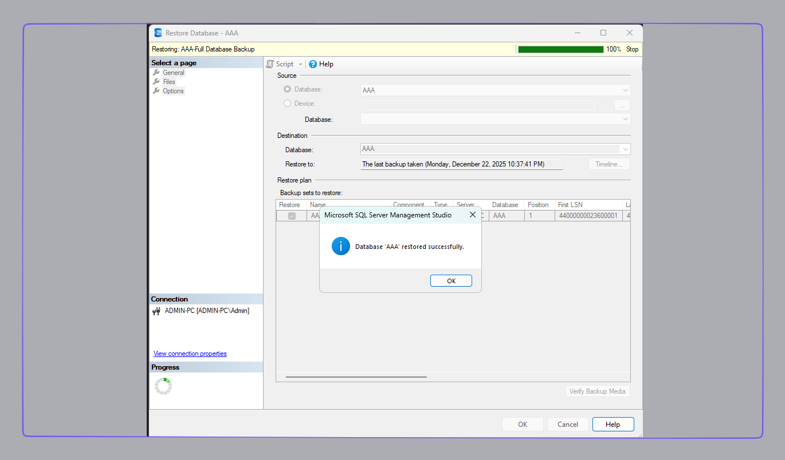

#### Cách 2: SQL

Mở cửa sổ **New Query** và chạy lần lượt các đoạn lệnh.

##### Backup (Sao Lưu)

```sql
BACKUP DATABASE AAA
TO DISK = 'C:\Users\Admin\Desktop\Backup\AAA.BAK'
WITH FORMAT;
GO
```

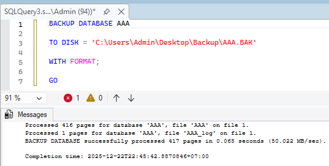

##### Xóa DB

```sql
ALTER DATABASE AAA SET SINGLE_USER WITH ROLLBACK IMMEDIATE; -- để đảm bảo không có ai đang dùng Database
DROP DATABASE AAA;
```

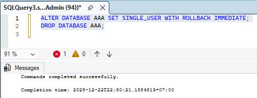

##### Restore (Khôi Phục)

```sql
RESTORE DATABASE AAA
FROM DISK =  'C:\Users\Admin\Desktop\Backup\AAA.BAK;
GO
```

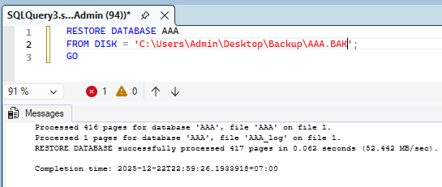

### SQL Server Log

Hãy đọc SQL Server Log trong phần SQL Enterprice → Management → SQL Server Log. Trình bày màn hình các bước thực hiện và ý nghĩa của mỗi trường thông tin trong bảng Log.

- **Đường dẫn:** Trong SQL Server Management Studio (SSMS), mở rộng mục **Management** -> Mở rộng **SQL Server Logs**. Click đúp vào **Current** (hoặc Archive #1, #2).

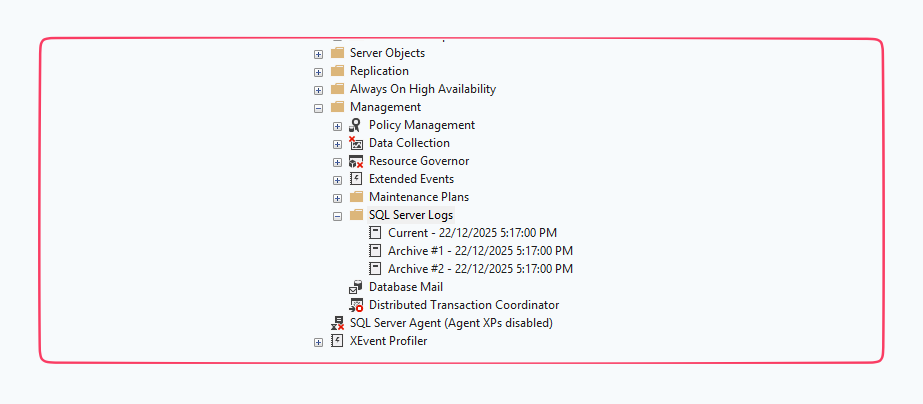

- Ý nghĩa các trường thông tin trong Log:
  - **Date:** Thời gian (ngày/giờ) sự kiện xảy ra.
  - **Source:** Nguồn gốc của thông báo (thường là Server, Logon, hoặc spid - Session Process ID).
  - **Message:** Nội dung chi tiết của thông báo ("Database backed up...", "Login failed for user...").

  - Mục đích: Giúp quản trị viên theo dõi sức khỏe hệ thống, phát hiện lỗi đăng nhập, kiểm tra các tác vụ backup thành công hay thất bại.

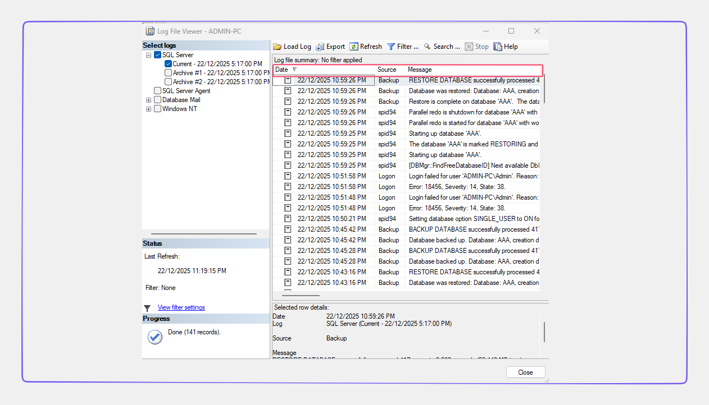

### Employees

Cho bảng Employees có cấu trúc như sau:

```sql
CREATE TABLE Employees (
    EmployeeID INT PRIMARY KEY,
    FirstName VARCHAR (50) NOT NULL,
    LastName VARCHAR (50) NOT NULL,
    BirthDate DATE NOT NULL,
    HireDate DATE NOT NULL );
GO
```

Giả sử tạo 1 View tên là `EmployeeNames` như sau:

```sql
CREATE VIEW EmployeeNames
AS
    SELECT FirstName, LastName
    FROM Employees
```

Hỏi câu lệnh `INSERT` dưới đây có thực hiện được hay không? Tại sao?

```sql
INSERT INTO EmployeeNames (FirstName, LastName) VALUES ('QuanLyThongTin', 'IE103');
```

**Trả lời:**

- Câu lệnh INSERT này KHÔNG thực hiện được.

**Giải thích:**

- **Cấu trúc bảng (`Employees`)**:
  - Cột `BirthDate` được định nghĩa là `NOT NULL` (Bắt buộc có dữ liệu).
  - Cột `HireDate` được định nghĩa là `NOT NULL` (Bắt buộc có dữ liệu).
  - Không có giá trị mặc định (`DEFAULT`) nào được khai báo cho 2 cột này.
  
- **Cấu trúc View (`EmployeeNames`):**
  - Chỉ chứa 2 cột: `FirstName` và `LastName`.
  
- **Hành động INSERT:**
  - Câu lệnh: `INSERT INTO EmployeeNames (FirstName, LastName) VALUES (...)`
  - Khi insert vào View, SQL Server thực chất sẽ cố gắng insert vào bảng gốc `Employees`.
  - Câu lệnh trên cung cấp `FirstName`, `LastName` (và `EmployeeID` nếu ID tự tăng - Identity, trong trường hợp này thì không).
  - Tuy nhiên, nó **không cung cấp giá trị** cho `BirthDate` và `HireDate`.

**Thực nghiệm:**

- Nhận thông báo lỗi.

```sql
Msg 515, Level 16, State 2, Line 15
Cannot insert the value NULL into column 'HireDate', table 'BTTH2.dbo.Employees'; column does not allow nulls. INSERT fails.
```

**Kết luận:**

- Do bảng gốc yêu cầu `BirthDate` và `HireDate` không được để trống (`NOT NULL`), nhưng câu lệnh `INSERT` thông qua View lại không cung cấp giá trị cho chúng, nên SQL Server sẽ báo lỗi vi phạm ràng buộc dữ liệu.

### Mã Hóa Dữ Liệu

Cho hình bên dưới.

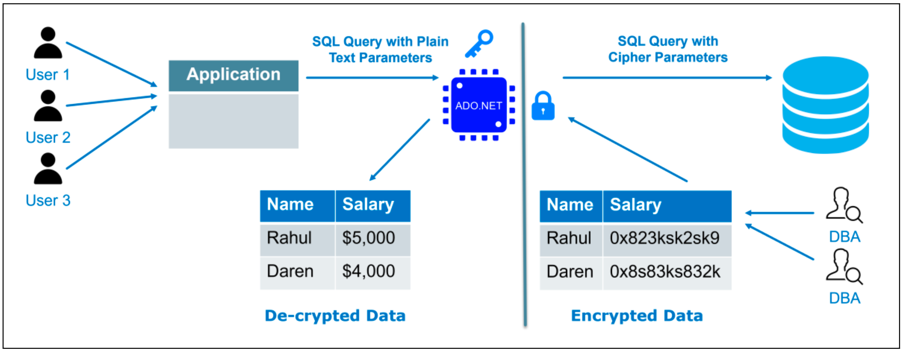

Hỏi hình trên đang mô tả mã hóa dữ liệu ở trạng thái nào? Vì sao?

Biết dữ liệu có 3 trạng thái là:

- Data at rest (trạng thái nghỉ),
- Data in use (trạng thái đang sử dụng),
- Data in motion/transit (trạng thái lưu chuyển).

Trả lời:

- Đồ họa trên miêu tả việc mã hóa dữ liệu ở các trạng thái sau đây.
- **Data in motion/transit (Trạng thái lưu chuyển)**
  - Mũi tên từ bộ phận điều khiển ADO.NET (phía ứng dụng/Client) gửi đến Database có ghi chú "SQL Query with Cipher Parameters" (Truy vấn SQL với các tham số mật mã).
  - ADO.NET: “a set of computer software components that programmers can use to access data and data services from a database.”
  - Điều này có nghĩa là dữ liệu đã được mã hóa ngay tại ứng dụng (Client-side) trước khi nó được gửi tới lưu trữ.
  - Do đó, trên đường truyền, dữ liệu hoàn toàn ở dạng mã hóa, bảo vệ nó khỏi việc bị nghe lén.
- **Data at rest (Trạng thái nghỉ)**
  - Ở phía bên phải (Database), hình ảnh biểu diễn dữ liệu ngay từ trước khi được đưa vào lưu trữ (hình trụ) là "Encrypted Data" (Dữ liệu đã mã hóa).
  - Ngay cả DBA (người quản trị cơ sở dữ liệu) khi truy xuất vào bảng cũng chỉ thấy chuỗi mã hóa vô nghĩa (ví dụ: 0x823ksk...).
  - Điều này chứng tỏ dữ liệu nằm trên thiết bị lưu trữ luôn ở trạng thái được mã hóa.

