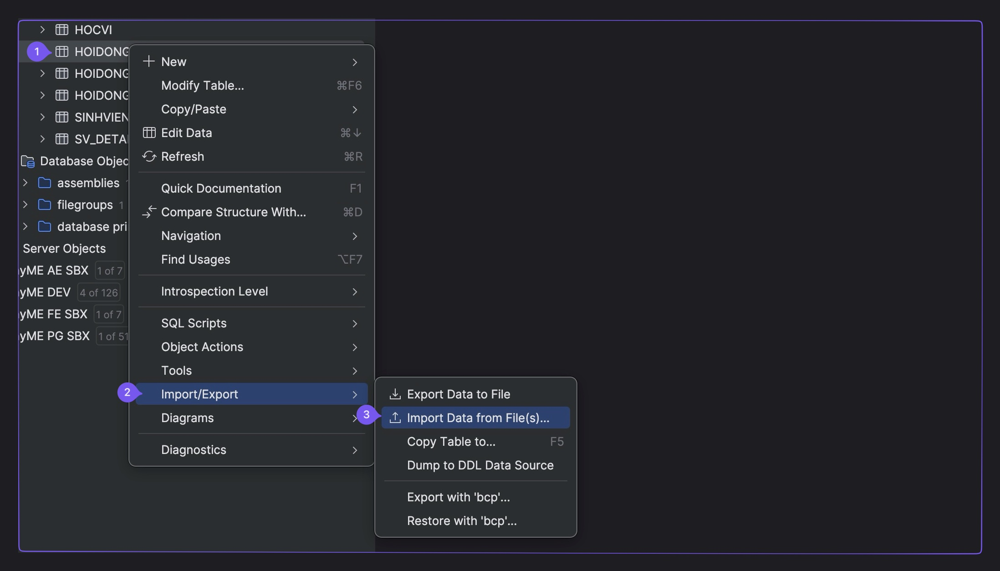
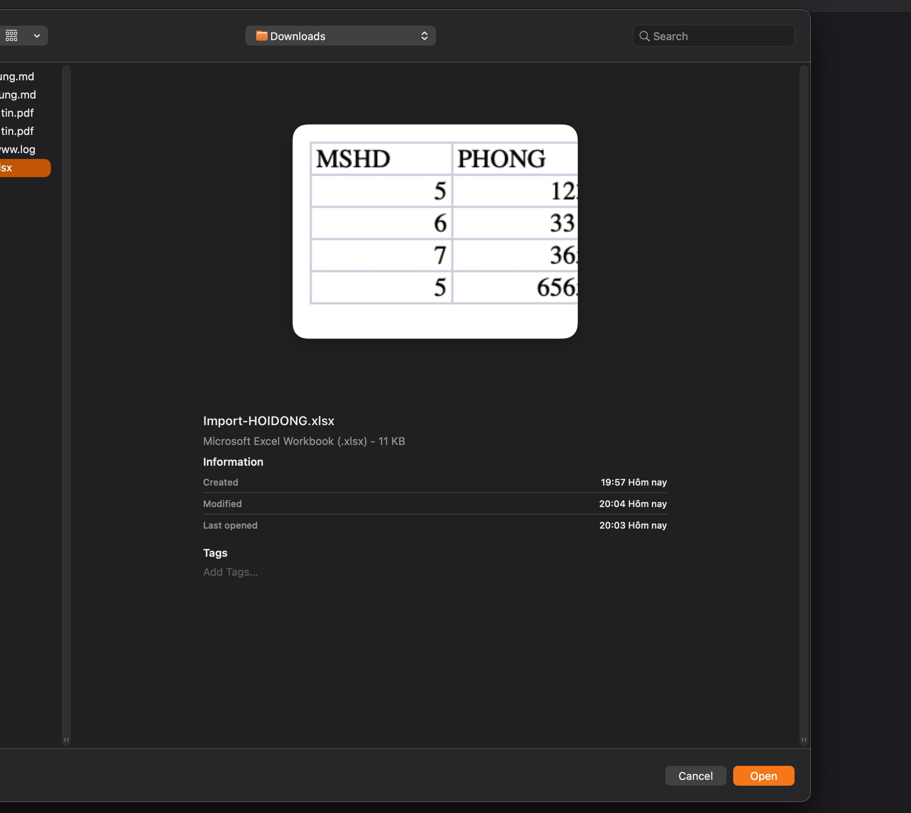
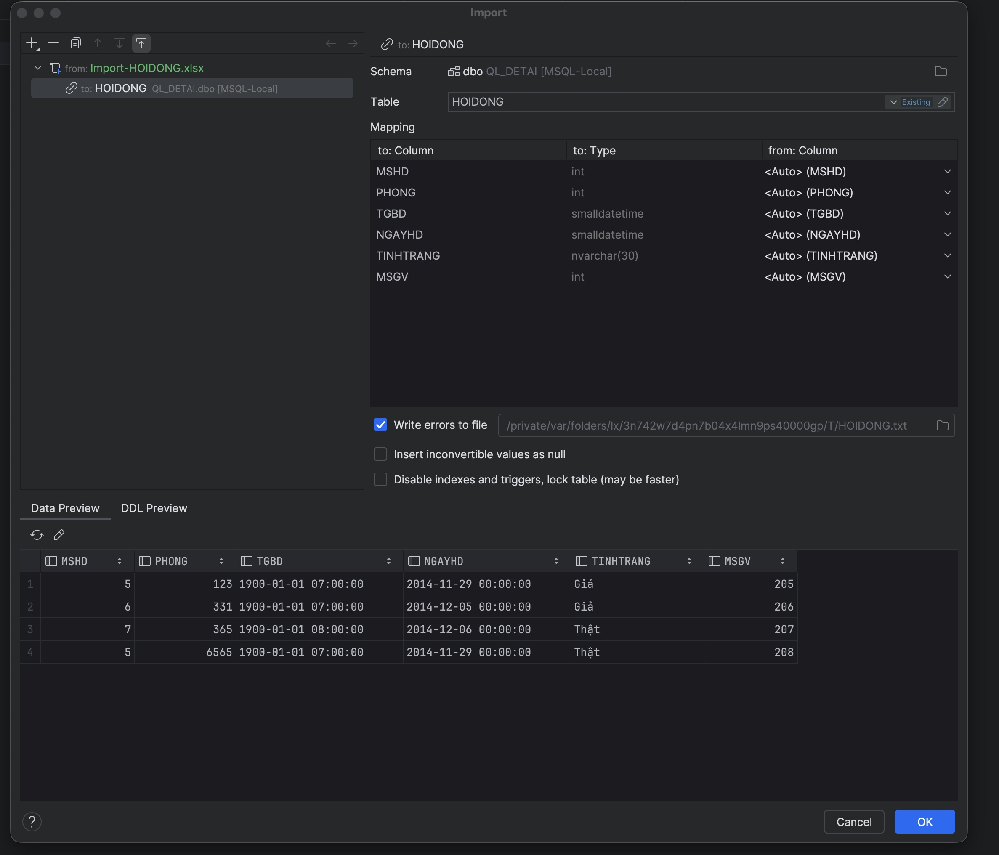
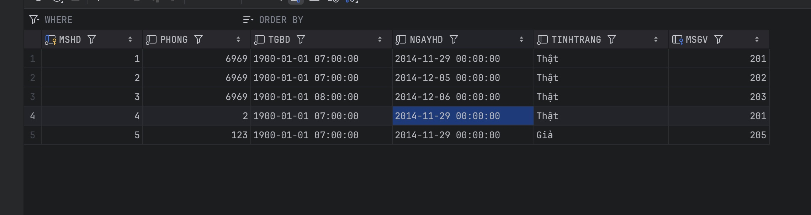
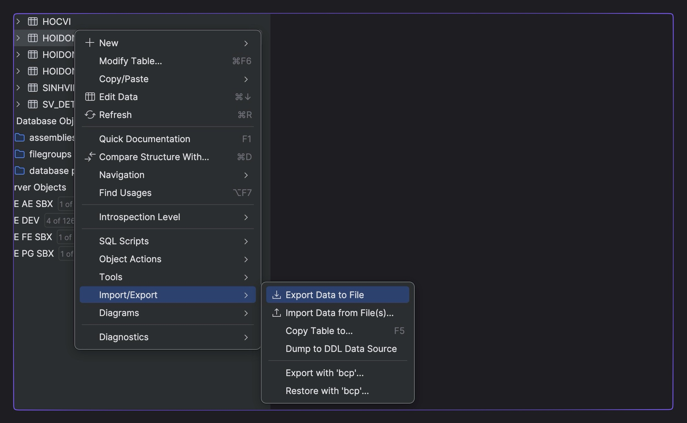
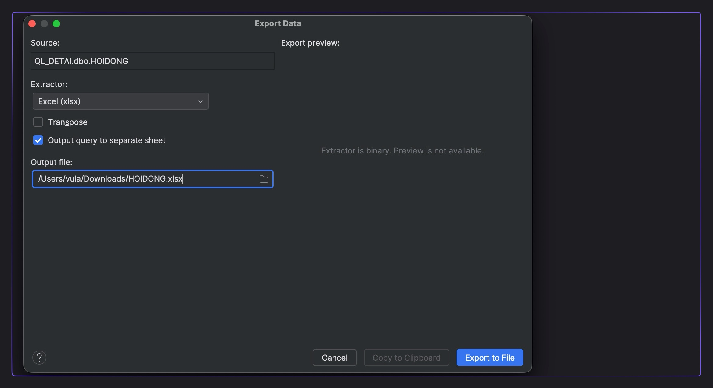
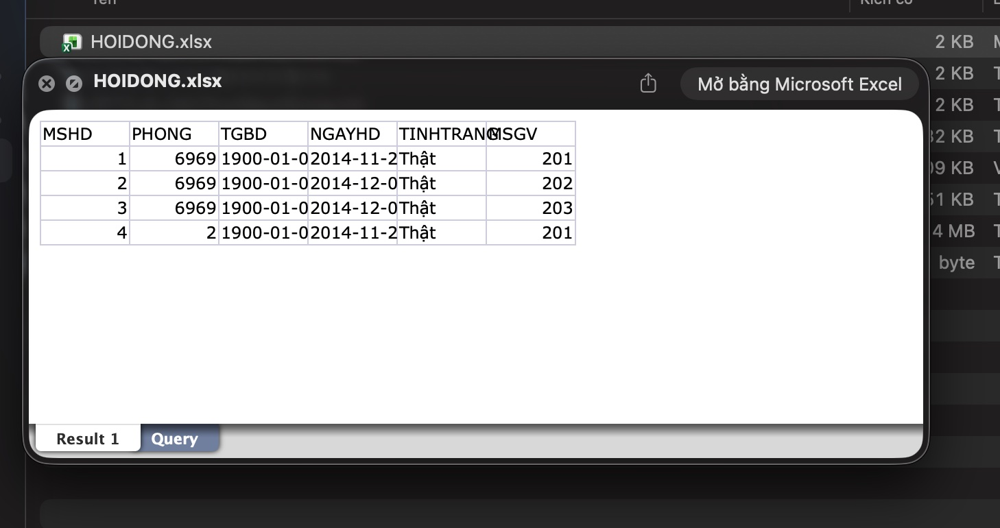

## A. IMPORT VÀ EXPORT

### Import Dữ Liệu Từ Excel File

Chọn 1 file dữ liệu (SV) từ excel, và import vào SQL Server.

- Chuột phải vào bảng cần IMPORT dữ liệu và chọn Import/Export > Import Data from File(s)…

- Chọn lựa file Excel chứa dữ liệu.

- Cấu hình các trường (field) và kiểu dữ liệu (data type) cho bảng.

- Kết quả: Dữ liệu đã được nhập (imported) thành công.

### Export Dữ Liệu tới Excel File

Chọn 1 table trong SQL Server, và export tới file Excel.

- Chuột phải vào bảng cần EXPORT dữ liệu và chọn Import/Export > Export Data to File

- Chỉ định thể loại file (**Extractor**) và nơi lưu trữ (**Output file**).

- Thông báo EXPORT thành công.

- Kiểm tra lại kết quả EXPORT.

