## D. Crystal Report Báo Cáo Tổng Doanh Thu

Cho CSDL Quản lý bán hàng đính kèm bên dưới. Hãy dùng Crystal Report để thiết kế một báo cáo cho biết Tổng doanh thu theo từng sản phẩm trong năm 2006 + 2007.

Yêu cầu gồm có 2 phần sau:

- Phần Biểu đồ tròn (Pie Chart): Cho biết tỷ lệ phần trăm doanh số bán được của từng sản phẩm trong năm 2006 + 2007.
    - Sử dụng `MASP` (mã sản phẩm) để phân biệt các sản phẩm với nhau (Vì sản phẩm có thể trùng tên).
    - Gán nhãn `MASP` cho từng phần trong biểu đồ.
    - Thông tin phần trăm của từng sản phẩm để bên phải của biểu đồ.
    - Lưu ý: Thông tin phần trăm trong biểu đồ là tổng doanh thu của từng sản phẩm trong năm 2006 + 2007, tức cột cuối cùng trong phần Bảng số liệu chi tiết bên dưới.

- Phần Bảng số liệu chi tiết: Cho biết doanh thu cụ thể của từng sản phẩm trong năm 2006, năm 2007 và năm (2006 + 2007). Cụ thể:
    - Tổng doanh thu theo từng sản phẩm trong năm 2006.
    - Tổng doanh thu theo từng sản phẩm trong năm 2007.
    - Tổng doanh thu theo từng sản phẩm trong năm 2006 + 2007.
    - Phần Page Header tô nền vàng và có Border xung quanh.
    - Phần Detail có Border xung quanh.

### Phần Biểu đồ tròn (Pie Chart)

```sql
-- Tạo View tính tổng doanh thu riêng từng sản phẩm trong năm 2006, 2007

CREATE OR ALTER VIEW V_BAOCAO_DOANHTHU_SP_2006_2007 AS
SELECT
    SP.MASP,
    SP.TENSP,
    ISNULL(SUM(CASE WHEN YEAR(HD.NGHD) = 2006 THEN CT.SL * SP.GIA ELSE 0 END), 0) AS DoanhThu2006,
    ISNULL(SUM(CASE WHEN YEAR(HD.NGHD) = 2007 THEN CT.SL * SP.GIA ELSE 0 END), 0) AS DoanhThu2007,
    ISNULL(SUM(CASE WHEN YEAR(HD.NGHD) IN (2006, 2007) THEN CT.SL * SP.GIA ELSE 0 END), 0) AS TongCaHaiNam
FROM
    SANPHAM SP
LEFT JOIN
    CTHD CT ON SP.MASP = CT.MASP
LEFT JOIN
    HOADON HD ON CT.SOHD = HD.SOHD
GROUP BY
    SP.MASP, SP.TENSP
GO
```

### Kiểm tra kết quả của view vừa tạo

```sql
   SELECT * FROM V_BAOCAO_DOANHTHU_SP_2006_2007;
```

### Tạo chart (Pie) trong sheet mới

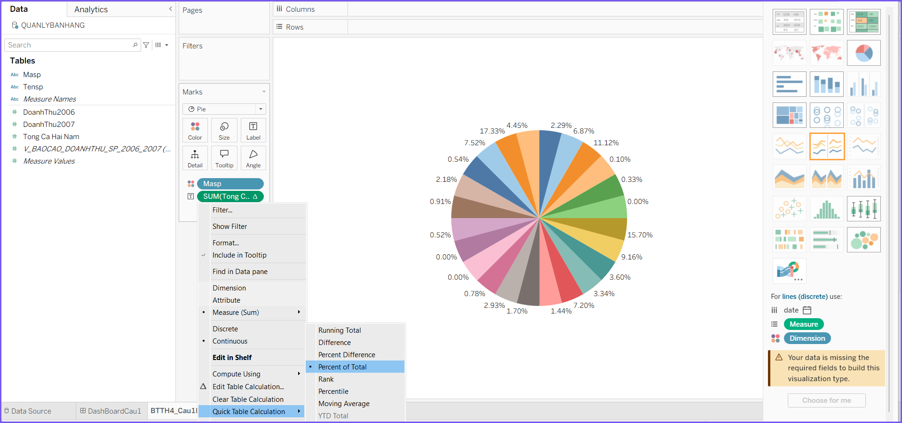

### Mapping dữ liệu từ View V_BAOCAO_DOANHTHU_SP_2006_2007 vào chart

Kéo thả vào mục Marks các trường trong view:

- MaSP -> Color => để hiển thị màu phân biệt sp
- Sum(TongCaNam) -> Angle => để chia tỉ lệ trong biểu đồ
- Sum(TongCaNam) và MaSP -> Label => để hiển thị trên biểu đồ

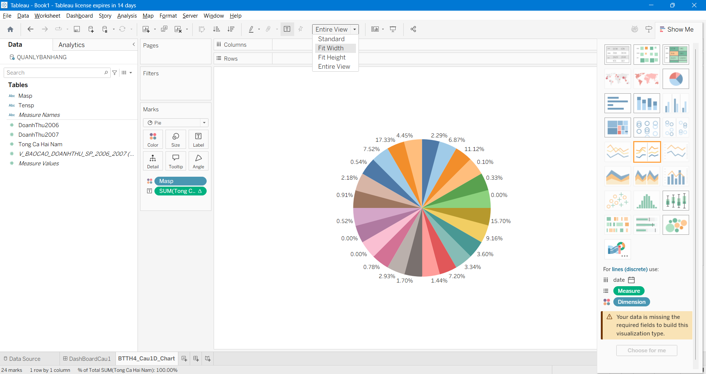

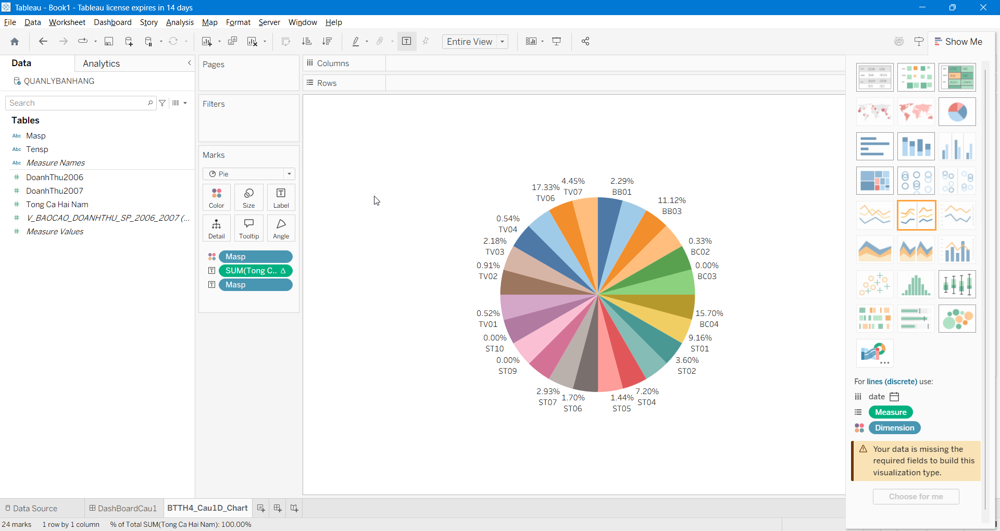

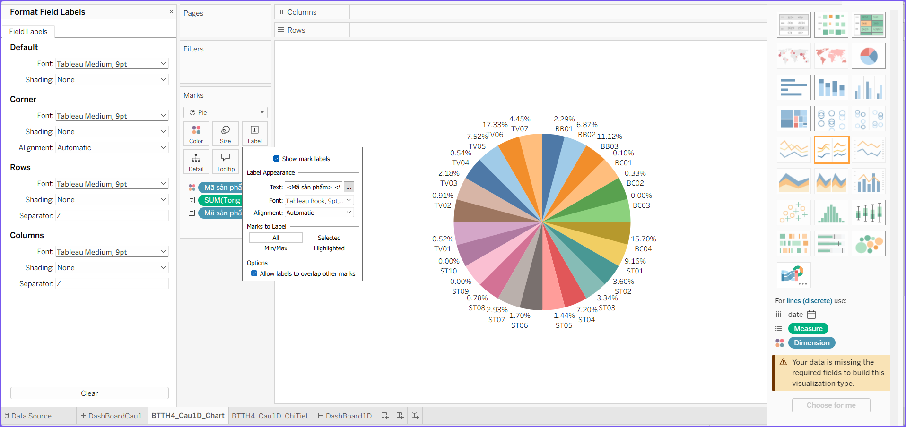

### Màn hình design của chart

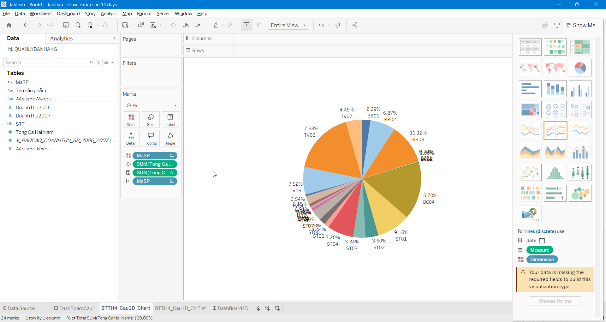

### Bảng số liệu chi tiết, tạo sheet mới, tô màu và vẽ đường viền

Kéo thả các field trong View

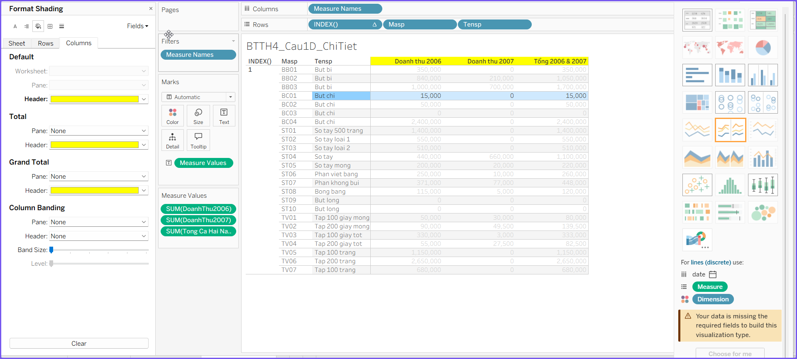

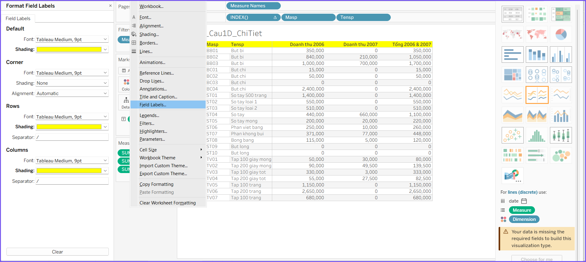

### Tạo STT

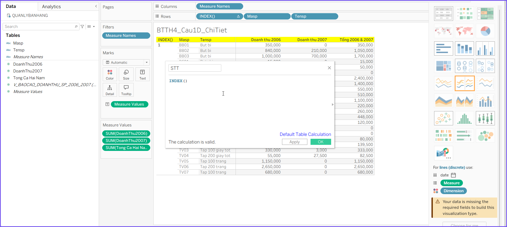

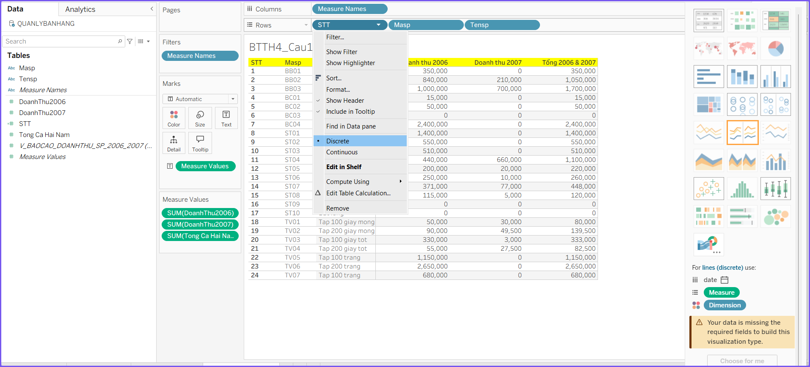

### Màn hình design & preview chi tiết

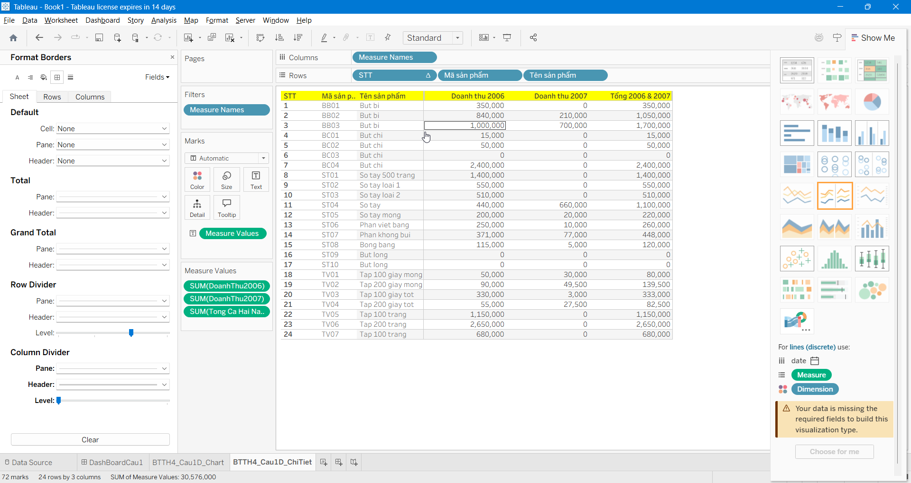

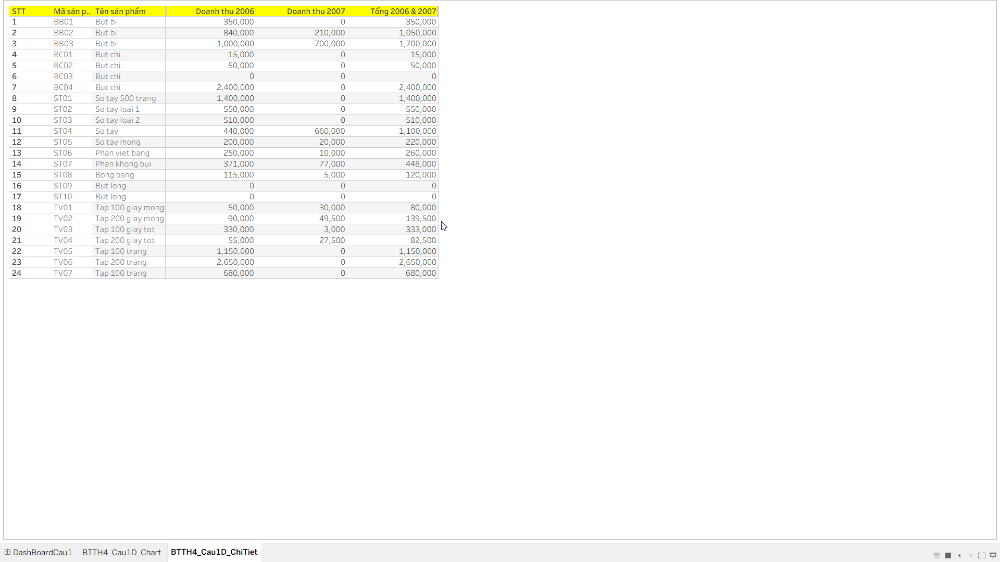

### Tạo dashboard để hiển thị biểu đồ và chi tiết

Kéo thả 2 sheet biểu đồ và sheet chi tiết vào

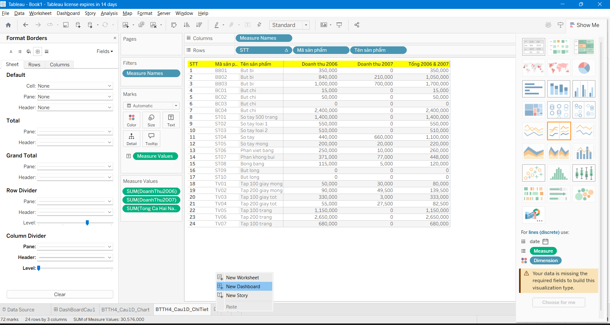

### Màn hình design cuối cùng

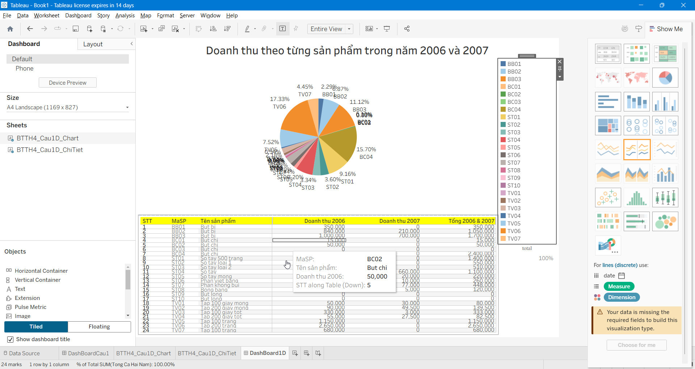

### Màn hình preview


