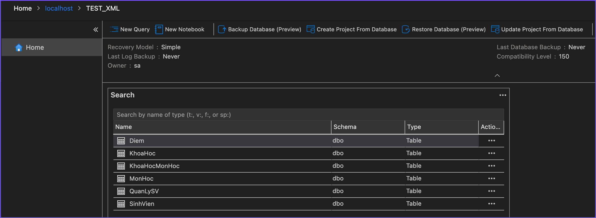

# A. Chuẩn Bị

Mục tiêu:

- Chuẩn bị Cơ Sở Dữ Liệu

## Tạo Cơ Sở Dữ Liệu

```{=typst}
#raw(read("code/BTTH5-a-0-create-db.sql"), lang: "sql", block: true)
```

## Tạo Các Bảng

### `KhoaHoc`

```{=typst}
#raw(read("code/BTTH5-a-create-KhoaHoc.sql"), lang: "sql", block: true)
```

### `SinhVien`

```{=typst}
#raw(read("code/BTTH5-a-create-SinhVien.sql"), lang: "sql", block: true)
```

### `MonHoc`

```{=typst}
#raw(read("code/BTTH5-a-create-MonHoc.sql"), lang: "sql", block: true)
```

### `KhoaHocMonHoc`

```{=typst}
#raw(read("code/BTTH5-a-create-KhoaHocMonHoc.sql"), lang: "sql", block: true)
```

### `Diem`

```{=typst}
#raw(read("code/BTTH5-a-create-Diem.sql"), lang: "sql", block: true)
```

### `QuanLySV`

```{=typst}
#raw(read("code/BTTH5-a-create-QuanLySV.sql"), lang: "sql", block: true)
```

### Kết Quả: Danh Sách Các Bảng



## Thêm Dữ Liệu

### `KhoaHoc`

```{=typst}
#raw(read("code/BTTH5-a-insert-KhoaHoc.sql"), lang: "sql", block: true)
```

### `SinhVien`

```{=typst}
#raw(read("code/BTTH5-a-insert-SinhVien.sql"), lang: "sql", block: true)
```

### `MonHoc`

```{=typst}
#raw(read("code/BTTH5-a-insert-MonHoc.sql"), lang: "sql", block: true)
```

### `KhoaHocMonHoc`

```{=typst}
#raw(read("code/BTTH5-a-insert-KhoaHocMonHoc.sql"), lang: "sql", block: true)
```

### `Diem`

```{=typst}
#raw(read("code/BTTH5-a-insert-Diem.sql"), lang: "sql", block: true)
```

### `QuanLySV`

- CNTT:

```{=typst}
#raw(read("code/BTTH5-a-insert-QuanLySV-cntt.sql"), lang: "sql", block: true)
```

- KHTN:

```{=typst}
#raw(read("code/BTTH5-a-insert-QuanLySV-khtn.sql"), lang: "sql", block: true)
```
