# Bài 1. Crystal Report 

## A. Crystal Report Từ Bảng (Table)

Tạo một Crystal Report từ một bảng tùy chọn trong CSDL QLDT.

Yêu cầu: 

- Đầy đủ cấu trúc của 1 Report. 
- Thêm cột số thứ tự cho mỗi sinh viên bằng SQL. 
- Tô nền vàng cho phần Page Header. 
- Ngăn cách phần Details với Report Footer bằng 1 đường kẻ. 
- Trình bày từng bước để tạo được Crystal Report.

### 1.Kết nối SQL Server với Tableau

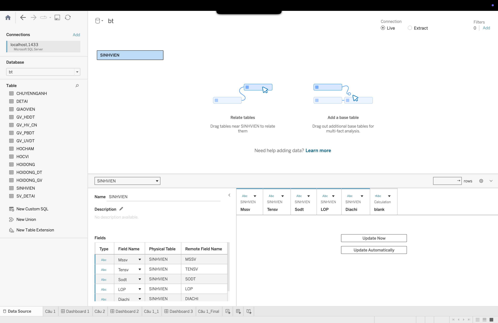

### 2.Cập nhật title của report

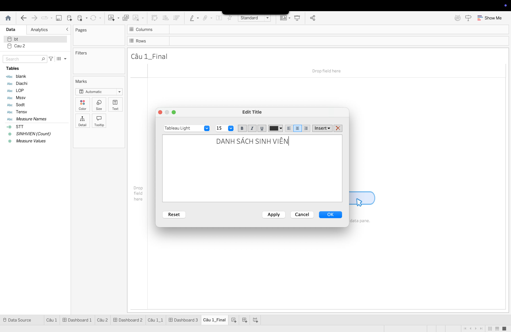

### 3.Drag các database fields từ data panel qua Rows panel

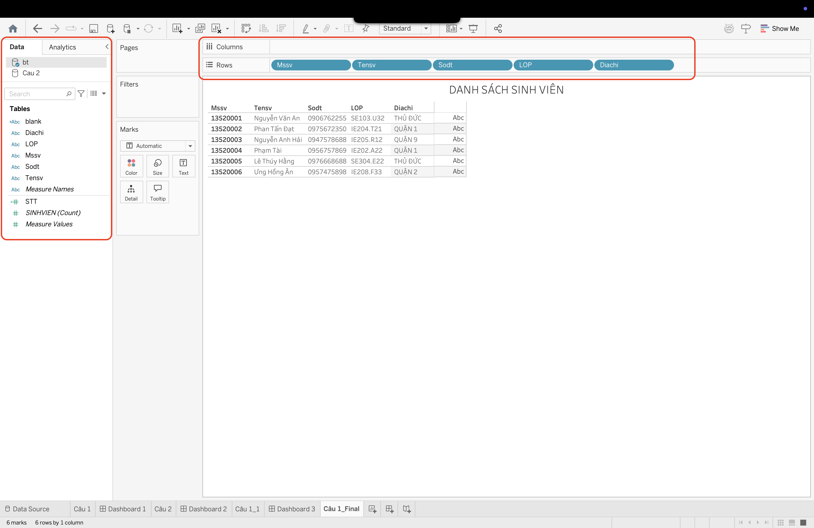

### 4.Bổ sung column STT

#### 4.1 Tạo Calculated Field

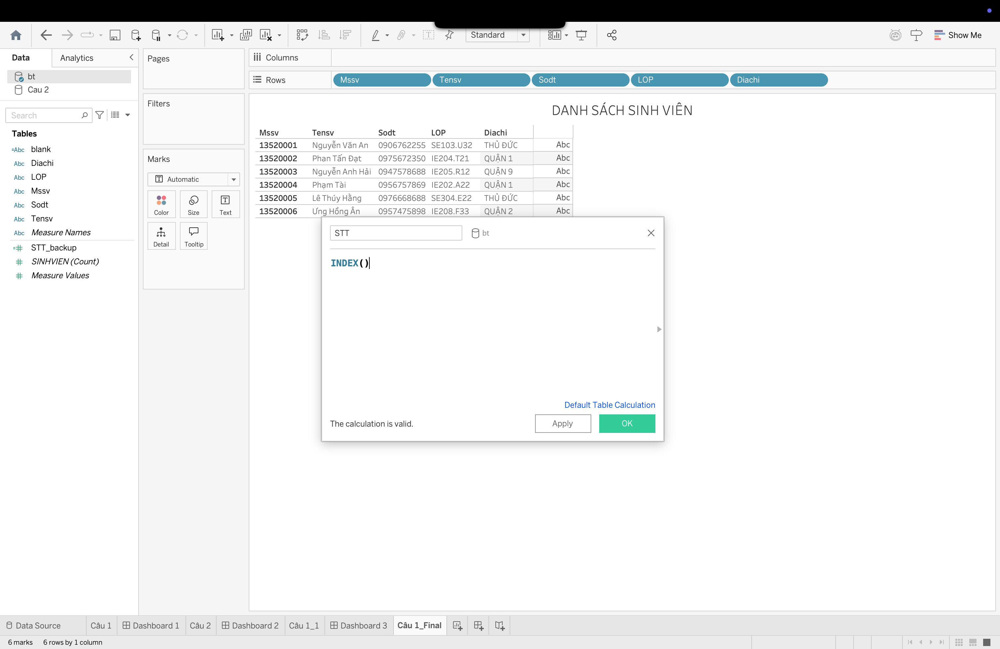

#### 4.2 Drag vào Row panel và chỉnh sửa thuộc tính cho phù hợp

Chọn thuộc tính `Discrete` để hiển thị STT rõ ràng.

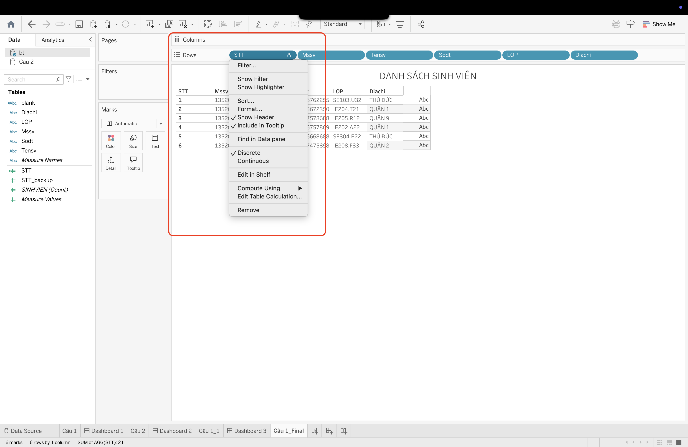

### 5.Format lại layout

#### 5.1 Ẩn đi column không cần thiết có chứa nội dung "ABC"

##### Drag row `Dia chi` vào mục `Text` của `Marks` panel

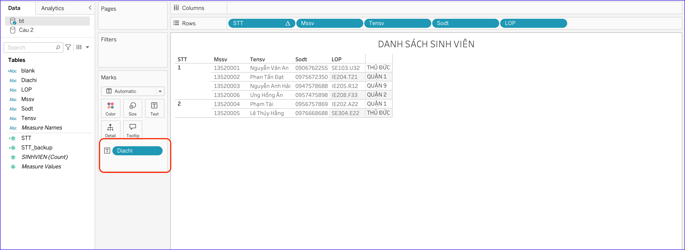

##### Drag `Measure Names` từ `Data` panel vào `Columns` panel

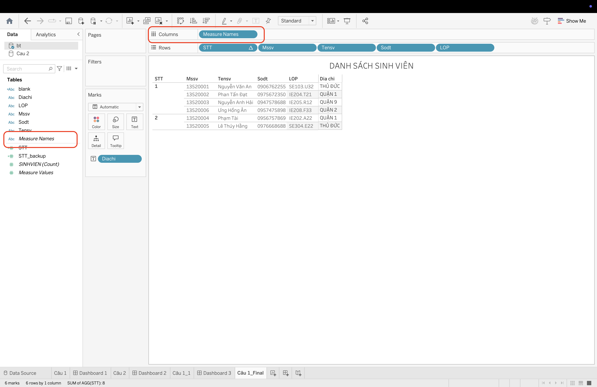

##### Cập nhật lại color của header

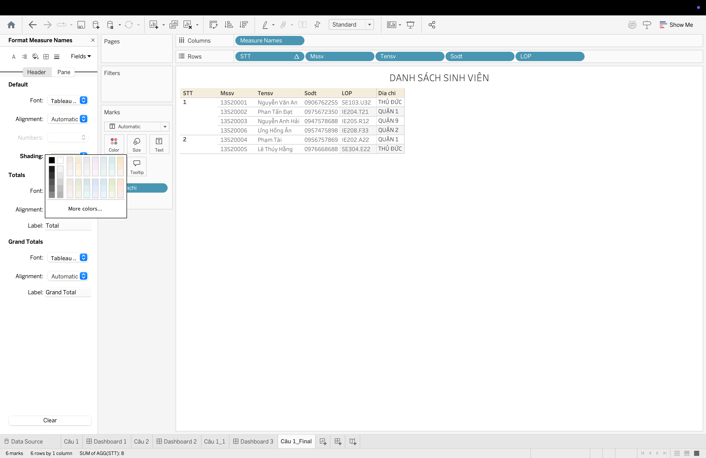

##### Cập nhật lại công thức tính index của STT để hiển thị chính xác

- Chọn `Edit Table Calculation`

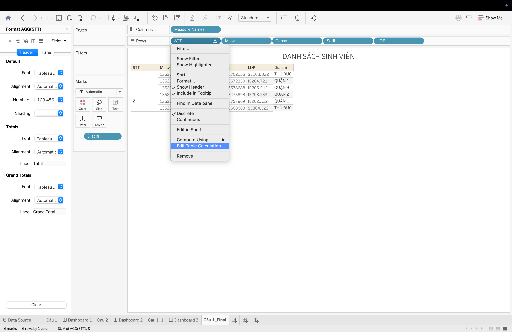

- Cập nhật lại logic
  - Chọn `Specific Dimensions`
  - Check tất cả các giá trị hiện tại cần kết hợp để xác định index.
  - Ở mục `At the level`: chọn `Deepest`

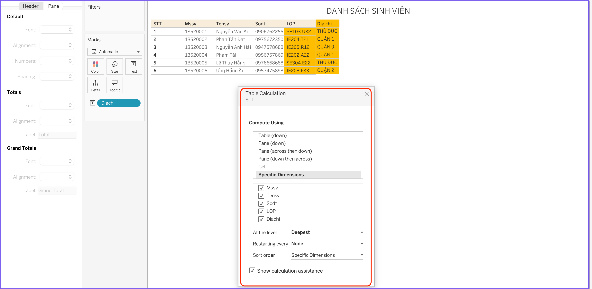

### 6.Tạo Dashboard cho report

#### 6.1 Tạo Dashboard và setup layout

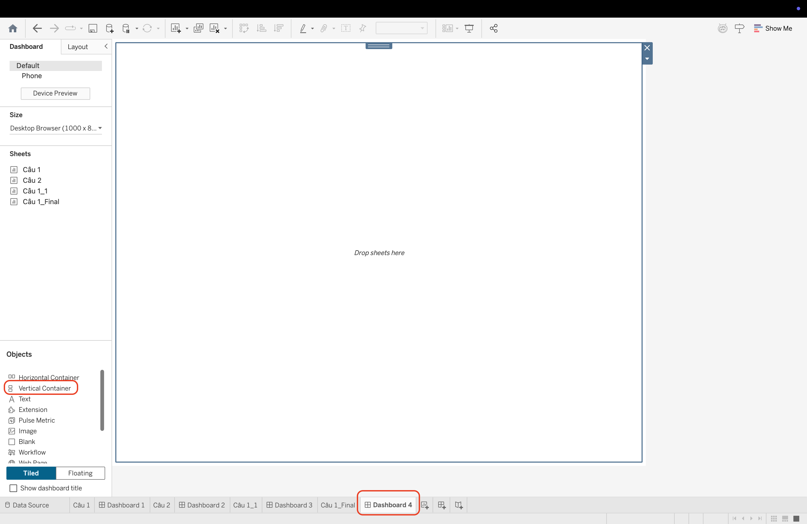

#### 6.2 Thêm title cho dashboard

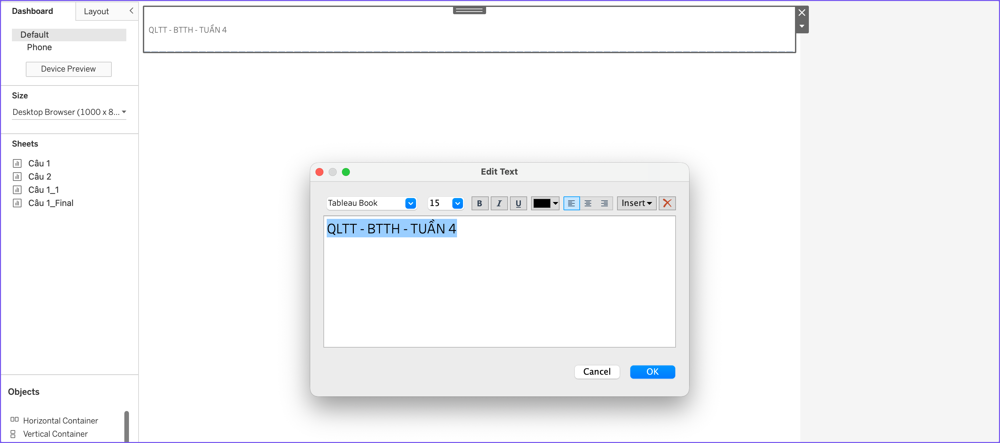

#### 6.3 Drag report vào dashboard

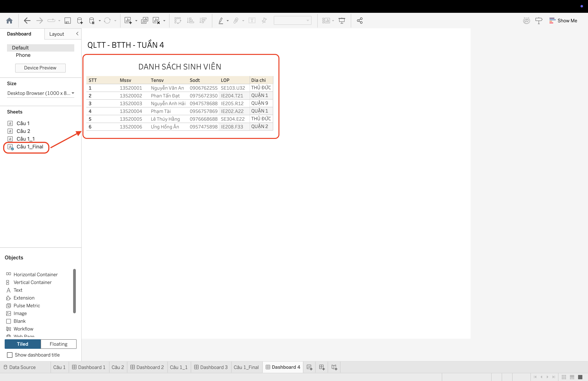

#### 6.4 Add footer to dashboard
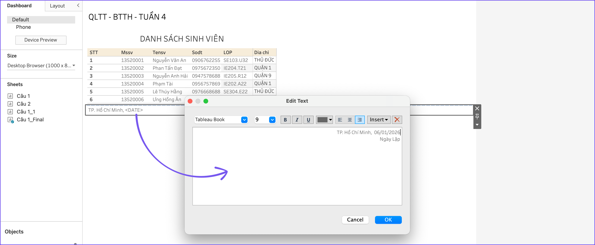

### 7. Report hoàn chỉnh

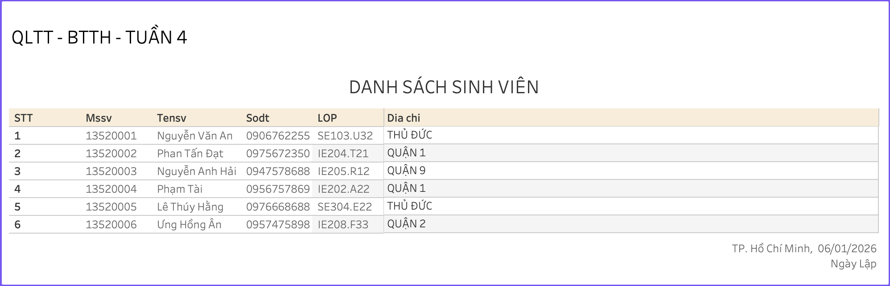

## B. Crystal Report Từ View

Tạo một View cho biết thông tin đề tài, thông tin giáo viên là ủy viên đề tài và điểm số của các giáo viên ủy viên này cho từng đề tài. Sau đó tạo một Crystal Report từ View vừa tạo.

Yêu cầu: 

- Đầy đủ cấu trúc của 1 Report. 
- Thêm cột số thứ tự cho mỗi đề tài bằng Crystal Report. 
- Sắp xếp điểm giảm dần theo từng đề tài. 
- Page Header có 2 đường kẻ trên cùng và 1 đường kẻ dưới cùng, Report Footer có 2 đường kẻ. Tô nền vàng cho Page Header và Report Footer. 
- Ngăn cách phần mỗi đề tài trong phần Details bằng 1 đường kẻ trước mỗi đề tài.

## C. Crystal Report Báo Cáo Doanh Thu

Cho CSDL Quản lý bán hàng đính kèm bên dưới. Hãy dùng Crystal Report để thiết kế một báo cáo cho biết Doanh thu theo tháng của từng nhân viên trong năm 2006.

Yêu cầu gồm có 2 phần sau: 

- Phần Biểu đồ đường (Line Chart): Cho biết sự biến động về doanh số bán được của từng nhân viên qua các tháng trong năm 2006.
    - Trục X là các tháng trong năm 2006, trục Y là doanh số bán được.
    - Mỗi đường biểu thị một nhân viên tương ứng. 

- Phần Bảng số liệu chi tiết: Cho biết doanh thu cụ thể của tháng đó với từng nhân viên. Trong đó có: 
    - Tổng doanh thu theo từng nhân viên. 
    - Tổng doanh thu của tất cả nhân viên trong năm 2006. 
    - Lưu ý: Một số tháng không được hiển thị là do bảng `HOADON` không có số liệu bán hàng của tháng đó.

## D. Crystal Report Báo Cáo Tổng Doanh Thu

Cho CSDL Quản lý bán hàng đính kèm bên dưới. Hãy dùng Crystal Report để thiết kế một báo cáo cho biết Tổng doanh thu theo từng sản phẩm trong năm 2006 + 2007.

Yêu cầu gồm có 2 phần sau: 

- Phần Biểu đồ tròn (Pie Chart): Cho biết tỷ lệ phần trăm doanh số bán được của từng sản phẩm trong năm 2006 + 2007. 
    - Sử dụng `MASP` (mã sản phẩm) để phân biệt các sản phẩm với nhau (Vì sản phẩm có thể trùng tên). 
    - Gán nhãn `MASP` cho từng phần trong biểu đồ. 
    - Thông tin phần trăm của từng sản phẩm để bên phải của biểu đồ. 
    - Lưu ý: Thông tin phần trăm trong biểu đồ là tổng doanh thu của từng sản phẩm trong năm 2006 + 2007, tức cột cuối cùng trong phần Bảng số liệu chi tiết bên dưới. 

- Phần Bảng số liệu chi tiết: Cho biết doanh thu cụ thể của từng sản phẩm trong năm 2006, năm 2007 và năm (2006 + 2007). Cụ thể: 
    - Tổng doanh thu theo từng sản phẩm trong năm 2006. 
    - Tổng doanh thu theo từng sản phẩm trong năm 2007. 
    - Tổng doanh thu theo từng sản phẩm trong năm 2006 + 2007. 
    - Phần Page Header tô nền vàng và có Border xung quanh. 
    - Phần Detail có Border xung quanh. 
