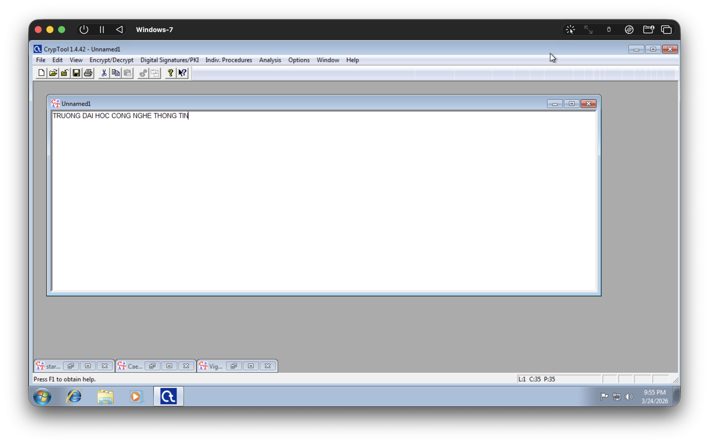
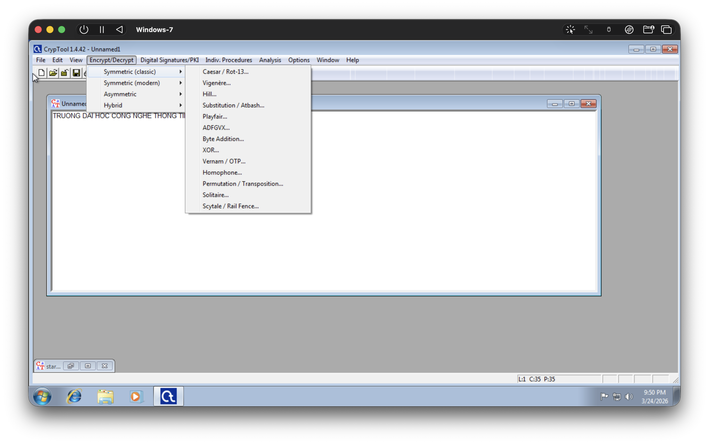
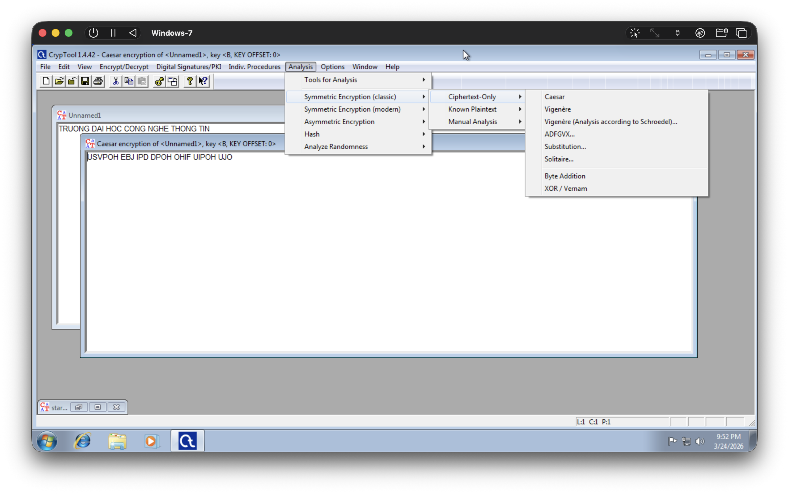
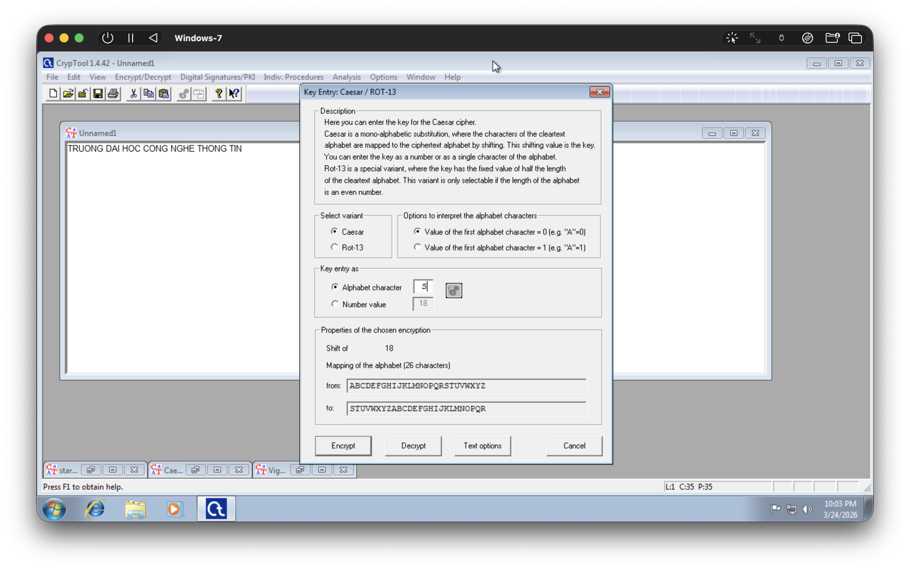
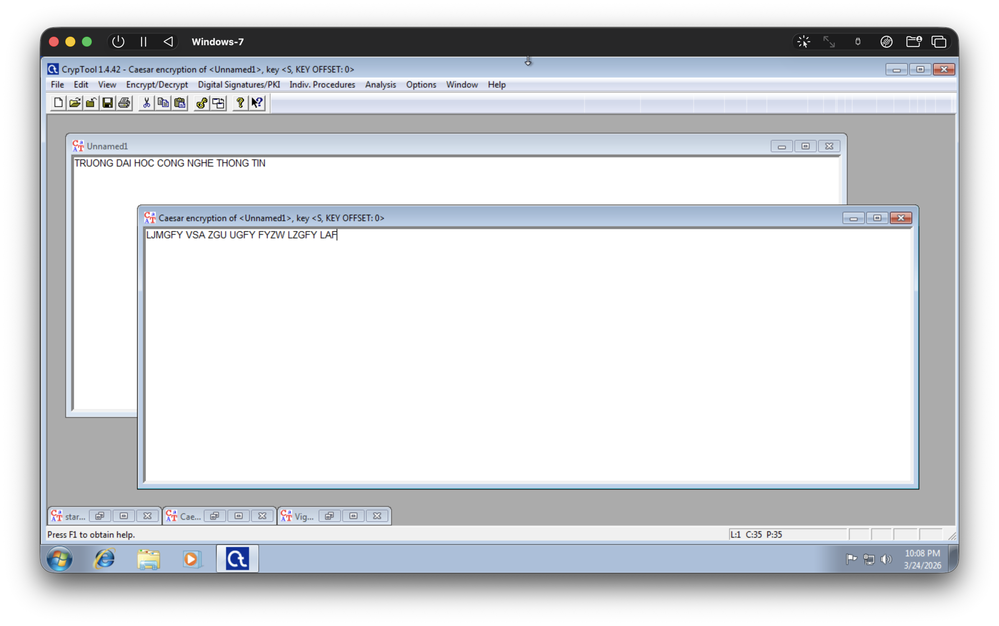
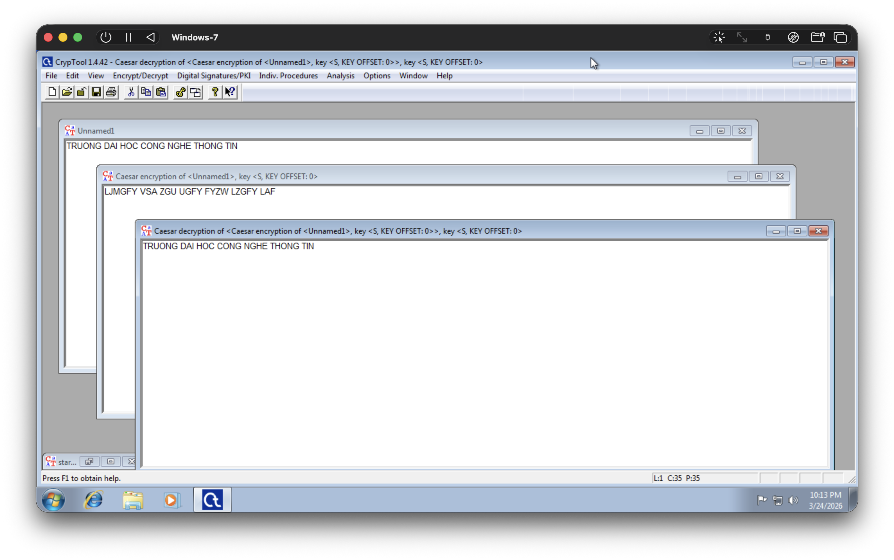

# BƯỚC 1 – Làm Quen CrypTool

## Văn Bản Mẫu

- File $\to$ New:
    - Cho phép tạo một đoạn văn bản mẫu, ví dụ: `TRUONG DAI HOC CONG NGHE THONG TIN`.

## Các Menu

- Menu Encrypt/Decrypt:
    - Liệt kê các kỹ thuật Mã Hóa, bao gồm:
        - Symmetric (classic): Mã Hóa Đối Xứng Cổ Điển
            - Caesar
            - Vigenere
            - Playfair
            - vv...
        - Symmetric (classic): Mã Hóa Đối Xứng Hiện Đại
        - Asymmetric: Mã Hóa Bất Đối Xứng
        - Hybrid: Mã Hóa Lai

- Menu Analysis
    - Cho phép phân tích các kỹ thuật mã hóa.
    - Có menu sắp xếp gần như tương đương với menu Encrypt/Decrypt.

## Thử Nghiệm Với Caesar

### Mã Hóa

- Tại cửa sổ chính với văn bản mẫu đã có, chọn **Encrypt/Decrypt $\to$ Symmetric (classic) $\to$ Caesar / Rot13...**
- Cửa sổ **Key Entry: Caesar / Rot13** hiện lên.
    - Chỉ định biến thể (**variant**): Caesar; Ký tự đầu tiên bắt đầu từ 0: $A = 0$.
    - **Key entry as**: chỉ định ký tự (độ lớn của sự dịch chuyển), trong ví dụ này là $S$, với $S = 18$.
- Chọn nút **Encrypt**.

- Kết quả:
    - Văn bản đã được mã hóa, cho ra kết quả: `LJMGFY VSA ZGU UGFY FYZW LZGFY LAF`
    - Cửa sổ kết quả cho biết key là gì, offset bao nhiêu.

### Giải Mã

- Tại cửa sổ kết quả, chọn menu **Encrypt/Decrypt $\to$ Symmetric (classic) $\to$ Caesar / Rot13...**
- Cửa sổ **Key Entry: Caesar / Rot13** hiện lên.
    - Thực hiện các thay đổi như ở phần mã hóa.
- Chọn nút **Decrypt**.
- Kết quả trả về là văn bản gốc, có hiện thị key và offset.

