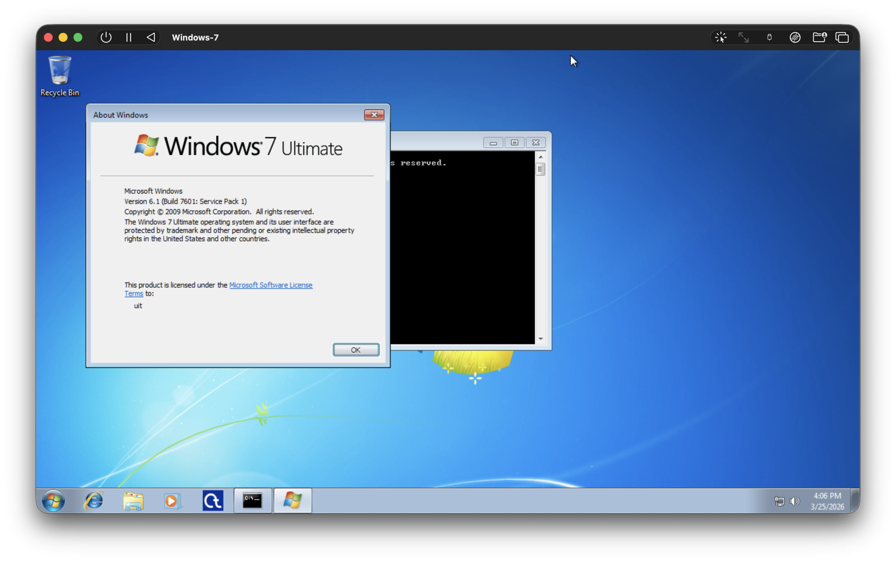
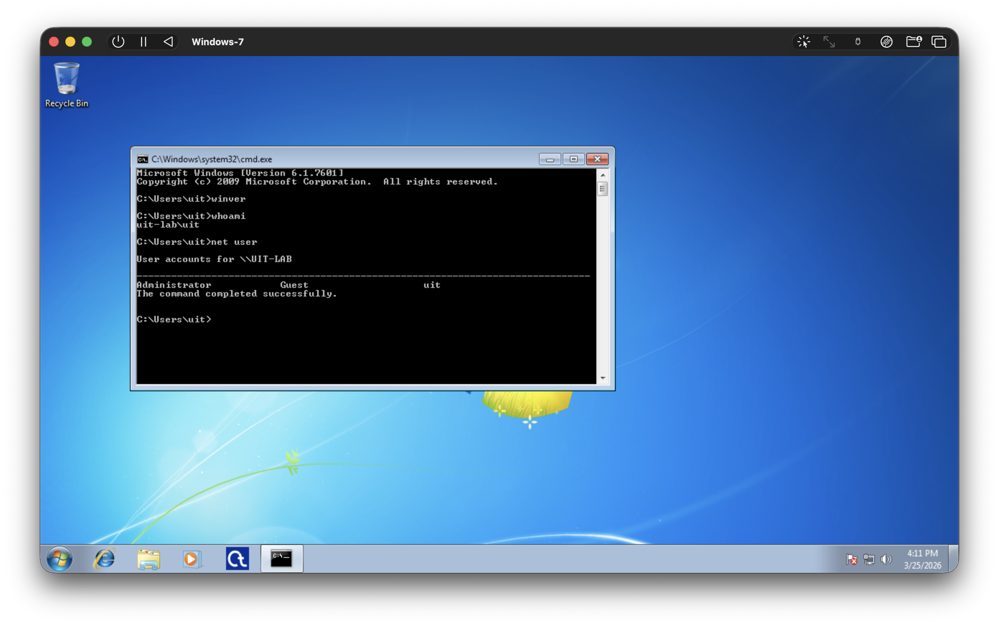
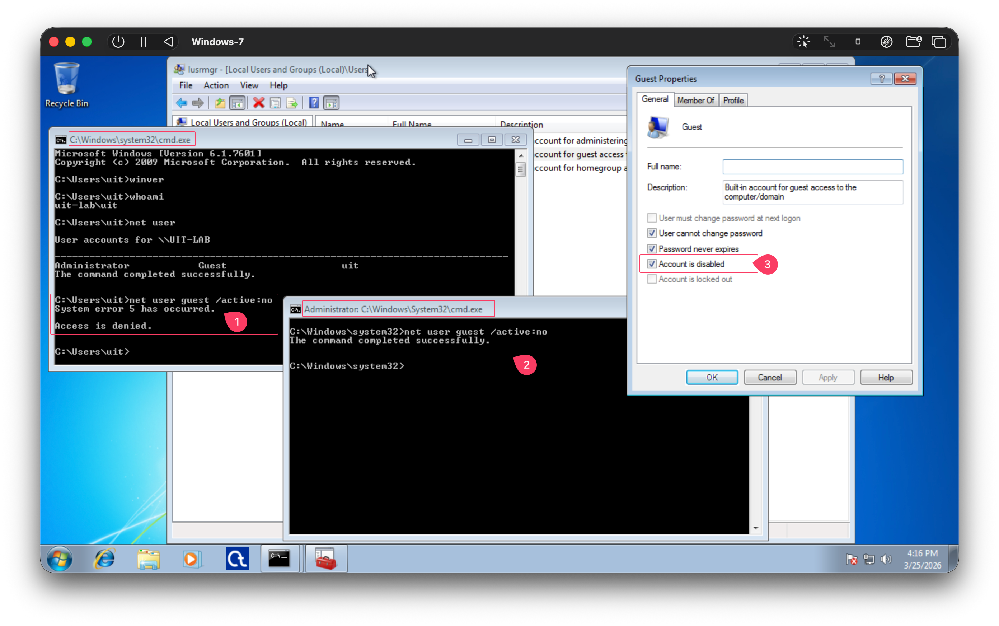

# PHẦN 1. CHUẨN BỊ MÁY WINDOWS

## Bước 1. Kiểm tra phiên bản Windows

1. Nhấn Windows + R.
2. Gõ: `winver` → Enter.
3. Ghi lại thông tin phiên bản Windows.

Thông tin phiên bản Windows:

- Windows 7 Ultimate
- Version: 6.1 (Build 7601: Server Pack 1)

## Bước 2. Kiểm tra quyền người dùng hiện tại

1. Mở Command Prompt:
    - Start → gõ cmd → Enter.
2. Gõ: `whoami`
3. Ghi lại tên tài khoản.
    - `uit`

## Bước 3. Liệt kê các tài khoản trong máy

1. Gõ lệnh: `net user`
2. Ghi chú:
    - Nếu có account lạ → đánh dấu rủi ro.
    - Nếu tài khoản Guest bật → rủi ro cao.

Kết quả:

- Account:
    - Administrator
    - Guest
    - `uit`
- Đánh giá rủi ro:
    - Không có account lạ.
    - Guest được bật: rủi ro cao.

## Bước 4. Tắt Guest Account

- Chạy cmd với Administrator.
- Chạy lệnh `net user guest /active:no`
    - Nếu chạy với user thường, gặp lỗi như ở 1.
    - Nếu chạy với Administrator, có thể hoàn thành, như ở 2.
- Hoàn thành.
- Kiểm tra lại, sử dụng Local Users and Groups
- Xem thuộc tính của Guest
    - **Account is disabled** ở 3.

