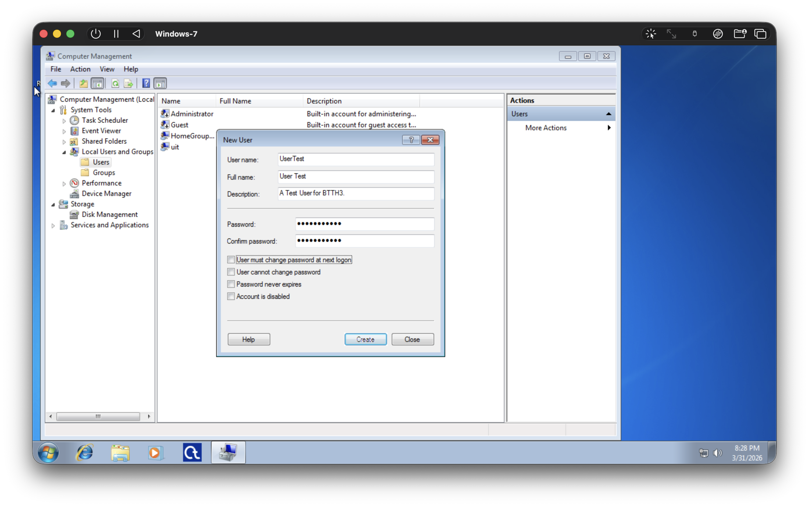
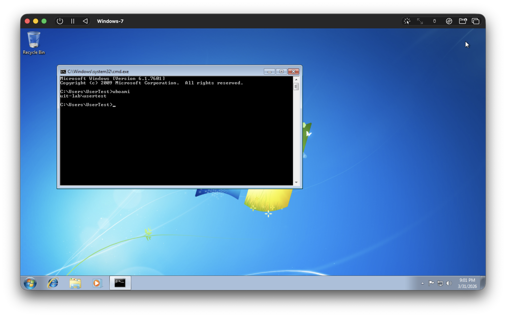

# Bước 1. Kiểm Tra / Tạo Tài Khoản Mục Tiêu UserTest

## Mục Tiêu

- Tạo hoặc xác nhận tài khoản nạn nhân `UserTest`.
- Login thử vào tài khoản nạn nhân `UserTest`.

## Hướng Dẫn

### Bước 1. Kiểm tra / tạo tài khoản mục tiêu UserTest

- Đăng nhập Windows bằng tài khoản có quyền Administrator.
- Mở **Computer Management**: Windows + X → chọn Computer Management, hoặc `compmgmt.msc` → Enter.
- Trong khung bên trái, chọn: **System Tools → Local Users and Groups → Users**.
- Kiểm tra xem đã có tài khoản `UserTest` hay chưa trong danh sách **Users**.

Nếu CHƯA có tài khoản UserTest:

- Chuột phải vào **Users → New User…**
- User name: `UserTest`; Full name: *User Test* (tùy ý);
- Password: `P@ssw0rd123` (hoặc tùy ý);
- Bỏ chọn "*User must change password at next logon*" nếu không muốn thay đổi ở lần đăng nhập đầu tiên;
- Nhấn **Create**.

## Thực Hiện

### Tạo Tài Khoản Nạn Nhân

- Tài khoản nạn nhân:

```c
Tài Khoản:  UserTest
Mật Khẩu:   P@ssw0rd123
```

- Sử dụng **Computer Management** để tạo tài khoản mới `UserTest`:



## Login Thử Vào Tài Khoản Nạn Nhân

- Login thử vào tài khoản nạn nhân với:
    - Tài Khoản: `UserTest`
    - Mật Khẩu: `P@ssw0rd123`


