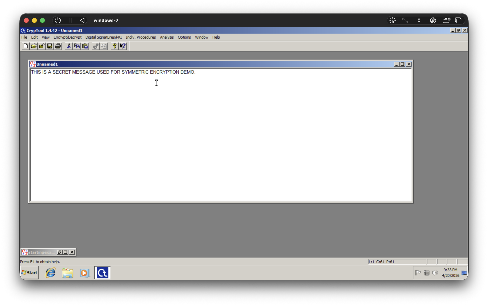
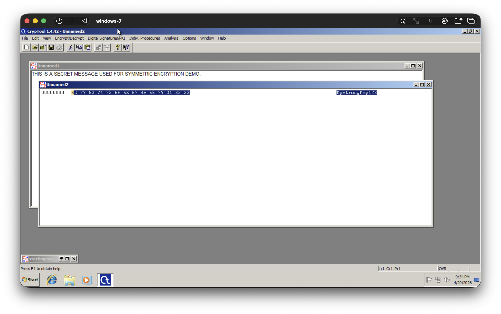
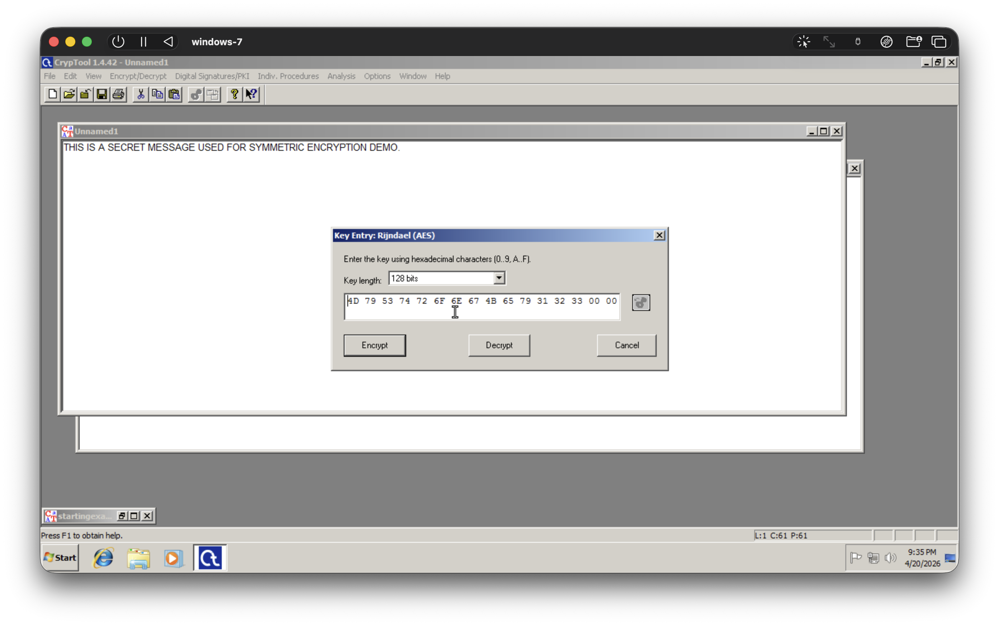
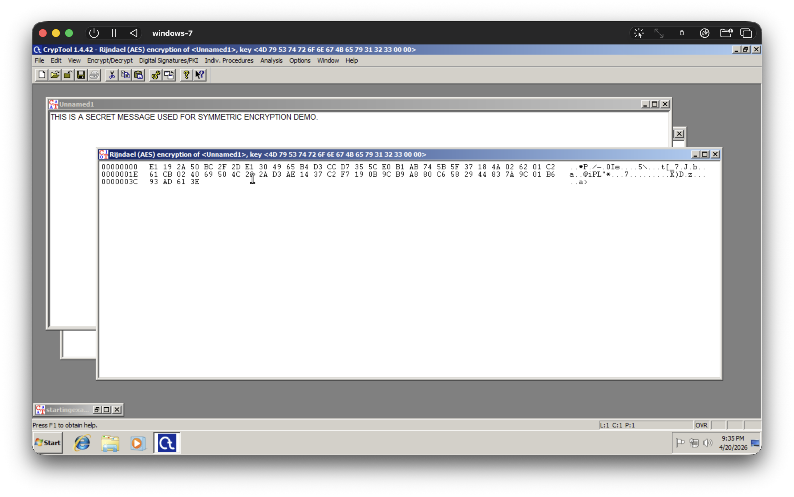
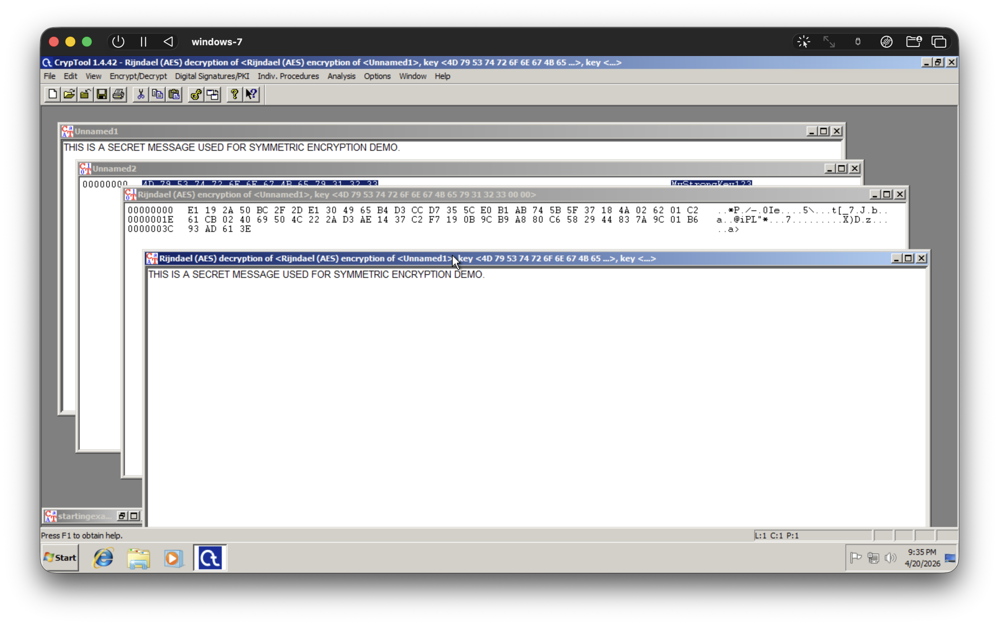
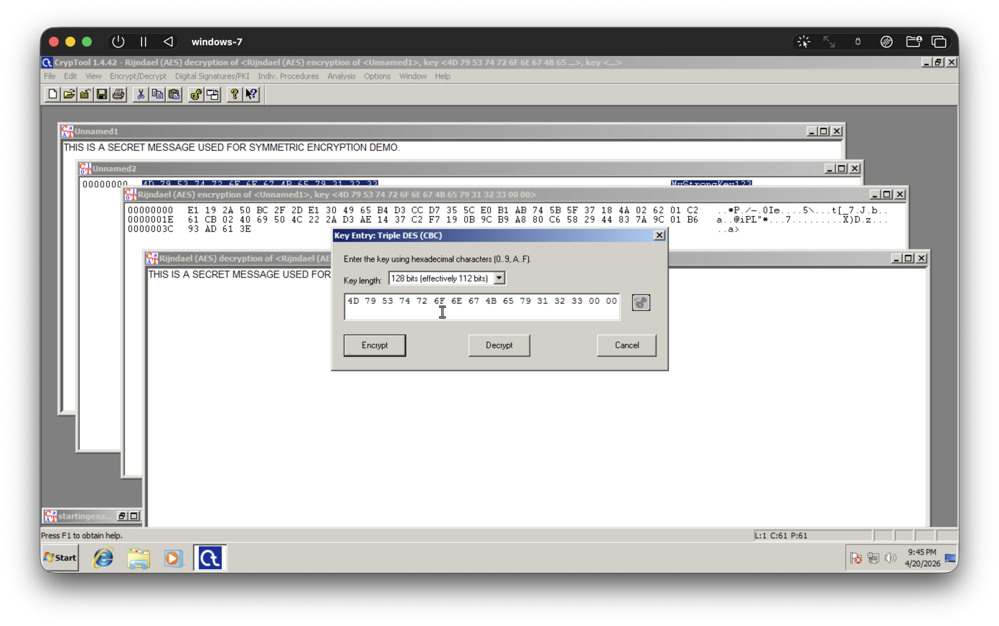
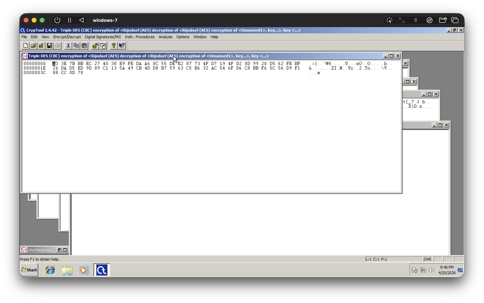
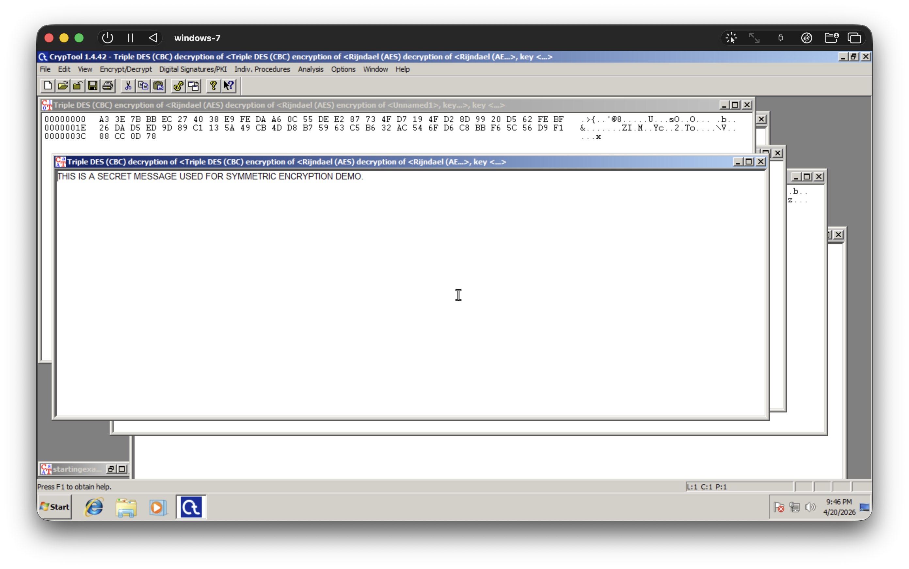
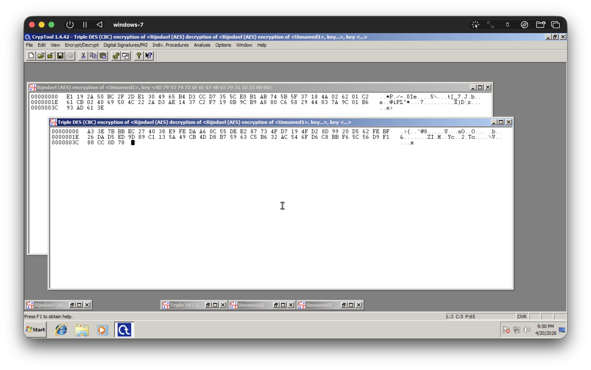

# Bước 1. Mã Hoá & Giải Mã Bằng Mã Hoá Đối Xứng (AES/DES)

## Chuẩn Bị

- Nhập văn bản: THIS IS A SECRET MESSAGE USED FOR SYMMETRIC ENCRYPTION DEMO.

- Key `MyStrongKey123` và dạng Hex:
  - Chọn View > Hex dump

## Mã Hóa AES (CBC)

- Encrypt → Symmetric (modern) → AES (CBC) → nhập key: MyStrongKey123 (dạng Hex)
  - `4D 79 53 74 72 6F 6E 67 4B 65 79 31 32 33`
  - Các bit thiếu sẽ được thêm vào ở dạng `00 00`

- Văn bản đã được mã hóa:

## Giải Mã AES (CBC)

<!-- - Chọn mode ECB hoặc thay đổi CBC/CFB/OFB để quan sát khác biệt. -->
- Giải mã bằng Decrypt → Symmetric (modern) → AES với cùng key.

## Mã Hóa Triple DES (CBC)

- Encrypt → Symmetric (modern) → Triple DES (CBC) → nhập key: MyStrongKey123 (dạng Hex)

- Văn bản đã được mã hóa:

## Giải Mã Triple DES (CBC)

- Giải mã bằng Decrypt → Symmetric (modern) → Triple DES (CBC) với cùng key.

## So Sánh Văn Bản Mã Hóa AES (CBC) vs Triple DES (CBC)

- Văn bản mã hóa của AES (CBC) và Triple DES (CBC) có sự khác biệt.

