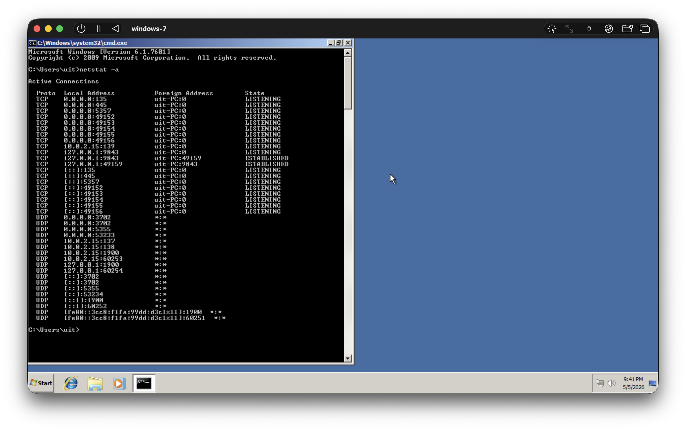
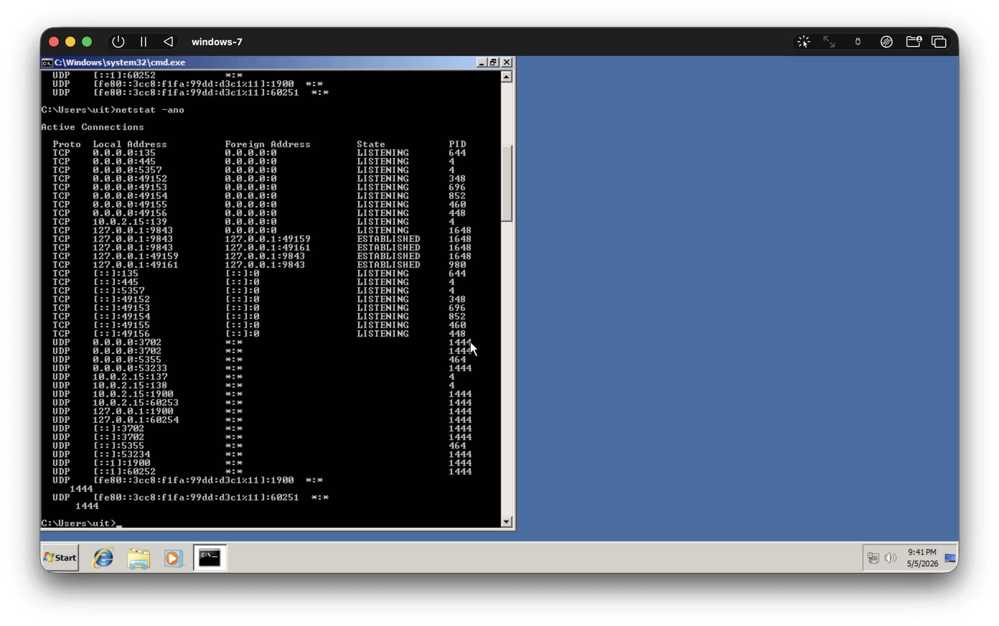
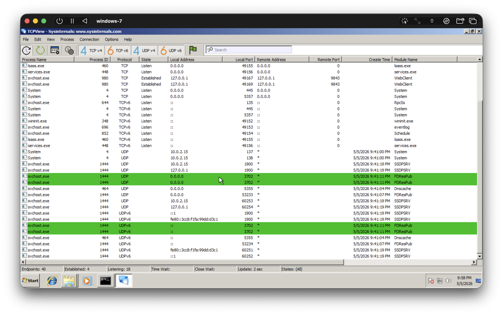
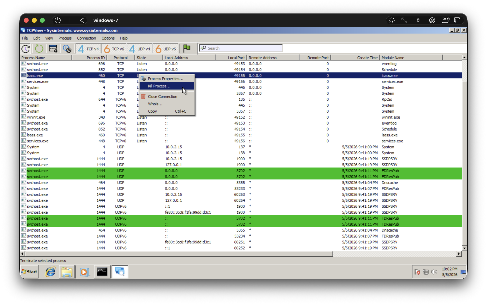
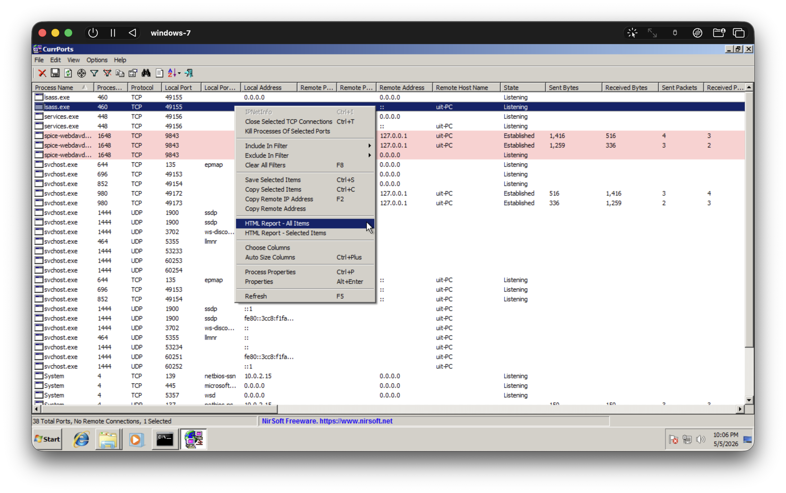
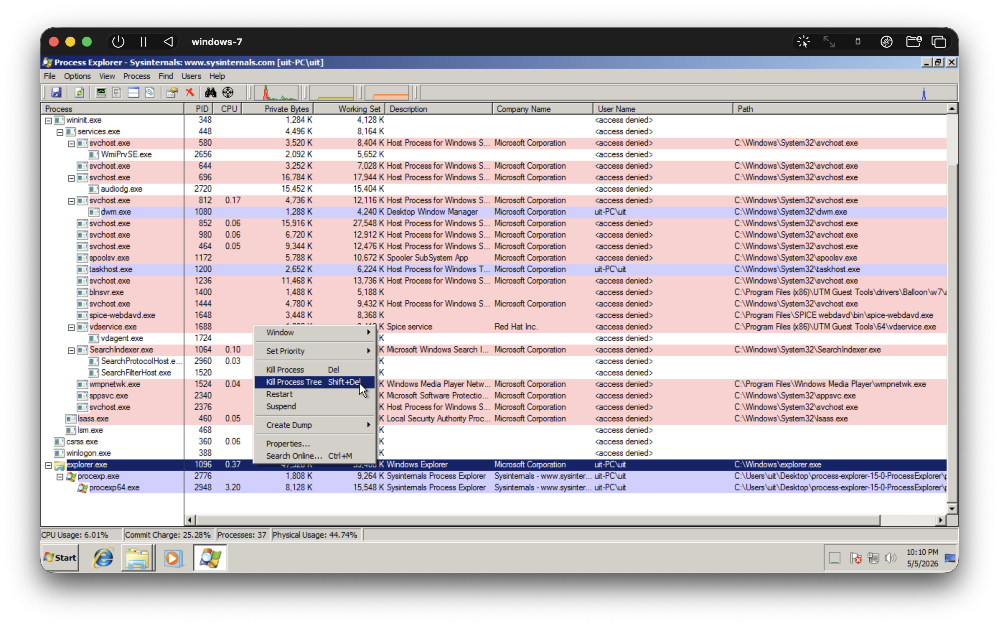

# Các Công Cụ Phổ Biến

Trong quá trình phân tích và giám sát mã độc, việc theo dõi các tiến trình và kết nối mạng là cực kỳ quan trọng. Dưới đây là chức năng và cách sử dụng của 5 công cụ phổ biến.

## Netstat

- Download: Không cần (tích hợp sẵn trong Windows/Linux/macOS).

### Chức Năng

- Là một công cụ dòng lệnh (command-line).
- Tích hợp sẵn trên các Hệ Điều Hành (Windows, Linux, macOS).
- Giúp hiển thị các:
  - Kết nối mạng TCP/UDP đang hoạt động (ESTABLISHED).
  - Cổng đang lắng nghe (LISTEN).
  - Bảng định tuyến.
  - Các thống kê giao diện mạng.
  - PID của tiến trình tương ứng với kết nối đang có.

### Cách Sử Dụng

- Mở Command Prompt (`cmd`) dưới quyền Quản Trị Viên (Administrator, Windows) hoặc root (Linux).
  - Mục đích có toàn quyền và xem được ứng dụng/kết nối từ toàn bộ người dùng.
- Gõ lệnh `netstat -a` để xem tất cả các kết nối.
- Gõ lệnh `netstat -ano` để hiển thị thêm cột PID (Process ID).
- Đối chiếu PID này với Task Manager để biết tiến trình nào đang kết nối ra ngoài.

### Ví Dụ

<!-- - Dưới đây là phiên bản trên macOS như một ví dụ.

```shell
$ netstat -a
Active Internet connections (including servers)
Proto Recv-Q Send-Q  Local Address          Foreign Address        (state)    
tcp4       0      0  192.168.10.14.64346    pnkula-ad-in-f10.https ESTABLISHED
tcp4       0      0  192.168.10.14.64347    pnkula-ad-in-f10.https ESTABLISHED
tcp4       0      0  192.168.10.14.64344    pnkulb-al-in-f10.https ESTABLISHED
tcp4       0      0  192.168.10.14.64345    pnkulb-al-in-f10.https ESTABLISHED
tcp4       0      0  192.168.10.14.64342    hkg12s36-in-f10..https ESTABLISHED
tcp4       0      0  192.168.10.14.64341    hkg12s36-in-f10..https ESTABLISHED
tcp4       0      0  192.168.10.14.64310    216.239.34.223.https   ESTABLISHED
tcp4       0      0  192.168.10.14.64309    52.123.130.14.https    ESTABLISHED
tcp4       0      0  192.168.10.14.64205    hkg12s36-in-f10..https ESTABLISHED
tcp4       0      0  192.168.10.14.64191    lb-140-82-113-25.https ESTABLISHED
tcp4       0      0  192.168.10.14.64148    lb-140-82-112-26.https ESTABLISHED
tcp4       0      0  192.168.10.14.64006    216.239.38.223.https   ESTABLISHED
tcp4       0      0  localhost.63978        localhost.64002        ESTABLISHED
tcp4       0      0  localhost.64002        localhost.63978        ESTABLISHED
tcp4       0      0  localhost.63448        localhost.64001        ESTABLISHED
tcp4       0      0  localhost.64001        localhost.63448        ESTABLISHED
tcp4       0      0  192.168.10.14.64000    151.101.65.242.https   ESTABLISHED
tcp4       0      0  localhost.63987        localhost.63994        ESTABLISHED
tcp4       0      0  localhost.63994        localhost.63987        ESTABLISHED
tcp4       0      0  192.168.10.14.63991    pnkula-af-in-f10.https ESTABLISHED
tcp4       0      0  localhost.63976        localhost.63990        ESTABLISHED
``` -->

Ví dụ 1: `netstat -a`



Ví dụ 2: `netstat -ano`



## Fport

- Download: [Fport](https://github.com/interference-security/kali-windows-binaries/tree/master/fport)
- Lưu ý:
  - Chương trình đã quá cũ, đây là một phiên bản tìm được trên GitHub
  - Có thể sử dụng `netsat` hoặc CurrPorts hoặc TCPViewe như các giải pháp thay thế.

### Chức Năng

- Là một công cụ dòng lệnh cũ của Foundstone (hiện đã không thể tìm thấy trang chủ).
- Dùng để báo cáo tất cả các cổng TCP/IP và UDP đang mở.
- Ánh xạ (map) chúng trực tiếp tới các tiến trình/ứng dụng đang chạy.
- Nó giúp phát hiện nhanh các cổng đang bị mã độc (như Trojan hay Backdoor) mở để chờ các kết nối tới.

### Cách Sử Dụng

- Chạy file `fport.exe` trong Command Prompt (yêu cầu quyền Admin).
- Màn hình sẽ trả về danh sách gồm Process Name, PID, Port và Protocol.

### Ví Dụ

- Đây là một mô phỏng khi chạy chương trình.

```cmd
C:\>fport
FPort v2.0 - TCP/IP Process to Port Mapper
Copyright 2000 by Foundstone, Inc.
http://nez
Pid   Process            Port  Proto Path
392   svchost        ->  135   TCP   C:\WINNT\system32\svchost.exe
8     System         ->  139   TCP
8     System         ->  445   TCP
508   MSTask         ->  1025  TCP   C:\WINNT\system32\MSTask.exe

392   svchost        ->  135   UDP   C:\WINNT\system32\svchost.exe
8     System         ->  137   UDP
8     System         ->  138   UDP
8     System         ->  445   UDP
224   lsass          ->  500   UDP   C:\WINNT\system32\lsass.exe
212   services       ->  1026  UDP   C:\WINNT\system32\services.exe

The program contains five (5) switches.  The switches may be utilized using either a '/' 
or a '-' preceding the switch.  The switches are;

Usage:
	/?	 usage help
        /p       sort by port
        /a       sort by application
        /i       sort by pid
        /ap      sort by application path

For updates visit:  www.foundstone.com
```

## TCPView

- Download: [TCPView](https://learn.microsoft.com/en-us/sysinternals/downloads/tcpview)

### Chức Năng

- Là công cụ đồ họa của bộ Sysinternals (Microsoft), rất khả tín.
- Cung cấp danh sách chi tiết và trực quan về tất cả các endpoint TCP và UDP trên hệ thống.
- Bao gồm địa chỉ local/remote và trạng thái hiện tại của kết nối.

### Cách Sử Dụng

- Mở ứng dụng `Tcpview.exe`.
- Các kết nối mới tạo sẽ được tô màu xanh lá.
- Kết nối bị đóng tô màu đỏ.
- Nhấp chuột phải vào một kết nối khả nghi để chọn:
  - **Close Connection** (đóng kết nối)
  - **Kill Process** (buộc dừng tiến trình lây nhiễm).
- Có thể lựa chọn bật tắt các giao thức:
  - TCP v4 / TCP v6
  - UDP v4 / UDP v6

### Ví Dụ

- Một giao diện rất đặc trưng và quen thuộc tương tự Process Explorer.



- Có thể chọn **Close Connection** / **Kill Process** từ menu ngữ cảnh.



## CurrPorts Tool

- Download: [CurrPorts Tool at NirSoft](https://www.nirsoft.net/utils/cports.html).
- Là một trong loạt các tiện ích rất hữu dụng từ NirSoft.

### Chức Năng

- Tương tự TCPView
- Đây là một phần mềm/tiện ích giám sát mạng (của NirSoft).
- Hiển thị danh sách tất cả các cổng TCP/IP và UDP hiện đang mở trên máy tính.
- Cung cấp nhiều tùy chọn làm việc, đặc biệt cho phép trích xuất danh sách thành HTML trực quan.

### Cách Sử Dụng

- Khởi chạy `cports.exe`.
- Ứng dụng sẽ liệt kê chi tiết tên tiến trình, đường dẫn file thực thi, và thông tin version của phần mềm đang mở cổng.
- Người dùng có thể bôi đen các tiến trình độc hại, nhấn nút **Kill Processes Of Selected Ports** để đóng chúng.
- Xuất báo cáo ra file HTML/XML để phân tích thêm.

### Ví Dụ



## Process Viewer (ay Process Explorer)

- Download: [Process Explorer](https://learn.microsoft.com/en-us/sysinternals/downloads/process-explorer)
- Đã được đề cập ở Bài Tập Thực Hành 4.

### Chức Năng

- Là công cụ giám sát tiến trình nâng cao.
- Cho phép theo dõi chi tiết:
  - Cấu trúc tiến trình (tiến trình cha/con).
  - Tài nguyên CPU/RAM sử dụng.
  - Các thư viện (DLL) đang được nạp vào bộ nhớ.

### Cách Sử Dụng

- Mở ứng dụng để xem cây tiến trình (Process Tree).
- Nếu phát hiện một tiến trình lạ ngụy trang thành file hệ thống (ví dụ `svchost.exe` nhưng chạy từ đường dẫn lạ):
  - Có thể click đúp vào để xem các luồng (threads)
  - Kiểm tra chữ ký số
  - Hoặc gửi trực tiếp mã băm (hash) của tiến trình đó lên VirusTotal để quét mã độc.

### Ví Dụ

- Cây tiến trình (Process Tree) trực quan, giúp dễ dàng phát hiện tiến trình lạ.


