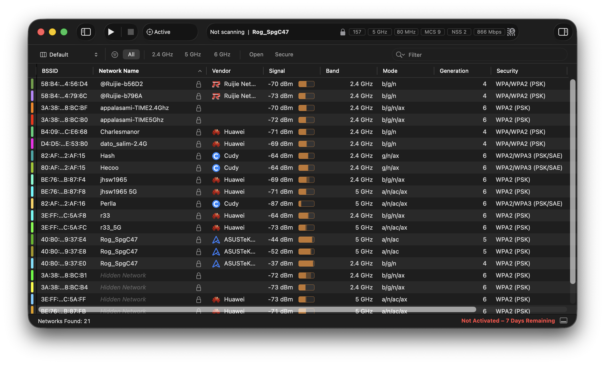

# TIẾT 1. KHẢO SÁT WI-FI & NHẬN DIỆN NGUY CƠ

## Bài 1. Quét Và Liệt Kê Wi-Fi Xung Quanh

- Bước 1: Mở Command Prompt
- Bước 2: Chạy lệnh `netsh wlan show networks mode=bssid`
- Bước 3: Quan sát và chụp màn hình các thông tin:
  - SSID
  - Authentication
  - Encryption
  - Signal
- Bước 4: Hoàn thành bảng sau (ít nhất 8 mạng, nếu không đủ thì ghi rõ lý do):

<!-- | STT | SSID | Authentication | Encryption | Signal | Đánh giá |
|-----|------|----------------|------------|--------|----------|
| 1   |      |                |            |        |          |
| 2   |      |                |            |        |          |
| 3   |      |                |            |        |          |
| 4   |      |                |            |        |          |
| 5   |      |                |            |        |          |
| 6   |      |                |            |        |          |
| 7   |      |                |            |        |          |
| 8   |      |                |            |        |          | -->

```{=typst}
#show table.cell: set text(size: 0.8em)
#table(
  columns: (1fr,) * 6,
  align: (left, left, left, left, left, left),
  [STT], [SSID], [Authentication], [Encryption], [Signal], [Đánh giá],
  [1], [], [], [], [], [],
  [2], [], [], [], [], [],
  [3], [], [], [], [], [],
)
```

Gợi ý đánh giá:

- Open / None → Không an toàn
- WPA2-PSK (AES) → Tốt
- WPA3 → Rất tốt

### Liệt Kê Wi-Fi Xung Quanh

Do đang sử dụng macOS trên Apple Silicon, và không có khả năng triển khai các Windows VM có hỗ trợ wifi, và hiện cũng không mượn được máy Windows, vì vậy sinh viên xin phép sử dụng ứng dụng WIFI Explore Pro (có trên App Store) để thực hiện bài thực hành này.

Danh sách các mạng Wi-Fi xung quanh khu vực sinh viên học tập:

- SSID ở đây được gọi là Network Name.
- Tất cả các WIFI đều sử dụng một chế độ bảo mật cụ thể.
- Luôn yêu cầu xác thực (không có mạng mở free-wifi).
- Tín hiệu khá tốt ở hầu hết các WIFI (trên 50%).



### Bảng Liệt Kê Và Đánh Giá

- Encryption cho biết rõ là CCMP bao nhiêu bit.
- Signal hiển thị ở dạng số nguyên, giá trị càng lớn, wifi càng mạnh.

<!-- | STT  | SSID                | Authentication      | Encryption         | Signal (dBm) | Đánh Giá |
| ---- | ------------------- | ------------------- | ------------------ | ------------ | -------- |
| 1    | \@Ruijie-b56D2      | WPA/WPA2 (PSK)      | CCMP-128           | -70          | Tốt      |
| 2    | Appalasami Family   | WPA2 (PSK)          | CCMP-128           | -71          | Tốt      |
| 3    | appalasami-TIME5Ghz | WPA2 (PSK)          | CCMP-128           | -73          | Tốt      |
| 4    | Charlesmanor        | WPA/WPA2 (PSK)      | TKIP               | -71          | Tốt      |
| 5    | dato\_salim\_2.4G   | WPA/WPA2 (PSK)      | TKIP               | -69          | Tốt      |
| 6    | Hash                | WPA2/WPA3 (PSK/SAE) | CCMP-128           | -64          | Rất Tốt  |
| 7    | Hecoo               | WPA2/WPA3 (PSK/SAE) | CCMP-128           | -63          | Rất Tốt  |
| 8    | jhsw1965 5G         | WPA2 (PSK)          | CCMP-128           | -71          | Tốt      |
| 9    | JustinTmj           | WPA/WPA2 (PSK)      | CCMP-128           | -74          | Tốt      |
| 10   | Perlla              | WPA2/WPA3 (PSK/SAE) | CCMP-128           | -87          | Rất Tốt  |
| 11   | r33_5G              | WPA2 (PSK)          | CCMP-128           | -70          | Tốt      |
| 12   | Rog_SpgC47          | WPA2 (PSK)          | CCMP-128           | -46          | Tốt      | -->

```{=typst}
#figure(
  table(
    columns: (5%, 24%, 28%, 14%, 15%, 14%),
    align: (left, left, left, left, right, left),
    [stt], [SSID], [Authentication], [Encryption], [Signal (dBm)], [Đánh Giá],
    [1], [\@Ruijie-b56D2], [WPA/WPA2 (PSK)], [CCMP-128], [\-70], [#text(fill: green)[#sym.checkmark.heavy] Tốt],
    [2], [Appalasami Family], [WPA2 (PSK)], [CCMP-128], [\-71], [#text(fill: green)[#sym.checkmark.heavy] Tốt],
    [3], [appalasami-TIME5Ghz], [WPA2 (PSK)], [CCMP-128], [\-73], [#text(fill: green)[#sym.checkmark.heavy] Tốt],
    [4], [Charlesmanor], [WPA/WPA2 (PSK)], [TKIP], [\-71], [#text(fill: green)[#sym.checkmark.heavy] Tốt],
    [5], [dato\_salim\_2.4G], [WPA/WPA2 (PSK)], [TKIP], [\-69], [#text(fill: green)[#sym.checkmark.heavy] Tốt],
    [6], [Hash], [WPA2/WPA3 (PSK/SAE)], [CCMP-128], [\-64], [#text(fill: green)[#sym.checkmark.heavy #sym.checkmark.heavy] Rất Tốt],
    [7], [Hecoo], [WPA2/WPA3 (PSK/SAE)], [CCMP-128], [\-63], [#text(fill: green)[#sym.checkmark.heavy #sym.checkmark.heavy] Rất Tốt],
    [8], [jhsw1965 5G], [WPA2 (PSK)], [CCMP-128], [\-71], [#text(fill: green)[#sym.checkmark.heavy] Tốt],
    [9], [JustinTmj], [WPA/WPA2 (PSK)], [CCMP-128], [\-74], [#text(fill: green)[#sym.checkmark.heavy] Tốt],
    [10], [Perlla], [WPA2/WPA3 (PSK/SAE)], [CCMP-128], [\-87], [#text(fill: green)[#sym.checkmark.heavy #sym.checkmark.heavy] Rất Tốt],
    [11], [r33\_5G], [WPA2 (PSK)], [CCMP-128], [\-70], [#text(fill: green)[#sym.checkmark.heavy] Tốt],
    [12], [Rog\_SpgC47], [WPA2 (PSK)], [CCMP-128], [\-46], [#text(fill: green)[#sym.checkmark.heavy] Tốt]
  ),
caption: [Bài 1. Bảng Liệt Kê Và Đánh Giá WIFI]
)
```

## Bài 2. Phân Loại Wi-Fi Theo Mức Độ An Toàn

Sinh viên tự chia các Wi-Fi đã quét vào 3 nhóm:

- Nhóm A: An Toàn
- Nhóm B: Trung Bình
- Nhóm C: Nguy Hiểm

Đánh giá chung:

- Nhóm A là các Wi-Fi dùng WPA2/WPA3, nhóm B là các Wi-Fi dùng WPA/WPA2.
- Tất cả các mạng Wi-Fi đều dùng một cơ chế bảo mật nhất định.
  - Vì vậy, không có Wi-Fi nào được xếp vào nhóm C.
- Các chuẩn phổ biến được dùng là WPA2, vì các Wi-Fi đều ở quy mô gia đình.
  - Một số Wi-Fi hỗ trợ WPA3, đây thường là các thiết bị phát sóng thế hệ mới.

<!-- | stt  | SSID                | Authentication      | Nhóm       | Lý Do                                        |
| ---- | ------------------- | ------------------- | ---------- | -------------------------------------------- |
| 1    | \@Ruijie-b56D2       | WPA/WPA2 (PSK)      | Trung Bình | Cho phép fall-back về WPA vốn yếu hơn.       |
| 2    | Appalasami Family   | WPA2 (PSK)          | An Toàn    | WPA2 vẫn rất tốt cho quy mô nhỏ.             |
| 3    | appalasami-TIME5Ghz | WPA2 (PSK)          | An Toàn    | WPA2 vẫn rất tốt cho quy mô nhỏ.             |
| 4    | Charlesmanor        | WPA/WPA2 (PSK)      | Trung Bình | Cho phép fall-back về WPA vốn yếu hơn.       |
| 5    | dato_salim-2.4G     | WPA/WPA2 (PSK)      | Trung Bình | Cho phép fall-back về WPA vốn yếu hơn.       |
| 6    | Hash                | WPA2/WPA3 (PSK/SAE) | An Toàn    | WPA3 phù hợp cho cả môi trường doanh nghiệp. |
| 7    | Hecoo               | WPA2/WPA3 (PSK/SAE) | An Toàn    | WPA3 phù hợp cho cả môi trường doanh nghiệp. |
| 8    | jhsw1965 5G         | WPA2 (PSK)          | An Toàn    | WPA2 vẫn rất tốt cho quy mô nhỏ.             |
| 9    | JustinTmj           | WPA/WPA2 (PSK)      | Trung Bình | Cho phép fall-back về WPA vốn yếu hơn.       |
| 10   | Perlla              | WPA2/WPA3 (PSK/SAE) | An Toàn    | WPA3 phù hợp cho cả môi trường doanh nghiệp. |
| 11   | r33_5G              | WPA2 (PSK)          | An Toàn    | WPA2 vẫn rất tốt cho quy mô nhỏ.             |
| 12   | Rog_SpgC47          | WPA2 (PSK)          | An Toàn    | WPA2 vẫn rất tốt cho quy mô nhỏ.             | -->

```{=typst}
#figure(
table(
  columns: (5%, 24%, 28%, 15%, 28%),
  align: (left, left, left, left, left),
  [stt], [SSID], [Authentication], [Nhóm], [Lý Do], 
  [1], [\@Ruijie-b56D2], [WPA/WPA2 (PSK)], [Trung Bình], [Cho phép fall-back về WPA vốn yếu hơn.],
  [2], [Appalasami Family], [WPA2 (PSK)], [An Toàn], [WPA2 vẫn rất tốt cho quy mô nhỏ.],
  [3], [appalasami-TIME5Ghz], [WPA2 (PSK)], [An Toàn], [WPA2 vẫn rất tốt cho quy mô nhỏ.],
  [4], [Charlesmanor], [WPA/WPA2 (PSK)], [Trung Bình], [Cho phép fall-back về WPA vốn yếu hơn.],
  [5], [dato\_salim-2.4G], [WPA/WPA2 (PSK)], [Trung Bình], [Cho phép fall-back về WPA vốn yếu hơn.],
  [6], [Hash], [WPA2/WPA3 (PSK/SAE)], [An Toàn], [WPA3 phù hợp cho cả môi trường doanh nghiệp.],
  [7], [Hecoo], [WPA2/WPA3 (PSK/SAE)], [An Toàn], [WPA3 phù hợp cho cả môi trường doanh nghiệp.],
  [8], [jhsw1965 5G], [WPA2 (PSK)], [An Toàn], [WPA2 vẫn rất tốt cho quy mô nhỏ.],
  [9], [JustinTmj], [WPA/WPA2 (PSK)], [Trung Bình], [Cho phép fall-back về WPA vốn yếu hơn.],
  [10], [Perlla], [WPA2/WPA3 (PSK/SAE)], [An Toàn], [WPA3 phù hợp cho cả môi trường doanh nghiệp.],
  [11], [r33\_5G], [WPA2 (PSK)], [An Toàn], [WPA2 vẫn rất tốt cho quy mô nhỏ.],
  [12], [Rog\_SpgC47], [WPA2 (PSK)], [An Toàn], [WPA2 vẫn rất tốt cho quy mô nhỏ.]
),
caption: [Bài 2. Phân Loại WIFI Theo Mức Độ An Toàn]
)
```

## Câu Hỏi Ngắn

> Vì sao Wi-Fi không đặt mật khẩu vẫn có người sử dụng?

Một số nguyên nhân như:

- Môi trường chia sẻ Wi-Fi công cộng và muốn đơn giản hóa việc kết nối.
- Sự tương thích với các thiết bị có chuẩn cũ, hoặc kết nối đặc thù.
- Các mạng ngang hàng/Ad-hoc, vòng đời chia sẻ ngắn.
- Các mạng Wi-Fi cô lập và không có kết nối Internet hoặc hạ tầng quan trọng.
- Sử dụng các hình thức xác thực khác, ví dụ đăng ký qua cổng Captive Portal, hoặc cơ chế xác thực nội bộ (Enterprise).
