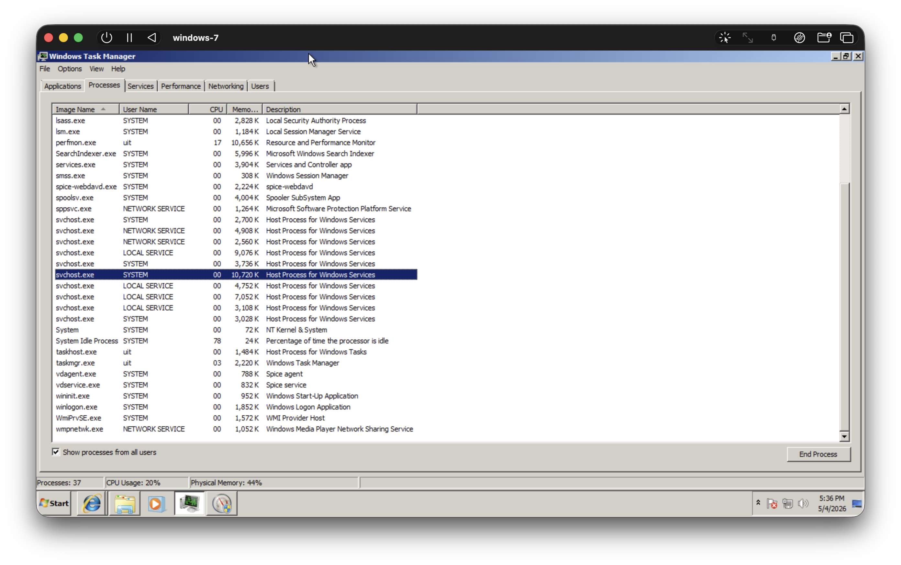
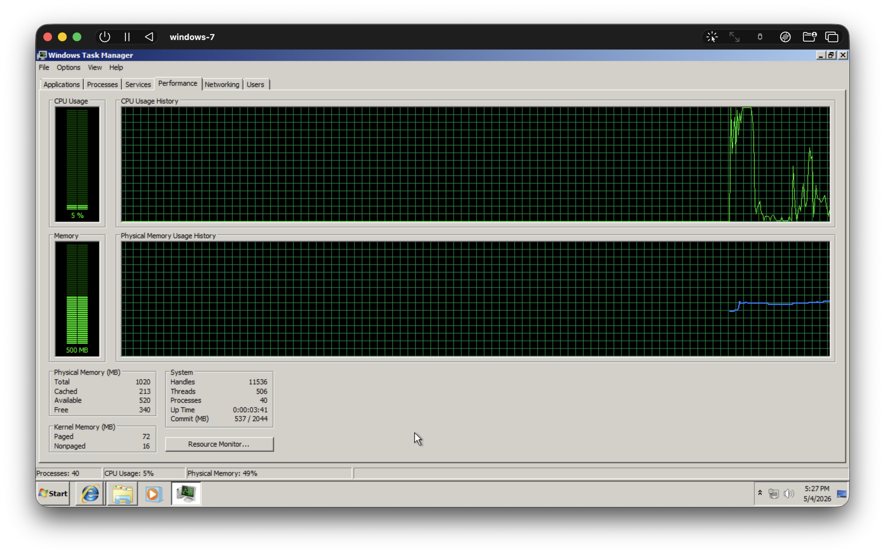
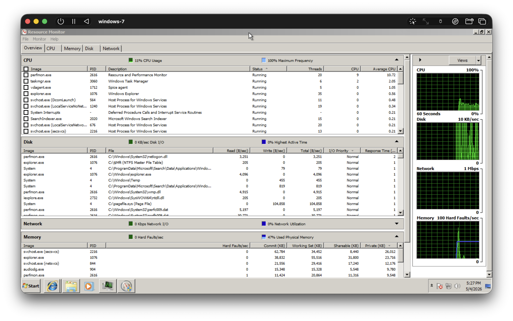
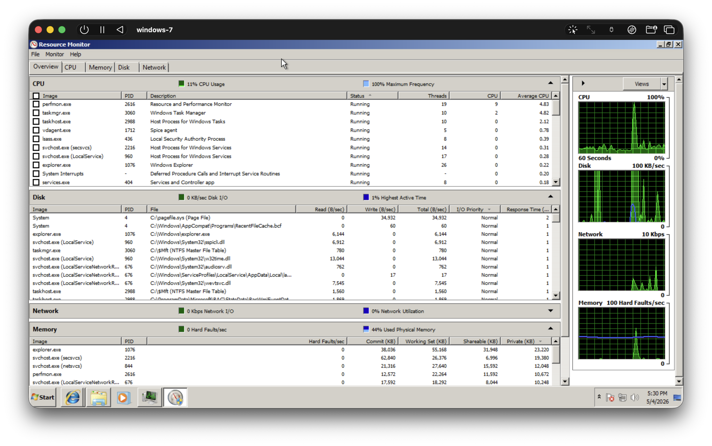

# PHẦN A. QUAN SÁT ỨNG DỤNG VÀ TIẾN TRÌNH TRONG RAM

## A1 – Mở Task Manager

1. Nhấn tổ hợp phím: **Ctrl + Shift + Esc**.
2. Chọn tab "**Processes**".
3. Chụp màn hình lại (những ứng dụng nào đang sử dụng CPU, Ram, đĩa cứng…).
4. Mục tiêu: Xác định ứng dụng nào đang chạy và sử dụng RAM.

Sử dụng Task Manager: **Processes**.

- Thông tin từng tiến trình và lượng CPU/RAM sử dụng tương ứng.

Sử dụng Task Manager: **Performance**.

- Thông tin sử dụng CPU/RAM tổng quan cho toàn bộ các tiến trình.

Sử dụng Resource Monitor: **Overview**.

- Thông tin sử dụng CPU/Disk/Memory tổng quan với nhiều thông tin chi tiết hơn.

## A2 – Sắp xếp theo lượng RAM

1. Tại tab "**Processes**", nhấn vào cột **Memory** để sắp xếp giảm dần.
2. Ghi lại 5 tiến trình chiếm RAM nhiều nhất.
3. Chụp màn hình.

5 tiến trình sử dụng nhiều RAM nhất:

| STT | Tên tiến trình | PID | Lượng RAM sử dụng |
| --- | --- | --- | --- |
| 1 | "Ứng dụng" | "" | "" |
| 2 | "Ứng dụng" | "" | "" |
| 3 | "Ứng dụng" | "" | "" |
| 4 | "Ứng dụng" | "" | "" |
| 5 | "Ứng dụng" | "" | "" |

## A3 – Quan sát tiến trình chi tiết

1. Chuyển sang tab "**Details**".
2. Quan sát **PID – Process ID**.
3. Ghi lại 3 PID của các tiến trình lạ hoặc không rõ chức năng. Tìm hiểu trên mạng Internet để xem có thể biết các tiến trình đó là tiến trình gì?

Sử dụng Resource Monitor:

| STT | Tên Tiến Trình | PID | Miêu Tả |
| --- | --- | --- | --- |
| 1 | "Ứng dụng" | "" | "" |
| 2 | "Ứng dụng" | "" | "" |
| 3 | "Ứng dụng" | "" | "" |
