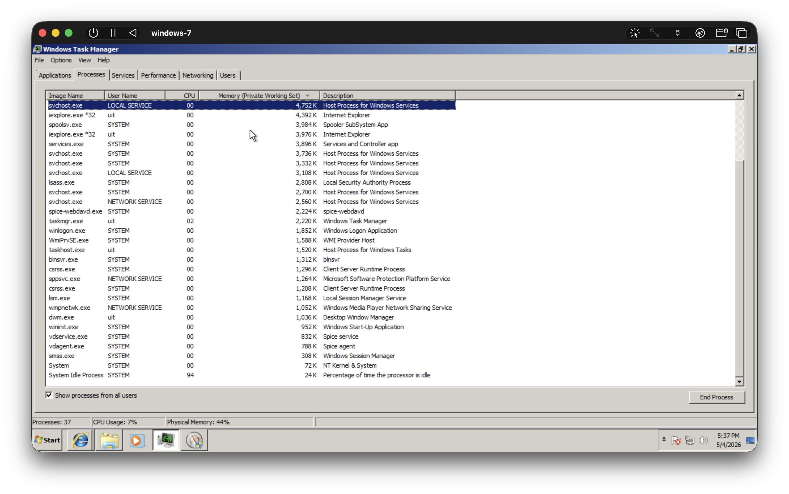

# PHẦN A. QUAN SÁT ỨNG DỤNG VÀ TIẾN TRÌNH TRONG RAM

## A1 – Mở Task Manager

1. Nhấn tổ hợp phím: **Ctrl + Shift + Esc**.
2. Chọn tab "**Processes**".
3. Chụp màn hình lại (những ứng dụng nào đang sử dụng CPU, Ram, đĩa cứng…).
4. Mục tiêu: Xác định ứng dụng nào đang chạy và sử dụng RAM.

Sử dụng Task Manager: **Processes**.

- Thông tin từng tiến trình và lượng CPU/RAM sử dụng tương ứng.


Sử dụng Task Manager: **Performance**.

- Thông tin sử dụng CPU/RAM tổng quan cho toàn bộ các tiến trình.


Sử dụng Resource Monitor: **Overview**.

- Thông tin sử dụng CPU/Disk/Memory tổng quan với nhiều thông tin chi tiết hơn.


## A2 – Sắp Xếp Theo Lượng RAM

1. Tại tab "**Processes**", nhấn vào cột **Memory** để sắp xếp giảm dần.
2. Ghi lại 5 tiến trình chiếm RAM nhiều nhất.
3. Chụp màn hình.

5 tiến trình sử dụng nhiều RAM nhất:



<!-- | STT | Tên Tiến Trình | User Name | Lượng RAM Sử Dụng (KB) | Miêu Tả |
| --- | --- | --- | --- | --- |
| 1 | `svchost.exe` | LOCAL SERVICE | 4,752 | Host Process for Windows Services |
| 2 | `iexplorer.exe` *32 | uit | 4,392 | Internet Explorer |
| 3 | `spoolsv.exe` | SYSTEM | 3,984 | Spooler Subsystem App |
| 4 | `iexplorer.exe` *32 | uit | 3,976 | Internet Explorer |
| 5 | `services.exe` | SYSTEM | 3,896 | Services and Controller app | -->

```{=typst}
#figure(
table(
  columns: (10%, 20%, 25%,  15%, 30%),
  align: (center, left, left, right, left),
  [STT], [Tiến Trình], [User Name], [RAM (K)], [Miêu Tả],
  [1], [`svchost.exe`], [LOCAL SERVICE], [4,752], [Host Process for Windows Services],
  [2], [`iexplorer.exe`], [uit], [4,392], [Internet Explorer],
  [3], [`spoolsv.exe`], [SYSTEM], [3,984], [Spooler Subsystem App],
  [4], [`iexplorer.exe`], [uit], [3,976], [Internet Explorer],
  [5], [`services.exe`], [SYSTEM], [3,896], [Services and Controller app]
),
caption: [A2. 5 Tiến Trình Sử Dụng Nhiều RAM Nhất]
)
```

## A3 – Quan Sát Tiến Trình Chi Tiết

1. Chuyển sang tab "**Details**".
2. Quan sát **PID – Process ID**.
3. Ghi lại 3 PID của các tiến trình lạ hoặc không rõ chức năng. Tìm hiểu trên mạng Internet để xem có thể biết các tiến trình đó là tiến trình gì?

Sử dụng Resource Monitor:


<!-- | STT | Tiến Trình | PID | Miêu Tả | Thông Tin Thêm |
| :---: | --- | ---: | --- | --- |
| 1 | `vdagent.exe` | 1712 | Spice Agent | SPICE Guest Agent (Máy này là máy ảo - VM) |
| 2 | `lsass.exe` | 436 | Local Security Authority Process | Enforcing security policies, managing user logins, password changes, and creating access tokens |
| 3 | `svchost.exe (secsvcs)` | 2216 | Host Process for Windows Services | Security Service group | -->

```{=typst}
#figure(
table(
  columns: (10%, 15%, 15%, 25%, 35%),
  align: (center, left, right, left, left),
  [STT], [Tiến Trình], [PID], [Miêu Tả], [Thông Tin Thêm],
  [1], [`vdagent.exe`], [1712], [Spice Agent], [SPICE Guest Agent (Máy này là máy ảo - VM)],
  [2], [`lsass.exe`], [436], [Local Security Authority Process], [Enforcing security policies, managing user logins, password changes, and creating access tokens],
  [3], [`svchost.exe (secsvcs)`], [2216], [Host Process for Windows Services], [Security Service group]
),
caption: [A3. Quan Sát Tiến Trình Chi Tiết]
)
```
