# B. Thực Hành

Hãy sử dụng Xpath, Xquery để thực hiện các yêu cầu sau đây.

## Câu 1

- Viết lệnh Xpath lấy Sinh viên có `ID=10`
- Viết lệnh Xpath lấy sinh viên ở vị trí cuối cùng ở trường CNTT.

### Sinh viên có `ID=10`

```{=typst}
#raw(read("code/BTTH5-b-1a.sql"), lang: "sql", block: true)
```

Kết quả:

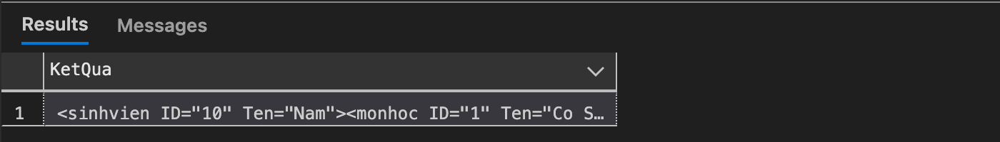

```{=typst}
#raw(read("code/BTTH5-b-1a.xml"), lang: "xml", block: true)
```

### Sinh Viên Ở Vị Trí Cuối Cùng Trong Trường `CNTT`

```{=typst}
#raw(read("code/BTTH5-b-1b.sql"), lang: "sql", block: true)
```

Kết quả:

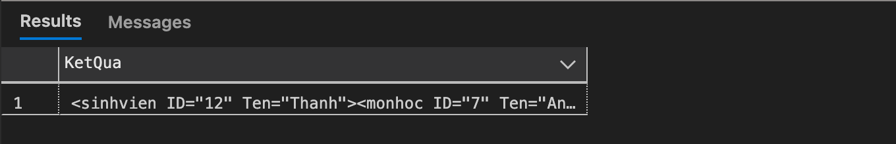

```{=typst}
#raw(read("code/BTTH5-b-1b.xml"), lang: "xml", block: true)
```

## Câu 2

Viết lệnh trả về tất cả các nút từ nút gốc là `THONGTINSV`.

```{=typst}
#raw(read("code/BTTH5-b-2.sql"), lang: "sql", block: true)
```

Kết quả:

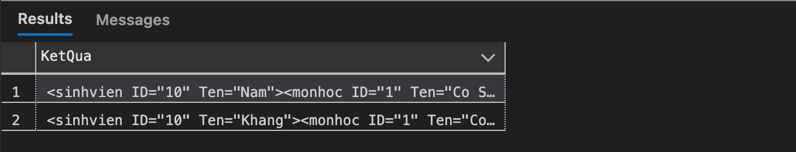

- CNTT:

```{=typst}
#raw(read("code/BTTH5-b-2a.xml"), lang: "xml", block: true)
```

- KHTN:

```{=typst}
#raw(read("code/BTTH5-b-2b.xml"), lang: "xml", block: true)
```

## Câu 3

Viết lệnh Xquery trả về danh sách sinh viên có `ID < 12` với `MSDH = 1`.

```{=typst}
#raw(read("code/BTTH5-b-3.sql"), lang: "sql", block: true)
```

Kết quả:


```{=typst}
#raw(read("code/BTTH5-b-3.xml"), lang: "xml", block: true)
```

## Câu 4

Viết lệnh Xquery trả về danh sách sinh viên sắp xếp theo tên với `MSDH=2`.

```{=typst}
#raw(read("code/BTTH5-b-4.sql"), lang: "sql", block: true)
```

Kết quả:

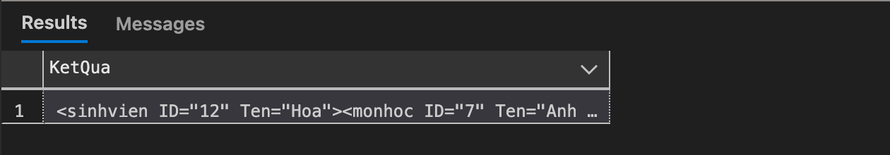

```{=typst}
#raw(read("code/BTTH5-b-4.xml"), lang: "xml", block: true)
```

## Câu 5

Viết lệnh Xquery trả về `MSDH` và `TenDH` theo định dạng sau:

```xml
<!-- Dữ liệu mẫu -->
<QuanLySV>
    <ChiTietSV>1 DH CNTT</ChiTietSV>
</QuanLySV>
```

```{=typst}
#raw(read("code/BTTH5-b-5.sql"), lang: "sql", block: true)
```

Kết quả:

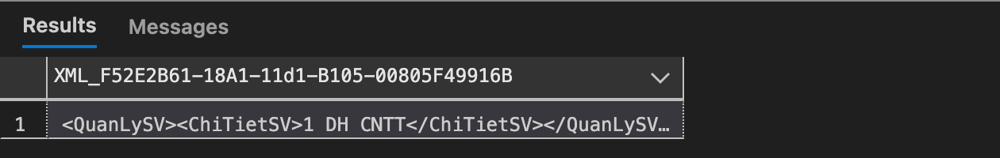

```{=typst}
#raw(read("code/BTTH5-b-5.xml"), lang: "xml", block: true)
```

## Câu 6

Viết lệnh Xquery xóa tên các sinh viên trường DH `KHTN`.

```{=typst}
#raw(read("code/BTTH5-b-6.sql"), lang: "sql", block: true)
```

Hoàn thành:


Kiểm tra lại:

```{=typst}
#raw(read("code/BTTH5-b-6a.sql"), lang: "sql", block: true)
```

Kết quả:

- Không còn thuộc tính `Ten` trong `sinhvien`.

```{=typst}
#raw(read("code/BTTH5-b-6.xml"), lang: "xml", block: true)
```

## Câu 7

Viết lệnh Xquery trả về thông tin các sinh viên có tên là '`Nam`' hoặc '`Thanh`'.

```{=typst}
#raw(read("code/BTTH5-b-7.sql"), lang: "sql", block: true)
```

Kết quả:

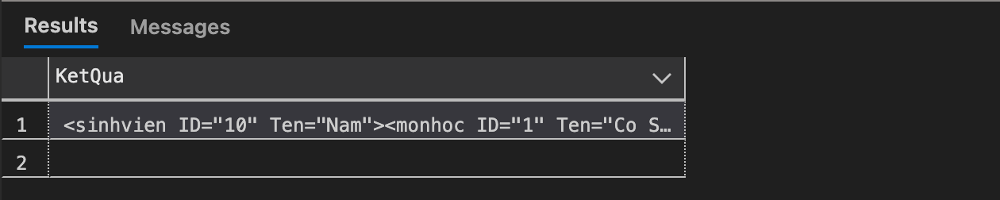

```{=typst}
#raw(read("code/BTTH5-b-7.xml"), lang: "xml", block: true)
```

## Câu 8

Viết lệnh Xquery thay đổi tên sinh viên thứ 2 thành tên '`Binh`' trong trường `CNTT`.

```{=typst}
#raw(read("code/BTTH5-b-8.sql"), lang: "sql", block: true)
```

Hoàn thành:


Kiểm tra lại:

```{=typst}
#raw(read("code/BTTH5-b-8a.sql"), lang: "sql", block: true)
```

Kết quả:

- Thay đổi tên sinh viên thứ 2 (không phụ thuộc vào ID) thành tên 'Binh' trong trường CNTT.

```{=typst}
#raw(read("code/BTTH5-b-8.xml"), lang: "xml", block: true)
```

## Câu 9

Viết lệnh Xquery kiểm tra xem có tồn tại sinh viên có `ID` là 12 trong trường `KHTN` không?

- Nếu có trả về 1
- Nếu không thì trả về 0.

```{=typst}
#raw(read("code/BTTH5-b-9.sql"), lang: "sql", block: true)
```

Hoàn thành:

- Có 1 sinh viên có `ID = 12` trong trường `KHTN`.

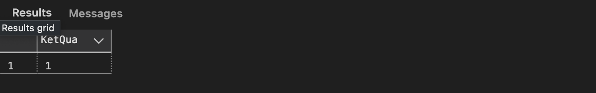

Kiểm tra lại:

```{=typst}
#raw(read("code/BTTH5-b-9a.sql"), lang: "sql", block: true)
```

Kết quả:

- Trả về `sinhvien` có `ID = 12` trong trường `KHTN`.
- Hiện tại đã không còn thuộc tính `Ten` trong `sinhvien`.

```{=typst}
#raw(read("code/BTTH5-b-9.xml"), lang: "xml", block: true)
```

## Câu 10

Viết lệnh Xquery kiểm tra xem có tồn tại sinh viên tên '`Lan`' trong trường `CNTT` không?

- Nếu có trả về 1
- Nếu không thì trả về 0.

Và `INSERT` thêm vào `THONGTINSV`:

```xml
<!-- Dữ liệu mẫu -->
<sinhvien ID="15" Ten="Lan">
<monhoc ID="10" Ten="Toan Roi Rac" />
<monhoc ID="11" Ten="Lap Trinh C#" />
<monhoc ID="12" Ten="CSDL Nang Cao" />
</sinhvien>
```

### Kiểm Tra

Kiểm tra xem có tồn tại sinh viên `Lan` trong trường `CNTT` không:

```{=typst}
#raw(read("code/BTTH5-b-10a.sql"), lang: "sql", block: true)
```

Kết quả:

- Không có sinh viên nào tên `Lan` trong trường `CNTT`.

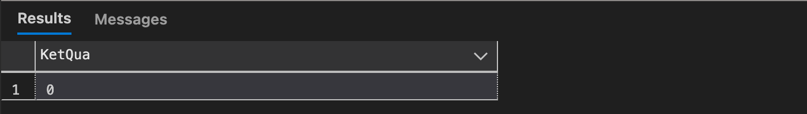

### Thêm Thông Tin

Thêm `Lan` vào `THONGTINSV`:

```{=typst}
#raw(read("code/BTTH5-b-10b.sql"), lang: "sql", block: true)
```

Hoàn thành:

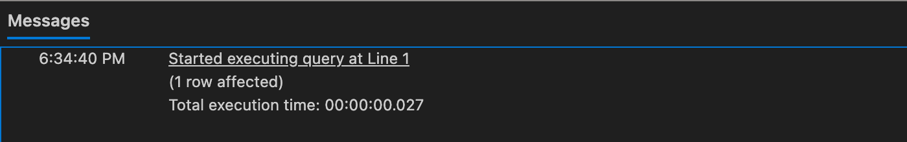

Kiểm tra lại:

```{=typst}
#raw(read("code/BTTH5-b-10d.sql"), lang: "sql", block: true)
```

Kết quả:

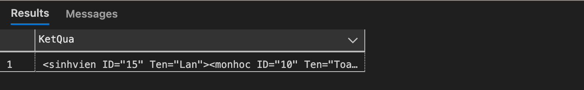

Thông tin của sinh viên:

```{=typst}
#raw(read("code/BTTH5-b-10d.xml"), lang: "xml", block: true)
```

## Câu 11

Viết lệnh Xquery thực hiện phép nối bằng các lệnh Xquery như một câu truy vấn trong SQL để trả về thông tin là sinh viên nào học khóa học tên là gì, sinh viên nào học môn học gì?

```{=typst}
#raw(read("code/BTTH5-b-11.sql"), lang: "sql", block: true)
```

Kết quả:

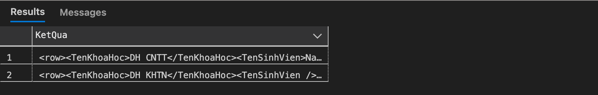

- CNTT: Thông tin đầy đủ bao gồm Khóa học, Tên sinh viên, Tên môn học.

```{=typst}
#raw(read("code/BTTH5-b-11-cntt.xml"), lang: "xml", block: true)
```

- KHTN: Không có Tên sinh viên do đã bị xóa ở Câu 6.

```{=typst}
#raw(read("code/BTTH5-b-11-khtn.xml"), lang: "xml", block: true)
```
