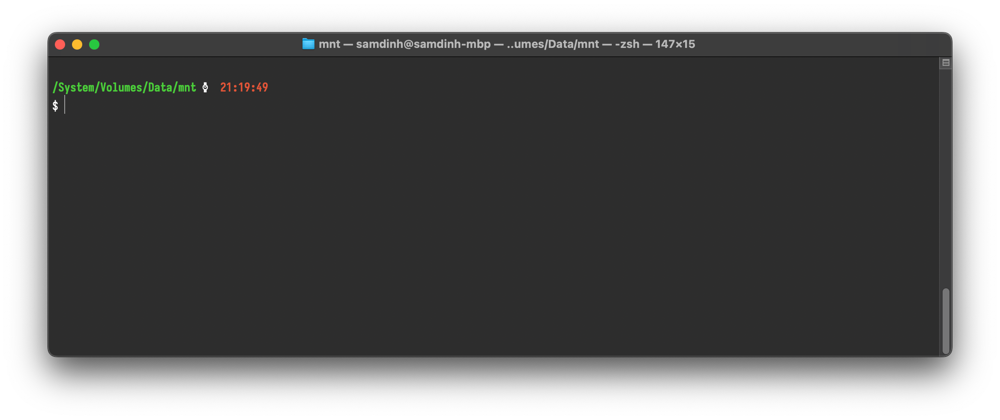
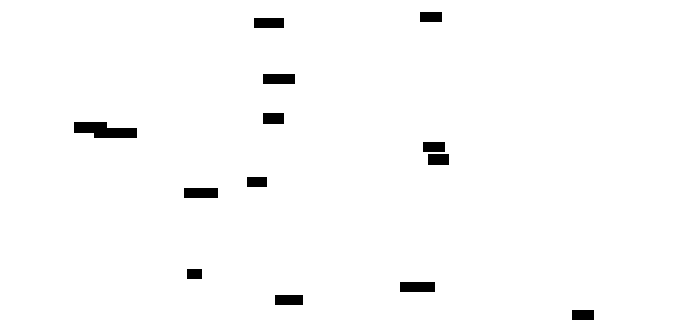

# Phân Tích Và Thiết Kế

## Các Chức Năng Nghiệp Vụ

Lorem ipsum dolor sit amet, consectetur adipiscing elit, sed do eiusmod tempor incididunt ut labore et dolore magnam aliquam quaerat voluptatem. Ut enim aeque doleamus animo, cum corpore dolemus, fieri.



Lorem ipsum dolor sit amet, consectetur adipiscing elit, sed do eiusmod tempor incididunt ut labore et dolore magnam aliquam quaerat.

## Đối Tượng và Mối Quan Hệ

Lorem ipsum dolor sit amet, consectetur adipiscing elit, sed do eiusmod tempor incididunt ut labore et dolore magnam aliquam quaerat voluptatem. Ut enim aeque doleamus animo, cum corpore dolemus, fieri.

Lorem ipsum dolor sit amet, consectetur adipiscing elit, sed do eiusmod tempor incididunt ut labore et dolore magnam aliquam quaerat.

## Mô Hình Mức Quan Niệm

Lorem ipsum dolor sit amet, consectetur adipiscing elit, sed do eiusmod tempor incididunt ut labore et dolore magnam aliquam quaerat voluptatem. Ut enim aeque doleamus animo, cum corpore dolemus, fieri.

```{=typst}
#figure(
table(
  columns: (1fr,) * 3,
  align: (left, left, left),
  [#strong[Thực Thể]], [#strong[Quan Hệ]], [#strong[Thực Thể]],
  [#strong[Quản Trị Viên]], [được gán], [#strong[Vai Trò]],
  [#strong[Vai Trò]], [có các], [#strong[Quyền Hạn]],
  [#strong[Phòng]], [thuộc], [#strong[Loại Phòng]],
  [#strong[Người Dùng]], [thực hiện], [#strong[Đặt Phòng]],
  [#strong[Đặt Phòng]], [bao gồm], [#strong[Phòng]],
  [#strong[Đặt Phòng]], [được áp dụng], [#strong[Mã Giảm Giá]],
  [#strong[Đặt Phòng]], [được], [#strong[Thanh Toán]],
  [#strong[Đặt Phòng]], [được], [#strong[Đánh Giá]],
  [#strong[Người Dùng]], [viết], [#strong[Đánh Giá]],
  [#strong[Người Dùng]], [thực hiện], [#strong[Thanh Toán]],
  [#strong[Người Dùng]], [yêu cầu], [#strong[Hoàn Tiền]],
  [#strong[Thanh Toán]], [được], [#strong[Hoàn Tiền]],
  [#strong[Quản Trị Viên]], [duyệt], [#strong[Hoàn Tiền]],
  [#strong[Đặt Phòng]], [có kèm], [#strong[Dịch Vụ]]
),
caption: [Ví dụ về Bảng]
)
```

Tóm tắt các thực thể và mối quan hệ bằng mô hình trực quan:

<!-- Sử dụng layout elk cho riêng diagram này. -->




<!-- TODO: Cân nhắc sử dụng direction TD -->


## Thiết Kế Cơ Sở Dữ Liệu

Lorem ipsum dolor sit amet, consectetur adipiscing elit, sed do eiusmod tempor incididunt ut labore et dolore magnam aliquam quaerat voluptatem. Ut enim aeque doleamus animo, cum corpore dolemus, fieri.
