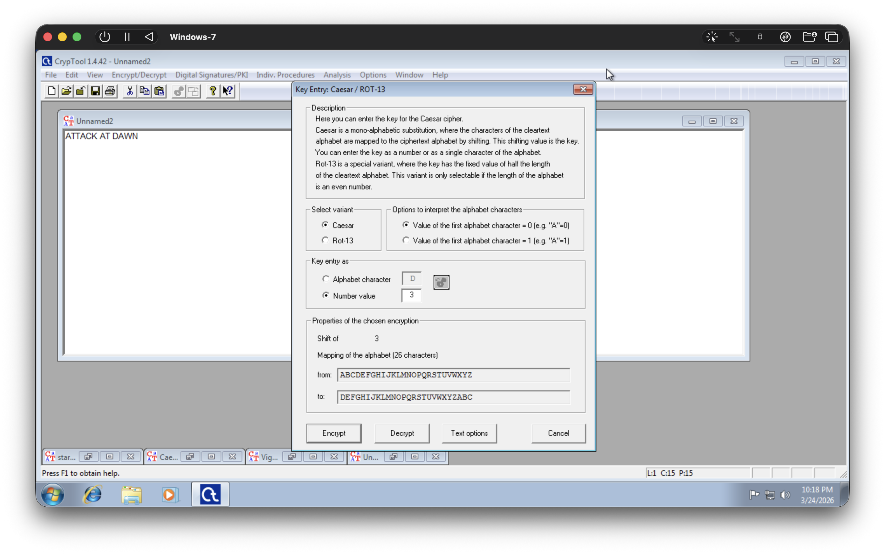
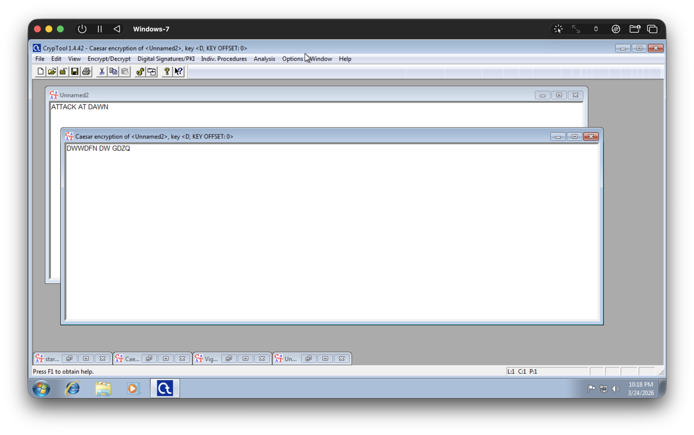
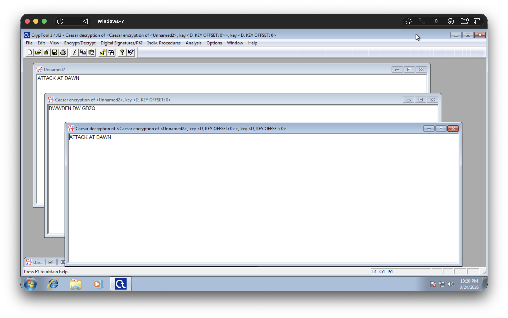
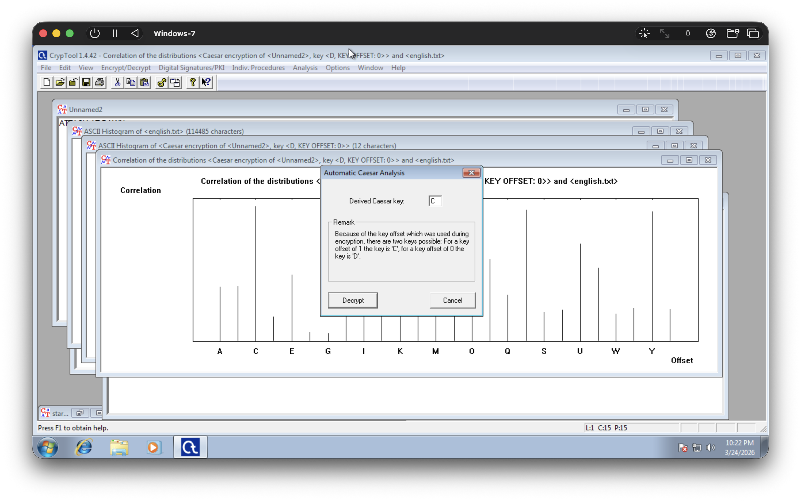
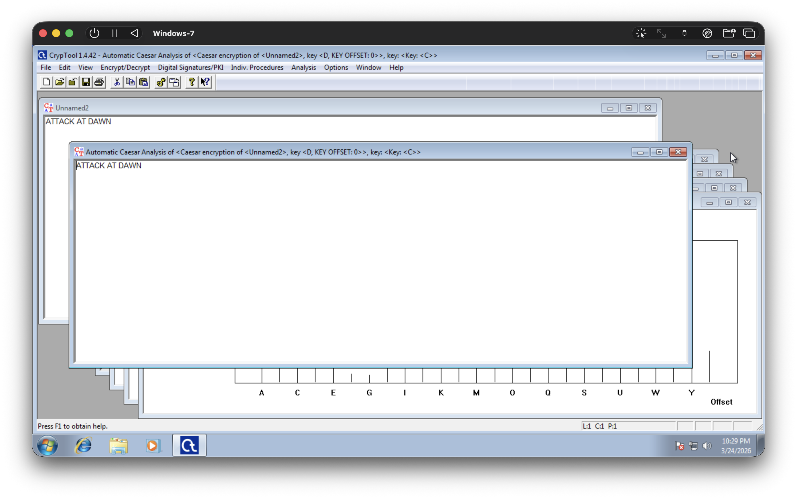
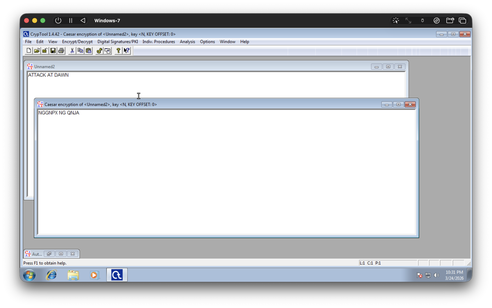
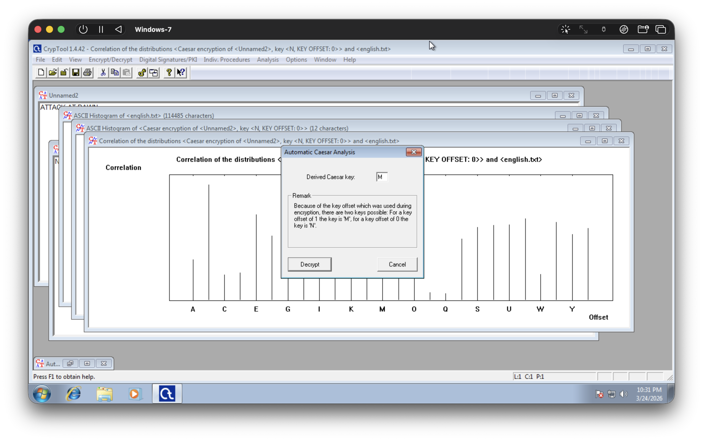
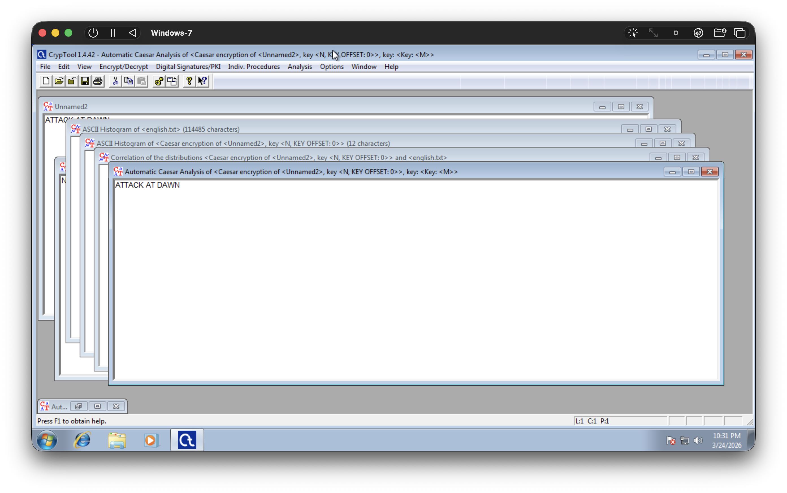

# BƯỚC 2 – Caesar Cipher

## Mã Hóa

- Nhập plaintext: `ATTACK AT DAWN`.
    - File $\to$ New.
- Encrypt → Classical → Caesar → key = 3.
    - Mục *Key entry as* chọn *Number value*, giá trị là 3.

- Kết quả: văn bản được mã hóa thành `DWWDFN DW GDZQ`.

## Giải Mã

- Dùng Decrypt để giải mã lại.
    - Menu Encrypt/Decrypt $\to$ Symmetric (classic) $\to$ Caesar / Rot13...
    - Nhập lại cấu hình như trước đó, cụ thể là key = 13.
    - Chọn **Decrypt**

- Kết quả:

## Analysis

- Phân tích brute-force: **Analysis → Classical → Caesar Analysis**.
    - Cho biết khả năng để giải mã, với key là 3. Nhưng sẽ tùy thuộc vào offset cụ thể là 0, hay là 1.
        - Với 0 thì đó là D.
        - Với 1 thì đó là C.
        - Trong trường hợp này, khi mã hóa, em đã chọn offset là 0, với key là 3, tức là D.

- Kết quả: văn bản mẫu được giải mã đúng.

## Lặp Lại Với Các Key Khác

- Lặp lại với các key khác: 5, 7, 13.
    - Sinh viên tự tạo 3 ciphertext và trao đổi để giải mã lẫn nhau.
    - Ví dụ với key = 13, chúng ta có văn bản đã mã hóa: `NGGNPX NG QNJA`

- Sử dụng **Analysis → Classical → Caesar Analysis**:
    - Cho biết key là 13, gồm 2 khả năng:
        - Key là $M$, nếu offset là 1.
        - Key là $N$, nếu offset là 0.

- Giải mã: văn bản gốc đã được giải mã đúng.

