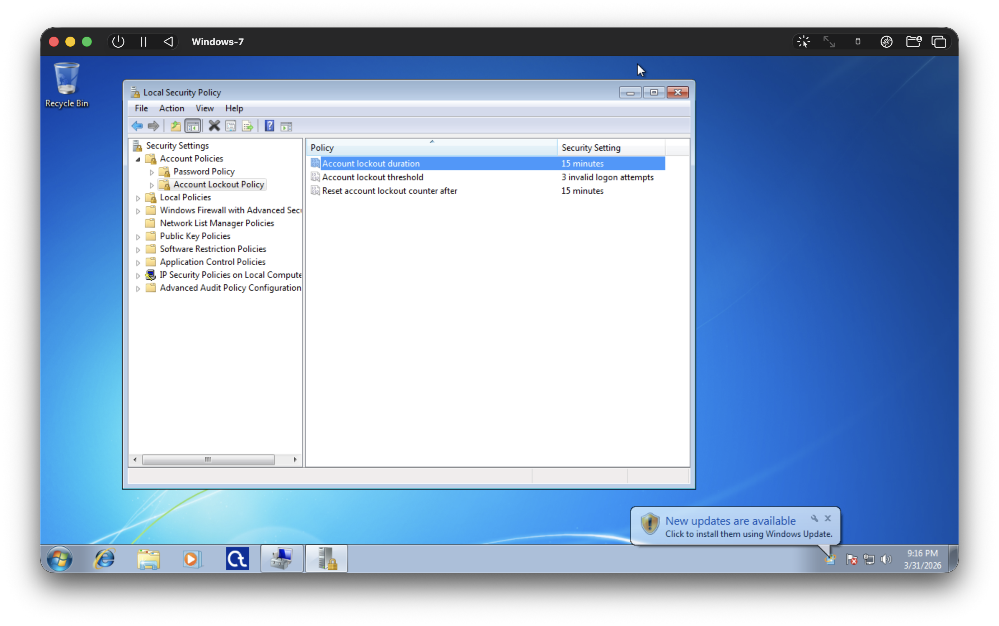

# Bước 2. Cấu Hình Chính Sách Khóa Tài Khoản (Account Lockout Policy)

- **Mục tiêu:** Khi có quá nhiều lần đoán sai mật khẩu, tài khoản sẽ tự động bị khóa.
- Kiểm tra lại các tham số:
    - Account lockout duration = 15 minutes;
    - Account lockout threshold = 3;
    - Reset account lockout counter after = 15 minutes.

