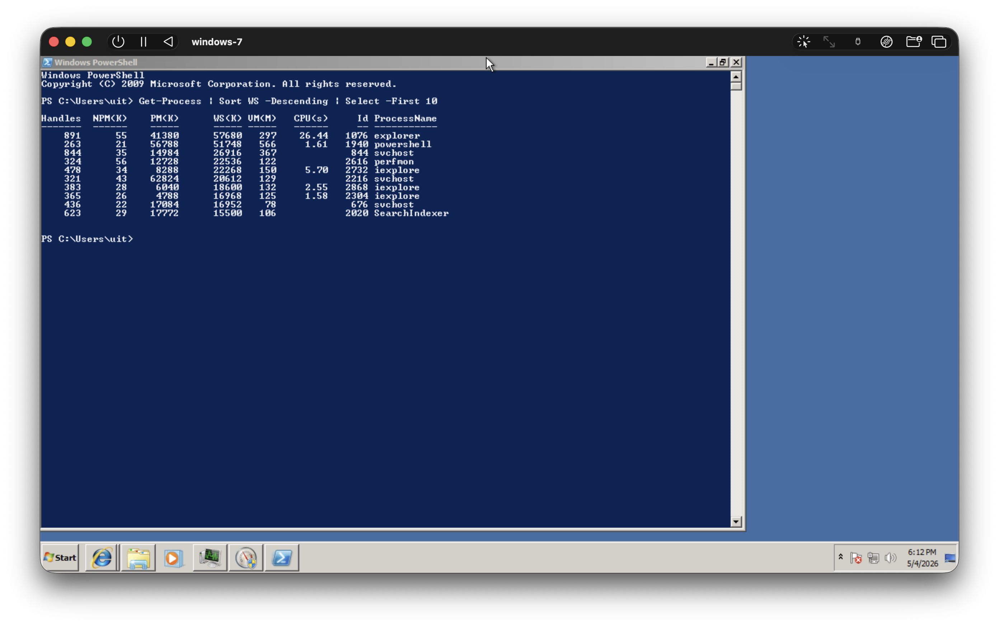

# PHẦN B. KIỂM TRA TIẾN TRÌNH BẰNG LỆNH WINDOWS

## B1 – Liệt Kê Tiến Trình Bằng CMD

CMD: `tasklist`

Yêu cầu:

- Chụp ảnh kết quả.
- Nhận diện tiến trình "không rõ nguồn gốc".

Không có tiến trình lạ trong danh sách:

- Ngoại trừ `spice-webdavd.exe` là cài đặt thêm như một phần của phần mềm ảo hóa.


## B2 – Kiểm Tra Tiến Trình Theo RAM Bằng PowerShell

PowerShell:

```powershell
Get-Process | Sort WS -Descending | Select -First 10
```

Tiến hành cài đặt PowerShell (Installing PowerShell on Windows)

Yêu cầu:

- Chụp ảnh kết quả.
- Ghi chú tiến trình chiếm nhiều RAM nhất.

Tiến trình chiếm nhiều RAM nhất:

- **explorer** với giá trị là 57680 KB.



## B3 – Tìm Tiến Trình Theo Tên

PowerShell:

```powershell
Get-Process -Name iexplore
```

- Đây là Internet Explorer, hiện có nhiều tab đang mở, nên có thể thấy nhiều tiến trình từ chương trình này.


