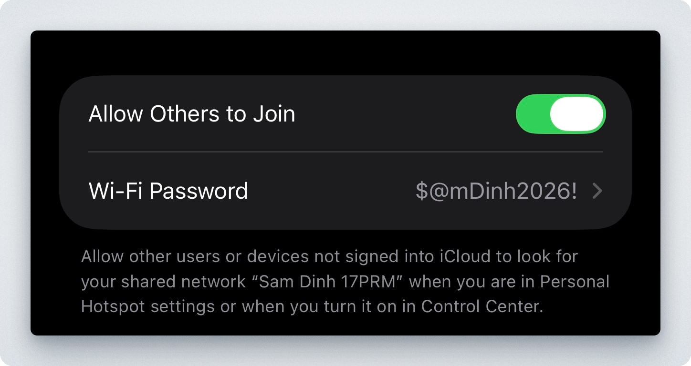
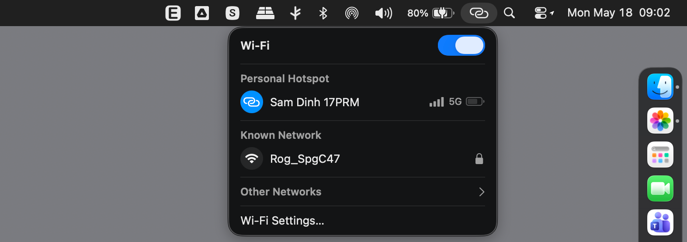
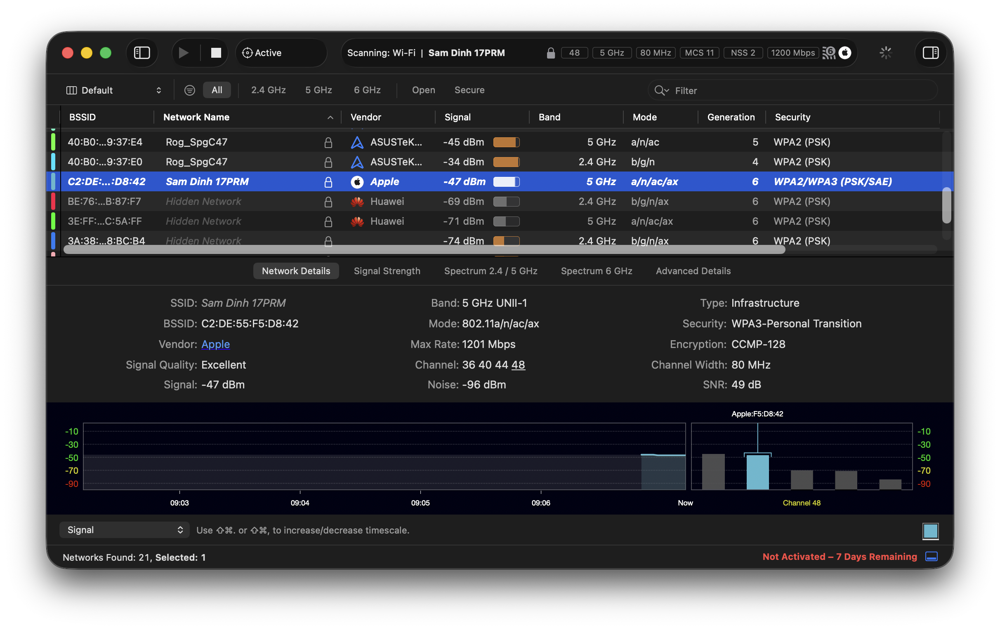

# TIẾT 2. PHÂN TÍCH CHUẨN BẢO MẬT & CẤU HÌNH WI-FI AN TOÀN

## Bài 3. So Sánh Chuẩn Bảo Mật Wi-Fi (Có Dẫn Chứng)

<!-- | Chuẩn | Thấy trong khảo sát? | Độ an toàn | Nhận xét |
|-------|------------------------|------------|----------|
| WEP   | Không             | Kém tới rất kém           | Gần như đã được loại bỏ khỏi sử dụng ở các thiết bị gia đình thường thấy từ các nhà cung cấp Internet.        |
| WPA   | Có             | Trung bình           | Mặc dù có cải thiện so với WEP nhưng không được phổ biến rộng rãi do sự xuất hiện của WPA2. |
| WPA2  | Có             | Khá tốt           | Là chuẩn bảo mật phổ biến nhất hiện nay. Vẫn còn tồn tại các giới hạn bảo mật nhất định. |
| WPA3  | Có             | Rất tốt.            | Là chuẩn bảo mật mới nhất và an toàn nhất hiện nay, phù hợp cho cả môi trường gia đình và doanh nghiệp. | -->

```{=typst}
#figure(
table(
  columns: (10%, 15%, 20%, 55%),
  align: (left, left, left, left),
  [Chuẩn], [Khảo Sát], [Độ An Toàn], [Nhận Xét],
  [WEP], [Không], [Kém tới rất kém], [Gần như đã được loại bỏ khỏi sử dụng ở các thiết bị gia đình thường thấy từ các nhà cung cấp Internet.],
  [WPA], [Có], [Trung bình], [Mặc dù có cải thiện so với WEP nhưng không được phổ biến rộng rãi do sự xuất hiện của WPA2.],
  [WPA2], [Có], [Khá tốt], [Là chuẩn bảo mật phổ biến nhất hiện nay. Vẫn còn tồn tại các giới hạn bảo mật nhất định.],
  [WPA3], [Có], [Rất tốt.], [Là chuẩn bảo mật mới nhất và an toàn nhất hiện nay, phù hợp cho cả môi trường gia đình và doanh nghiệp.]
),
  caption: [Bài 3. Bảng So Sánh Chuẩn Bảo Mật Wi-Fi]
)
```

Dẫn chứng:

- Tất cả các Wi-Fi tìm thấy đều sử dụng từ WPA2 trở lên (mặc dù cho hỗ trợ tương thích WPA nhưng không ưu tiên).


## Bài 4. Tạo Wi-Fi An Toàn Bằng Hotspot Điện Thoại (Mô Phỏng Router)

iPhone:

- Bước 1: Settings → Personal Hotspot.
- Bước 2: Đổi Wi-Fi Password ($\ge$ 12 ký tự): `$@mDinh2026!`.
- Bước 3: Chụp màn hình cấu hình.



## Bài 5. Kiểm Chứng Mã Hóa Wi-Fi Vừa Tạo (Laptop)

### Kiểm Chứng Mã Hóa Wi-Fi

1. Kết Nối Vào Hotspot.



2. Duyệt Wi-Fi để kiểm tra thông số.

- Encryption (hay Cipher): CCMP-128.
  - CCMP (Counter Mode with Cipher Block Chaining Message Authentication Code Protocol)
  - Đây là AES với thuật toán mã hóa 128 bit.



### Câu hỏi

> Cipher AES có ý nghĩa gì trong bảo mật Wi-Fi?

Đầu tiên, chúng ta sẽ phân biệt các thành phần được quan sát ở trên:

- WPA2/WPA3: là các giao thức bảo mật (luật lệ).
- CCMP: CCMP là giao thức mã hóa dữ liệu (cách thức đóng gói) và sẽ sử dụng các thuật toán mã hóa nhất định.
- AES: là lõi thuật toán (ổ khóa toán học) mà CCMP sử dụng để xáo trộn dữ liệu.
  - Viết tắt của Advanced Encryption Standard.
  - AES-128 là một thuật toán mã hóa khối (block cipher).
  - AES là một thuật toán mã hóa đối xứng, có nghĩa là cùng một khóa được sử dụng để mã hóa và giải mã dữ liệu.
- Kết hợp thành CCMP-AES-128, hay tạm gọi là Cipher AES.
  - CCMP sử dụng AES để mã hóa dữ liệu, đảm bảo tính bảo mật và toàn vẹn của dữ liệu.

**Vai trò & Ý nghĩa của AES trong bảo mật Wi-Fi:**

Ứng dụng:

- Mã hóa: Dữ liệu từ thiết bị được mã hóa bằng AES, với một khóa dựa trên mật khẩu Wi-Fi đã được thống nhất giữa thiết bị và Router.
- Truyền tải: Khối dữ liệu này được truyền tải qua mạng không dây, kẻ tấn công có thể bắt (sniff) các gói tin và lấy ra các khối dữ liệu.
- Giải mã: Kẻ tấn công không thể giải mã dữ liệu nếu không có khóa. Router sẽ giải mã vì sở hữu khóa 
tương ứng.

Ý nghĩa:

- Xác thực: AES đảm bảo rằng chỉ những thiết bị có khóa chính xác mới có thể kết nối vào mạng Wi-Fi.
- Tính toàn vẹn: AES đảm bảo rằng dữ liệu không bị thay đổi trong quá trình truyền.
- An toàn: Gói tin hoặc khối dữ liệu có thể được bắt (sniff) nhưng không thể được giải mã nếu không có khóa chính xác.
