# Câu 3. An Ninh Thông Tin

Dựa vào CSDL đã thiết kế ở BTTH số 2 (QLĐT), hãy thực hiện các yêu cầu sau:

1. Tạo ra 3 users: `GIANGVIEN`, `GIAOVU` và `SINHVIEN`, đặt *mật khẩu tuỳ ý*.
2. Phân quyền cho các users trên database như sau:
    - `GIAOVU` có quyền xem và chỉnh sửa (cập nhật) trên tất cả các bảng
    - `GIANGVIEN`:
        - Có quyền xem trên các bảng có liên quan đến thông tin GV, các đề tài mà GV hướng dẫn, phản biện hay làm uỷ viên, xem thông tin hội đồng và danh sách các đề tài hiện có.
        - Có quyền cập nhật thông tin của mình.
    - `SINHVIEN` có quyền xem thông tin của sinh viên, thông tin của hội đồng và danh sách các đề tài hiện có.
    - Tất cả người dùng trên đều không có quyền xoá thông tin.

## Tạo Ra 3 Users

Yêu cầu:

- Tạo ra 3 users: `GIANGVIEN`, `GIAOVU` và `SINHVIEN`, đặt *mật khẩu tuỳ ý*.

Thực hiện:

- Trước khi tạo 3 user ta tạo 3 login đăng nhập trên SERVER.

```sql
CREATE LOGIN GIANGVIEN WITH PASSWORD = 'gi@ngvien123';
CREATE LOGIN GIAOVU WITH PASSWORD = 'gi@ovu123';
CREATE LOGIN SINHVIEN WITH PASSWORD = 's@nhvien123';
GO
```

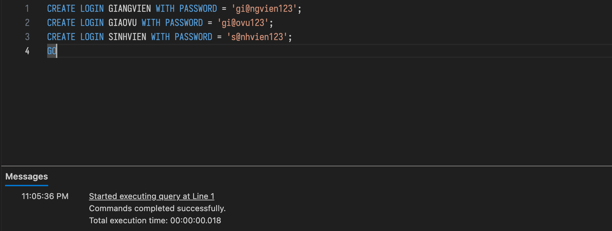

- Kiểm tra 3 login đã tạo trên SERVER chưa.

```sql
SELECT name
FROM sys.server_principals
WHERE name IN ('GIANGVIEN', 'GIAOVU', 'SINHVIEN');
GO
```

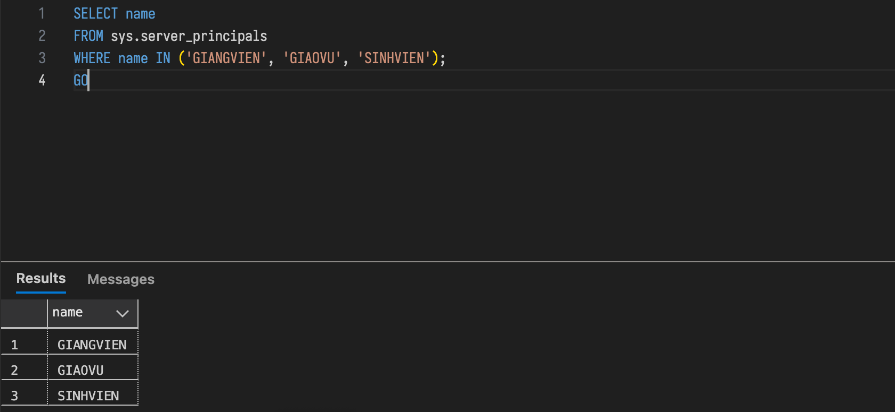

- Tạo 3 user trên DATABASE.

```sql
CREATE USER GIANGVIEN FOR LOGIN GIANGVIEN;
CREATE USER GIAOVU FOR LOGIN GIAOVU;
CREATE USER SINHVIEN FOR LOGIN SINHVIEN;
GO
```

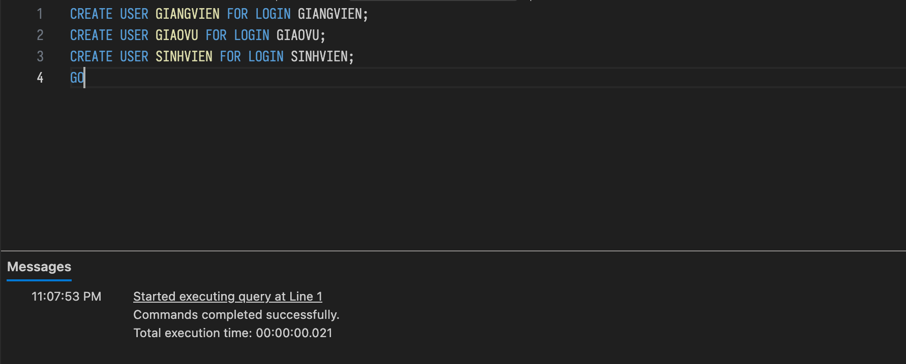

- Kiểm tra 3 user đã tạo trên DATABASE chưa.

```sql
SELECT name
FROM sys.database_principals
WHERE name IN ('GIANGVIEN', 'GIAOVU', 'SINHVIEN');
GO
```


## Phân Quyền Cho Các Users Trên Database

### GIAOVU

Yêu cầu:

- `GIAOVU` có quyền xem và chỉnh sửa (cập nhật) trên tất cả các bảng.

Thực hiện:

- Quền XEM:

```sql
GRANT SELECT, UPDATE ON SV_DETAI TO GIAOVU;
GRANT SELECT, UPDATE ON SINHVIEN TO GIAOVU;
GRANT SELECT, UPDATE ON HOIDONG_GV TO GIAOVU;
GRANT SELECT, UPDATE ON HOIDONG_DT TO GIAOVU;
GRANT SELECT, UPDATE ON HOIDONG TO GIAOVU;
GRANT SELECT, UPDATE ON HOCVI TO GIAOVU;
GRANT SELECT, UPDATE ON HOCHAM TO GIAOVU;
GRANT SELECT, UPDATE ON GV_UVDT TO GIAOVU;
GRANT SELECT, UPDATE ON GV_PBDT TO GIAOVU;
GRANT SELECT, UPDATE ON GV_HV_CN TO GIAOVU;
GRANT SELECT, UPDATE ON GV_HDDT TO GIAOVU;
GRANT SELECT, UPDATE ON GIAOVIEN TO GIAOVU;
GRANT SELECT, UPDATE ON DETAI_DIEM TO GIAOVU;
GRANT SELECT, UPDATE ON DETAI TO GIAOVU;
GRANT SELECT, UPDATE ON CHUYENNGANH TO GIAOVU;
GO
```


- Kiểm tra `GIAOVU` XEM được bảng.

```sql
EXECUTE AS USER = 'GIAOVU';
SELECT * FROM GIAOVIEN;
REVERT;
GO
```

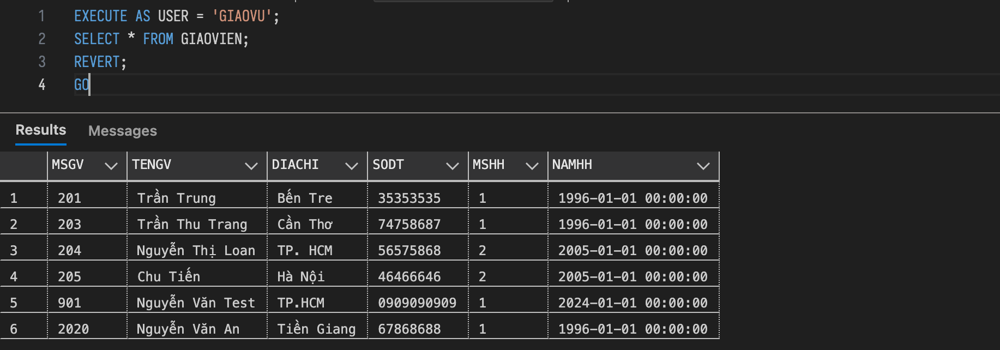

- Kiểm tra `GIAOVU` Cập Nhật được bảng.

```sql
EXECUTE AS USER = 'GIAOVU';
UPDATE GIAOVIEN
SET TENGV = TENGV
WHERE MSGV = '001';
REVERT;
GO
```

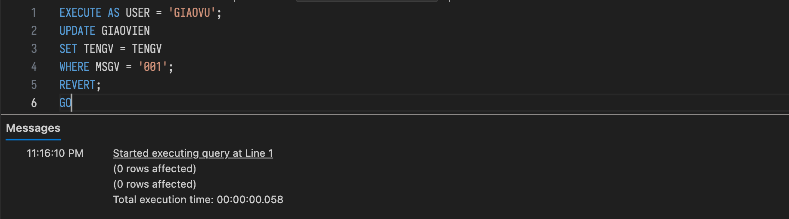

### GIANGVIEN

#### Quyền xem trên các bảng có liên quan đến thông tin GV

Yêu cầu:

- Có quyền xem trên các bảng có liên quan đến thông tin GV, các đề tài mà GV hướng dẫn, phản biện hay làm uỷ viên, xem thông tin hội đồng và danh sách các đề tài hiện có.

Thực hiện:

- 1.1 Thông tin giảng viên (và các bảng mô tả thông tin GV nếu cần)

```sql
GRANT SELECT ON GIAOVIEN TO GIANGVIEN;
GRANT SELECT ON HOCHAM TO GIANGVIEN;
GRANT SELECT ON CHUYENNGANH TO GIANGVIEN;
GRANT SELECT ON GV_HV_CN TO GIANGVIEN;
GO
```

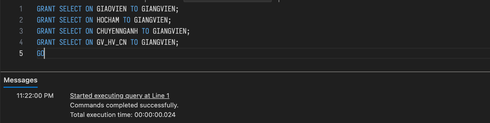

- 1.2 Danh sách đề tài hiện có + thông tin chi tiết đề tài

```sql
GRANT SELECT ON DETAI TO GIANGVIEN;
GRANT SELECT ON DETAI_DIEM  TO GIANGVIEN;
GRANT SELECT ON SV_DETAI TO GIANGVIEN;
GO
```

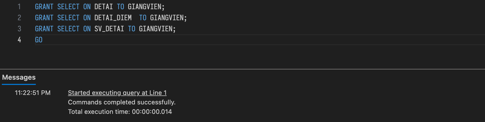

- 1.3 Các đề tài GV Hướng Dẫn / Phản Biện / Uỷ Viên.

```sql
GRANT SELECT ON GV_HDDT  TO GIANGVIEN;
GRANT SELECT ON GV_PBDT  TO GIANGVIEN;
GRANT SELECT ON GV_UVDT  TO GIANGVIEN;
GO
```

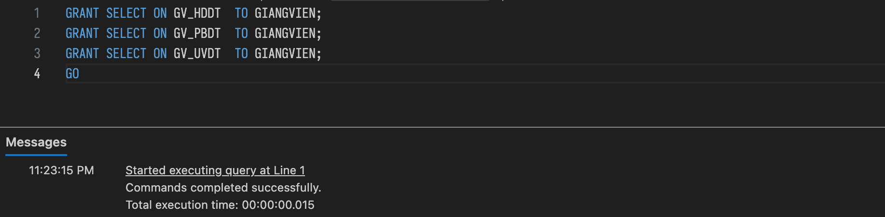

- 1.4 Thông tin hội đồng + danh sách đề tài trong hội đồng + GV trong hội đồng

```sql
GRANT SELECT ON HOIDONG TO GIANGVIEN;
GRANT SELECT ON HOIDONG_DT TO GIANGVIEN;
GRANT SELECT ON HOIDONG_GV  TO GIANGVIEN;
GO
```

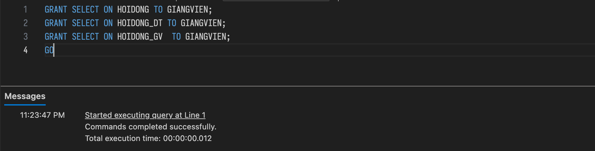

- Kiểm thử quyền XEM.

```sql
EXECUTE AS USER = 'GIANGVIEN';
SELECT * FROM GIAOVIEN;
REVERT;
GO
```

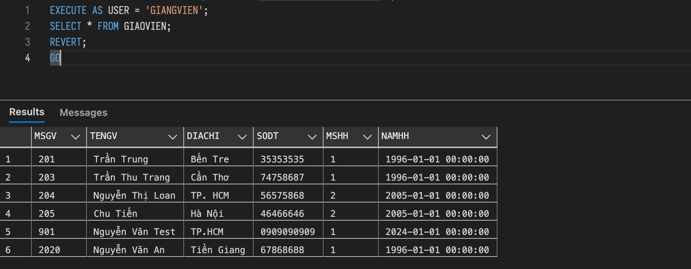

#### Có quyền cập nhật thông tin của mình.

Yêu cầu:

- Có quyền cập nhật thông tin của mình.
- Tránh trường hợp được sửa hết nguyên bản giáo viên.

Ý tưởng:

- Thêm cột đăng nhập vào bảng `GIAOVIEN`.
- Gán tài khoản đăng nhập cho từng giáo viên.
- Tạo bảng view thông tin của tôi.

Thực hiện:

- 2.1 Thêm cột `TenDangNhap` vào bảng `GIAOVIEN`.

```sql
ALTER TABLE GIAOVIEN
ADD TenDangNhap VARCHAR(50);
GO
```

- 2.2 Giả sử gán `TenDangNhap = GIANGVIEN` với `MSGV` là `201`.

```sql
UPDATE GIAOVIEN
SET TenDangNhap = 'GIANGVIEN'
WHERE MSGV = '201';
GO
```

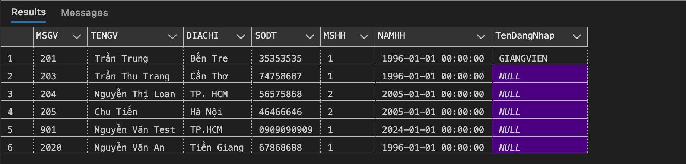

- 2.3 Tạo bảng View *Thông Tin Của Tôi*

```sql
CREATE VIEW GV_ThongTinCuaToi
AS
    SELECT MSGV, TENGV, DIACHI, SODT, NAMHH
    FROM dbo.GIAOVIEN
    WHERE TenDangNhap ='GIANGVIEN';
GO
```

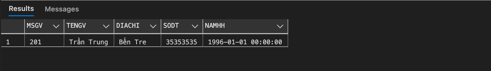

- 2.4 Up thông tin `GIAOVIEN` theo tên đăng nhập trên View.

```sql
GRANT SELECT, UPDATE ON GV_ThongTinCuaToi TO GIANGVIEN;
DENY UPDATE ON GIAOVIEN TO GIANGVIEN;
GO
```

- 2.5 Dùng Trigger để up thông tin từ View xuống bảng `GIAOVIEN`.

```sql
CREATE TRIGGER trg_Update_GV
ON GV_ThongTinCuaToi
INSTEAD OF UPDATE
AS
BEGIN
    UPDATE GIAOVIEN
    SET
        TENGV  = i.TENGV,
        DIACHI = i.DIACHI,
        SODT   = i.SODT,
        NAMHH  = i.NAMHH
    FROM inserted i
    WHERE GIAOVIEN.MSGV = i.MSGV
      AND GIAOVIEN.TenDangNhap = 'GIANGVIEN';
END;
GO
```

Kiểm thử: GIANGVIEN với MSGV '101'.

- Cập nhật thông tin của bản thân: THÀNH CÔNG.

```sql
EXECUTE AS USER = 'GIANGVIEN';
UPDATE GV_ThongTinCuaToi
SET TENGV = TENGV
WHERE MSGV = '201';
REVERT;
GO
```

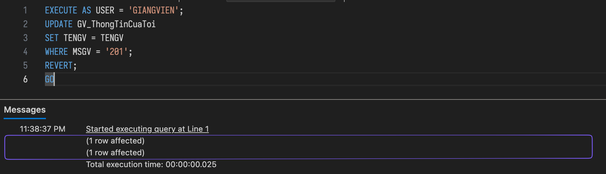

- Cập nhật thông tin của người khác: KHÔNG THÀNH CÔNG.

```sql
EXECUTE AS USER = 'GIANGVIEN';
UPDATE GV_ThongTinCuaToi
SET TENGV = TENGV
WHERE MSGV = '203';
REVERT;
GO
```

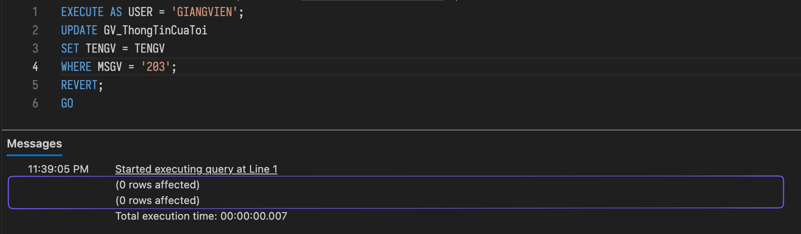

### SINHVIEN

Yêu cầu:

- `SINHVIEN` có quyền xem thông tin của sinh viên, thông tin của hội đồng và danh sách các đề tài hiện có.

Thực hiện:

```sql
GRANT SELECT ON SINHVIEN TO SINHVIEN;
GRANT SELECT ON HOIDONG TO SINHVIEN;
GRANT SELECT ON HOIDONG_DT TO SINHVIEN;
GRANT SELECT ON DETAI TO SINHVIEN;
GO
```

Kiểm thử:

```sql
EXECUTE AS USER = 'SINHVIEN';
SELECT *
FROM SINHVIEN;
REVERT;
GO
```

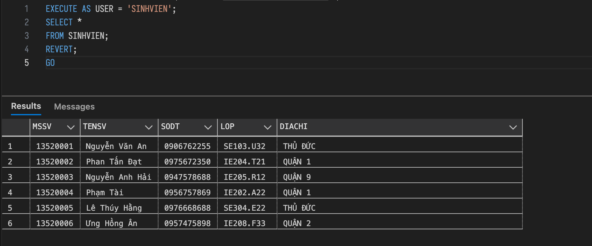

### Tất Cả Người Dùng

Yêu cầu:

- Tất cả người dùng trên đều KHÔNG có quyền XÓA thông tin.

#### GIAOVU

- Thực hiện:

```sql
DENY DELETE ON CHUYENNGANH TO GIAOVU;
DENY DELETE ON DETAI TO GIAOVU;
DENY DELETE ON DETAI_DIEM TO GIAOVU;
DENY DELETE ON GIAOVIEN TO GIAOVU;
DENY DELETE ON GV_HDDT TO GIAOVU;
DENY DELETE ON GV_HV_CN TO GIAOVU;
DENY DELETE ON GV_PBDT TO GIAOVU;
DENY DELETE ON GV_UVDT TO GIAOVU;
DENY DELETE ON HOCHAM TO GIAOVU;
DENY DELETE ON HOCVI TO GIAOVU;
DENY DELETE ON HOIDONG TO GIAOVU;
DENY DELETE ON HOIDONG_DT TO GIAOVU;
DENY DELETE ON HOIDONG_GV TO GIAOVU;
DENY DELETE ON SINHVIEN TO GIAOVU;
DENY DELETE ON SV_DETAI TO GIAOVU;
GO
```

- Kiểm thử:

```sql
EXECUTE AS USER = 'GIAOVU';
DELETE FROM CHUYENNGANH;
REVERT;
GO
```


#### GIANGVIEN

- Thực hiện:

```sql
DENY DELETE ON GIAOVIEN TO GIANGVIEN;
DENY DELETE ON DETAI TO GIANGVIEN;
DENY DELETE ON HOIDONG TO GIANGVIEN;
DENY DELETE ON HOIDONG_DT TO GIANGVIEN;
DENY DELETE ON HOIDONG_GV TO GIANGVIEN;
DENY DELETE ON GV_HDDT TO GIANGVIEN;
DENY DELETE ON GV_PBDT TO GIANGVIEN;
DENY DELETE ON GV_UVDT TO GIANGVIEN;
DENY DELETE ON DETAI_DIEM TO GIANGVIEN;
DENY DELETE ON SV_DETAI TO GIANGVIEN;
GO
```

- Kiểm thử:

```sql
EXECUTE AS USER = 'GIANGVIEN';
DELETE FROM DETAI_DIEM;
REVERT;
GO
```

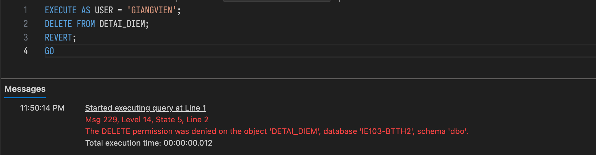

#### SINHVIEN

- Thực hiện:

```sql
DENY DELETE ON SINHVIEN TO SINHVIEN;
DENY DELETE ON HOIDONG TO SINHVIEN;
DENY DELETE ON HOIDONG_DT TO SINHVIEN;
DENY DELETE ON DETAI TO SINHVIEN;
GO
```

- Kiểm thử:

```sql
EXECUTE AS USER = 'SINHVIEN';
DELETE FROM HOIDONG;
REVERT;
GO
```

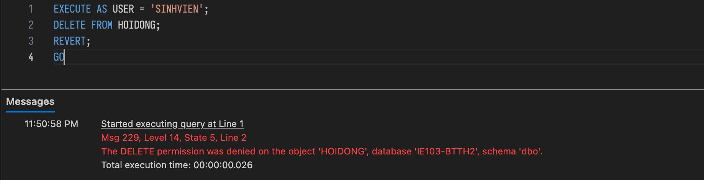
