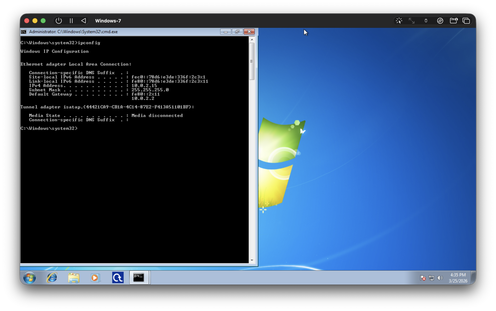
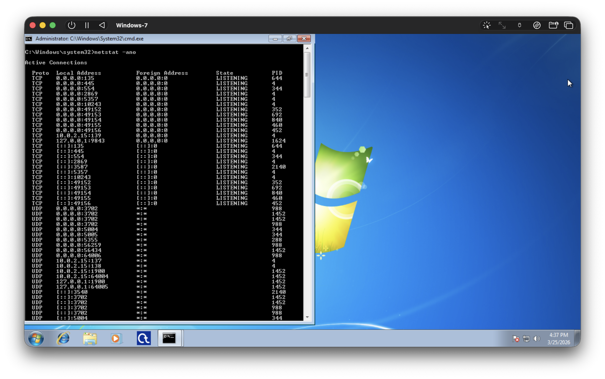
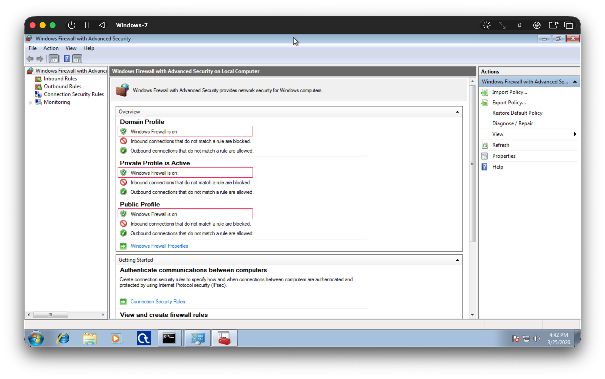

# PHẦN 3. KIỂM TRA MẠNG VÀ CỔNG MỞ

## Bước 1. Kiểm tra IP

1. Gõ lệnh: `ipconfig`
2. Ghi lại IPv4.

IPv4:
- IP Address: 10.0.2.15
- Netmask: 255.255.255.0
- Gateway: 10.0.2.2



## Bước 2. Kiểm tra cổng đang mở bằng netstat

1. Gõ: `netstat -ano`
2. Quan sát:
    - LISTENING → cổng đang mở
    - ESTABLISHED → kết nối đang hoạt động
3. Ghi lại các cổng quan trọng:
    - 22 (SSH – nếu có)
    - 80, 443 (web)
    - 3389 (RDP)
    - 445 (SMB)
4. Nếu thấy cổng lạ → đánh dấu rủi ro.

Trạng thái cổng:

- Đang mở (LISTENING): 135, 445, 554, 2869, 5357, vv..
- Đang kết nối (ESTABLISHED): không có.

Các cổng quan trọng:

- 445: SMB. Đang mở (LISTENING)

```c
C:\Windows\system32>netstat -ano

Active Connections

  Proto  Local Address          Foreign Address        State           PID
  TCP    0.0.0.0:135            0.0.0.0:0              LISTENING       644
  TCP    0.0.0.0:445            0.0.0.0:0              LISTENING       4
  TCP    0.0.0.0:554            0.0.0.0:0              LISTENING       344
  TCP    0.0.0.0:2869           0.0.0.0:0              LISTENING       4
  TCP    0.0.0.0:5357           0.0.0.0:0              LISTENING       4
  TCP    0.0.0.0:10243          0.0.0.0:0              LISTENING       4
  TCP    0.0.0.0:49152          0.0.0.0:0              LISTENING       352
  TCP    0.0.0.0:49153          0.0.0.0:0              LISTENING       692
  TCP    0.0.0.0:49154          0.0.0.0:0              LISTENING       840
  TCP    0.0.0.0:49155          0.0.0.0:0              LISTENING       460
  TCP    0.0.0.0:49156          0.0.0.0:0              LISTENING       452
  TCP    10.0.2.15:139          0.0.0.0:0              LISTENING       4
  TCP    127.0.0.1:9843         0.0.0.0:0              LISTENING       1624
  UDP    0.0.0.0:3702           *:*                                    988
  UDP    0.0.0.0:3702           *:*                                    1452
  UDP    0.0.0.0:3702           *:*                                    1452
  UDP    0.0.0.0:3702           *:*                                    988
  UDP    0.0.0.0:5004           *:*                                    344
  UDP    0.0.0.0:5005           *:*                                    344
  UDP    0.0.0.0:5355           *:*                                    288
  UDP    0.0.0.0:56259          *:*                                    988
  UDP    0.0.0.0:56434          *:*                                    1452
  UDP    0.0.0.0:64006          *:*                                    988
  UDP    10.0.2.15:137          *:*                                    4
  UDP    10.0.2.15:138          *:*                                    4
  UDP    10.0.2.15:1900         *:*                                    1452
  UDP    10.0.2.15:64004        *:*                                    1452
  UDP    127.0.0.1:1900         *:*                                    1452
  UDP    127.0.0.1:64005        *:*                                    1452
```

`netstat -ano`:



## Bước 3. Kiểm tra tường lửa Windows Defender

1. Mở Start → Windows Security.
2. Chọn Firewall & network protection.
3. Kiểm tra:
    - Domain network → ON?
    - Private network → ON?
    - Public network → ON?
4. Chụp màn hình lại.

Kiểm tra:

- Domain network → ON
- Private network → ON
- Public network → ON


