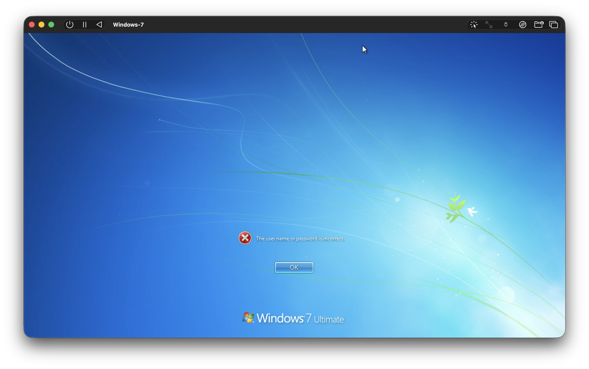
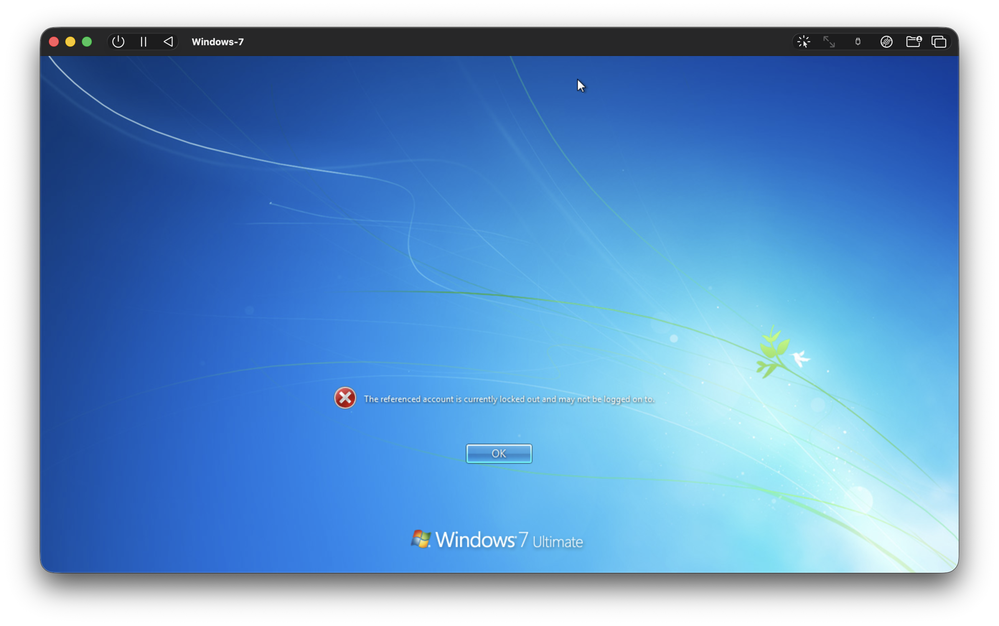

# Bước 3. Mô Phỏng Tấn Công Dò Mật Khẩu (Từ Màn Hình Đăng Nhập)

## Mục Tiêu

- Thử nhiều mật khẩu sai để kích hoạt cơ chế khóa tài khoản đã cấu hình ở bước 2.

## Hướng Dẫn

- Tại màn hình đăng nhập, chọn tài khoản `UserTest`.
- Thực hiện ít nhất 3 lần đăng nhập sai (theo *threshold* đã cấu hình):
- Lần 1: nhập mật khẩu sai (ví dụ: `123456`) → Enter.
- Lần 2: nhập mật khẩu sai khác (ví dụ: `User1234`) → Enter.
- Lần 3: tiếp tục nhập mật khẩu sai (ví dụ: `Password!`) → Enter.
- Quan sát thông báo sau lần thử thứ 3: tài khoản `UserTest` sẽ bị khóa trong khoảng thời gian đã cấu hình (ví dụ 15 phút).

## Thực Hiện

- Thử đăng nhập vào tài khoản `UserTest` với mật khẩu sai, 3 lần.
    - Nhận thông báo: *The user name or password is incorrect.*

- **Kết quả:** Tài khoản `UserTest` bị khóa và từ chối đăng nhập, có thể xem thông báo ở các lần tiếp theo (lần thứ 4 trở lên).
    - Nhận thông báo: *The referrenced account is currently locked out and may not be logged on to.*

