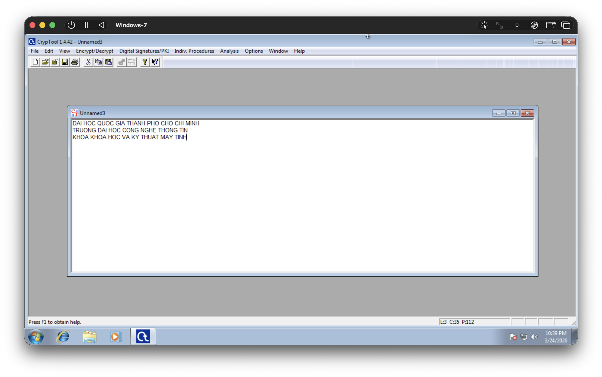
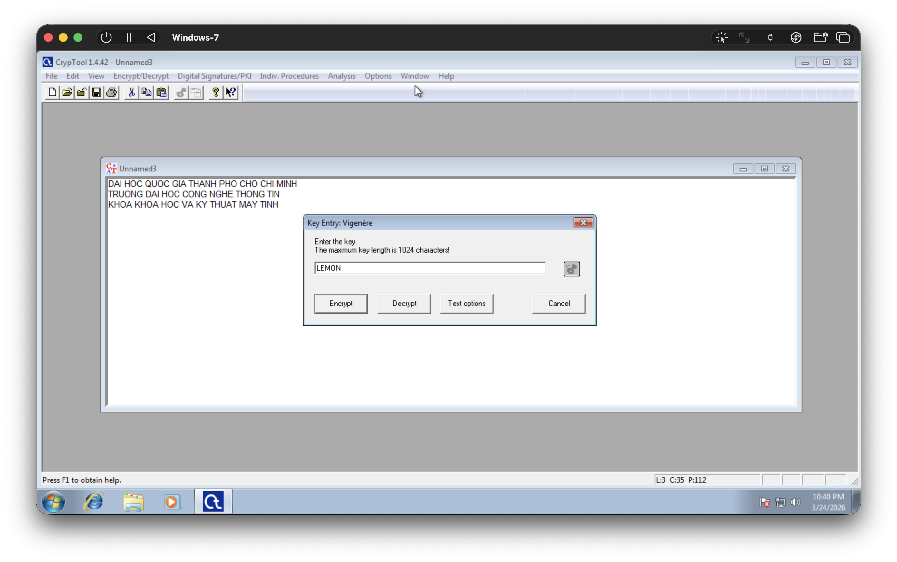
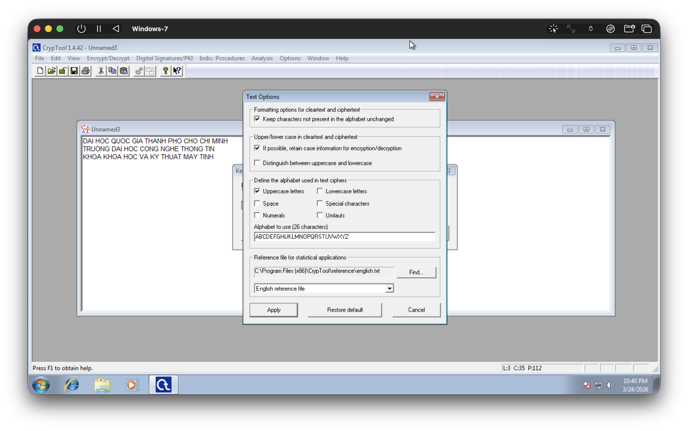
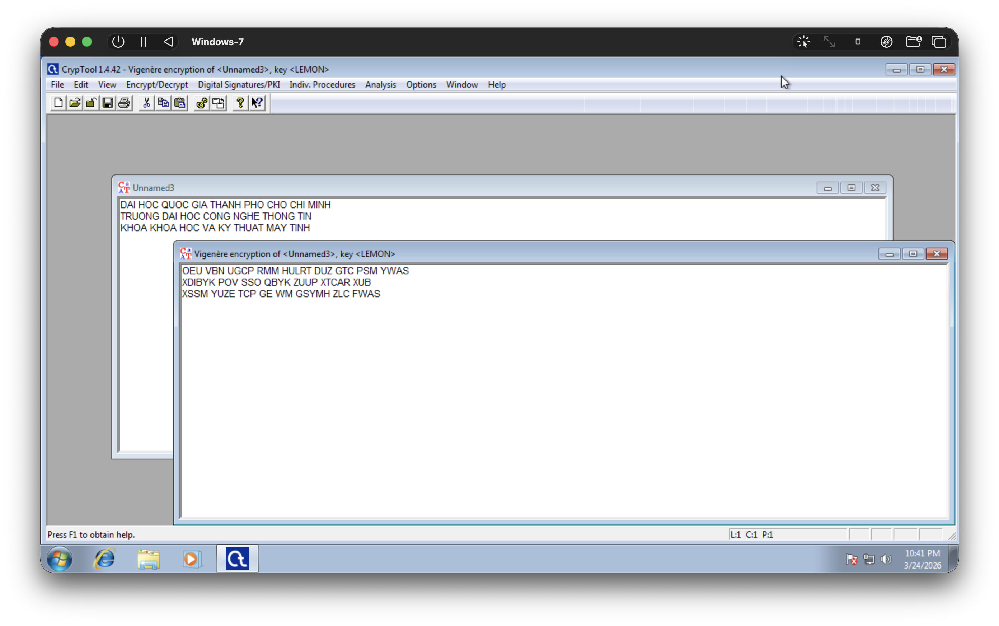
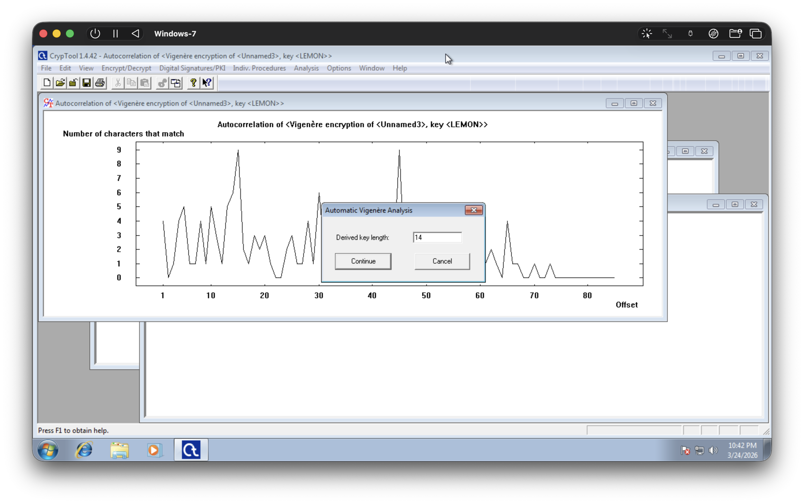
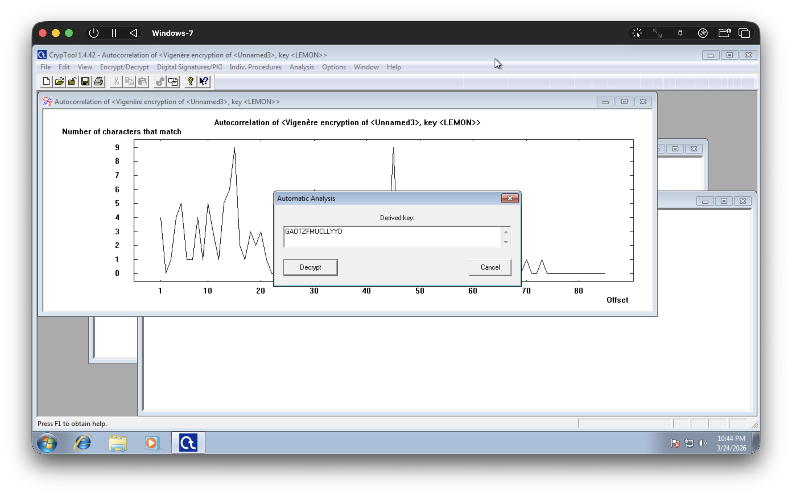
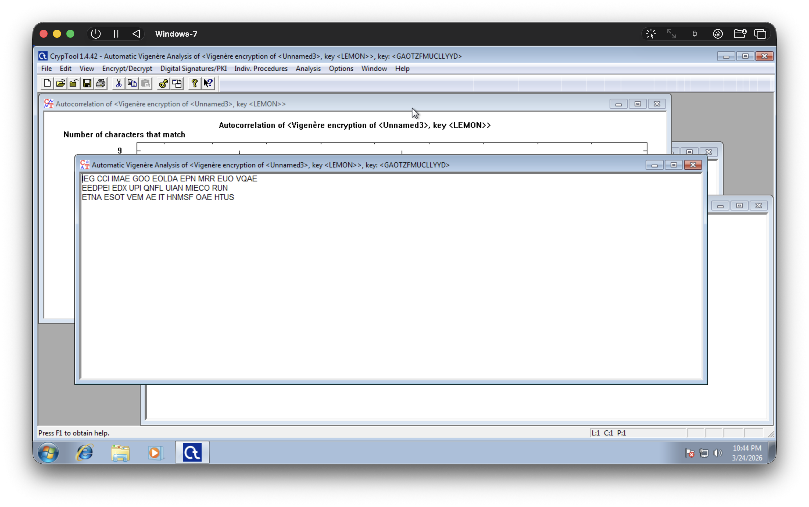
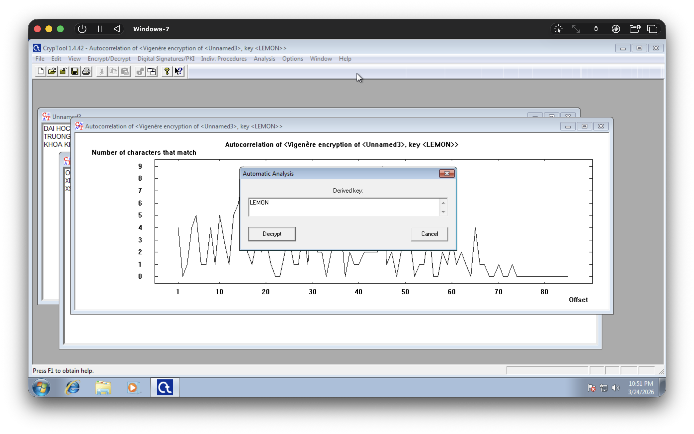
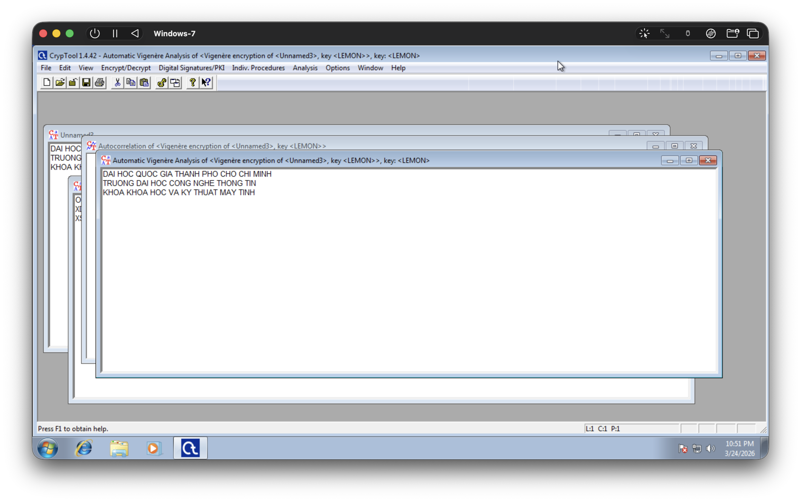
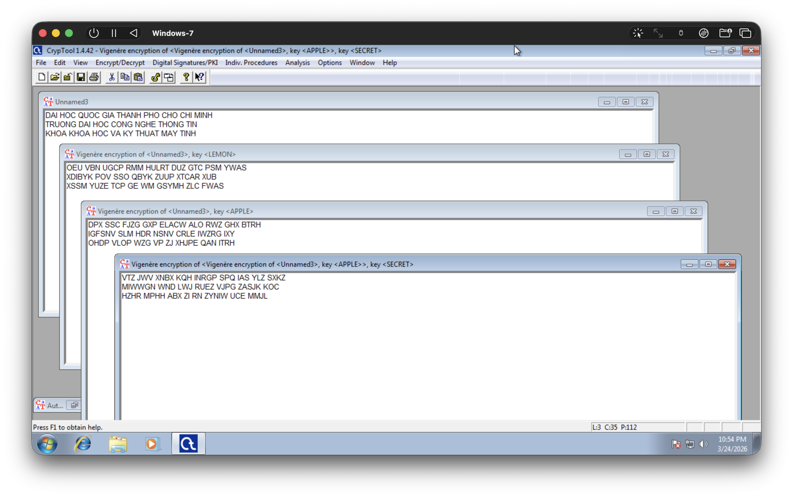

# BƯỚC 3 – Vigenère Cipher

- Nhập plaintext dài 3–4 dòng để tăng độ phức tạp.
- Encrypt → Vigenère → key = `LEMON`.
- Decrypt lại bằng key.
- Phân tích khóa bằng Analysis → Vigenère Analysis.
- Quan sát IC và độ dài khóa dự đoán.
- Tạo một ciphertext mới với key khác (`APPLE`, `SECRET`).
- Thực hành: sinh viên đổi ciphertext cho nhau để phá bằng Kasiski + IC.

## Plaintext

```c
DAI HOC QUOC GIA THANH PHO CHO CHI MINH
TRUONG DAI HOC CONG NGHE THONG TIN
KHOA KHOA HOC VA KY THUAT MAY TINH
```



## Mã Hóa

- Menu **Encrypt/Decrypt $\to$ Symmetric (classic) $\to$ Vigenère**
    - **Key Entry**: `LEMON`
    - Chọn **Encrypt**



- Có thể bấm **Text options** để xem thêm các tùy chọn về miền không gian khóa.



- Kết Quả
    - Văn bản mẫu được mã hóa.



## Analysis

- Độ dài khóa dự đoán là 14. Đây cho thấy 2 điểm:
    - Công cụ phân tích dựa trên từ điển tiếng Anh (ở phần **Text options**), nên khó có kết quả chính xác với ngôn ngữ khác.
    - Độ dài khóa sai lệch rất nhiều so với khóa gốc, cho thấy Vigenère đem đến sự bảo mật hơn so với Caesar.



- Khóa dự đoán không chính xác



- Khóa sai nên kết quả giải mã sai:



- Nhập lại mã khóa thủ công.



- Văn bản gốc được giải mã thành công.



## Ciphertext Mới Với Các Key Khác

- Ciphertext với key: APPLE và SECRET, cho kết quả lần lượt.


