# Bước 3. Mã Hoá Khóa Công Khai RSA

## Văn Bản Gốc

```
THIS IS A SECRET MESSAGE USED FOR ASYMMETRIC ENCRYPTION DEMO.
```

## Tạo Cặp Khóa RSA

- Digital Signatures/KPI → PKI → Generate/Import Keys...

- Nhập các thông tin cần thiết.
    - Sau đó bấm Tạo Cặp Khóa (**Generate new key pair...**).

```diff
+ First Name:       Sam
+ Last Name:        Dinh
+ PIN:              1234
+ PIN verification: 1234
```


- Quá trình tạo cặp khóa sẽ bắt đầu:
    - Thời gian hoàn thành vào độ lớn của khóa, sức mạnh tính toán, v...

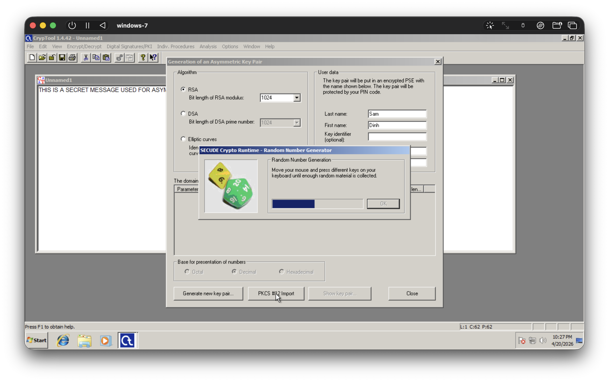

- Sau khi tạo cặp khóa thành công, ta sẽ có thông báo về việc tạo cặp khóa thành công.
    - Hoàn thành trong khoảng 7.125 giây.


- Bấm chọn **Show key pair...** để xem cặp khóa vừa tạo.

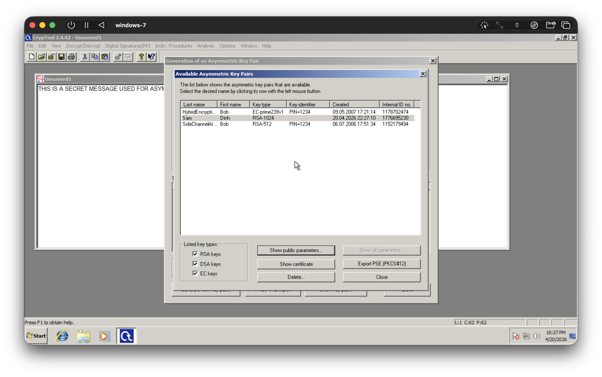

- Có thể chọn **Export PSE (PKCS#12)** để lưu trữ.

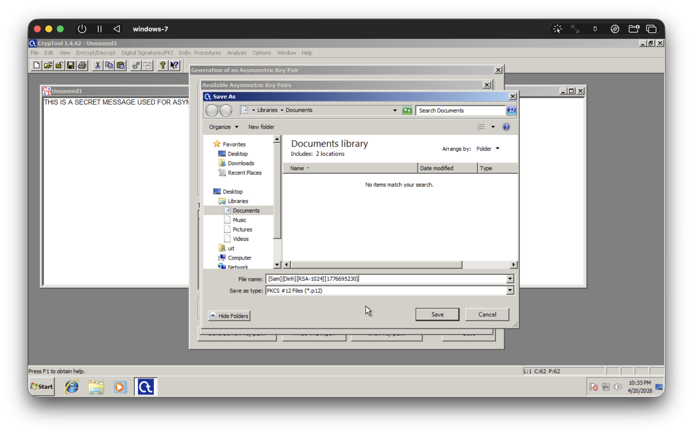

## Mã Hóa Văn Bản Với Public Key 

- Chọn **Encrypt/Decrypt** → **Asymmetric** → **RSA** → **Encryption**.
    - Chọn key vừa tạo.

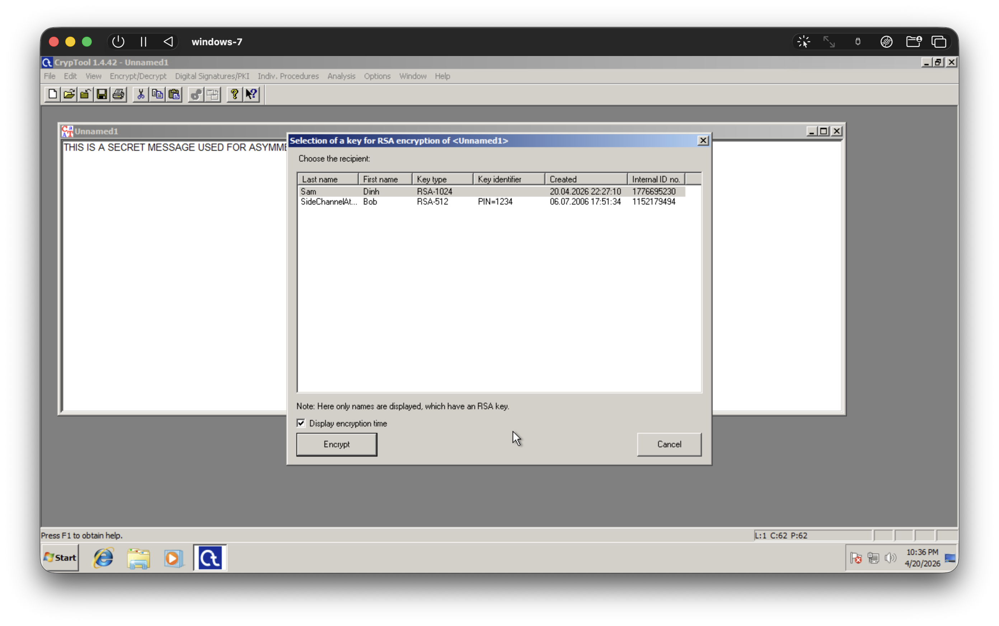

- Mã hóa thành công, trong chưa tới 1 giây

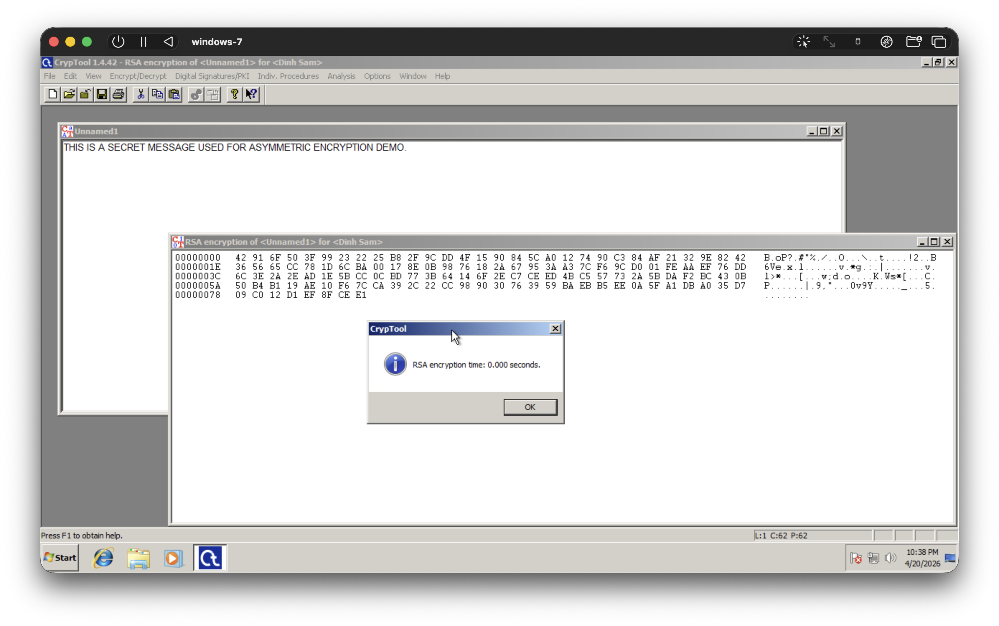

## Giải Mã Với Private Key

- Chọn **Encrypt/Decrypt** → **Asymmetric** → **RSA** → **Decryption**.
    - Chọn key vừa tạo cần dùng.
    - Điền vào mã PIN khi tạo key.

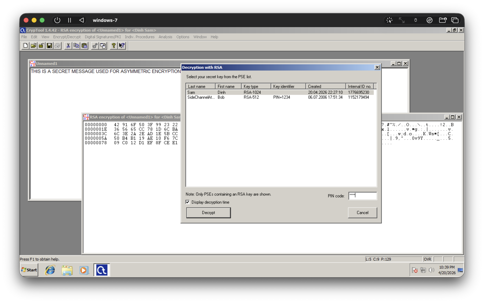

- Kết quả giải mã:
    - Văn bản gốc ở bên phải.
    - Hoàn thành trong 0.016 giây.

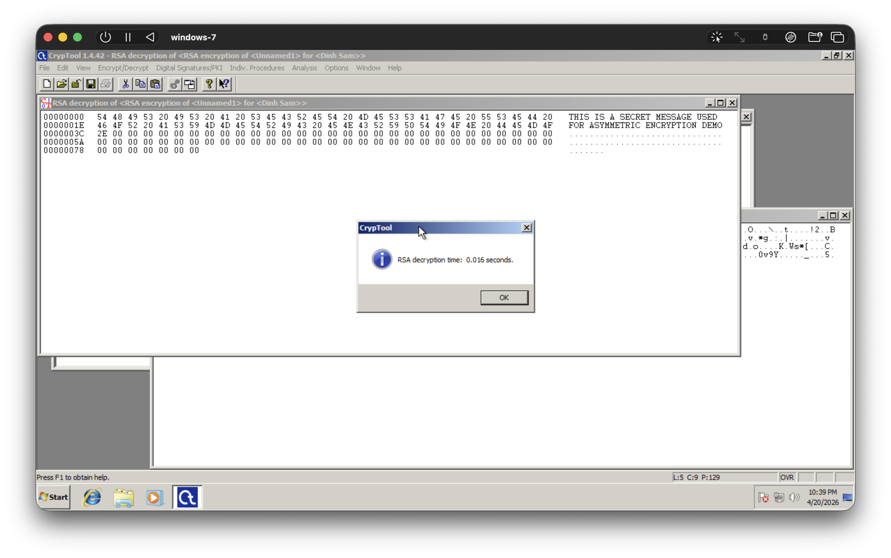

- Lưu ý: Nếu không điền đúng mã PIN, nhận thông báo lỗi.

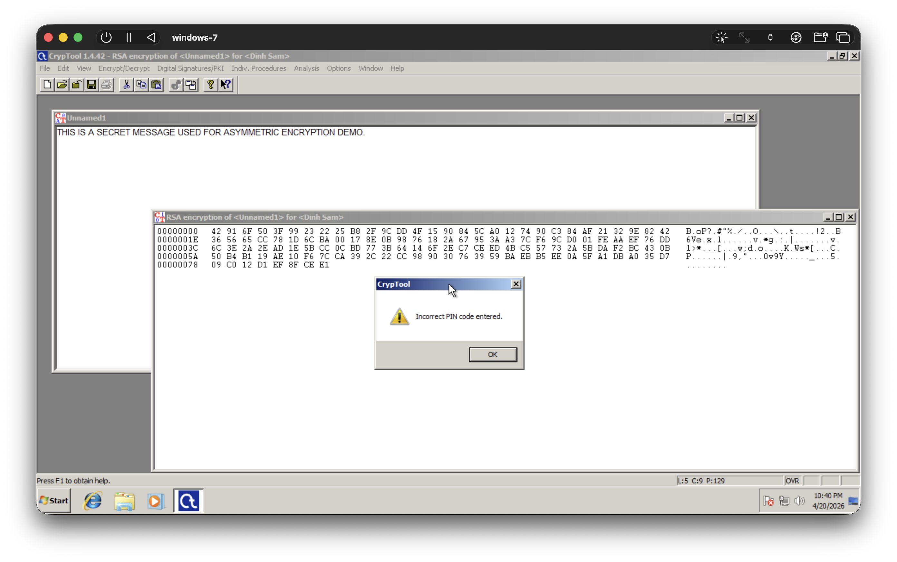

## Thử Nghiệm Với Độ Dài Bit 2048

- Tạo mã key mới với cùng thông tin nhưng khác về độ dài bit.
    - Độ dài bit: 2048

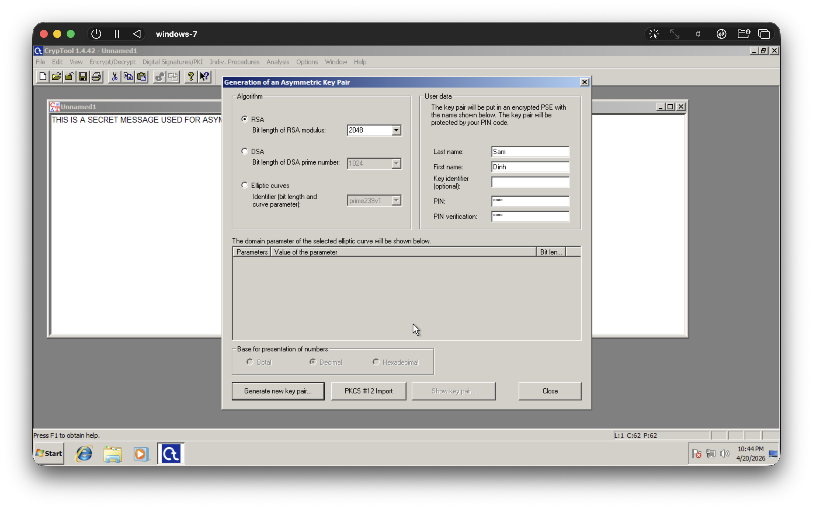

- Thông báo tạo cặp key mới hoàn thành: 3.656 giây.

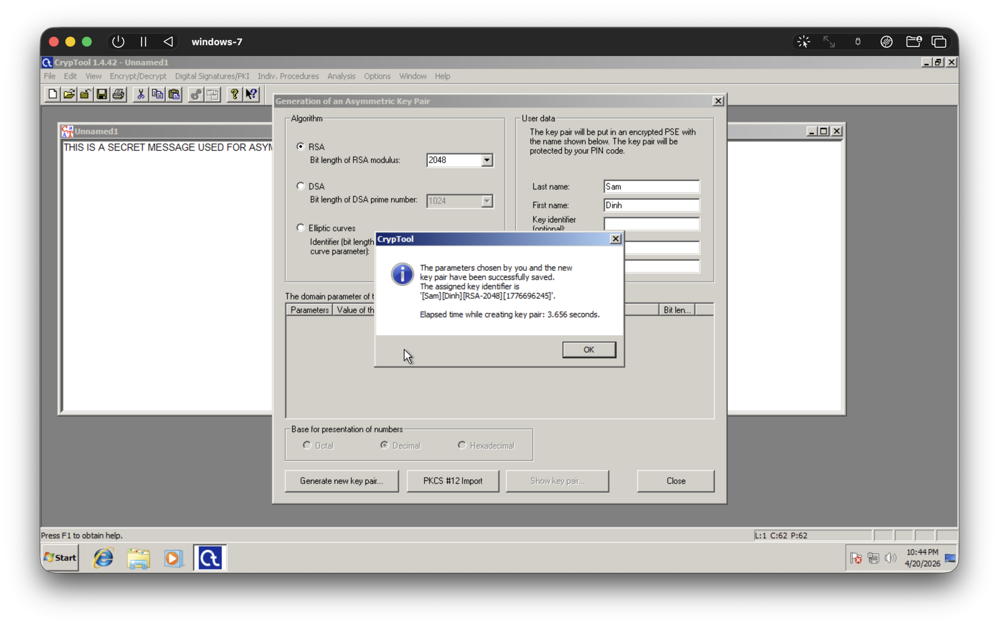

- Mã key mới đã sẵn sàng: Sam Dinh RSA-2048


- Mã hóa văn bản gốc với key RSA 2048 bit.

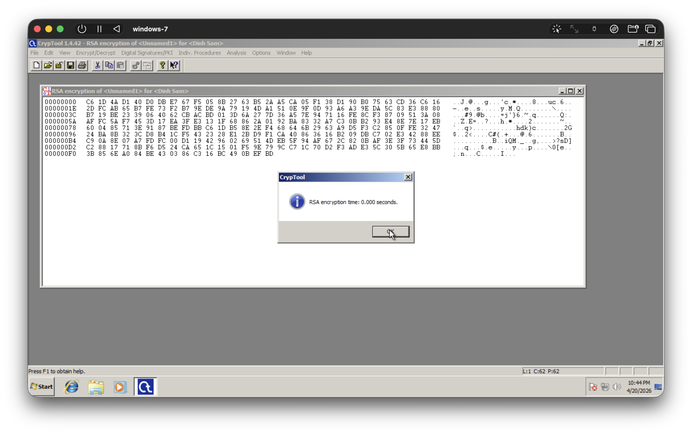

- Giải mã với key RSA 2048 bit: nhập mã PIN đã dùng.

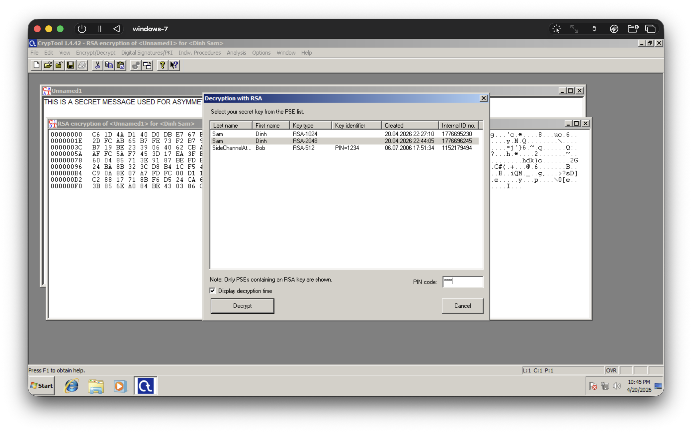

- Kết quả giải mã: Hoàn thành trong 0.046 giây.

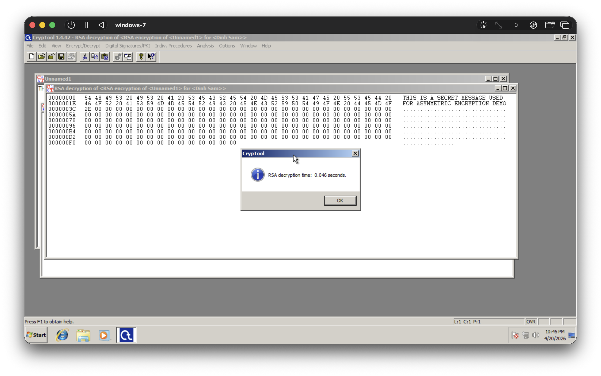

- Như vậy, có sự chênh lệch đáng kể khi giải mã với key RSA 1024 bit và 2048 bit.
    - 1024: 0.016 giây
    - 2048: 0.046 giây
    - Gấp khoảng 3 lần.
