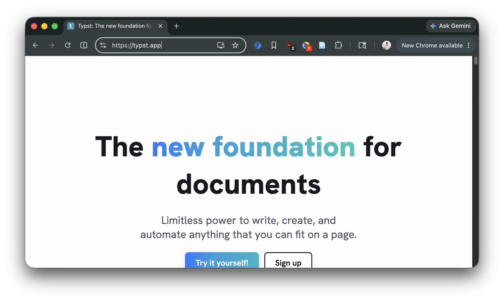
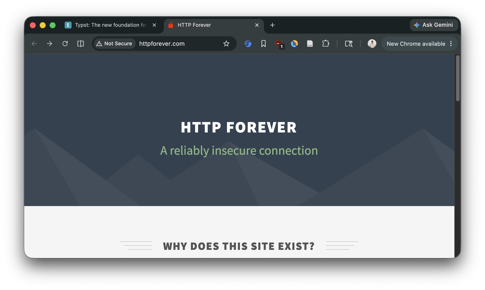
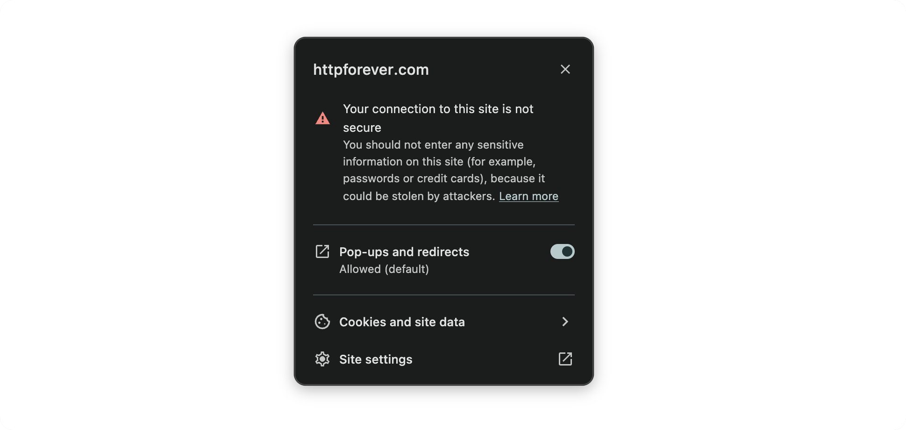

# TIẾT 3. RỦI RO WI-FI CÔNG CỘNG & HTTPS

## Bài 6. Kiểm tra HTTPS trên Wi-Fi công cộng

- Bước 1: Kết nối vào Wi-Fi công cộng (nếu có) (Nếu không có, dùng Wi-Fi bất kỳ)
- Bước 2:
  - Mở trình duyệt:
    - Truy cập 1 trang HTTPS
    - Truy cập 1 trang HTTP (hoặc demo)

Trang có HTTPS:

- [https://typst.app](https://typst.app)
- Thông báo: HTTPS kết nối an toàn.

Trang không có HTTPS (chỉ có HTTP):

- [http://httpforever.com/](http://httpforever.com/)
- Thông báo: Not Secure (Không an toàn)

### Câu hỏi phân tích

> Điều gì có thể xảy ra nếu đăng nhập tài khoản trên HTTP?

Khi truy cập website với HTTP (không có $S$(ecured)), người dùng có nguy cơ bị lộ dữ liệu với bất kỳ dữ liệu nào được chuyển đi/trao đổi trong quá trình sử dụng website đó.

Lý do:

- Kết nối với website được sử dụng giao thức HTTP nhưng không có thêm một lớp mã hóa $S$ (Secured Layer) như ở HTTPS, khi đó toàn bộ dữ liệu trao đổi, gửi/nhận từ người dùng, hay chính xác hơn là ứng dụng duyệt web và webserver là ở dạng văn bản thô, không mã hóa.
- Kẻ tấn công có thể dễ dàng bắt các gói tin và ghép nối các khối dữ liệu (payload), và từ đó đọc được toàn bộ nội dung trao đổi giữa người dùng và website, bao gồm: thông tin tài khoản, mật khẩu, thông tin cá nhân, thông tin giao dịch, v.v. 

Khuyến nghị:

- Không truy cập hoặc sử dụng các website chỉ dùng HTTP.
- Nếu cần thiết phải truy cập website dùng HTTP, không trao đổi các dữ liệu quan trọng: tên người dùng, mật khẩu, các thông tin thanh toán, thông tin cá nhân, vv...
- Trong trường hợp website sử dụng HTTPS nhưng vẫn nhận cảnh báo "Not Secure", không truy cập hoặc sử dụng website đó. Hoặc kiểm tra lại các chứng chỉ SSL/TLS của website đó, tránh trường hợp giả mạo, DNS spoofing, man-in-the-middle, v.v. 
