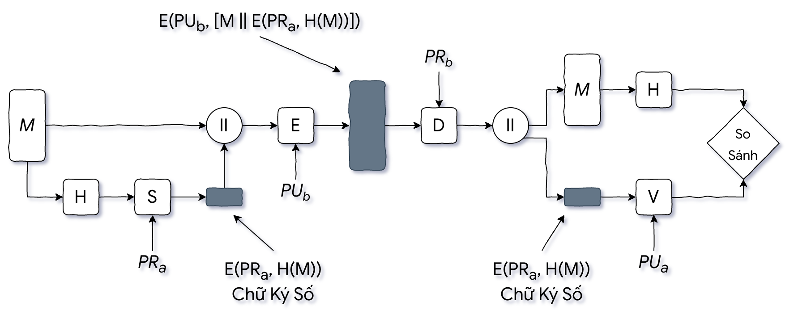

# Câu 3. Mô Hình Chứng Thực Dữ Liệu

- Dựa trên 6 công dụng của hàm băm trong bài học:
    - Xây dựng 1 mô hình có:
        - bảo mật
        - chứng thực
        - chữ ký số.
    - Phân tích hoạt động.
    - Nêu ưu nhược điểm của mô hình này.

## Tiêu Chí

- Đảm bảo an toàn cho cả thông điệp và chữ ký số.

Trích:

```{=typst}
- CHAPTER 11 / CRYPTOGRAPHIC HASH FUNCTIONS #cite(<cryptographyandnetworksecurity>, form: "normal", supplement: "p. 343")
```

> The hash value must be transmitted in a secure fashion. That is, the hash value must be protected so that if an adversary alters or replaces the message, it is not feasible for adversary to also alter the hash value to fool the receiver. This type of attack is shown in Figure 11.2b. In this example, Alice transmits a data block and attaches a hash value. Darth intercepts the message, alters or replaces the data block, and calculates and attaches a new hash value. Bob receives the altered data with the new hash value and does not detect the change. To prevent this attack, the hash value generated by Alice must be protected.

## Sơ Đồ Trực Quan



## Miêu Tả Hoạt Động

- Ký $S$: Người gửi $A$ sử dụng Khóa Riêng Tư ($PR_a$) để tạo Chữ Ký Số cho thông điệp.
    - Điều này đảm bảo mỗi thông điệp có một chữ ký số riêng biệt.
    - Đồng thời đảm bảo chỉ có người gửi gốc mới có Khóa Riêng Tư đúng.
- Mã Hóa $E$: Thông Điệp + Chữ Ký Số được mã hóa với Khóa Công Khai của người nhận $B$ ($PU_b$).
    - Khi mã hóa với $PU_b$, chỉ người nhận đúng có $PR_b$ mới có thể giải mã được.
- Giải Mã $D$:
    - Người nhận $B$ sử dụng Khóa Riêng Tư ($PR_b$) để giải mã và nhận lại thông điệp + Chữ Ký Số.
- Xác Thực $V$:
    - Người nhận $B$ sử dụng Khóa Công Khai của người gửi $A$ ($PU_a$) để xác thực/verify Chữ Ký Số để đảm bảo thông điệp là toàn vẹn và đúng người gửi.

## Ưu và Nhược:

- Ưu:
    - Đảm bảo các tiêu chí đề bài đưa ra: chữ ký số ($S$); chứng thực ($V$); bảo mật ($E$).
- Nhược:
    - Chậm vì sử dụng cặp mã khóa bất đồng bộ, không phù hợp với các ứng dụng real-time.

## Ứng Dụng

- Phù hợp các ứng dụng trao đổi thông tin yêu cầu về bảo mật và chứng thực, nhưng không cần thời gian thực, ví dụ gửi/nhận email/file, có độ trễ chấp nhận được, đặc biệt đề cao tính pháp lý của thông điệp và quan hệ gửi/nhận.
