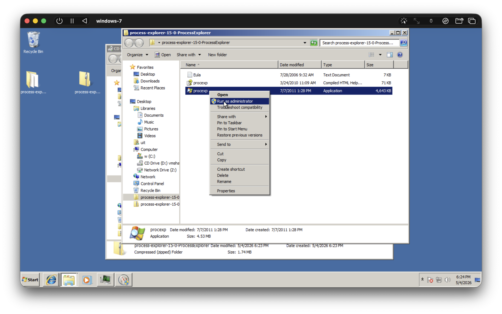
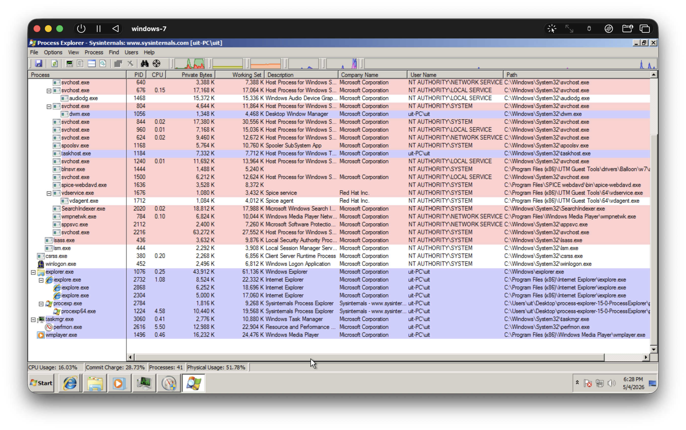

# PHẦN C. KIỂM TRA VÙNG NHỚ ỨNG DỤNG VỚI PROCESS EXPLORER

## C1 – Tải Và Chạy Process Explorer

1. Truy cập: [learn.microsoft.com/sysinternals/downloads/process-explorer](https://learn.microsoft.com/sysinternals/downloads/process-explorer)
2. Giải nén file ZIP.
3. Chạy **procexp.exe** (*Run as Administrator*).

## C2 – Quan Sát Cây Tiến Trình

1. Mở Process Explorer.
2. Nhận diện tiến trình bị tô màu tím, xanh lá, xanh dương (theo chuẩn Sysinternals).
3. Giải thích:
    - Màu xanh lá: tiến trình mới tạo
    - Màu xanh dương: tiến trình đang chạy
    - Màu đỏ: tiến trình mới đóng

Cây Tiến Trình:

- Vòng đời Tiến trình bắt đầu với màu Xanh Lá, sau đó chuyển sang màu Xanh Dương, và cuối cùng kết thúc là màu Đỏ.
- Một tiến trình có thể gọi/chạy một tiến trình khác, tạo thành Cây Tiến Trình.
    - Ví dụ: *explorer.exe* gọi/chạy *iexplore.exe* được biểu diễn bằng sự thụt lề của *iexplore.exe* so với *explorer.exe*.

## C3 – Phân Tích Memory Của Notepad

1. Mở Notepad.
2. Gõ 1 đoạn text ví dụ: “password=12345678” (dùng dữ liệu giả).
3. KHÔNG lưu file.
4. Trở lại Process Explorer → chuột phải vào notepad.exe → Properties.
5. Chọn tab “Memory”.
6. Quan sát các vùng Private Bytes, Working Set, Heap…
7. Chụp màn hình.

Ghi nhận:

→ Dữ liệu “password=12345678” tồn tại trong RAM dù không lưu file.

## C4 – Kiểm Tra Chuỗi Ký Tự Trong Bộ Nhớ Notepad

Trong Process Explorer → Properties → tab “Strings”.

- Tìm các đoạn text ứng dụng đang xử lý.
- Ghi nhận: có thể tìm thấy nội dung vừa gõ.
