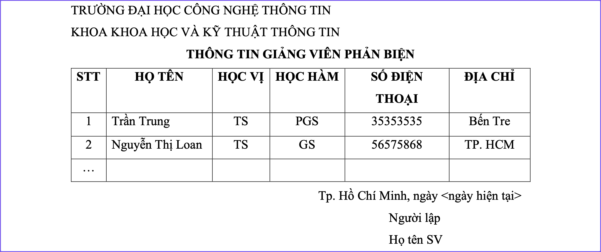
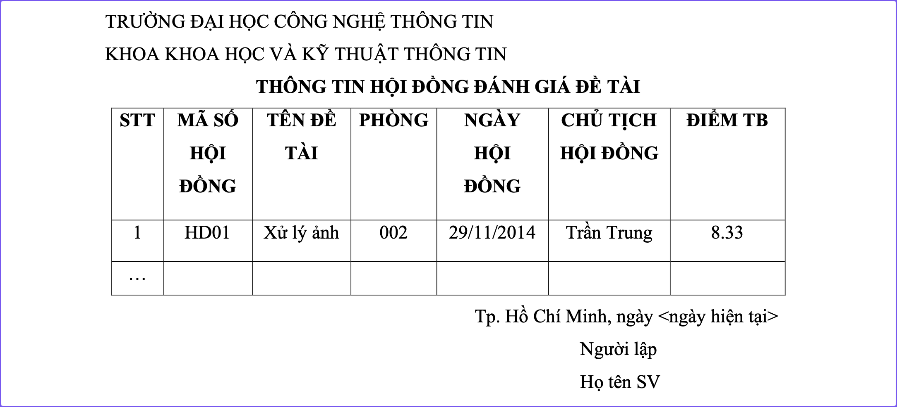

# Câu 4. Trình Bày Thông Tin

Dùng Crystal Report (Trên Windows) hoặc Tableau (Trên MAC) để thiết kế các Reports như sau:

1. Thông tin GV phản biện.

2. Thông tin hội đồng đánh giá đề tài.

## Thông Tin GV Phản Biện

(Trình bày ở đây)

## Thông Tin Hội Đồng Đánh Giá Đề Tài

(Trình bày ở đây)
