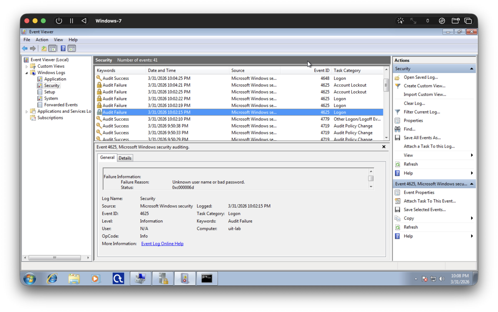
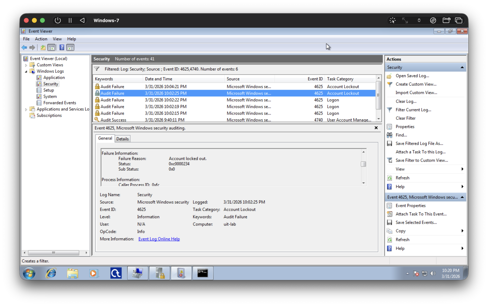
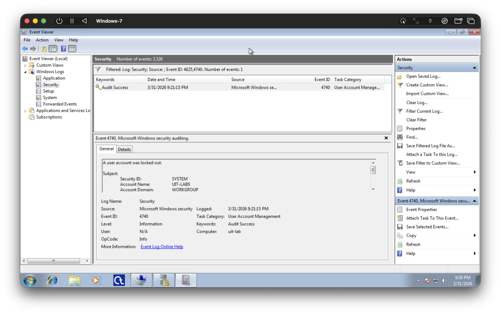

# Bước 4. Quan Sát Nhật Ký Sự Kiện (Event Viewer)

## Mục Tiêu

- Học cách phân tích log Security để phát hiện dấu hiệu tấn công dò mật khẩu.

## Hướng Dẫn

- Đăng nhập lại Windows bằng tài khoản có quyền quản trị (ví dụ: `AdminLab`).
- Mở Event Viewer: nhấn Windows + R → gõ `eventvwr.msc` → Enter.
- Trong khung bên trái, chọn: Windows Logs → Security.
- Ở khung bên phải, chọn: Filter Current Log…
- Trong cửa sổ Filter, tại mục Event IDs nhập: `4625,4740` rồi nhấn OK.
- Tìm các sự kiện có ID `4625` (*An account failed to log on*) liên quan đến tài khoản `UserTest`, mở chi tiết để xem lý do thất bại và nguồn đăng nhập (nếu có).
- Tìm sự kiện có ID `4740` (*A user account was locked out*) để xác định thời điểm tài khoản `UserTest` bị khóa và máy thực hiện hành động.

## Thực Hiện

Lưu ý:

- Windows 7 mặc định không ghi nhận event id 4625.
    - Cần sử dụng **Local Security Policy** để bật chức năng **Audit Logon**.
        - **Security Settings** → **Advanced Audit Policy Configuration** → **System Audit Policies - Local Group Policy Object** → **Logon/Logoff** → **Audit Logon**.
    - Khi đó, event 4740 sẽ không được sử dụng nữa.
    - Các thông báo liên quan đến sai mật khẩu khi đăng nhập, hoặc tài khoản bị khóa đều là id 4625, nhưng có **Task Category** là khác.
    - Các **Task Category** cho event id 4625 tương ứng:
        - Sai mật khẩu: **Logon**.
        - Khóa tài khoản: **Account Lockout**.

### Event ID 4625: Logon

- Có tối đa 3 event của event id **4625: Logon**.
    - Thông báo: "*Unknown user name or bad password.*"
    - Tài khoản `UserTest` bị nhập sai mật khẩu.
    - Điều này thể hiện rằng:
        - Người dùng đã nhập sai mật khẩu 3 lần.



- Nội dung của event **4625: Logon** ở dạng XML (có lược bỏ):
    - Chứa đủ các thông tin về:
        - Tên tài khoản bị khóa: `UserTest`
        - Thời gian xảy ra.
        - Và các thông tin khác.

```{=typst}
#figure(
  raw(read("code/b4-4625-01.xml"), lang: "xml", block: true),
  kind: raw,
  caption: [Bước 4. Event ID 4625: Logon],
)
```

### Event ID 4625: Account Lockout

- Ngay sau đó là các event id **4625: Account Lockout**.
    - Thông báo: "*Account locked out.*"
    - Tài khoản `UserTest` bị khóa sau 3 lần sai mật khẩu.



- Nội dung của event **4625: Account Lockout** ở dạng XML (có lược bỏ):
    
```{=typst}
#figure(
  raw(read("code/b4-4625-02.xml"), lang: "xml", block: true),
  kind: raw,
  caption: [Bước 4. Event ID 4625: Account Lockout],
)
```

### Event ID 4740: User Account Management

Thông tin:

- Đây là event ID khả dụng trước khi bật event ID 4625.
- Được thay thế bởi event ID **4625: Account Lockout**.

Nội dung:

- Event ID **4740: User Account Management**
    - Tài khoản `UserTest` bị khóa.
    - "A user account was locked out."
    - Account Name: UserTest
    - Logged: 3/31/2026 9:40:11 PM



- Chi tiết của event 4740 ở dạng XML (có lược bỏ):
    - Phần **EventData** chứa ít thông tin hơn event **4625: Account Lockout**.

```{=typst}
#figure(
  raw(read("code/b4-4740.xml"), lang: "xml", block: true),
  kind: raw,
  caption: [Bước 4. Event ID 4740: User Account Management],
)
```

### Bảng Tóm Tắt

- Với **Account lockout threshold** thành *3 invalid logon attempts*:
    - Lưu ý: **4740: User Account Management** được thay thế (tương đương) bởi **4625: Account Lockout**.

<!-- | STT | Threshold | Event ID | Task Category | Số Lượng |
|:---:|:---------:|:---------------:|:-------------:|:-------------:|
| 1 | 3 | 4625 | Logon | 3 |
| 2 | 3 | 4625 | Account Lockout | 1 |
| 3 | 3 | 4740 | User Account Management | 1 | -->

```{=typst}
#figure(
  table(
    columns: (10%, 15%, 15%, 45%, 15%),
    align: (center, center, center, left, center),
    [STT], [Threshold], [Event ID], [Task Category], [Số Lượng],
    [1], [3], [4625], [Logon], [3],
    [2], [3], [4625], [Account Lockout], [1],
    [3], [3], [4740], [User Account Management], [1]
  ),
  kind: table,
  caption: [Bước 4. Loại và Số Lượng Event ID (threshold = 3)]
)
```
