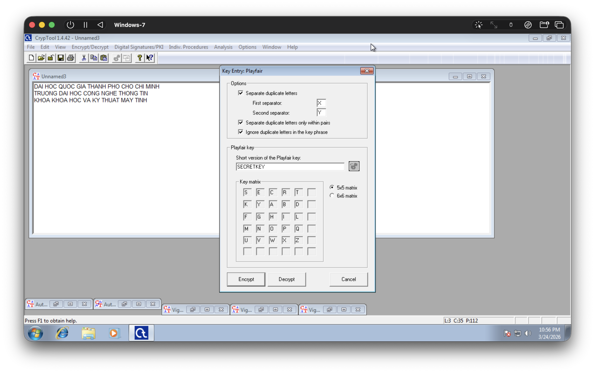
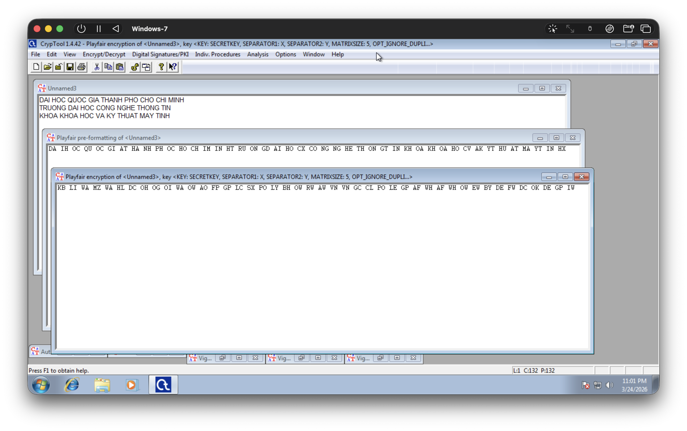
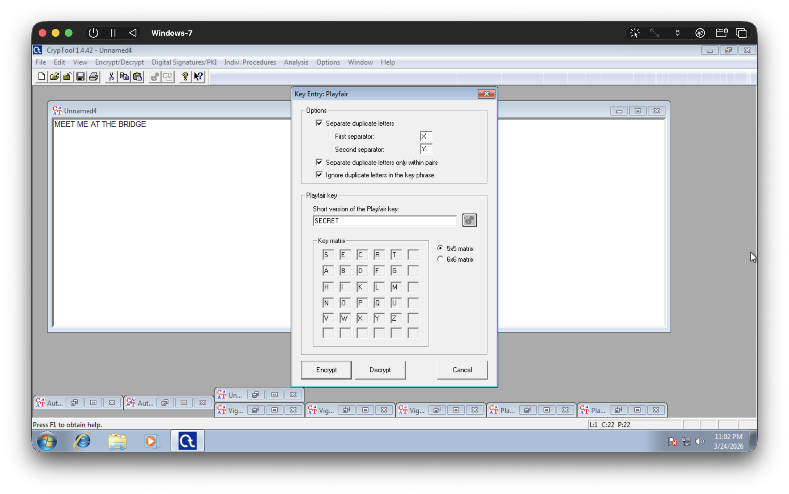
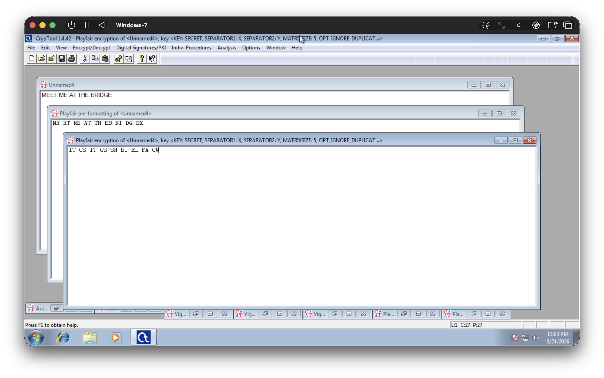
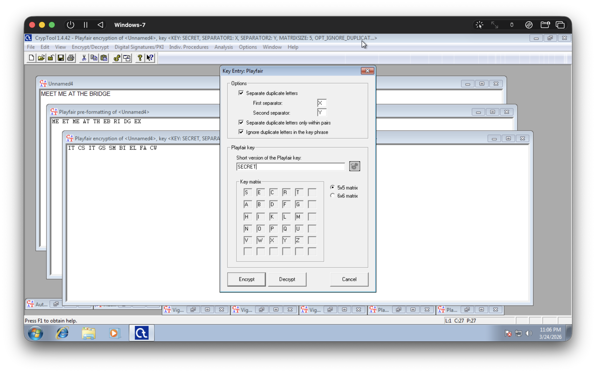
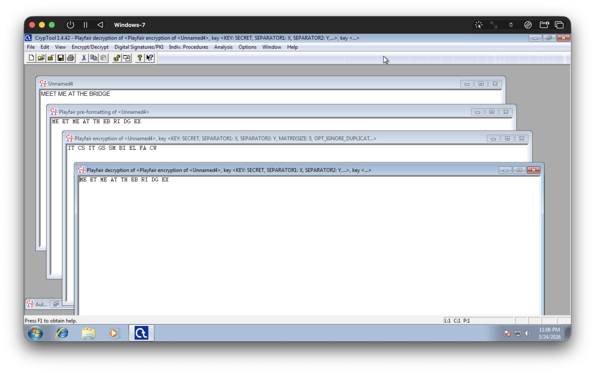

# BƯỚC 4 – Playfair Cipher

## Ma Trận Khóa

- Đây là ma trận $5 \times 5$ vì văn bản gốc chỉ chứa các ký tự chữ cái (tối đa 26 ký tự), không chứa ký tự số.
- Một ký tự sẽ được lược bỏ, thường là $J$ để chuỗi khóa vừa với tổng số 25 ký tự của ma trận khóa.

<!-- | **+** | **1** | **2** | **3** | **4** | **5** |
| :---: | :---: | :---: | :---: | :---: | :---: |
|   **1**   |   S   |   E   |   C   |   R   |   T   |
|   **2**   |   K   |   Y   |   A   |   B   |   D   |
|   **3**   |   F   |   G   |   H   |   I   |   L   |
|   **4**   |   M   |   N   |   O   |   P   |   Q   |
|   **5**   |   U   |   V   |   W   |   X   |   Z   | -->

```{=typst}
#figure(
  table(
  columns: (1fr,) * 6,
  align: (center, center, center, center, center, center),
  [#strong[\+]], [#strong[1]], [#strong[2]], [#strong[3]], [#strong[4]], [#strong[5]], [#strong[1]], [S], [E], [C], [R], [T], [#strong[2]], [K], [Y], [A], [B], [D], [#strong[3]], [F], [G], [H], [I], [L], [#strong[4]], [M], [N], [O], [P], [Q], [#strong[5]], [U], [V], [W], [X], [Z]
),
caption: [BƯỚC 4 – Ma Trận Khóa]
)
```
## Mã Hóa

- Menu **Encrypt/Decrypt $\to$ Symmetric (classic) $\to$ Playfair**.
- Cửa sổ **Key Entry: Playfair** hiện lên.
- Có thể chỉ định ký tự thay thế/phân tách:
    - $X$: mặc định.
    - $Y$: nếu cần thêm.
    - Chỉ chia tách khi có ký tự trùng trong cùng một cặp.
- Chỉ định kích thước ma trận:
    - $5 \times 5$ : được chọn, vì không chứa ký tự số.



- Kết quả:
    - Văn bản gốc được băm thành từng cặp.
    - Văn bản đã mã hóa.



## Meet Me At The Bridge

- Văn bản gốc `MEET ME AT THE BRIDGE`.
- Menu **Encrypt/Decrypt $\to$ Symmetric (classic) $\to$ Playfair**.



- Trong trường hợp này, văn bản gốc không đủ ký tự chẵn để tạo thành các cặp, nên cặp cuối cùng, CrypTool chèn thêm $X$ vào để thành cặp hoàn chỉnh:
    - `ME ET ME AT TH EB RI DG EX`

<!-- |  1  |  2  |     |  3  |  4  |     |  5  |  6  |     |  7  |  8  |     |  9  | 10  |     | 11  | 12  |     | 13  | 14  |     | 15  | 16  |     | 17  | 18  |
| :-: | :-: | :-: | :-: | :-: | :-: | :-: | :-: | :-: | :-: | :-: | :-: | :-: | :-: | :-: | :-: | :-: | :-: | :-: | :-: | :-: | :-: | :-: | :-: | :-: | :-: |
|  M  |  E  |     |  E  |  T  |     |  M  |  E  |     |  A  |  T  |     |  T  |  H  |     |  E  |  B  |     |  R  |  I  |     |  D  |  G  |     |  E  |  X  | -->

```{=typst}
#figure(
  table(
  columns: (1fr,) * 26,
  align: (center, center, center, center, center, center, center, center, center, center, center, center, center, center, center, center, center, center, center, center, center, center, center, center, center, center),
  [1], [2], [], [3], [4], [], [5], [6], [], [7], [8], [], [9], [10], [], [11], [12], [], [13], [14], [], [15], [16], [], [17], [18], [M], [E], [], [E], [T], [], [M], [E], [], [A], [T], [], [T], [H], [], [E], [B], [], [R], [I], [], [D], [G], [], [E], [X]
  ),
  caption: [BƯỚC 4 – Các Cặp Của Văn Bản Gốc]
)
```

- Kết quả:



- Tại cửa sổ text của văn bản đã mã hóa, chọn menu **Encrypt/Decrypt $\to$ Classic $\to$ Playfair**
    - Nhập vào key = `SECRET`



- Giải mã thành công.


