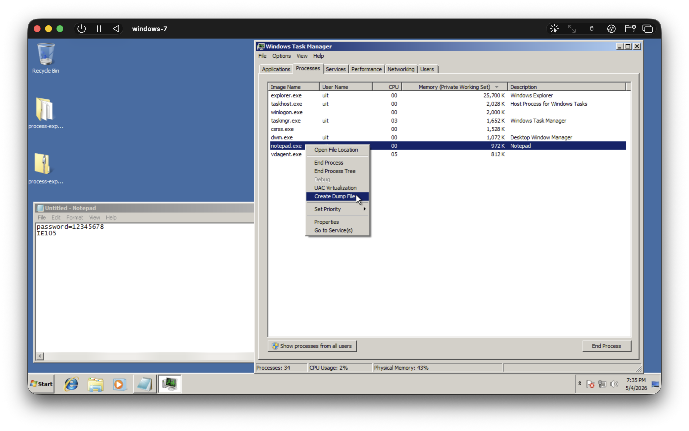
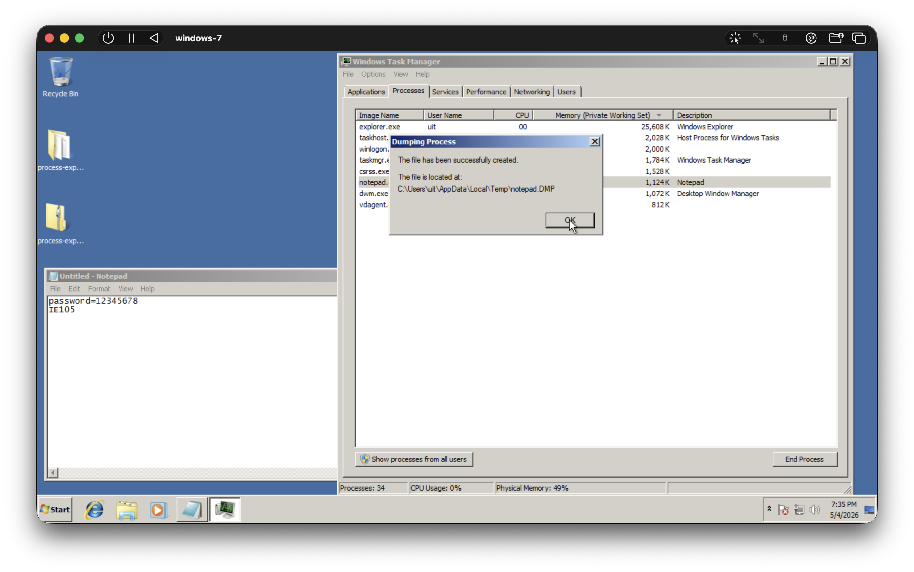
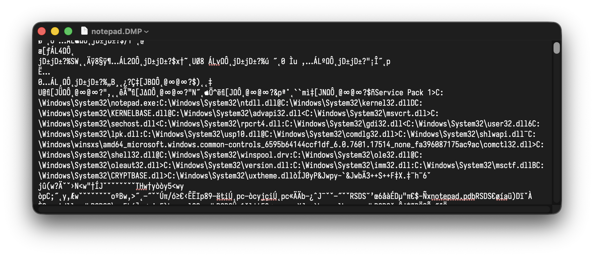
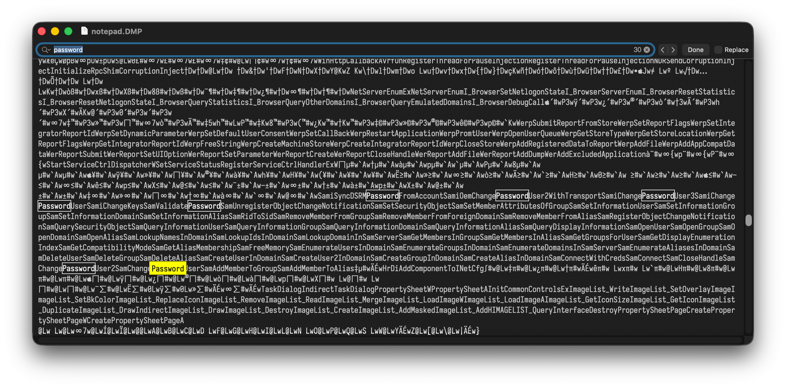
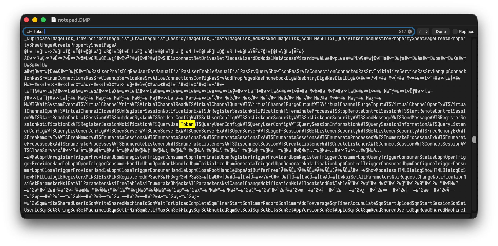
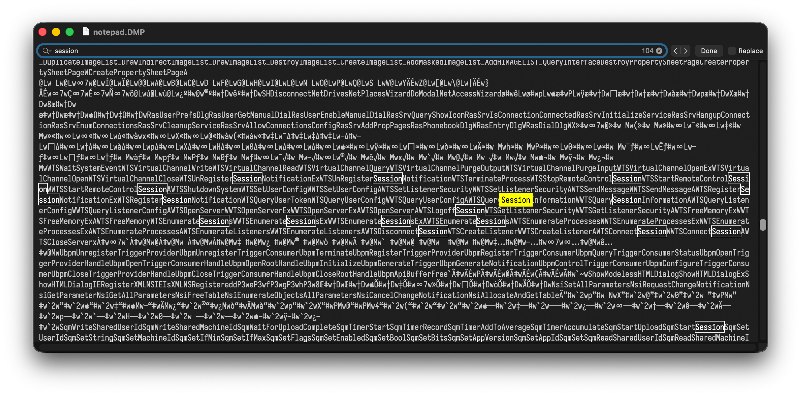

# PHẦN D. TẠO MEMORY DUMP CỦA MỘT TIẾN TRÌNH

> Phần D và E là phần tuỳ chọn. Sinh viên tự tìm hiểu cách thực hiện để hoàn thành nội dung này.

## D1 – Tạo Process Dump

Task Manager → tab Details → chuột phải tiến trình → Create dump file.



## D2 – Lưu File

Windows tạo file tại:

```
C:\Users\uit\AppData\Local\Temp\notepad.DMP
```



## D3 – Kiểm Tra File Dump

<!-- - Mở bằng Notepad++ hoặc Visual Studio.
- Tìm text:

```
password
token
session
``` -->

Có thể duyệt file .DMP và tìm thấy rất nhiều thông tin về tiến trình và các dữ liệu của tiến trình, bao gồm đường dẫn tới file thực thi, các thư viện được sử dụng, vv.. như các ví dụ dưới đây:



- password



- token



- session


