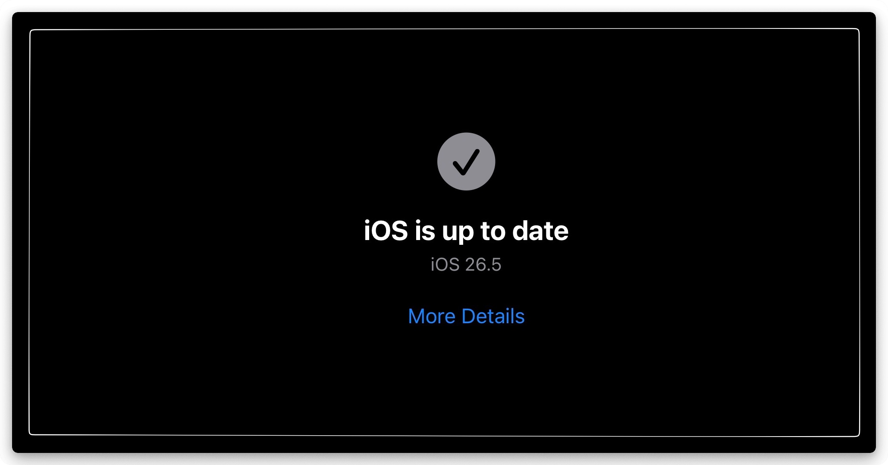
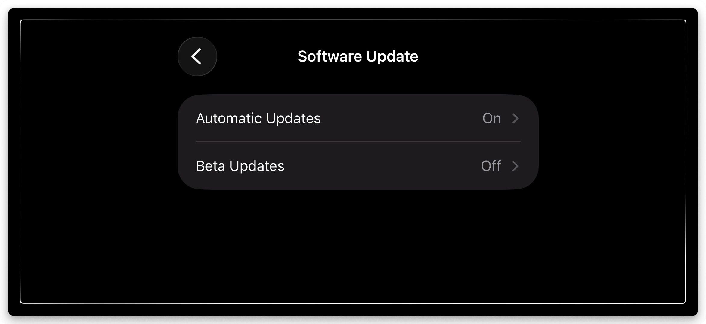
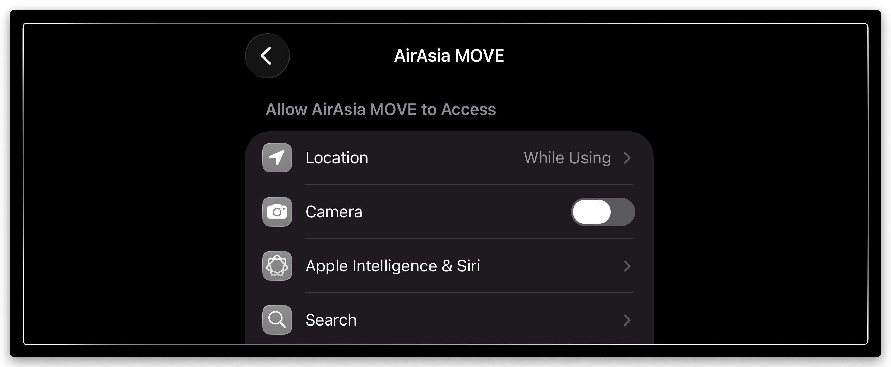
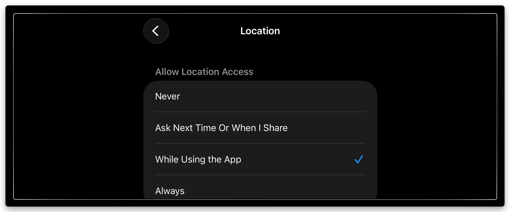

# TIẾT 4. BẢO MẬT THIẾT BỊ DI ĐỘNG (THỰC HÀNH BẮT BUỘC)

## Bài 8. Thiết Lập Khóa Màn Hình An Toàn

- PIN $\ge$ 6 số hoặc mật khẩu.
- Bật vân tay / FaceID (nếu có).
- Chụp màn hình mục cấu hình (không lộ mã).

Thiết bị: iPhone.

Mã Pin: 10111997

- 6 chữ số
- Luôn yêu cầu mã PIN ngay khi khóa màn hình.

Luôn yêu cầu FaceID cho bất kỳ tác vụ quan trọng nào:

- Mở khóa iPhone.
- Thanh toán.
- Điền mật khẩu.

## Bài 9. Kiểm Tra Cập Nhật Hệ Điều Hành

- Android: System Update
- iOS: Software Update

Thiết bị: iPhone

- Phiên bản iOS: mới nhất tại thời điểm hiện tại.

- Auto Update: bật. Đảm bảo luôn nhận thông báo về phiên bản mới nhất.

## Bài 10. Kiểm Soát Quyền Ứng Dụng

- Bước 1: Settings → Privacy → Location / Camera / Microphone
- Bước 2: Chọn 1 ứng dụng → chỉnh:
  - While using app / Ask every time
- Bước 3: Chụp màn hình

Ứng dụng: AirAsia MOVE

- Camera: Tắt.
  - Không có lý do gì để ứng dụng này có quyền truy cập camera trong khi chỉ dùng để mua vé máy bay.

- Location: While Using (the App).
  - Chỉ cho phép truy cập vị trí khi đang sử dụng ứng dụng, nhằm gợi ý các chuyến bay phù hợp với vị trí hiện tại.

