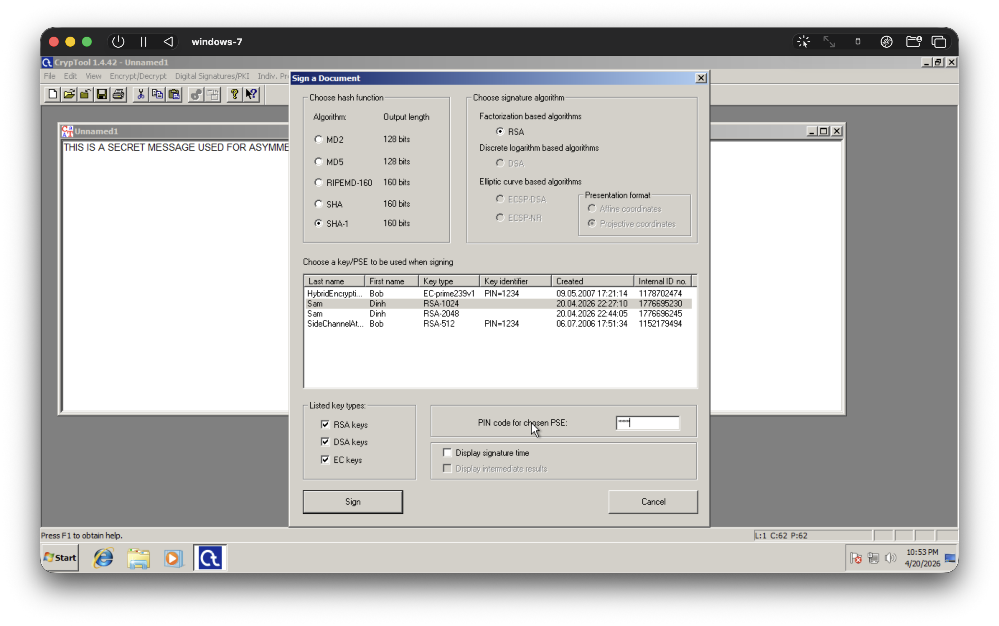
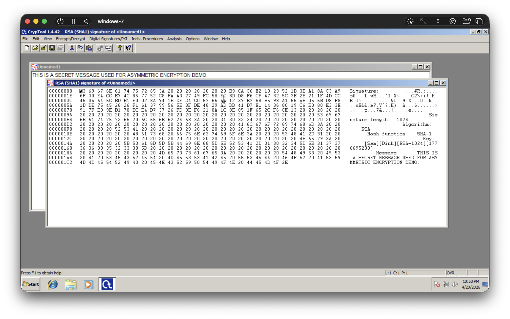
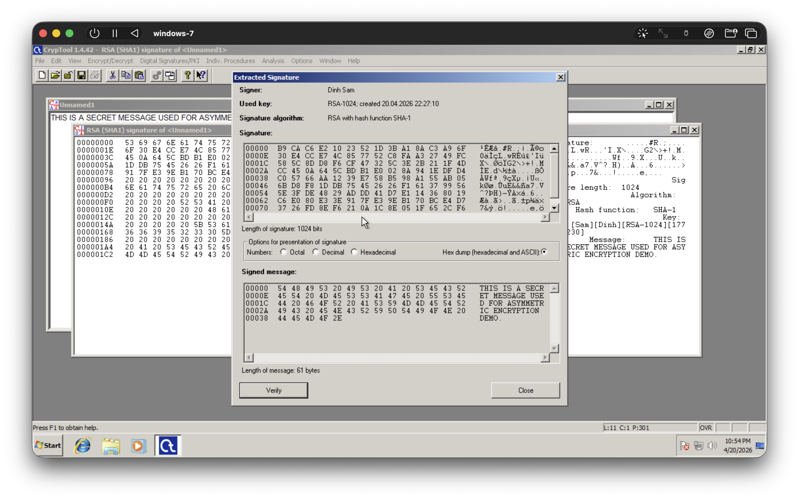
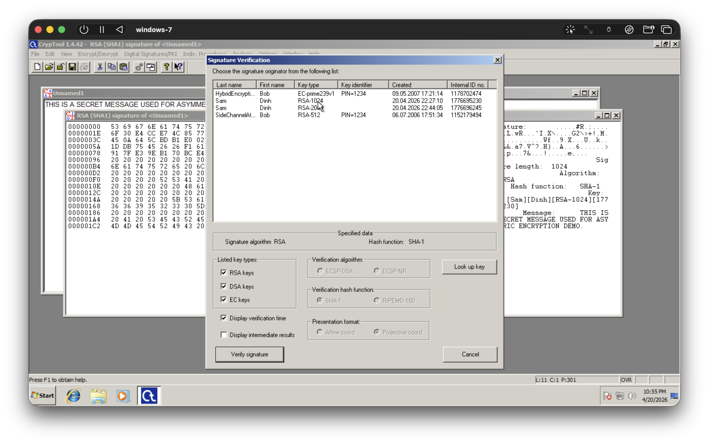
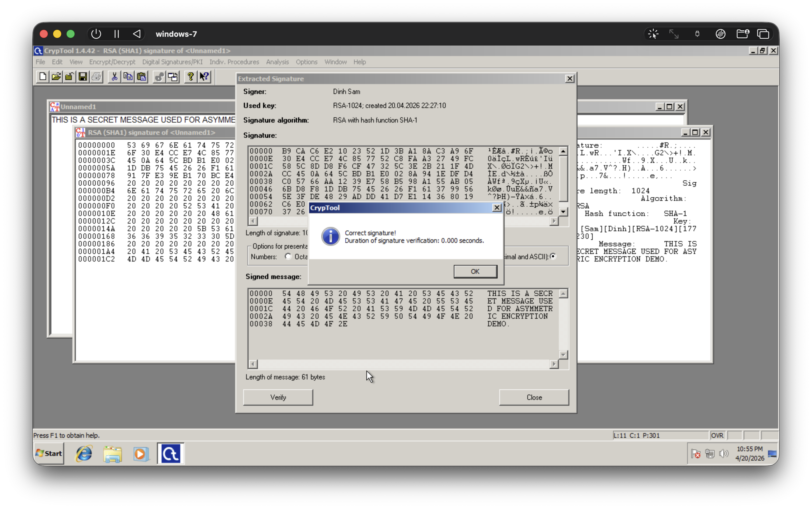
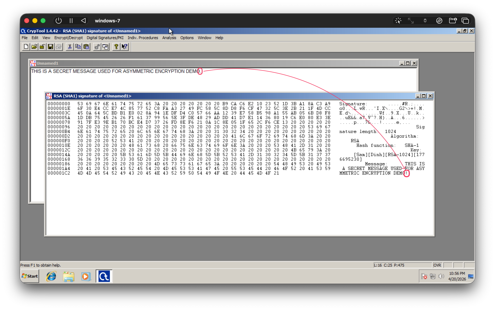
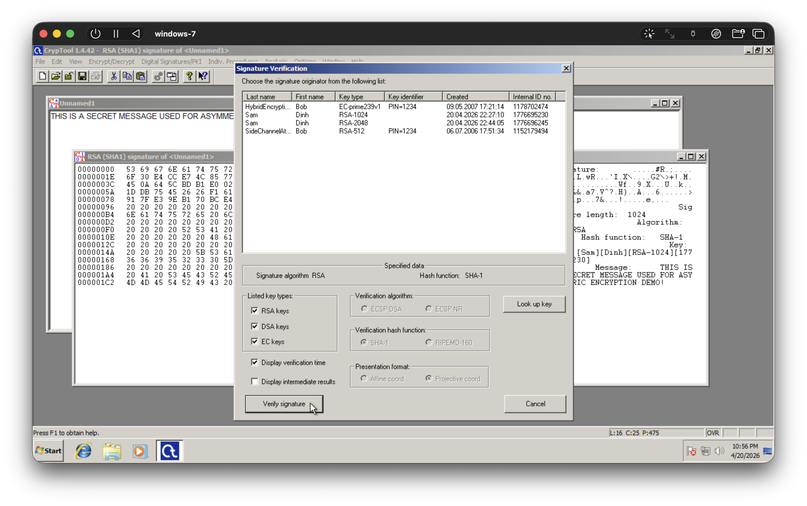
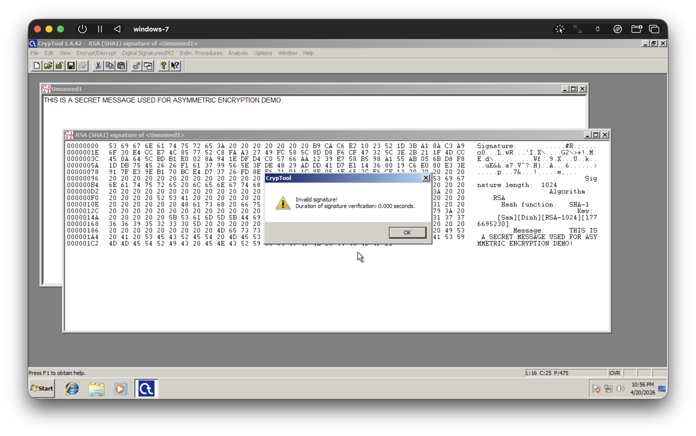

# Bước 4. Chữ Ký Số (Digital Signature)

## Sign Document

- Chọn **Digitals Signatures/PKI** → **Sign Document...**
  - Hash function: SHA1
  - Algorithms: RSA
  - PSE: Cặp khóa RSA-1024 bit vừa tạo.
  - PIN: 1234 (của cặp khóa vừa tạo).
  - Chọn **Sign**.

- Văn bản đã ký và chữ ký.

- Xem chữ ký vừa tạo ra.

## Verify Signature

- Chọn **Digitals Signatures/PKI** → **Verify Signature...**
  - Chọn RSA-1024 vừa tạo.
  - Xác nhận các thông số:
    - Algorithm: RSA
    - Hash function: SHA-1
  - Bấm **Verify signature**

- Kết quả xác nhận chữ ký.
  - Thành công: chữ ký đúng.

## Giả Lập Chữ Ký Sai

- Thay đổi 1 ký tự trong văn bản và tạo hash lại: Đổi dấu '.' thành dấu '!'.

- Chạy lại **Verify Signature** với văn bản đã thay đổi.

- Kết quả của chữ ký đã thay đổi: Sai.

