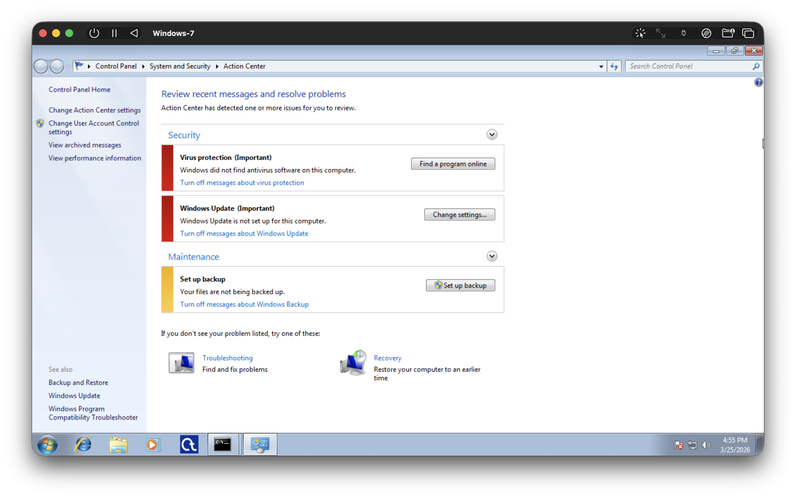
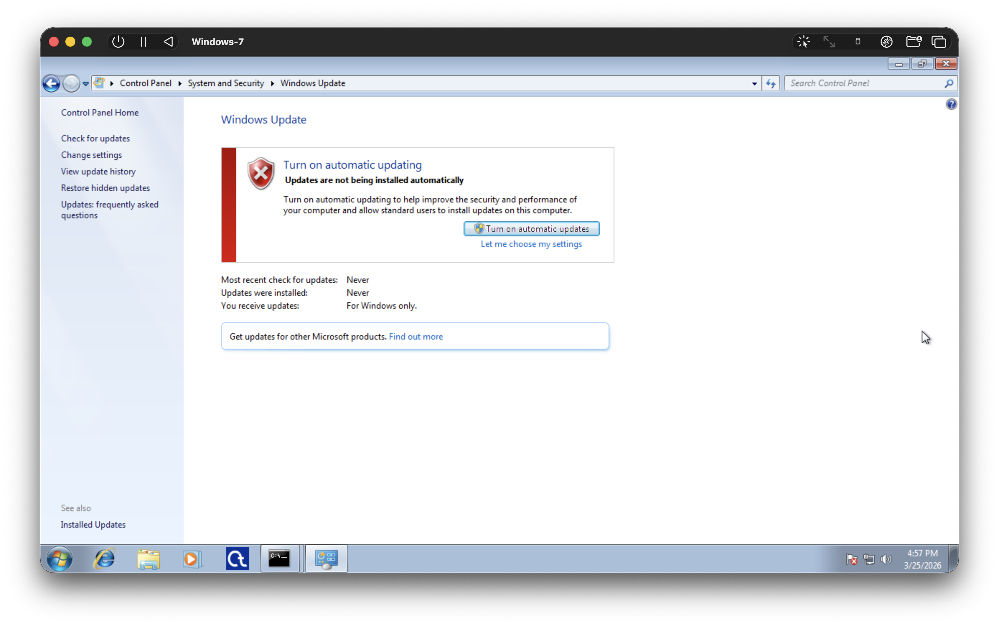

# Bước 5. Thay Đổi Chính Sách Khóa Tài Khoản Và So Sánh

## Bước 1. Kiểm tra trạng thái Antivirus

1. Start → Windows Security → Virus & threat protection.
2. Kiểm tra:
    - Real-time protection: ON?
    - Cloud protection: ON?

Kiểm tra:

- Real-time protection: OFF
- Cloud protection: OFF
- Hiện không có chương trình anti-virus nào được cài đặt.

## Bước 2. Kiểm tra Windows Update

1. Start → Settings → Update & Security → Windows Update.
2. Kiểm tra:
    - Có bản update nào đang chờ?
    - Hệ thống có bật Automatic Update không?

Kiểm tra:

- Hệ thống có bật Automatic Update không? Không, hiện Update đang được tắt.
- Có bản update nào đang chờ? Không.
    - Vì phiên bản Windows cơ bản đã bị ngừng hỗ trợ, và máy đang chạy với một môi trường không có internet.
    - Có thể sử dụng Windows Upgrade Catelog để tải thủ công một số update nếu cần.
        - https://www.catalog.update.microsoft.com/
        - Được miêu tả chi tiết hơn ở phần phụ lục.

