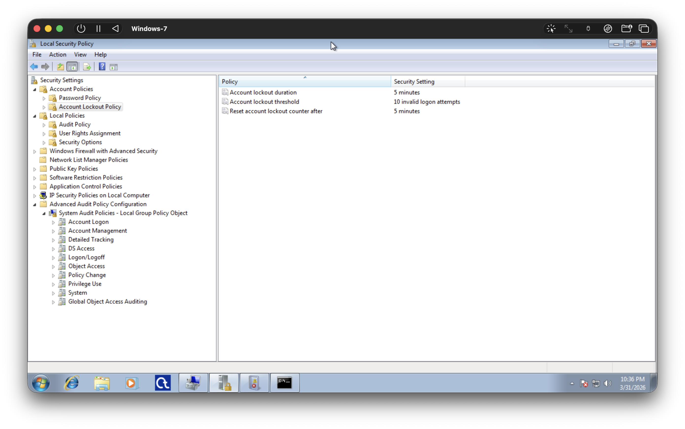
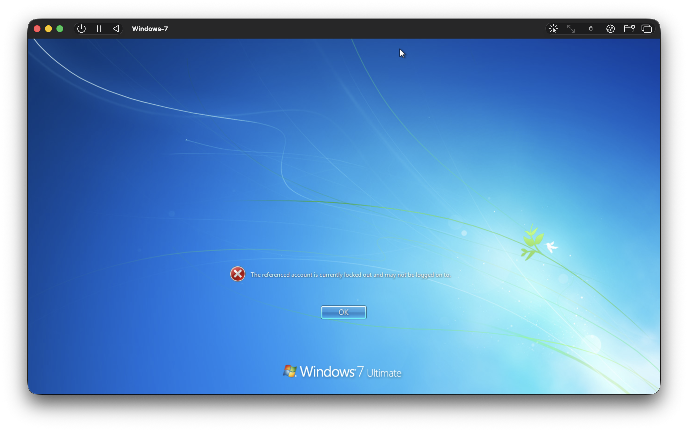
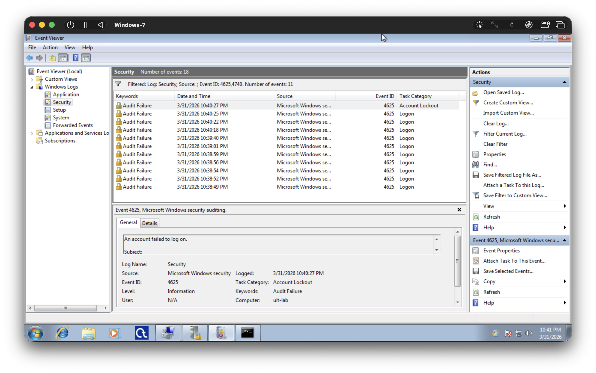

# Bước 5. Thay Đổi Chính Sách Khóa Tài Khoản Và So Sánh

## Mục Tiêu

- Thấy được mối liên hệ giữa cấu hình chính sách và mức độ an toàn.

## Hướng Dẫn

- Mở lại **Local Security Policy** (`secpol.msc`).
- Vào **Account Policies → Account Lockout Policy**.
- Thay đổi **Account lockout threshold**, ví dụ từ 3 → 10 *invalid logon attempts*.
- Đăng xuất và lặp lại quá trình thử mật khẩu sai cho `UserTest` như ở Bước 3, đếm số lần nhập sai trước khi tài khoản bị khóa.
- Quan sát lại log trong **Event Viewer** để xem số lượng sự kiện `4625` và sự kiện `4740` thay đổi như thế nào so với cấu hình trước.

## Thực Hiện

- Thay đổi **Account lockout threshold** thành *10 invalid logon attempts*.



- Thử đăng nhập sai 10 lần với tài khoản `UserTest`.
    - Tài khoản bị khóa sau lần thứ 10 nhập sai mật khẩu.



- Refresh cửa sổ **Event Viewer** và chúng ta thấy (đã có clear trước đó):
    - Chính xác *10* event **4625: Logon**. Và sau đó là
    - Có *1* event **4625: Accout Lockout**.
    - Điều này cho biết rằng hệ điều hành đã khóa tài khoản sau khi phát hiện có 10 lần đăng nhập không thành công liên tiếp.



## Bảng Tóm Tắt

- Sau khi thay đổi **Account lockout threshold** thành *10 invalid logon attempts*:

<!-- | STT | Threshold | Event ID | Task Category | Số Lượng |
|:---:|:---------:|:---------------:|:-------------:|:-------------:|
| 1 | 10 | 4625 | Logon | 10 |
| 2 | 10 | 4625 | Account Lockout | 1 | -->

```{=typst}
#figure(
  table(
    columns: (10%, 15%, 15%, 45%, 15%),
    align: (center, center, center, left, center),
    [STT], [Threshold], [Event ID], [Task Category], [Số Lượng],
    [1], [10], [4625], [Logon], [10],
    [2], [10], [4625], [Account Lockout], [1]
  ),
  kind: table,
  caption: [Bước 5. Loại và Số Lượng Event ID (threshold = 10)]
)
```

## Thảo Luận

- Khi *threshold = 3*: hệ thống nhạy với tấn công dò mật khẩu hơn.
    - Kẻ tấn công chỉ cần 3 lần nhập/thử sai để bị khóa tài khoản và mất/giảm cơ hội đoán mật khẩu.
    - Nhưng người dùng hợp lệ cũng dễ bị khóa tài khoản hơn nếu nhập sai mật khẩu cùng số lần.
- Khi *threshold = 10*: hệ thống ít nhạy hơn.
    - Kẻ tấn công cần tới 10 lần nhập sai để khóa tài khoản.
    - Nhưng người dùng hợp lệ có cơ hội để được sai mật khẩu nhiều lần hơn trước khi bị khóa.

Điều này yêu cầu người Quản Trị phải cân nhắc kỹ lưỡng khi cấu hình chính sách khóa tài khoản, đảm bảo rằng hệ thống đủ nhạy để phát hiện tấn công dò mật khẩu, nhưng không quá nhạy để khóa tài khoản của người dùng hợp lệ trong những trường hợp sai sót nhất định, ví dụ mật khẩu quá phức tạp và sai vài ký tự ở các lần thử khác nhau.

Threshold = 3 là một con số hợp lý, hoặc thậm chí dư thừa cho các môi trường doanh nghiệp, nhạy cảm với bảo mật và các sai sót. Vì ở môi trường doanh nghiệp, mật khẩu thường không phải là hình thức đăng nhập duy nhất, mà có thể có thêm các hình thức khác, ví dụ: Sinh Trắc Học (Vân Tay, Mống Mắt, vv..); Thẻ Từ Định Danh, vv...

Threshold = 10 là quá nhiều, kể cả cho máy tính người dùng cá nhân, vì vậy đây là một con số không hợp lý, hoặc nhẹ hơn là không cần thiết.
