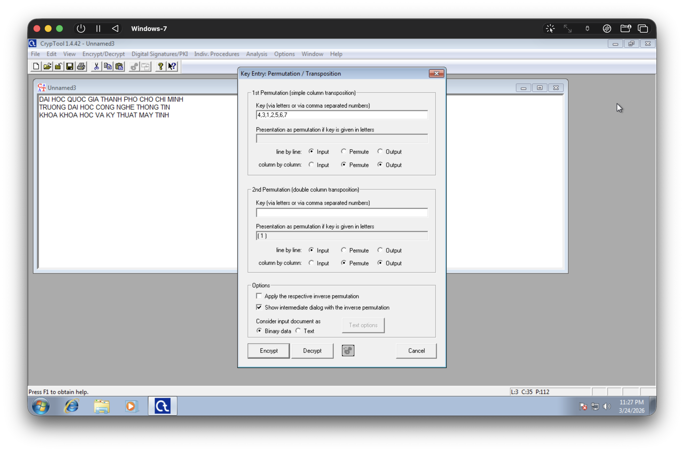
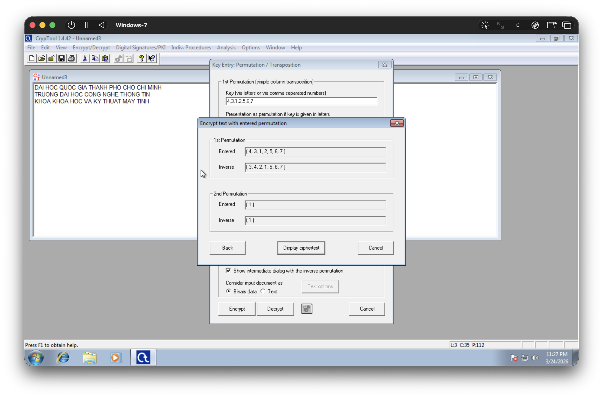
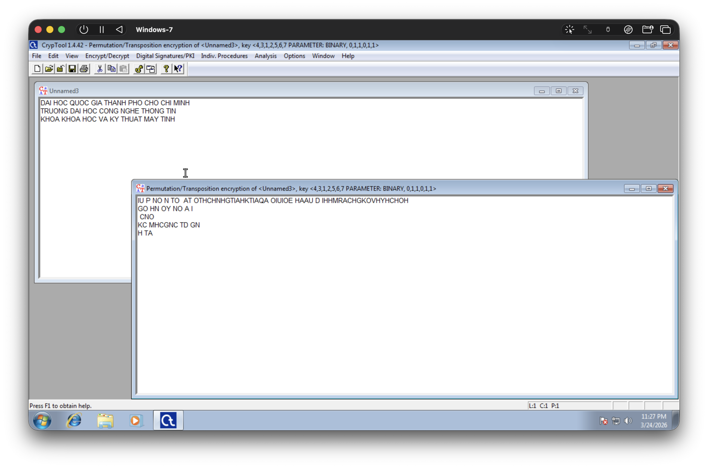
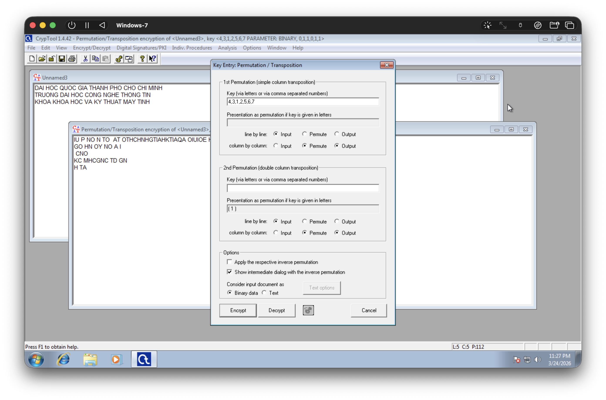
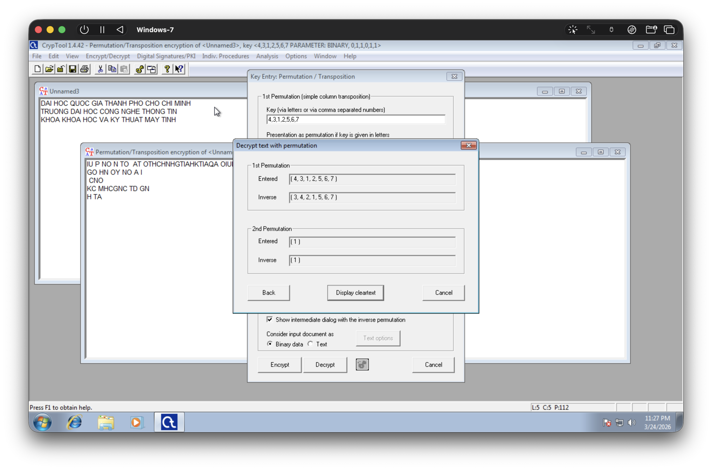
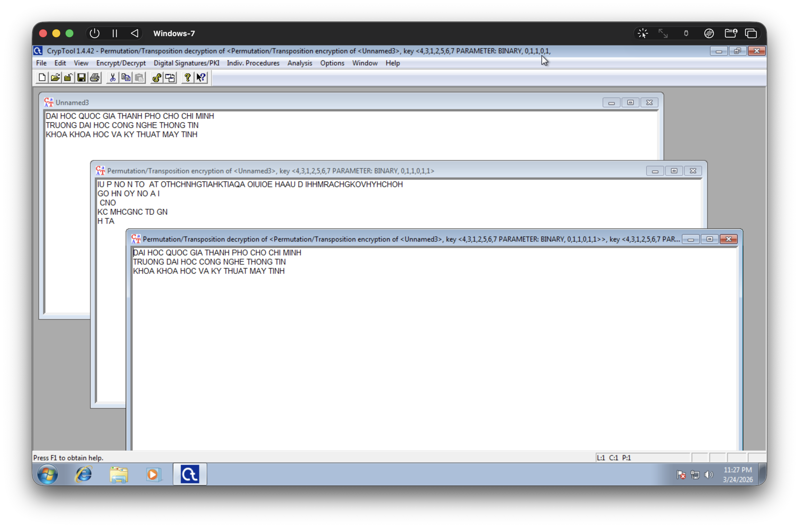
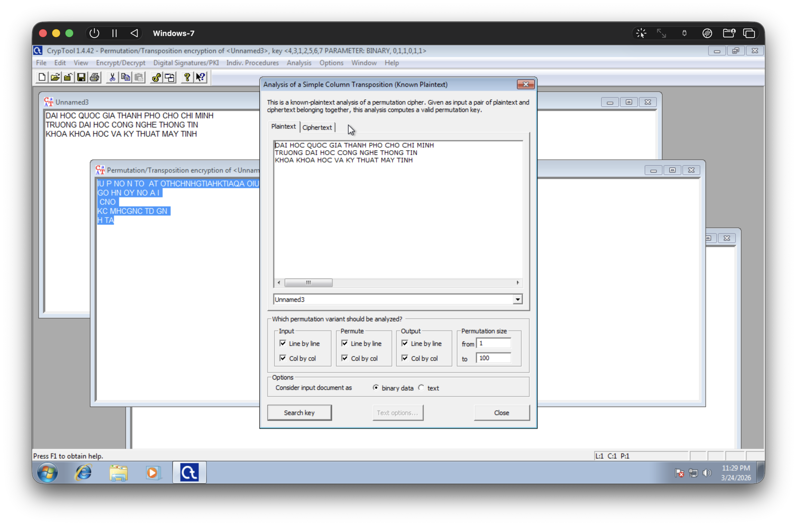
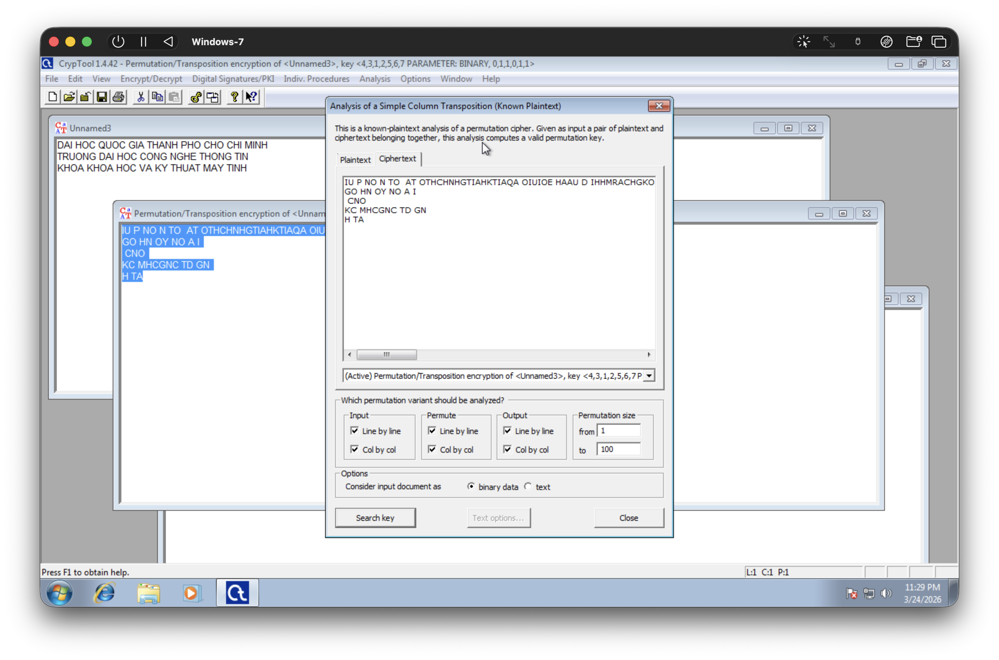
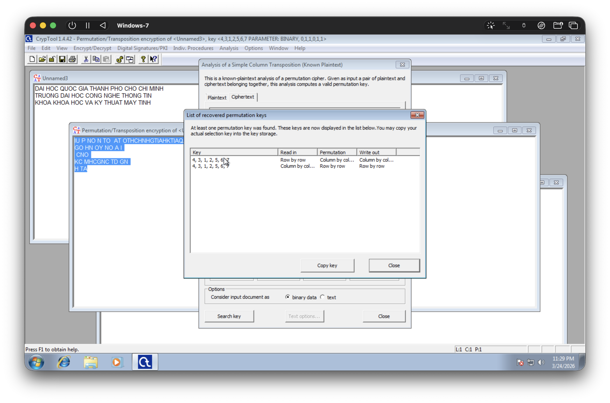
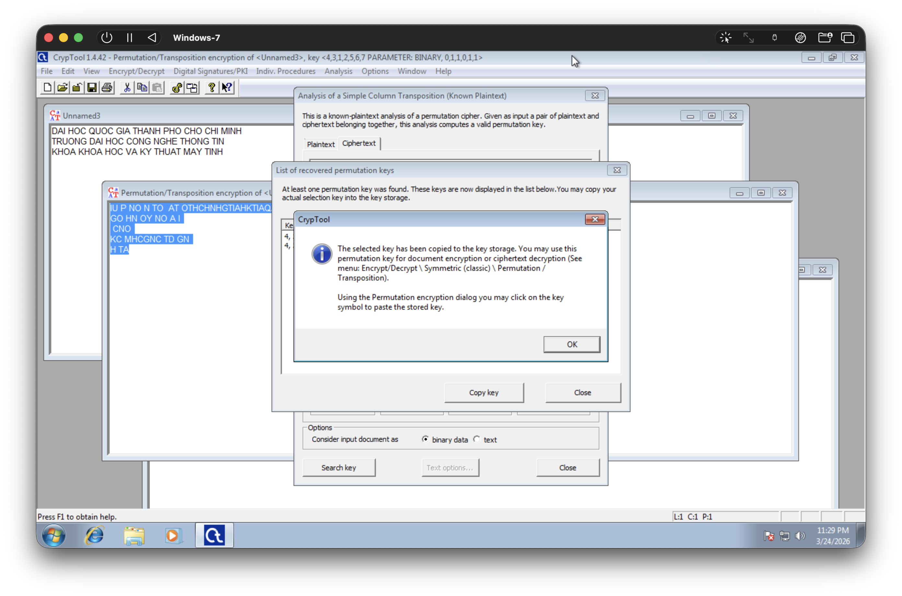

# BƯỚC 5 – Transposition Cipher

- Encrypt → Transposition → Columnar.
- Key: 4312567.
- Giải mã lại.
- Dùng Analysis → Transposition Analysis để phá mã.
- Tạo thêm 2 ví dụ khác để sinh viên thử nghiệm.

## Mã Hóa

- Menu **Encrypt/Decrypt $\to$ Symmetric (classic) $\to$ Permutation / Transposition**.
- Nhập vào chuỗi khóa đã cho, phân tách bằng dấu phẩy (,): `4,3,1,2,5,6,7`

- Chọn **Encrypt**.
    - Bảng mới hiện lên cho biết chuỗi khóa.
    - Chọn **Display ciphertext** để xem kết quả mã hóa.

- Kết quả mã hóa:

## Giải Mã

- Tại cửa sổ văn bản đã mã hóa, chọn menu **Encrypt/Decrypt $\to$ Symmetric (classic) $\to$ Permutation / Transposition**.
- Nhập vào mã khóa đã dùng trước đó: `4,3,1,2,5,6,7`
- Chọn **Decrypt**

- Cửa sổ mới hiện ra, thông báo các cài đặt giải mã.
    - Chọn **Display cleartext** để xem văn bản được giải mã (văn bản gốc).

- Kết quả: văn bản gốc được giải mã.

## Analysis

- Menu **Analysis $\to$ Symmetric (classic) $\to$ Simple Column Transposition**.
- Cửa sổ **Analysis of a Simple Column Transposition** hiện lên.
    - Chỉ định **Plaintext** và **Ciphertext** lần lượt bằng cách dùng menu xổ xuống và chọn cửa sổ tương ứng.

- Tương tự với **Ciphertext**

- Key được tìm ra, so sánh với key đã dùng trước đó: `4,3,1,2,5,6,7`

- Có thể copy key để phục vụ việc giải mã.

