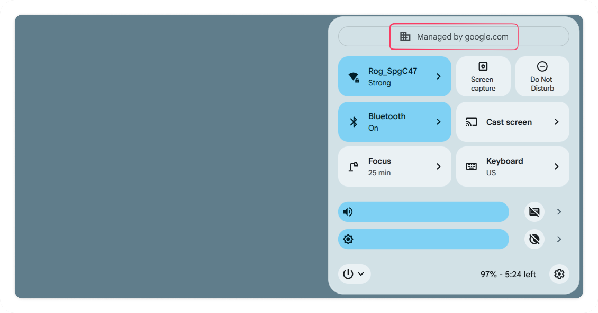
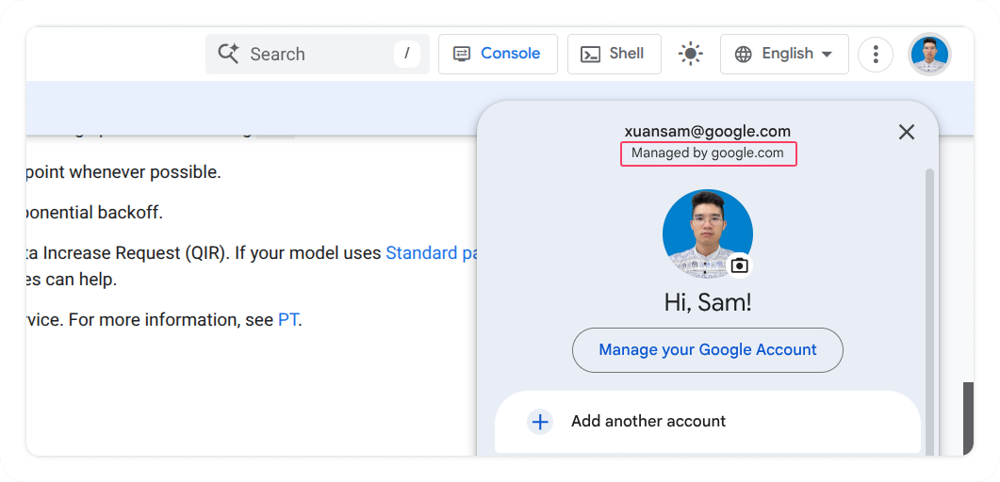
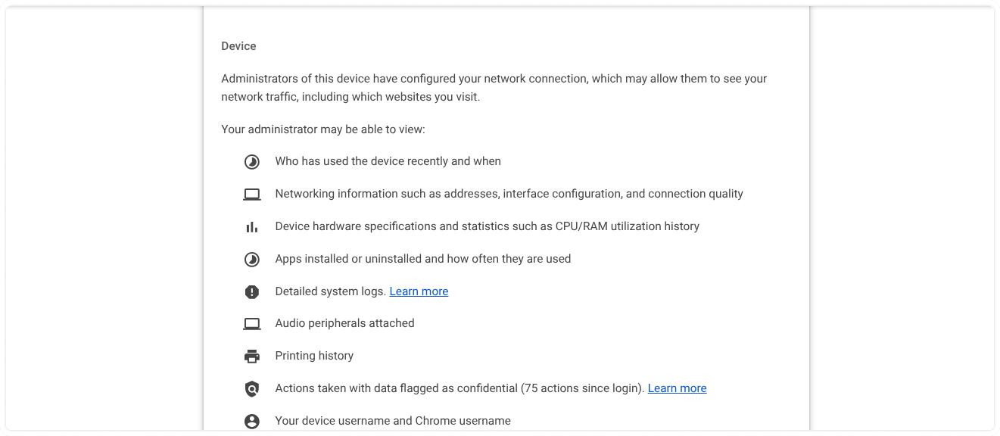

```{=typst}
#import "../template/lib.typ": *
```

# PHẦN 5 --- LIÊN HỆ THỰC TẾ

**Bước 5**:

Sinh viên tự tìm **1 ví dụ thực tế** (trong hoặc ngoài nước):

- Sản phẩm
- Dịch vụ
- Mô hình triển khai

Bảng 3: Ví dụ thực tế

| Nội dung | Mô tả |
| -- | -- |
| Tên sản phẩm/dịch vụ | |
| Xu thế áp dụng | |
| Lợi ích mang lại | |
| Hạn chế/Rủi ro | |

## Google BeyondCorp -- Giới Thiệu

Để minh họa cho cách Zero Trust được triển khai trong thực tế, sinh viên chọn phân tích **Google BeyondCorp**, vốn được coi là một trong những triển khai Zero Trust đầu tiên ở quy mô lớn trên thế giới.

Đầu tiên là một vài mô tả nhanh về BeyondCorp theo nguyên bản tài liệu.

```{=typst}
#co-info(title: "Trích Dẫn")[
*BeyondCorp là gì?*

BeyondCorp là một mô hình *bảo mật và hạ tầng liên quan* được Google phát triển từ năm 2011. Trong BeyondCorp, quyền truy cập vào các dịch vụ nội bộ được cấp dựa trên *chính sách bảo mật* thể hiện qua nhiều *tín hiệu* (như *danh tính người dùng*, *thông tin thiết bị*) thay vì chỉ dựa trên lòng tin vào kết nối mạng.

Để biết thêm chi tiết, vui lòng xem tài liệu công khai tại:

- #link("https://cloud.google.com/beyondcorp", "BeyondCorp tại Google Cloud Platform")
- #link("https://research.google/pubs/beyondcorp-a-new-approach-to-enterprise-security/", "BeyondCorp: A New Approach to Enterprise Security")
]
```

```{=typst}
#co-succ(title: "Nguyên Văn")[
*What is BeyondCorp?*

BeyondCorp is a *security model and associated infrastructure* developed at Google since 2011. In BeyondCorp, access to internal services is granted *by expressive security policy based on multiple signals* (user identity, device inventory information) rather than *solely network-based trust*.

For details, please see the externally available documentation below:

- #link("https://cloud.google.com/beyondcorp", "BeyondCorp tại Google Cloud Platform")
- #link("https://research.google/pubs/beyondcorp-a-new-approach-to-enterprise-security/", "BeyondCorp: A New Approach to Enterprise Security")
]
```

```{=typst}
#co-info(title: "Trích Dẫn")[
*Nguyên Tắc Cốt Lõi của BeyondCorp*

- Kết nối từ một mạng cụ thể *không quyết định* bạn có thể truy cập vào những dịch vụ nào.
  - Không còn "tin tưởng" mạng nội bộ như một vùng an toàn.
- Truy cập vào tài nguyên được cấp dựa trên *thông tin về người dùng* và *trạng thái thiết bị* của họ.
  - Dựa trên danh tính người dùng (là ai, bộ phận nào, v.v...).
  - Trạng thái thiết bị (có được đăng ký hay không, đang ở vị trí địa lý nào, v.v..).
- Mọi truy cập phải được *xác thực*, *cấp phép* và *mã hóa*.
  - Chứng minh danh tính, cấp quyền truy cập, mã hóa mọi dữ liệu.
]
```

```{=typst}
#co-warn(title: "Nguyên Văn")[
*BeyondCorp Principles*

- Connecting from a particular network *must not determine which services you can access*.
- Access to services is granted *based on what we know about you and your device*.
- All access to services must be *authenticated, authorized, and encrypted*.
]
```

Có nghĩa, đây không thuần túy là một giải pháp phần mềm thuần túy mà là một mô hình **end--to--end** (từ đầu tới cuối) bao gồm mọi khía cạnh: từ con người, quy trình cho tới hạ tầng công nghệ tạo thành một hệ sinh thái.

## Google BeyondCorp -- Ví Dụ Thực Tế

Ví dụ, ở khía cạnh kỹ thuật thuần túy có thể điểm qua một vài khía cạnh nổi bật như sau:

- Mỗi thiết bị đều phải được khai báo, đăng ký và quản lý trong hệ thống.



- Tương tự, mỗi người dùng đều được quản lý, theo dõi: đăng nhập ở đâu, thiết bị nào, thiết bị đã được đăng ký trong hệ thống hay chưa, phiên bản hệ điều hành, các policy đã được đồng bộ, thời điểm đồng bộ, v.v... nói chung rất rất nhiều yếu tố theo thời gian thực.



- Tại bất kỳ thời điểm nào trong quá trình kết nối, hệ thống luôn có thông tin/trạng thái của thiết bị & người dùng.


- Tóm lại, đây là một quá trình thường xuyên, liên tục và được tự động hóa bằng các Policy (chính sách) phù hợp, không phụ thuộc hoặc rất ít phụ thuộc vào sự can thiệp thủ công của con người. Điều này giảm tải cho đội ngũ quản trị hệ thống, đồng thời nâng cao tính chính xác và khách quan trong việc ra quyết định cấp quyền truy cập.



## Google BeyondCorp -- Tổng Quan

Dưới đây là các nội dung tóm tắt sau khi tìm hiểu về Google BeyondCorp.

```{=typst}
#figure(
  table(
    columns: (25%, 75%),
    align: (left, left),
    table.header(
      [*Nội Dung*], [*Mô Tả*],
    ),
    [Tên sản phẩm/dịch vụ],
    [
      - *Google BeyondCorp Enterprise*.
      - Là một nền tảng Zero Trust do Google phát triển.
      - Ban đầu được triển khai nội bộ cho nhân viên Google từ năm 2011.
      - Sau đó được thương mại hóa cho khách hàng doanh nghiệp thông qua Google Cloud Platform (GCP).
    ],

    [Xu thế áp dụng],
    [
      - *Zero Trust Security* -- loại bỏ hoàn toàn mô hình bảo mật theo vành đai truyền thống.
      - Mọi truy cập vào tài nguyên nội bộ đều được xác thực dựa trên danh tính người dùng (là ai, bộ phận nào, v.v...) và trạng thái thiết bị (có được đăng ký hay không, đang ở vị trí địa lý nào, v.v..).
      - Mọi thiết bị: Chromebook, Macbook, Windows, Android, iOS, Linux -- tất cả.
      - Bất kể kết nối từ mạng nội bộ Google hay Wi-Fi công cộng hay các bên khác (vendor), có nghĩa không quan trọng điểm kết nối, đã tham gia mạng lưới sẽ đều áp dụng.
    ],

    [Lợi ích mang lại],
    [
      - Hơn 100.000 nhân viên Google làm việc từ mọi nơi mà không cần VPN, vẫn đảm bảo an toàn.
      - Giảm nguy cơ lateral movement -- kể cả khi một tài khoản bị xâm phạm, kẻ tấn công không thể truy cập tài nguyên khác.
      - Cung cấp trải nghiệm người dùng mượt mà: nhân viên không cần kết nối VPN chậm, chỉ cần xác thực qua trình duyệt.
      - Mô hình đã được chứng minh hiệu quả qua hơn 10 năm vận hành, trở thành chuẩn mực cho ngành công nghiệp.
      - Giúp các hành hàng của GCP được tiếp cận giải pháp tiên tiến mà không cần đầu tư hạ tầng hay công cụ phức tạp, và tập trung vào phần quan trọng nhất: Con Người.
    ],
    [Hạn chế/Rủi ro],
    [
      - BeyondCorp được thiết kế và triển khai bởi Google, do đó có thể không phù hợp với các doanh nghiệp khác có quy mô và mức độ trưởng thành về công nghệ (tech-savvy) khác nhau.
      - Việc triển khai BeyondCorp tốn chi phí, nhưng nếu không triển khai sẽ tốn kém hơn.
      - Phù hợp và yêu cầu mức độ hạ tầng nhất định, không thể đơn giản triển khai được ngay lập tức.
      - Cần sự đồng bộ từ chiến lược cho tới quản lý, vận hành, và là một sự thay đổi lớn về văn hóa làm việc.
    ]
  ),
  caption: [Ví Dụ Thực Tế: Google BeyondCorp]
)
```

## Google BeyondCorp -- Bình Luận

Google bắt đầu phát triển BeyondCorp từ năm 2011 như một phản ứng trước các cuộc tấn công APT (Advanced Persistent Threat) nhắm vào các công ty công nghệ lớn tại Silicon Valley. Trước đó, Google cũng giống nhiều doanh nghiệp khác -- phụ thuộc vào mô hình bảo mật phân cấp trong/ngoài: ai ở trong mạng nội bộ thì được tin cậy. Tuy nhiên, với sự gia tăng của thiết bị di động và điện toán đám mây, khái niệm "vành đai" ngày càng mờ nhạt.

Giải pháp của Google là chuyển quyền kiểm soát truy cập từ **vị trí mạng** (location-based) sang **danh tính cá nhân** (identity-based). Mỗi yêu cầu truy cập đều phải thỏa mãn ba điều kiện: xác thực **danh tính người dùng**, kiểm tra **trạng thái bảo mật thiết bị** (đã cập nhật patch chưa? có phần mềm đồng bộ policy của Google hay không? v.v...), và xác nhận **quyền truy cập ứng dụng** cụ thể.

BeyondCorp không phải là một dự án triển khai nhanh chóng -- đó là một quá trình chuyển đổi **kéo dài nhiều năm**, đòi hỏi **đầu tư lớn** về công nghệ, quy trình và đào tạo nhân viên. Tuy nhiên, kết quả đã chứng minh giá trị: Google hiện là một trong những tổ chức an toàn nhất thế giới, và BeyondCorp đã được thương mại hóa để các doanh nghiệp khác có thể áp dụng mô hình tương tự thông qua Google Cloud Platform (GCP).
