# BƯỚC 6 – Solitaire Cipher

- Tìm hiểu và cho biết cách thức mã hoá và giải mã của giải thuật
- Cho ví dụ mã hoá và giải mã, với plaintext là họ tên sinh viên

## Nguyên Lý Hoạt Động

- Là một dạng mã dòng (stream cipher) sử dụng một bộ bài tây để tạo ra chuỗi khóa (keystream).
    - 54 lá gồm
        - 52 lá thường và
        - 2 lá Joker

Quy ước không gian khóa:

- Sử dụng trường hợp mặc định đánh chỉ số bắt đầu từ 0: $A=0, B=1, \dots, Z=25$, như bảng sau đây:

<!-- |  0  |  1  |  2  |  3  |  4  |  5  |  6  |  7  |  8  |  9  | 10  | 11  | 12  | 13  | 14  | 15  | 16  | 17  | 18  | 19  | 20  | 21  | 22  | 23  | 24  | 25  |
| :-: | :-: | :-: | :-: | :-: | :-: | :-: | :-: | :-: | :-: | :-: | :-: | :-: | :-: | :-: | :-: | :-: | :-: | :-: | :-: | :-: | :-: | :-: | :-: | :-: | :-: |
|  A  |  B  |  C  |  D  |  E  |  F  |  G  |  H  |  I  |  J  |  K  |  L  |  M  |  N  |  O  |  P  |  Q  |  R  |  S  |  T  |  U  |  V  |  W  |  X  |  Y  |  Z  | -->

```{=typst}
#figure(
  table(
  columns: (1fr,) * 26,
  align: (center, center, center, center, center, center, center, center, center, center, center, center, center, center, center, center, center, center, center, center, center, center, center, center, center, center),
  [0], [1], [2], [3], [4], [5], [6], [7], [8], [9], [10], [11], [12], [13], [14], [15], [16], [17], [18], [19], [20], [21], [22], [23], [24], [25], [A], [B], [C], [D], [E], [F], [G], [H], [I], [J], [K], [L], [M], [N], [O], [P], [Q], [R], [S], [T], [U], [V], [W], [X], [Y], [Z]
),
caption: [BƯỚC 6 -- Quy Ước Không Gian Khóa]
)
```

Nguyên lý cơ bản:

- **Key** chính là thứ tự sắp xếp ban đầu của 54 lá bài trong bộ bài (Initial deck).
    - Có thể xuôi hoặc ngược, tức là nhỏ đến lớn hoặc ngược lại.
- Hệ thống sẽ xáo trộn bộ bài qua các bước cố định (dịch chuyển Joker, cắt bài, tráo bài...) để sinh ra từng con số ngẫu nhiên.
    - Tập hợp các số này tạo thành **Keystream**, ví dụ: `4,47,10,24,8,49,44,6,18,33,24`.
- Số ngẫu nhiên này sẽ được quy đổi ra độ dời để cộng vào bản gốc (Plaintext) giống như thuật toán Caesar hay Vigenère:
    - Ưu điểm: độ dời thay đổi liên tục và cực kỳ khó đoán cho từng chữ cái.
- **Khi giải mã**, bắt buộc phải có một bộ bài được sắp xếp y hệt như bộ bài ban đầu của người gửi (có thể load hoặc nhập thủ công)
    - Trải qua các bước xáo bài tương tự, người nhận sẽ tạo ra được chuỗi Keystream gốc
    - Lấy bản mã dịch chuyển đi một đoạn theo số trong Keystream là sẽ thu được bản rõ.

## Plaintext

- Tên sinh viên: `DINH XUAN SAM`

## Mã Hóa

- Menu **Encrypt/Decrypt $\to$ Symmetric (classic) $\to$ Solitaire**.
- Cửa sổ **Key Entry** hiện lên, có thể *cài đặt* các điều kiện mã hóa, ví dụ:
    - **Total number of cards**: số lượng các lá bài.
    - **Card order**: thứ tự của lá bài.

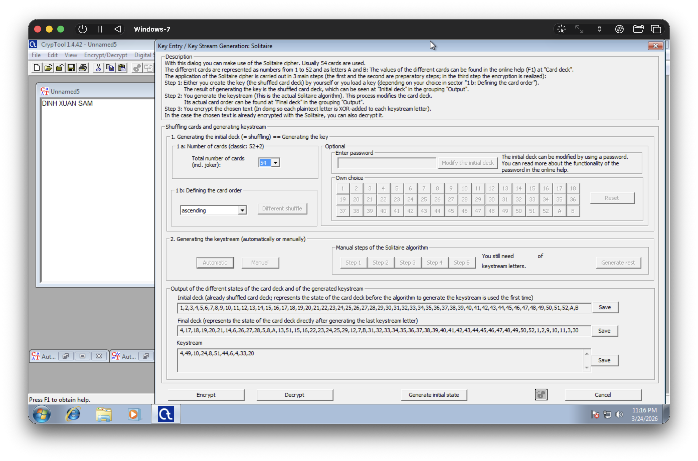

- Chỉ định các cài đặt trong Key Entry:
    - **Total number of cards**: 52
    - **Card order**: *ascending*, nhỏ đến lớn.

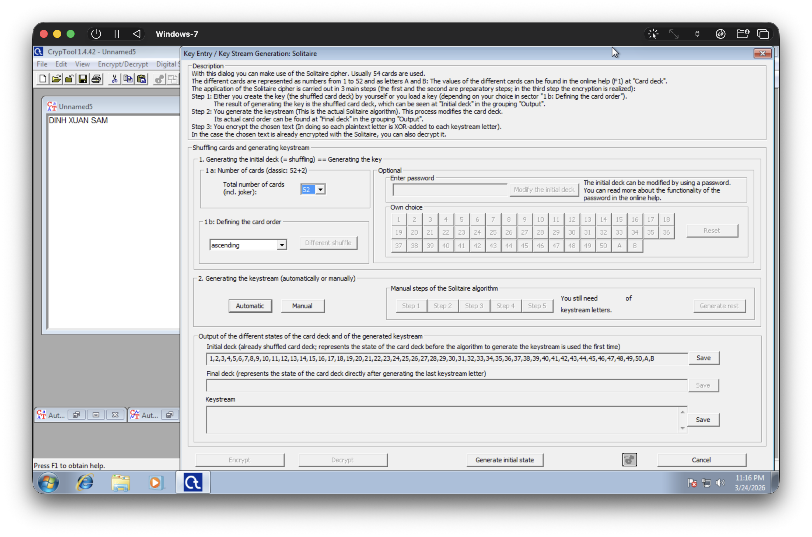

- Tại mục **2. Generating the keystream**, chọn **Automatic** (*tự động*).
- Các keystream sẽ được tạo ra ở mục Output.
- Có thể lưu lại các keystream sử dụng các nút **Save** tương ứng với **Initial deck** và **Final deck** như hình.
- Keystream: `4,47,10,24,8,49,44,6,18,33,24`

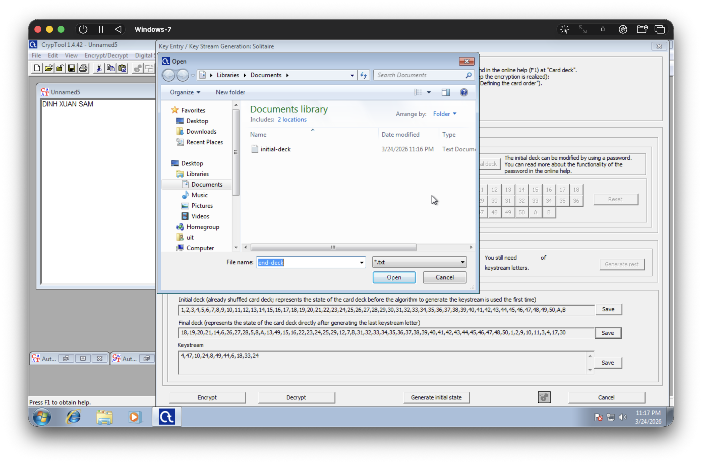

- Kết quả: văn bản gốc được mã hóa thành `HDXFF RSTKH K`
    - `D` (3) dịch đi 4 đơn vị, thành `H` (7).
    - `I` (8) dịch đi 47 đơn vị, thành `D` (3) (đi gần 2 vòng).
    - `N` (13) dịch đi 10 đơn vị thành `X` (23).
    - Tương tự cho các ký tự khác.

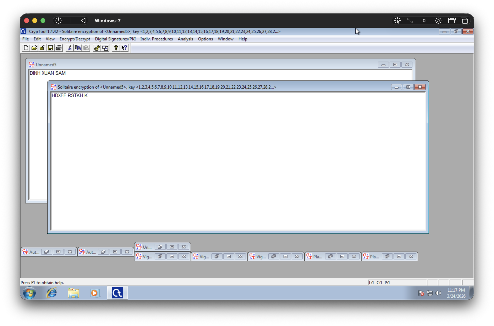

## Giải Mã

- Tại cửa sổ văn bản đã mã hóa, chọn menu **Encrypt/Decrypt $\to$ Symmetric (classic) $\to$ Solitaire**.
- Nhập lại các thông tin khớp với đã dùng trước đó:
    - **1a. Number of cards**: 52
    - **1b: Defining the card order**: *ascending*
- Keystream sẽ được tạo ra.
- Chọn **Decrypt**

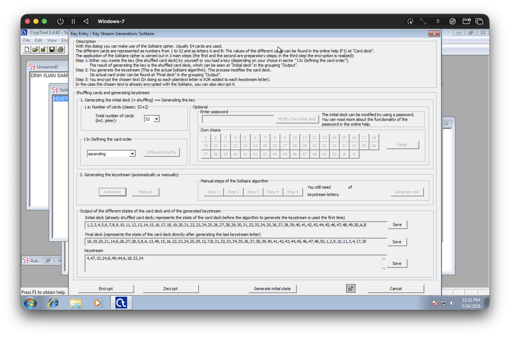

- Văn bản gốc được giải mã.

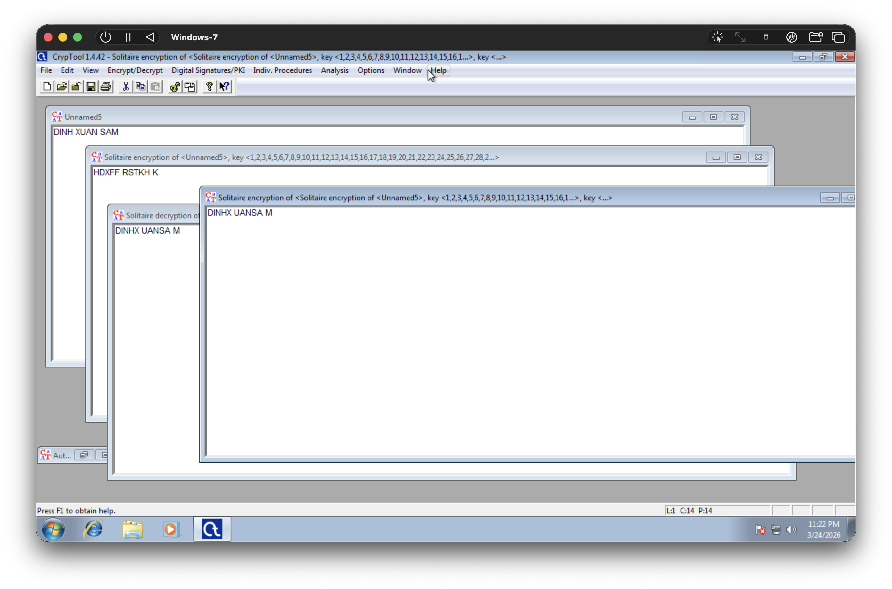

## Analysis

- Để giải mã, cần chỉ định **Parameters of the found deck**.
    - Hoặc tải file deck đã lưu trước đó, hoặc chỉ định thủ công.
    - Trong trường hợp này, em sẽ tải file đã lưu trước đó với **Load final deck**

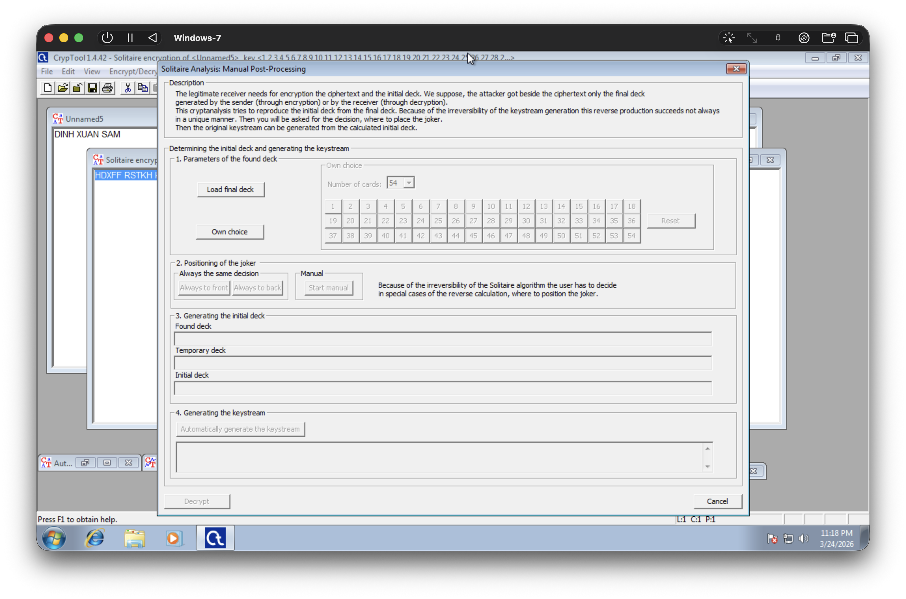

- Chọn file tương ứng là `end-deck.txt` đã lưu trước đó tương ứng với **Final deck**

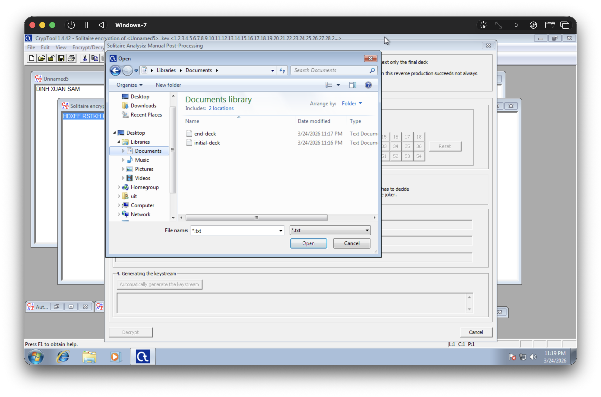

- Bước 2, **Positioning of the joker**, là thứ tự sắp xếp, đây là phần **Initial deck** trước đó.
    - Chọn **Always to front**.

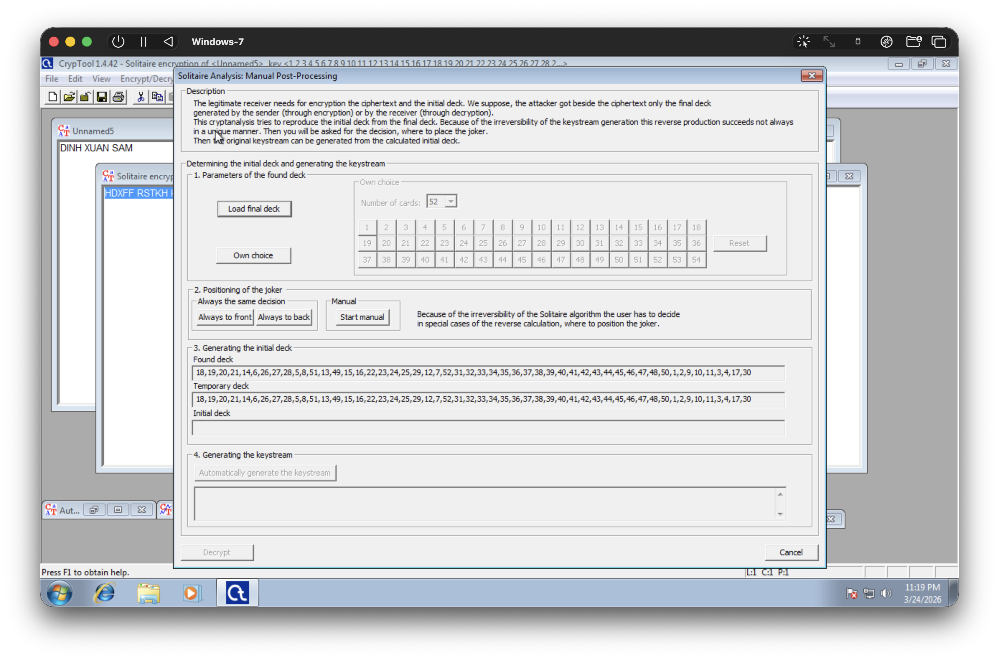

- Bước 3, **Initial deck** được tạo ra, sẵn sàng để tạo **Keystream**

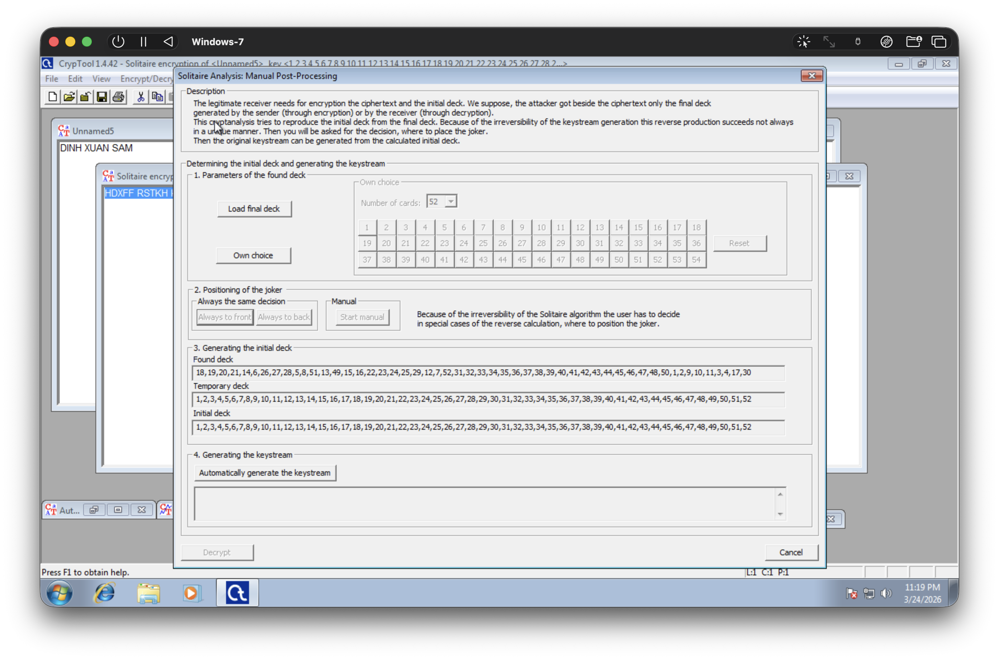

- Bước 4, **Generating the keystream**
    - Bấm chọn **Automatically generate the keystream**
    - Key stream sẽ được tạo ra, giống với trước đó đã dùng: `4,47,10,24,8,49,44,6,18,33,24`

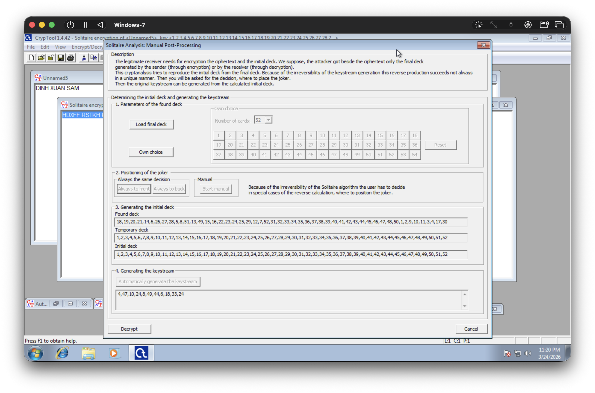

- Chọn **Decrypt**
    - Văn bản gốc được giải mã.
    - Có chèn sai vị trí khoảng trắng thành: `DINHX UANSA M`

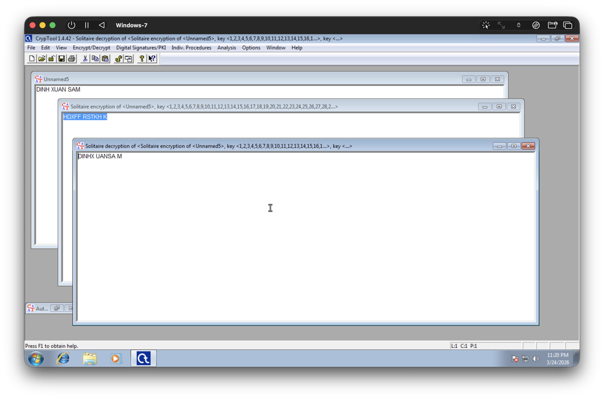
